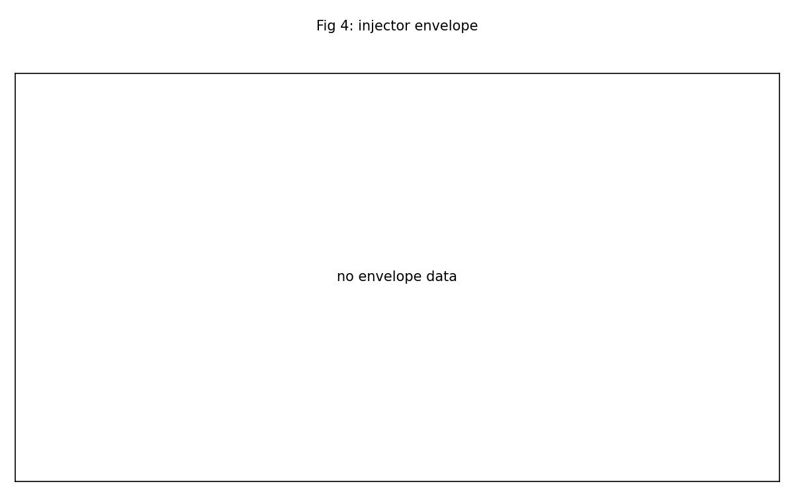

<!-- RTL Design Sherpa Documentation Header -->
<table>
<tr>
<td width="80">
  
</td>
<td>
  <strong>RTL Design Sherpa</strong> · <em>Learning Hardware Design Through Practice</em> 
  
    <a href="https://github.com/sean-galloway/RTLDesignSherpa">GitHub</a> ·
    <a href="https://github.com/sean-galloway/RTLDesignSherpa/blob/main/docs/DOCUMENTATION_INDEX.md">Documentation Index</a> ·
    <a href="https://github.com/sean-galloway/RTLDesignSherpa/blob/main/docs/DOCUMENTATION_INDEX.md">MIT License</a>
  
</td>
</tr>
</table>

---

<!-- End Header -->

# Battery Report — 2026-10-05

Board serial: `200300B818A0`  
Generated: 2026-10-06T00:02:22Z  

## Summary

- Images reported: **1**
- Passed: **1**
- Failed: **0**
- Partial: **0**
- Program failed: **0**

> Confidence: **1,000,000** blocks across the soak(s); **0** mis-decodes (**74,560** blocks were pushed past the correction limit and every one was flagged).

| Image | Codec | Status | Solver | Sequences |
|-------|-------|--------|--------|-----------|
| genesys2_axis | BCH(4224,4120) | PASS | RIBM; datapath AXIS; no comparator, so the B-side counters read 0 by design | init=PASS, soak=PASS |

## Per-Image Findings

### genesys2_axis

Codec: BCH(4224,4120) t=8 m=13 4 symbols/beat  
Solver/topology: RIBM; datapath AXIS; no comparator, so the B-side counters read 0 by design  
Overall status: **PASS**  

Soak progress: 999936 of 1000000 blocks after 31908s (31 blk/s).  

Soak final counters:

| Metric | Value |
|--------|-------|
| blocks_final | 1,000,000 |
| wall_s | 31910 |
| blk_per_s | 31.0 |
| clean | 111,957 |
| corrected | 768,922 |
| uncorrectable | 119,121 |
| bits_corrected | 3,119,679 |
| failing_runs | 0 |
| over_t_blocks | 74,560 |
| misdecoded | 0 |
| misdecode_rate | 0.00e+00 (1 in 74560) |

## Figures

## Limits

- No sweep data was present in the transcripts.
