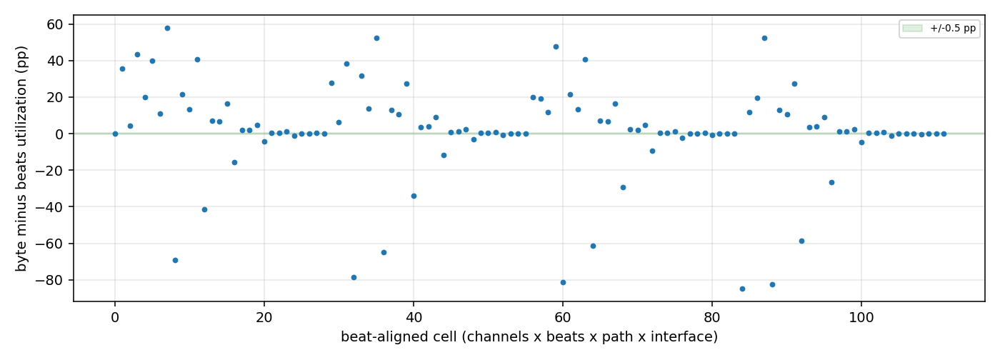
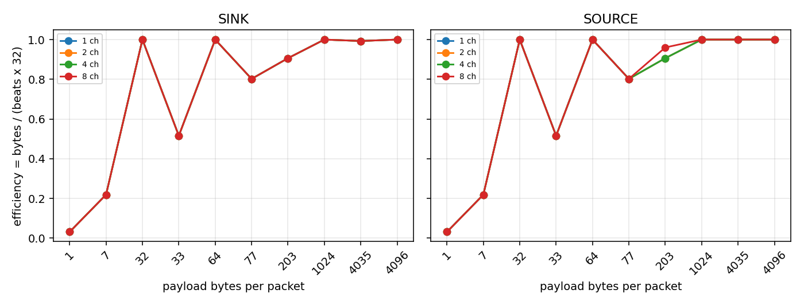

<!-- RTL Design Sherpa Documentation Header -->
<table>
<tr>
<td width="80">
  <a href="https://github.com/sean-galloway/RTLDesignSherpa">
    
  </a>
</td>
<td>
  <strong>RTL Design Sherpa</strong> &middot; <em>Learning Hardware Design Through Practice</em><br>
  <sub>
    <a href="https://github.com/sean-galloway/RTLDesignSherpa">GitHub</a> &middot;
    <a href="https://github.com/sean-galloway/RTLDesignSherpa/blob/main/docs/DOCUMENTATION_INDEX.md">Documentation Index</a> &middot;
    <a href="https://github.com/sean-galloway/RTLDesignSherpa/blob/main/LICENSE">MIT License</a>
  </sub>
</td>
</tr>
</table>

---

<!-- End Header -->


# RAPIDS Byte-Granular DMA: Byte Characterization Report

**Version:** 0.11  
**Date:** 2026-10-03  
**Platform:** Genesys 2, 256-bit, 8 channels, 100 MHz  
**Results:** `rapids_byte_perf_20261003_122406.json`

---

## 1. Headline

| Path | Point | Efficiency | MB/s measured | % of 3200 MB/s peak |
|---|---:|---:|---:|---:|
| Sink | byte path, 4096 B x 8 ch | 1.000 | 357 | 11.2 % |
| Sink | beat path, 4096 beats x 8 ch | 1.000 | 356 | 11.1 % |
| Sink | beat path, 4096 beats x 8 ch, word-wide checker build | 1.000 | 3182 | 99.4 % |
| Source | byte path, 4096 B x 8 ch | 1.000 | 354 | 11.1 % |
| Source | beat path, 4096 beats x 8 ch | 1.000 | 356 | 11.1 % |
| Source | beat path, 4096 beats x 8 ch, word-wide checker build | 1.000 | 3199 | 100.0 % |

: Largest transfers at 8 channels

The byte-wise rates sit at the harness checker ceiling of 3200 / 9 = 355.6 MB/s, not at the DUT's limit: the byte-wise CRC checkers take 9 cycles per 32-byte beat (section 3). Read every MB/s in this report against both the 3200 MB/s peak and that ceiling. Efficiency (payload over beats x lanes) does not depend on the checker.

The word-wide checker build (`BYTE_CRC=0`) takes one beat per cycle and is not checker-bound: its rows show the DUT's own rate against the 3200 MB/s peak. Its data check covers 4 of the 32 bytes of each beat, so it is a rate measurement and the byte-wise build is the integrity measurement.

## 2. Definitions

| Term | Meaning |
|---|---|
| Bytes moved | Total payload bytes over all active channels and descriptors; from the exact byte count of the AXIS bus meter. |
| Beats moved | Accepted beats on the interface named: AXIS beats on the stream side, memory beats on the AXI side. |
| Efficiency | payload bytes / (beats x BYTE_LANES), BYTE_LANES = 32. 1.0 means every lane of every beat carried payload. |
| MB/s | Total bytes / measurement window, windows counted in 100 MHz cycles by the harness meters, not wall clock. |
| Peak | 3200 MB/s = 100 MHz x 32 B, per direction. Shown beside every measured MB/s value. |
| Engaged utilization | prod / (prod + bp + starv) on one interface; the RAPIDS Beats headline metric, used only for the beat-aligned comparison. |

: Definitions

## 3. Beat-aligned rows against the RAPIDS Beats report

These rows use the beat-scaled path (`pkt_bytes=None`, beats per channel) on the byte DUT, which is how the RAPIDS Beats report measured its matrix: 9-beat bursts, response delay 0, backpressure off, default seed, bare bus meters. The metric is engaged utilization (`prod / (prod + bp + starv)`), the RAPIDS Beats headline metric. "Unchanged" is checked numerically: every cell is compared to the same cell of `genesys_dw256_obs_C.json` and must agree within 0.5 percentage points, the threshold the RAPIDS Beats report itself applies between builds.

### 3.1 Word-wide checker build (the verdict)

Measured on the `BYTE_CRC=0` bitstream (BUILD.WORD_CRC = 1, results file `rapids_byte_perf_20261003_121944.json`, bitstream sha256 `053fc2c192b869c8`). Its checkers take one beat per cycle like the RAPIDS Beats build. They CRC one 32-bit slice of each beat (slice 0, which holds the beat's LFSR word) and ignore the strobes, so the golden is the RAPIDS Beats golden and the data check covers 4 of the 32 bytes of each beat. That is enough for a utilization measurement of whole-beat rows; full-byte integrity is what the byte-wise build in 3.2 and the rest of this report check. The design under test is the same RTL.

Each meter window opens on its own interface's first handshake (rd, wr, sout), and the sink-ingress window opens on the first ACCEPTED beat; cycles where the stream is offered before that accept are counted by `OBS_SIN_LAUNCH` (CSR 0x158) and are reported with the mechanism table below. The v0.2 report's rows were measured with every window on the shared `obs_dut_busy` open, which charged the descriptor-fetch wait to starvation on the memory-side interfaces; those start-up readings are harness artifacts and were corrected by the window change, not by a DUT change.

| Ch | Beats/ch | Sink AXIS-in % (byte / beats) | Sink AXI4-wr % | Source AXI4-rd % | Source AXIS-out % | Max abs delta (pp) |
|---|---:|---:|---:|---:|---:|---:|
| 1 | 1 | 50.0 / 50.0 | 50.0 / 14.3 | 11.1 / 6.7 | 50.0 / 6.7 | 43.33 |
| 1 | 4 | 100.0 / 80.0 | 80.0 / 40.0 | 33.3 / 22.2 | 80.0 / 22.2 | 57.78 |
| 1 | 16 | 25.0 / 94.1 | 94.1 / 72.7 | 66.7 / 53.3 | 94.1 / 53.3 | 69.12 |
| 1 | 64 | 57.1 / 98.5 | 98.5 / 91.4 | 88.9 / 82.1 | 98.5 / 82.1 | 41.32 |
| 1 | 256 | 84.2 / 99.6 | 99.6 / 97.7 | 97.0 / 94.8 | 99.6 / 94.8 | 15.40 |
| 1 | 1024 | 95.5 / 99.9 | 99.9 / 99.4 | 99.2 / 98.7 | 99.9 / 98.7 | 4.38 |
| 1 | 4096 | 98.8 / 100.0 | 100.0 / 99.9 | 99.8 / 99.7 | 100.0 / 99.7 | 1.13 |
| 2 | 1 | 66.7 / 66.7 | 50.0 / 22.2 | 18.2 / 11.8 | 50.0 / 11.8 | 38.24 |
| 2 | 4 | 10.5 / 88.9 | 88.9 / 57.1 | 50.0 / 36.4 | 88.9 / 36.4 | 78.36 |
| 2 | 16 | 32.0 / 97.0 | 97.0 / 84.2 | 80.0 / 69.6 | 97.0 / 69.6 | 64.97 |
| 2 | 64 | 65.3 / 99.2 | 99.2 / 95.5 | 94.1 / 90.1 | 99.2 / 90.1 | 33.92 |
| 2 | 256 | 88.3 / 99.8 | 99.8 / 98.8 | 98.5 / 97.3 | 99.8 / 97.3 | 11.53 |
| 2 | 1024 | 96.8 / 100.0 | 100.0 / 99.7 | 99.6 / 99.3 | 100.0 / 99.3 | 3.16 |
| 2 | 4096 | 99.2 / 100.0 | 100.0 / 99.9 | 99.9 / 99.8 | 100.0 / 99.8 | 0.81 |
| 4 | 1 | 100.0 / 80.0 | 50.0 / 30.8 | 30.8 / 19.0 | 66.7 / 19.0 | 47.62 |
| 4 | 4 | 12.9 / 94.1 | 94.1 / 72.7 | 66.7 / 53.3 | 94.1 / 53.3 | 81.21 |
| 4 | 16 | 37.2 / 98.5 | 98.5 / 91.4 | 88.9 / 82.1 | 98.5 / 82.1 | 61.25 |
| 4 | 64 | 70.3 / 99.6 | 99.6 / 97.3 | 97.0 / 94.8 | 99.6 / 94.8 | 29.28 |
| 4 | 256 | 90.5 / 99.7 | 99.9 / 99.4 | 99.2 / 98.7 | 99.9 / 98.7 | 9.25 |
| 4 | 1024 | 97.4 / 99.9 | 100.0 / 99.9 | 99.8 / 99.7 | 100.0 / 99.7 | 2.50 |
| 4 | 4096 | 99.3 / 100.0 | 100.0 / 100.0 | 100.0 / 99.9 | 100.0 / 99.9 | 0.64 |
| 8 | 1 | 4.1 / 88.9 | 50.0 / 38.1 | 47.1 / 27.6 | 80.0 / 27.6 | 84.83 |
| 8 | 4 | 14.5 / 97.0 | 97.0 / 84.2 | 80.0 / 69.6 | 97.0 / 69.6 | 82.42 |
| 8 | 16 | 40.5 / 99.2 | 99.2 / 95.5 | 94.1 / 90.1 | 99.2 / 90.1 | 58.72 |
| 8 | 64 | 73.1 / 99.8 | 99.8 / 98.5 | 98.5 / 97.3 | 99.8 / 97.3 | 26.66 |
| 8 | 256 | 91.6 / 96.1 | 100.0 / 99.7 | 99.6 / 99.3 | 100.0 / 99.3 | 4.51 |
| 8 | 1024 | 97.8 / 99.0 | 100.0 / 99.9 | 99.9 / 99.8 | 100.0 / 99.8 | 1.24 |
| 8 | 4096 | 99.4 / 99.7 | 100.0 / 100.0 | 100.0 / 100.0 | 100.0 / 100.0 | 0.32 |

: Engaged utilization, byte build / RAPIDS Beats reference, beat-aligned rows

**Verdict: CHANGED.** 112 of 112 beat-aligned cells were compared; 85 differ by more than 0.5 pp; the largest difference is -84.83 pp (ch 8, 1 beats, sink sin). Cells over the threshold: ch1 b1 sink wr +35.71 pp; ch1 b1 source rd +4.44 pp; ch1 b1 source sout +43.33 pp; ch1 b4 sink sin +20.00 pp; ch1 b4 sink wr +40.00 pp; ch1 b4 source rd +11.11 pp; ch1 b4 source sout +57.78 pp; ch1 b16 sink sin -69.12 pp; ch1 b16 sink wr +21.39 pp; ch1 b16 source rd +13.33 pp; ch1 b16 source sout +40.78 pp; ch1 b64 sink sin -41.32 pp; ....

**Where the differences come from.** Every difference is a fixed number of cycles per run, not a change of rate. The cycle counts below are the evidence; the same counts at 16 beats per channel are identical to these. Only the 1-beat rows differ: the write and source starvation there equals the channel count (channel count + 7 on the read side), a per-channel start-up term that later beats overlap, and the sink backpressure is 0 at 1 to 4 channels.

| Ch | Sink AXIS-in bp, byte | beats | Sink AXI4-wr starv, byte | beats | Source AXI4-rd starv, byte | beats |
|---|---:|---:|---:|---:|---:|---:|
| 1 | 47 | 0 | 1 | 6 | 8 | 14 |
| 2 | 67 | 0 | 1 | 6 | 8 | 14 |
| 4 | 107 | 2 | 1 | 6 | 8 | 14 |
| 8 | 187 | 82 | 1 | 6 | 8 | 14 |

: Cycle counts at 4096 beats per channel (fixed start-up terms, not rates)

- **Sink AXIS-in.** The byte ingress accepts a channel's stream only once that channel has a packet record, because the destination offset and the expected length come from the descriptor (sink ingress chapter of the MAS). While one channel occupies the stream the others are offered data with `tready` low, and the meter counts those cycles as backpressure: exactly 27 + 20 x channels, the per-channel packet-record wait of rapids TASK-021, independent of the beats per channel. RAPIDS Beats has no such term because it buffers the stream before the descriptor arrives. The `sin` window opens at the first ACCEPTED beat. The wait this window choice could hide is measured and empty: `OBS_SIN_LAUNCH` (CSR 0x158) counts cycles where the stream is offered before the first accept, and it read 0 on all 28 points of this run (and on all 28 rows of the word-wide sim campaign), so opening at the first offered beat and at the first accepted beat are the same measurement on this DUT.
- **Sink AXI4-wr.** The write window opens at the first write handshake, so the wait above is not in it. Start-up starvation is 1 cycle at 16 beats and up, the same for every channel count (at 1 beat it is the channel count). Under the previous shared window the same cells read 9 to 17 cycles: the descriptor-fetch wait was being charged to write starvation, and the per-interface windows removed that, not the DUT.
- **Source.** The read and stream-out windows open on their own first handshakes: 8 starvation cycles on `rd` and 1 on `sout` at 16 beats and up, every channel count (channel count + 7 and channel count at 1 beat). These cells read 15 to 22 cycles under the shared window, for the same reason as the write side. The remaining small POSITIVE deltas against the beats reference at short transfers are the same class of fixed start-up term on the beats harness's side of the comparison.
- **Amortisation.** Because each term is fixed, the byte and beats readings converge as the transfer grows: at 4096 beats per channel every cell is within 1.13 percentage points, and the 8-channel row within 0.32. The 1-to-64-beat rows, where a fixed term is a large share of the window, are the ones that move most.
- **Not explained.** With 1 beat per channel and 1, 2 or 4 channels the byte build shows no sink AXIS-in backpressure, while the same channels at 16 beats and up do, and the 8-channel 1-beat row reads 190 cycles against the 187 of the formula. Not isolated.

### 3.2 Byte-wise checker build (the standard bitstream)

| Ch | Beats/ch | Sink AXIS-in % (byte / beats) | Sink AXI4-wr % | Source AXI4-rd % | Source AXIS-out % | Max abs delta (pp) |
|---|---:|---:|---:|---:|---:|---:|
| 1 | 1 | 50.0 / 50.0 | 50.0 / 14.3 | 11.1 / 6.7 | 100.0 / 6.7 | 93.33 |
| 1 | 4 | 100.0 / 80.0 | 80.0 / 40.0 | 11.1 / 22.2 | 14.3 / 22.2 | 40.00 |
| 1 | 16 | 25.0 / 94.1 | 15.7 / 72.7 | 11.1 / 53.3 | 11.8 / 53.3 | 69.12 |
| 1 | 64 | 57.1 / 98.5 | 12.0 / 91.4 | 21.2 / 82.1 | 11.2 / 82.1 | 79.44 |
| 1 | 256 | 22.6 / 99.6 | 11.3 / 97.7 | 18.7 / 94.8 | 11.1 / 94.8 | 86.39 |
| 1 | 1024 | 12.7 / 99.9 | 11.2 / 99.4 | 12.4 / 98.7 | 11.1 / 98.7 | 88.26 |
| 1 | 4096 | 11.5 / 100.0 | 11.1 / 99.9 | 11.4 / 99.7 | 11.1 / 99.7 | 88.73 |
| 2 | 1 | 66.7 / 66.7 | 50.0 / 22.2 | 11.1 / 11.8 | 22.2 / 11.8 | 27.78 |
| 2 | 4 | 10.5 / 88.9 | 26.7 / 57.1 | 11.1 / 36.4 | 12.5 / 36.4 | 78.36 |
| 2 | 16 | 32.0 / 97.0 | 13.0 / 84.2 | 12.0 / 69.6 | 11.2 / 69.6 | 71.20 |
| 2 | 64 | 65.3 / 99.2 | 11.5 / 95.5 | 34.2 / 90.1 | 11.2 / 90.1 | 83.99 |
| 2 | 256 | 14.8 / 99.8 | 11.2 / 98.8 | 19.9 / 97.3 | 11.1 / 97.3 | 87.63 |
| 2 | 1024 | 11.8 / 100.0 | 11.1 / 99.7 | 12.5 / 99.3 | 11.1 / 99.3 | 88.57 |
| 2 | 4096 | 11.3 / 100.0 | 11.1 / 99.9 | 11.4 / 99.8 | 11.1 / 99.8 | 88.81 |
| 4 | 1 | 100.0 / 80.0 | 50.0 / 30.8 | 11.1 / 19.0 | 14.8 / 19.0 | 20.00 |
| 4 | 4 | 12.9 / 94.1 | 15.7 / 72.7 | 11.1 / 53.3 | 11.8 / 53.3 | 81.21 |
| 4 | 16 | 37.2 / 98.5 | 12.0 / 91.4 | 21.3 / 82.1 | 11.3 / 82.1 | 79.44 |
| 4 | 64 | 70.3 / 99.6 | 11.3 / 97.3 | 50.2 / 94.8 | 11.1 / 94.8 | 86.04 |
| 4 | 256 | 12.6 / 99.7 | 11.2 / 99.4 | 20.8 / 98.7 | 11.1 / 98.7 | 88.26 |
| 4 | 1024 | 11.5 / 99.9 | 11.1 / 99.9 | 12.6 / 99.7 | 11.1 / 99.7 | 88.73 |
| 4 | 4096 | 11.2 / 100.0 | 11.1 / 100.0 | 11.4 / 99.9 | 11.1 / 99.9 | 88.85 |
| 8 | 1 | 4.1 / 88.9 | 19.0 / 38.1 | 11.1 / 27.6 | 12.7 / 27.6 | 84.83 |
| 8 | 4 | 14.5 / 97.0 | 13.0 / 84.2 | 11.6 / 69.6 | 11.1 / 69.6 | 82.42 |
| 8 | 16 | 40.5 / 99.2 | 11.5 / 95.5 | 35.2 / 90.1 | 11.2 / 90.1 | 83.99 |
| 8 | 64 | 73.1 / 99.8 | 11.2 / 98.5 | 66.8 / 97.3 | 11.2 / 97.3 | 87.26 |
| 8 | 256 | 11.8 / 96.1 | 11.1 / 99.7 | 21.5 / 99.3 | 11.1 / 99.3 | 88.57 |
| 8 | 1024 | 11.3 / 99.0 | 11.1 / 99.9 | 12.6 / 99.8 | 11.1 / 99.8 | 88.81 |
| 8 | 4096 | 11.2 / 99.7 | 11.1 / 100.0 | 11.5 / 100.0 | 11.1 / 100.0 | 88.87 |

: Engaged utilization, byte build / RAPIDS Beats reference, beat-aligned rows

**Result on this build: CHANGED.** 112 of 112 beat-aligned cells were compared; 110 differ by more than 0.5 pp; the largest difference is +93.33 pp (ch 1, 1 beats, source sout). Cells over the threshold: ch1 b1 sink wr +35.71 pp; ch1 b1 source rd +4.44 pp; ch1 b1 source sout +93.33 pp; ch1 b4 sink sin +20.00 pp; ch1 b4 sink wr +40.00 pp; ch1 b4 source rd -11.11 pp; ch1 b4 source sout -7.94 pp; ch1 b16 sink sin -69.12 pp; ch1 b16 sink wr -57.04 pp; ch1 b16 source rd -42.22 pp; ch1 b16 source sout -41.57 pp; ch1 b64 sink sin -41.32 pp; ....

**What the byte-checker rows can and cannot show.** The byte build's on-chip checkers (`BYTE_CRC=1` on `axi4_slave_wr_crc_check` and `axis4_slave_pattern_check`) fold the strobed bytes of each beat into the CRC four bytes per cycle and hold ready low while they do, so a 32-byte beat occupies 9 cycles. That caps the harness at 3200 / 9 = 355.6 MB/s (11.1 % of the 3200 MB/s peak), which is where the large-transfer rows sit. The RAPIDS Beats reference used the word-wide checkers and is not checker-bound. The differences in this table are therefore the checkers backpressuring the DUT, not evidence about the DUT's own throughput, and this table is **not comparable** to the RAPIDS Beats report. The "utilization unchanged" criterion is settled in section 3.1 on the word-wide checker build (`BYTE_CRC=0`, BUILD.WORD_CRC = 1), where every checker takes one beat per cycle as in the RAPIDS Beats build.

### Figure 3.1: Byte minus beats utilization, beat-aligned cells



| Ch | Beats/ch | Sink bytes | Sink beats | Sink eff | Sink MB/s | Sink % peak | Src bytes | Src beats | Src eff | Src MB/s | Src % peak |
|---|---:|---:|---:|---:|---:|---:|---:|---:|---:|---:|---:|
| 1 | 1 | 32 | 1 | 1.000 | 1600 | 50.0 % | 32 | 1 | 1.000 | 356 | 11.1 % |
| 1 | 4 | 128 | 4 | 1.000 | 2560 | 80.0 % | 128 | 4 | 1.000 | 356 | 11.1 % |
| 1 | 16 | 512 | 16 | 1.000 | 497 | 15.5 % | 512 | 16 | 1.000 | 356 | 11.1 % |
| 1 | 64 | 2048 | 64 | 1.000 | 383 | 12.0 % | 1056 | 33 | 1.000 | 350 | 10.9 % |
| 1 | 256 | 8192 | 256 | 1.000 | 362 | 11.3 % | 4864 | 152 | 1.000 | 355 | 11.1 % |
| 1 | 1024 | 32768 | 1024 | 1.000 | 357 | 11.2 % | 29440 | 920 | 1.000 | 355 | 11.1 % |
| 1 | 4096 | 131072 | 4096 | 1.000 | 356 | 11.1 % | 127744 | 3992 | 1.000 | 356 | 11.1 % |
| 2 | 1 | 64 | 2 | 1.000 | 1600 | 50.0 % | 64 | 2 | 1.000 | 356 | 11.1 % |
| 2 | 4 | 256 | 8 | 1.000 | 337 | 10.5 % | 256 | 8 | 1.000 | 356 | 11.1 % |
| 2 | 16 | 1024 | 32 | 1.000 | 415 | 13.0 % | 928 | 29 | 1.000 | 349 | 10.9 % |
| 2 | 64 | 4096 | 128 | 1.000 | 369 | 11.5 % | 1312 | 41 | 1.000 | 351 | 11.0 % |
| 2 | 256 | 16384 | 512 | 1.000 | 359 | 11.2 % | 9152 | 286 | 1.000 | 355 | 11.1 % |
| 2 | 1024 | 65536 | 2048 | 1.000 | 356 | 11.1 % | 58304 | 1822 | 1.000 | 355 | 11.1 % |
| 2 | 4096 | 262144 | 8192 | 1.000 | 356 | 11.1 % | 254912 | 7966 | 1.000 | 356 | 11.1 % |
| 4 | 1 | 128 | 4 | 1.000 | 1600 | 50.0 % | 128 | 4 | 1.000 | 356 | 11.1 % |
| 4 | 4 | 512 | 16 | 1.000 | 413 | 12.9 % | 512 | 16 | 1.000 | 356 | 11.1 % |
| 4 | 16 | 2048 | 64 | 1.000 | 383 | 12.0 % | 1056 | 33 | 1.000 | 352 | 11.0 % |
| 4 | 64 | 8192 | 256 | 1.000 | 360 | 11.3 % | 1792 | 56 | 1.000 | 351 | 11.0 % |
| 4 | 256 | 32768 | 1024 | 1.000 | 357 | 11.2 % | 17472 | 546 | 1.000 | 355 | 11.1 % |
| 4 | 1024 | 131072 | 4096 | 1.000 | 356 | 11.1 % | 115776 | 3618 | 1.000 | 356 | 11.1 % |
| 4 | 4096 | 524288 | 16384 | 1.000 | 356 | 11.1 % | 508992 | 15906 | 1.000 | 356 | 11.1 % |
| 8 | 1 | 256 | 8 | 1.000 | 130 | 4.1 % | 256 | 8 | 1.000 | 356 | 11.1 % |
| 8 | 4 | 1024 | 32 | 1.000 | 415 | 13.0 % | 960 | 30 | 1.000 | 347 | 10.8 % |
| 8 | 16 | 4096 | 128 | 1.000 | 369 | 11.5 % | 1280 | 40 | 1.000 | 352 | 11.0 % |
| 8 | 64 | 16384 | 512 | 1.000 | 358 | 11.2 % | 2720 | 85 | 1.000 | 355 | 11.1 % |
| 8 | 256 | 65536 | 2048 | 1.000 | 356 | 11.1 % | 33856 | 1058 | 1.000 | 355 | 11.1 % |
| 8 | 1024 | 262144 | 8192 | 1.000 | 356 | 11.1 % | 230464 | 7202 | 1.000 | 356 | 11.1 % |
| 8 | 4096 | 1048576 | 32768 | 1.000 | 356 | 11.1 % | 1016896 | 31778 | 1.000 | 356 | 11.1 % |

: Beat-aligned rows: bytes, beats, efficiency, MB/s and share of the 3200 MB/s peak

Every beat-aligned row moves whole beats, so efficiency is 1.000 by construction; measured range over 56 rows: 1.000 to 1.000.

## 4. Transfer size (offset 0)

One descriptor per channel, payload in bytes, start offset 0. Bytes moved and beats are totals over the active channels; efficiency is payload bytes over beats times 32 bytes per beat, on the AXIS side and on the memory side. MB/s is total bytes over the measurement window (the longer of the stream and memory windows) and is always shown with its share of the 3200 MB/s peak (100 MHz x 32 B).

### 4.1 Sink path

| Payload B | Offset | Ch | Bytes moved | AXIS beats | Mem beats | Eff (AXIS) | Eff (mem) | MB/s | % of peak | Result |
|---|---:|---:|---:|---:|---:|---:|---:|---:|---:|---:|
| 1 | 0 | 1 | 1 | 1 | 1 | 0.031 | 0.031 | 50.0 | 1.56 % | PASS |
| 1 | 0 | 2 | 2 | 2 | 2 | 0.031 | 0.031 | 50.0 | 1.56 % | PASS |
| 1 | 0 | 4 | 4 | 4 | 4 | 0.031 | 0.031 | 50.0 | 1.56 % | PASS |
| 1 | 0 | 8 | 8 | 8 | 8 | 0.031 | 0.031 | 4.1 | 0.13 % | PASS |
| 7 | 0 | 1 | 7 | 1 | 1 | 0.219 | 0.219 | 350.0 | 10.94 % | PASS |
| 7 | 0 | 2 | 14 | 2 | 2 | 0.219 | 0.219 | 350.0 | 10.94 % | PASS |
| 7 | 0 | 4 | 28 | 4 | 4 | 0.219 | 0.219 | 350.0 | 10.94 % | PASS |
| 7 | 0 | 8 | 56 | 8 | 8 | 0.219 | 0.219 | 28.4 | 0.89 % | PASS |
| 32 | 0 | 1 | 32 | 1 | 1 | 1.000 | 1.000 | 1600.0 | 50.00 % | PASS |
| 32 | 0 | 2 | 64 | 2 | 2 | 1.000 | 1.000 | 1600.0 | 50.00 % | PASS |
| 32 | 0 | 4 | 128 | 4 | 4 | 1.000 | 1.000 | 1600.0 | 50.00 % | PASS |
| 32 | 0 | 8 | 256 | 8 | 8 | 1.000 | 1.000 | 129.9 | 4.06 % | PASS |
| 33 | 0 | 1 | 33 | 2 | 2 | 0.516 | 0.516 | 1100.0 | 34.38 % | PASS |
| 33 | 0 | 2 | 66 | 4 | 4 | 0.516 | 0.516 | 1320.0 | 41.25 % | PASS |
| 33 | 0 | 4 | 132 | 8 | 8 | 0.516 | 0.516 | 113.8 | 3.56 % | PASS |
| 33 | 0 | 8 | 264 | 16 | 16 | 0.516 | 0.516 | 129.4 | 4.04 % | PASS |
| 64 | 0 | 1 | 64 | 2 | 2 | 1.000 | 1.000 | 2133.3 | 66.67 % | PASS |
| 64 | 0 | 2 | 128 | 4 | 4 | 1.000 | 1.000 | 2560.0 | 80.00 % | PASS |
| 64 | 0 | 4 | 256 | 8 | 8 | 1.000 | 1.000 | 220.7 | 6.90 % | PASS |
| 64 | 0 | 8 | 512 | 16 | 16 | 1.000 | 1.000 | 251.0 | 7.84 % | PASS |
| 77 | 0 | 1 | 77 | 3 | 3 | 0.802 | 0.802 | 1925.0 | 60.16 % | PASS |
| 77 | 0 | 2 | 154 | 6 | 6 | 0.802 | 0.802 | 208.1 | 6.50 % | PASS |
| 77 | 0 | 4 | 308 | 12 | 12 | 0.802 | 0.802 | 256.7 | 8.02 % | PASS |
| 77 | 0 | 8 | 616 | 24 | 24 | 0.802 | 0.802 | 290.6 | 9.08 % | PASS |
| 203 | 0 | 1 | 203 | 7 | 7 | 0.906 | 0.906 | 369.1 | 11.53 % | PASS |
| 203 | 0 | 2 | 406 | 14 | 14 | 0.906 | 0.906 | 495.1 | 15.47 % | PASS |
| 203 | 0 | 4 | 812 | 28 | 28 | 0.906 | 0.906 | 414.3 | 12.95 % | PASS |
| 203 | 0 | 8 | 1624 | 56 | 56 | 0.906 | 0.906 | 379.4 | 11.86 % | PASS |
| 1024 | 0 | 1 | 1024 | 32 | 32 | 1.000 | 1.000 | 414.6 | 12.96 % | PASS |
| 1024 | 0 | 2 | 2048 | 64 | 64 | 1.000 | 1.000 | 382.8 | 11.96 % | PASS |
| 1024 | 0 | 4 | 4096 | 128 | 128 | 1.000 | 1.000 | 368.7 | 11.52 % | PASS |
| 1024 | 0 | 8 | 8192 | 256 | 256 | 1.000 | 1.000 | 362.0 | 11.31 % | PASS |
| 4035 | 0 | 1 | 4035 | 127 | 127 | 0.993 | 0.993 | 366.2 | 11.44 % | PASS |
| 4035 | 0 | 2 | 8070 | 254 | 254 | 0.993 | 0.993 | 360.6 | 11.27 % | PASS |
| 4035 | 0 | 4 | 16140 | 508 | 508 | 0.993 | 0.993 | 357.3 | 11.17 % | PASS |
| 4035 | 0 | 8 | 32280 | 1016 | 1016 | 0.993 | 0.993 | 356.3 | 11.13 % | PASS |
| 4096 | 0 | 1 | 4096 | 128 | 128 | 1.000 | 1.000 | 368.7 | 11.52 % | PASS |
| 4096 | 0 | 2 | 8192 | 256 | 256 | 1.000 | 1.000 | 362.0 | 11.31 % | PASS |
| 4096 | 0 | 4 | 16384 | 512 | 512 | 1.000 | 1.000 | 358.7 | 11.21 % | PASS |
| 4096 | 0 | 8 | 32768 | 1024 | 1024 | 1.000 | 1.000 | 357.1 | 11.16 % | PASS |

: Size sweep, sink path, offset 0

### 4.2 Source path

| Payload B | Offset | Ch | Bytes moved | AXIS beats | Mem beats | Eff (AXIS) | Eff (mem) | MB/s | % of peak | Result |
|---|---:|---:|---:|---:|---:|---:|---:|---:|---:|---:|
| 1 | 0 | 1 | 1 | 1 | 1 | 0.031 | 0.031 | 11.1 | 0.35 % | PASS |
| 1 | 0 | 2 | 2 | 2 | 2 | 0.031 | 0.031 | 18.2 | 0.57 % | PASS |
| 1 | 0 | 4 | 4 | 4 | 4 | 0.031 | 0.031 | 26.7 | 0.83 % | PASS |
| 1 | 0 | 8 | 8 | 8 | 8 | 0.031 | 0.031 | 34.8 | 1.09 % | PASS |
| 7 | 0 | 1 | 7 | 1 | 1 | 0.219 | 0.219 | 77.8 | 2.43 % | PASS |
| 7 | 0 | 2 | 14 | 2 | 2 | 0.219 | 0.219 | 116.7 | 3.65 % | PASS |
| 7 | 0 | 4 | 28 | 4 | 4 | 0.219 | 0.219 | 155.6 | 4.86 % | PASS |
| 7 | 0 | 8 | 56 | 8 | 8 | 0.219 | 0.219 | 186.7 | 5.83 % | PASS |
| 32 | 0 | 1 | 32 | 1 | 1 | 1.000 | 1.000 | 355.6 | 11.11 % | PASS |
| 32 | 0 | 2 | 64 | 2 | 2 | 1.000 | 1.000 | 355.6 | 11.11 % | PASS |
| 32 | 0 | 4 | 128 | 4 | 4 | 1.000 | 1.000 | 355.6 | 11.11 % | PASS |
| 32 | 0 | 8 | 256 | 8 | 8 | 1.000 | 1.000 | 355.6 | 11.11 % | PASS |
| 33 | 0 | 1 | 33 | 2 | 2 | 0.516 | 0.516 | 183.3 | 5.73 % | PASS |
| 33 | 0 | 2 | 66 | 4 | 4 | 0.516 | 0.516 | 227.6 | 7.11 % | PASS |
| 33 | 0 | 4 | 132 | 8 | 8 | 0.516 | 0.516 | 258.8 | 8.09 % | PASS |
| 33 | 0 | 8 | 264 | 16 | 16 | 0.516 | 0.516 | 277.9 | 8.68 % | PASS |
| 64 | 0 | 1 | 64 | 2 | 2 | 1.000 | 1.000 | 355.6 | 11.11 % | PASS |
| 64 | 0 | 2 | 128 | 4 | 4 | 1.000 | 1.000 | 355.6 | 11.11 % | PASS |
| 64 | 0 | 4 | 256 | 8 | 8 | 1.000 | 1.000 | 355.6 | 11.11 % | PASS |
| 64 | 0 | 8 | 512 | 16 | 16 | 1.000 | 1.000 | 355.6 | 11.11 % | PASS |
| 77 | 0 | 1 | 77 | 3 | 3 | 0.802 | 0.802 | 285.2 | 8.91 % | PASS |
| 77 | 0 | 2 | 154 | 6 | 6 | 0.802 | 0.802 | 308.0 | 9.62 % | PASS |
| 77 | 0 | 4 | 308 | 12 | 12 | 0.802 | 0.802 | 320.8 | 10.03 % | PASS |
| 77 | 0 | 8 | 616 | 24 | 24 | 0.802 | 0.802 | 327.7 | 10.24 % | PASS |
| 203 | 0 | 1 | 203 | 7 | 7 | 0.906 | 0.906 | 322.2 | 10.07 % | PASS |
| 203 | 0 | 2 | 406 | 14 | 14 | 0.906 | 0.906 | 335.5 | 10.49 % | PASS |
| 203 | 0 | 4 | 812 | 28 | 28 | 0.906 | 0.906 | 342.6 | 10.71 % | PASS |
| 203 | 0 | 8 | 1014 | 33 | 56 | 0.960 | 0.566 | 347.3 | 10.85 % | PASS |
| 1024 | 0 | 1 | 928 | 29 | 32 | 1.000 | 0.906 | 348.9 | 10.90 % | PASS |
| 1024 | 0 | 2 | 1056 | 33 | 64 | 1.000 | 0.516 | 349.7 | 10.93 % | PASS |
| 1024 | 0 | 4 | 1312 | 41 | 128 | 1.000 | 0.320 | 354.6 | 11.08 % | PASS |
| 1024 | 0 | 8 | 1760 | 55 | 256 | 1.000 | 0.215 | 353.4 | 11.04 % | PASS |
| 4035 | 0 | 1 | 1280 | 40 | 127 | 1.000 | 0.315 | 350.7 | 10.96 % | PASS |
| 4035 | 0 | 2 | 1760 | 55 | 254 | 1.000 | 0.217 | 352.0 | 11.00 % | PASS |
| 4035 | 0 | 4 | 2688 | 84 | 508 | 1.000 | 0.165 | 352.8 | 11.02 % | PASS |
| 4035 | 0 | 8 | 4512 | 141 | 1016 | 1.000 | 0.139 | 355.3 | 11.10 % | PASS |
| 4096 | 0 | 1 | 1280 | 40 | 128 | 1.000 | 0.312 | 350.7 | 10.96 % | PASS |
| 4096 | 0 | 2 | 1760 | 55 | 256 | 1.000 | 0.215 | 352.0 | 11.00 % | PASS |
| 4096 | 0 | 4 | 2688 | 84 | 512 | 1.000 | 0.164 | 352.3 | 11.01 % | PASS |
| 4096 | 0 | 8 | 4512 | 141 | 1024 | 1.000 | 0.138 | 353.9 | 11.06 % | PASS |

: Size sweep, source path, offset 0

### Figure 4.1: Efficiency against payload size



### Figure 4.2: Measured MB/s against payload size, peak as the dashed line


Observations from this data:

- Sink, 8 channels, 4096 B: 357 MB/s = 11.2 % of the 3200 MB/s peak at efficiency 1.000.
- Sink, 8 channels: 1 B payload reaches 4.1 MB/s, 88x less than 4096 B; the window is dominated by fixed per-packet latency (197 cycles for one beat per channel).
- Source, 8 channels, 4096 B: 354 MB/s = 11.1 % of the 3200 MB/s peak at efficiency 1.000.
- Source, 8 channels: 1 B payload reaches 34.8 MB/s, 10x less than 4096 B; the window is dominated by fixed per-packet latency (23 cycles for one beat per channel).

## 5. Start offset

A descriptor may start mid-beat. The offset moves payload into an extra memory beat when `offset + payload` crosses a beat boundary, lowering memory-side efficiency while the AXIS side, which packs from lane 0, is unchanged. Offset 0 rows repeat the size sweep.

### 5.1 Sink path

| Payload B | Offset | Ch | Bytes moved | AXIS beats | Mem beats | Eff (AXIS) | Eff (mem) | MB/s | % of peak | Result |
|---|---:|---:|---:|---:|---:|---:|---:|---:|---:|---:|
| 33 | 0 | 1 | 33 | 2 | 2 | 0.516 | 0.516 | 1100.0 | 34.38 % | PASS |
| 33 | 1 | 1 | 33 | 2 | 2 | 0.516 | 0.516 | 1100.0 | 34.38 % | PASS |
| 33 | 5 | 1 | 33 | 2 | 2 | 0.516 | 0.516 | 1100.0 | 34.38 % | PASS |
| 33 | 31 | 1 | 33 | 2 | 2 | 0.516 | 0.516 | 1100.0 | 34.38 % | PASS |
| 203 | 0 | 1 | 203 | 7 | 7 | 0.906 | 0.906 | 369.1 | 11.53 % | PASS |
| 203 | 1 | 1 | 203 | 7 | 7 | 0.906 | 0.906 | 369.1 | 11.53 % | PASS |
| 203 | 5 | 1 | 203 | 7 | 7 | 0.906 | 0.906 | 369.1 | 11.53 % | PASS |
| 203 | 31 | 1 | 203 | 7 | 8 | 0.906 | 0.793 | 225.6 | 7.05 % | PASS |
| 1024 | 0 | 1 | 1024 | 32 | 32 | 1.000 | 1.000 | 414.6 | 12.96 % | PASS |
| 1024 | 1 | 1 | 1024 | 32 | 33 | 1.000 | 0.970 | 317.0 | 9.91 % | PASS |
| 1024 | 5 | 1 | 1024 | 32 | 33 | 1.000 | 0.970 | 318.0 | 9.94 % | PASS |
| 1024 | 31 | 1 | 1024 | 32 | 33 | 1.000 | 0.970 | 324.1 | 10.13 % | PASS |
| 4035 | 0 | 1 | 4035 | 127 | 127 | 0.993 | 0.993 | 366.2 | 11.44 % | PASS |
| 4035 | 1 | 1 | 4035 | 127 | 127 | 0.993 | 0.993 | 366.2 | 11.44 % | PASS |
| 4035 | 5 | 1 | 4035 | 127 | 127 | 0.993 | 0.993 | 366.5 | 11.45 % | PASS |
| 4035 | 31 | 1 | 4035 | 127 | 128 | 0.993 | 0.985 | 344.6 | 10.77 % | PASS |
| 33 | 0 | 8 | 264 | 16 | 16 | 0.516 | 0.516 | 129.4 | 4.04 % | PASS |
| 33 | 1 | 8 | 264 | 16 | 16 | 0.516 | 0.516 | 129.4 | 4.04 % | PASS |
| 33 | 5 | 8 | 264 | 16 | 16 | 0.516 | 0.516 | 129.4 | 4.04 % | PASS |
| 33 | 31 | 8 | 264 | 16 | 16 | 0.516 | 0.516 | 129.4 | 4.04 % | PASS |
| 203 | 0 | 8 | 1624 | 56 | 56 | 0.906 | 0.906 | 379.4 | 11.86 % | PASS |
| 203 | 1 | 8 | 1624 | 56 | 56 | 0.906 | 0.906 | 379.4 | 11.86 % | PASS |
| 203 | 5 | 8 | 1624 | 56 | 56 | 0.906 | 0.906 | 380.3 | 11.89 % | PASS |
| 203 | 31 | 8 | 1624 | 56 | 64 | 0.906 | 0.793 | 249.8 | 7.81 % | PASS |
| 1024 | 0 | 8 | 8192 | 256 | 256 | 1.000 | 1.000 | 362.0 | 11.31 % | PASS |
| 1024 | 1 | 8 | 8192 | 256 | 264 | 1.000 | 0.970 | 328.6 | 10.27 % | PASS |
| 1024 | 5 | 8 | 8192 | 256 | 264 | 1.000 | 0.970 | 328.7 | 10.27 % | PASS |
| 1024 | 31 | 8 | 8192 | 256 | 264 | 1.000 | 0.970 | 329.5 | 10.30 % | PASS |
| 4035 | 0 | 8 | 32280 | 1016 | 1016 | 0.993 | 0.993 | 356.3 | 11.13 % | PASS |
| 4035 | 1 | 8 | 32280 | 1016 | 1016 | 0.993 | 0.993 | 356.3 | 11.13 % | PASS |
| 4035 | 5 | 8 | 32280 | 1016 | 1016 | 0.993 | 0.993 | 356.3 | 11.14 % | PASS |
| 4035 | 31 | 8 | 32280 | 1016 | 1024 | 0.993 | 0.985 | 347.4 | 10.86 % | PASS |

: Offset sweep, sink path

### 5.2 Source path

| Payload B | Offset | Ch | Bytes moved | AXIS beats | Mem beats | Eff (AXIS) | Eff (mem) | MB/s | % of peak | Result |
|---|---:|---:|---:|---:|---:|---:|---:|---:|---:|---:|
| 33 | 0 | 1 | 33 | 2 | 2 | 0.516 | 0.516 | 183.3 | 5.73 % | PASS |
| 33 | 1 | 1 | 33 | 2 | 2 | 0.516 | 0.516 | 173.7 | 5.43 % | PASS |
| 33 | 5 | 1 | 33 | 2 | 2 | 0.516 | 0.516 | 173.7 | 5.43 % | PASS |
| 33 | 31 | 1 | 33 | 2 | 2 | 0.516 | 0.516 | 173.7 | 5.43 % | PASS |
| 203 | 0 | 1 | 203 | 7 | 7 | 0.906 | 0.906 | 322.2 | 10.07 % | PASS |
| 203 | 1 | 1 | 203 | 7 | 7 | 0.906 | 0.906 | 317.2 | 9.91 % | PASS |
| 203 | 5 | 1 | 203 | 7 | 7 | 0.906 | 0.906 | 317.2 | 9.91 % | PASS |
| 203 | 31 | 1 | 203 | 7 | 8 | 0.906 | 0.793 | 317.2 | 9.91 % | PASS |
| 1024 | 0 | 1 | 928 | 29 | 32 | 1.000 | 0.906 | 348.9 | 10.90 % | PASS |
| 1024 | 1 | 1 | 928 | 29 | 33 | 1.000 | 0.879 | 348.9 | 10.90 % | PASS |
| 1024 | 5 | 1 | 928 | 29 | 33 | 1.000 | 0.879 | 348.9 | 10.90 % | PASS |
| 1024 | 31 | 1 | 928 | 29 | 33 | 1.000 | 0.879 | 348.9 | 10.90 % | PASS |
| 4035 | 0 | 1 | 1280 | 40 | 127 | 1.000 | 0.315 | 350.7 | 10.96 % | PASS |
| 4035 | 1 | 1 | 1280 | 40 | 127 | 1.000 | 0.315 | 350.7 | 10.96 % | PASS |
| 4035 | 5 | 1 | 1280 | 40 | 127 | 1.000 | 0.315 | 350.7 | 10.96 % | PASS |
| 4035 | 31 | 1 | 1280 | 40 | 128 | 1.000 | 0.312 | 350.7 | 10.96 % | PASS |
| 33 | 0 | 8 | 264 | 16 | 16 | 0.516 | 0.516 | 277.9 | 8.68 % | PASS |
| 33 | 1 | 8 | 264 | 16 | 16 | 0.516 | 0.516 | 275.0 | 8.59 % | PASS |
| 33 | 5 | 8 | 264 | 16 | 16 | 0.516 | 0.516 | 275.0 | 8.59 % | PASS |
| 33 | 31 | 8 | 264 | 16 | 16 | 0.516 | 0.516 | 275.0 | 8.59 % | PASS |
| 203 | 0 | 8 | 1014 | 33 | 56 | 0.960 | 0.566 | 347.3 | 10.85 % | PASS |
| 203 | 1 | 8 | 1014 | 33 | 56 | 0.960 | 0.566 | 347.3 | 10.85 % | PASS |
| 203 | 5 | 8 | 1014 | 33 | 56 | 0.960 | 0.566 | 347.3 | 10.85 % | PASS |
| 203 | 31 | 8 | 1046 | 34 | 64 | 0.961 | 0.511 | 352.2 | 11.01 % | PASS |
| 1024 | 0 | 8 | 1760 | 55 | 256 | 1.000 | 0.215 | 353.4 | 11.04 % | PASS |
| 1024 | 1 | 8 | 1760 | 55 | 264 | 1.000 | 0.208 | 349.9 | 10.93 % | PASS |
| 1024 | 5 | 8 | 1760 | 55 | 264 | 1.000 | 0.208 | 349.9 | 10.93 % | PASS |
| 1024 | 31 | 8 | 1760 | 55 | 264 | 1.000 | 0.208 | 349.9 | 10.93 % | PASS |
| 4035 | 0 | 8 | 4512 | 141 | 1016 | 1.000 | 0.139 | 355.3 | 11.10 % | PASS |
| 4035 | 1 | 8 | 4512 | 141 | 1016 | 1.000 | 0.139 | 355.3 | 11.10 % | PASS |
| 4035 | 5 | 8 | 4512 | 141 | 1016 | 1.000 | 0.139 | 355.3 | 11.10 % | PASS |
| 4035 | 31 | 8 | 4512 | 141 | 1024 | 1.000 | 0.138 | 353.9 | 11.06 % | PASS |

: Offset sweep, source path

### Figure 5.1: Memory-side efficiency against start offset


Offsets that cost an extra memory beat (sink, 1 channel): 203 B at offset 31: 7 -> 8 memory beats; 1024 B at offset 1: 32 -> 33 memory beats; 1024 B at offset 5: 32 -> 33 memory beats; 1024 B at offset 31: 32 -> 33 memory beats; 4035 B at offset 31: 127 -> 128 memory beats.

## 6. Descriptor chains

Several descriptors per channel back to back (4 channels), offset 0. Efficiency counts payload over all beats of the chain.

| Payload B | Descs | Path | Bytes moved | AXIS beats | Eff (AXIS) | MB/s | % of peak | Result |
|---|---:|---:|---:|---:|---:|---:|---:|---:|
| 1 | 16 | sink | 64 | 64 | 0.031 | 5.4 | 0.17 % | PASS |
| 1 | 16 | source | 64 | 64 | 0.031 | 38.8 | 1.21 % | PASS |
| 64 | 4 | sink | 1024 | 32 | 1.000 | 223.6 | 6.99 % | PASS |
| 64 | 4 | source | 1024 | 32 | 1.000 | 355.6 | 11.11 % | PASS |
| 64 | 16 | sink | 4096 | 128 | 1.000 | 221.4 | 6.92 % | PASS |
| 64 | 16 | source | 3872 | 121 | 1.000 | 354.9 | 11.09 % | PASS |
| 1024 | 4 | sink | 16384 | 512 | 1.000 | 342.5 | 10.70 % | PASS |
| 1024 | 4 | source | 2656 | 83 | 1.000 | 352.3 | 11.01 % | PASS |
| 1024 | 16 | sink | 65536 | 2048 | 1.000 | 336.6 | 10.52 % | PASS |
| 1024 | 16 | source | 50368 | 1574 | 1.000 | 355.6 | 11.11 % | PASS |

: Descriptor chains, 4 channels

## 7. Source backpressure (integrity only)

The source backpressure is paced by the host toggling the checker's ready over UART, so the cycle counts measure the host, not the DUT (rapids TASK-085). These rows are integrity checks: bytes and beats must still match and the golden CRCs must agree. Their MB/s is not reported.

| Ch | Payload B | Offset | Expected bytes | Expected AXIS beats | MB/s | Result |
|---|---:|---:|---:|---:|---:|---:|
| 1 | 33 | 0 | 33 | 2 | n/a (host-paced) | PASS |
| 1 | 33 | 5 | 33 | 2 | n/a (host-paced) | PASS |
| 1 | 1024 | 0 | 1024 | 32 | n/a (host-paced) | PASS |
| 1 | 1024 | 5 | 1024 | 32 | n/a (host-paced) | PASS |
| 4 | 33 | 0 | 132 | 8 | n/a (host-paced) | PASS |
| 4 | 33 | 5 | 132 | 8 | n/a (host-paced) | PASS |
| 4 | 1024 | 0 | 4096 | 128 | n/a (host-paced) | PASS |
| 4 | 1024 | 5 | 4096 | 128 | n/a (host-paced) | PASS |

: Source with backpressure, integrity rows

## 8. Failures, caveats and coverage

No measured point failed.

Coverage: 117 of 117 planned points of profile `standard` are in this file (117 passed, 0 failed).

Standing limitations of the design, not of this measurement:

- The sink `s_axis_tready` is one signal qualified by TID, so a beat for a channel whose packet record has not arrived blocks every channel behind it on the stream (head-of-line blocking, inherent and documented).
- TYPE=EXT descriptors stay beat-aligned by design and are not part of the byte sweeps.
- AXI error responses are now exercised and the paths are proven on silicon (rapids TASK-020, 2026-10-01); this entry previously recorded them as unproven and the hook as unbuilt. See section 8.1.
- Each interface has its own measurement window, opened on that interface's first handshake; the `sin` window opens on the first ACCEPTED stream beat, and cycles where the stream is offered before that accept are counted by `OBS_SIN_LAUNCH` (section 3.1). MB/s here uses the longer of the stream and memory windows.

## 8.1 AXI response-error injection (rapids TASK-020)

The two synthetic AXI slaves are built `ERR_INJECT=1` in this harness, so a chosen
burst on a chosen channel answers SLVERR instead of OKAY. `ERR_INJ` (0x0C8) arms it
-- WR_EN for the sink's B channel, RD_EN for the source's R channel, with RESP, CH,
SKIP and ONESHOT -- and `ERR_STAT` (0x0CC) reports from the SLAVE that the error was
really issued, so a passing status check cannot be the DUT agreeing with itself.
`ERR_INJECT=0` everywhere else keeps every other consumer answering OKAY as before.

| Run | Result |
|---|---|
| Board, `--byte-seq axi_resp_error --seq-level full`, 8 channels | **36/36 checks PASS**, 7,969 UART ops |
| UART sim, same sequence at gate | 18/18 checks PASS |
| Bitstream | sha256 `754c3c2d...`, WNS **+0.401 ns** at 100 MHz, 78,426 LUTs (38.5 %), 68 BRAM tiles |

Checked per half, per round, with a second channel running alongside throughout:
the slave issued the error (`ERR_STAT`); the sticky per-channel flag raised on the
TARGETED channel only (`SNK_SCHERR` / `SRC_SCHERR` and `SCHED_ERROR`);
`CHANNEL_RESET` cleared it; and both channels were golden against the byte-wise
CRC afterwards. So the DUT's sticky `r_wr_error` (BRESP) and `r_rd_error` (RRESP)
paths, and recovery through channel reset, are measured on hardware rather than
inferred from unit simulation.

NOT covered, and deliberately not claimed: the monbus error PACKET. The host has
no monbus-buffer readout -- `MON_BASE`/`MON_LIMIT` are configured and never read
back -- so the packet half of the error contract needs a readout that does not
exist yet. rapids TASK-020 keeps that box open.

## 8.2 Build variants measured against each other (2026-10-01)

One harness RTL; a variant is generic overrides, built by the named targets
`make bitstream-{std,perf,mon,obs,ila}`. Every number below is parsed from that
build's own post-route reports by `reports/extract_build_metrics.py` -- none is
typed in -- and every variant was then programmed and run on the board.

| Variant | LUT | vs std | BRAM | WNS ns | WHS ns | Failing eps | sha256 |
|---|---:|---:|---:|---:|---:|---:|---|
| std (`BYTE_CRC=1`) | 78,426 | -- | 68 | 0.401 | 0.045 | 0 | `754c3c2dcdb7` |
| perf (`BYTE_CRC=0`) | 71,643 | -6,783 | 52 | 0.426 | 0.037 | 0 | `1f268d98969d` |
| mon (`USE_AXI_MONITORS=1 GEN_MON=1`) | 84,190 | **+5,764** | 68 | 0.768 | 0.026 | 0 | `0678e8d52a88` |
| obs (`USE_OBSERVERS=1` + taps) | 100,396 | **+21,970** | 68 | 0.215 | 0.031 | 0 | `4ff79d23b873` |

All four close timing with zero failing endpoints out of ~264 k.

What the comparison is for -- the cost of instrumentation, which was previously
unmeasured on the byte design:

- **The interface observers are expensive**: +21,970 LUTs, +28 % over std, and
  they more than halve the timing margin (0.401 -> 0.215 ns). That is the one
  variant where the margin is thin enough to matter on a tighter part.
- **The in-core monitors are cheaper than the observers by 4x** (+5,764 LUTs)
  and the build closed BETTER than std (0.768 ns). Place-and-route variation is
  part of that, so read it as "no margin cost", not as an improvement.
- **The word-wide perf build is the cheapest in both LUTs and BRAM** (52 vs 68
  tiles): the byte-wise CRC machinery is what costs the BRAM, which is the
  resource price of measuring integrity rather than rate.

Board results, same bitstreams:

| Variant | Runs |
|---|---|
| std / mon / obs | byte smoke PASS, `axi_resp_error` **18/18**, byte-perf quick 7/7 |
| perf | aligned profile **28/28**, 3182 MB/s sink / 3199 MB/s source |

The perf row reproduces section 1's headline figures with a clean identity
record on both ends of the run. An earlier attempt produced the same numbers but
false-failed its END identity check -- the Genesys 2 chain transiently lists the
board with no device behind it -- which marked good results "not from one board";
`board_guard` now re-reads the chain once before failing, and a test covers both
that recovery and that a genuinely absent board still fails.

`perf` deliberately runs only the aligned profile: the host refuses byte-wise
checks on a word-wide build ("cannot check a partial strobe"), which is correct
and is why the integrity and rate measurements need two bitstreams.

## 9. Build and resources

| Build | Slice LUTs | Slice regs | BRAM tiles | WNS setup | WHS hold | Failing endpoints | Bitstream sha256 |
|---|---:|---:|---:|---:|---:|---:|---:|
| std | 79,129 | 57,735 | 68 | +0.726 ns | +0.013 ns | 0 | `c6985f762eee1e6b` |
| perf | 72,314 | 54,914 | 52 | +0.258 ns | +0.053 ns | 0 | `053fc2c192b869c8` |
| mon | 104,032 | 82,509 | 68 | +0.188 ns | +0.010 ns | 0 | `fdaeba896348de86` |
| obs | 101,265 | 90,925 | 68 | +0.044 ns | +0.005 ns | 0 | `c71a86de44366b38` |

: Post-route resources and timing at 100 MHz, XC7K325T (203,800 LUTs, 445 BRAM tiles)

Build configuration of each row:

- **std**: BYTE_CRC=1 USE_AXI_MONITORS=0 GEN_MON=0 USE_OBSERVERS=0. RTL commit `f2be469ac`.
- **perf**: BYTE_CRC=0 USE_AXI_MONITORS=0 GEN_MON=0 USE_OBSERVERS=0. RTL commit `616a93077`.
- **mon**: BYTE_CRC=1 USE_AXI_MONITORS=1 GEN_MON=1 USE_OBSERVERS=0 MON_CAPTURE=1. RTL commit `ef18561c9`.
- **obs**: BYTE_CRC=1 USE_OBSERVERS=1 OBS_ENABLE_MON_TAPS=1. RTL commit `ef18561c9`.

Every build closes timing at 100 MHz with no failing endpoint. The slack is small and positive; treat 100 MHz as the design point, not as margin. The resource figures come from the post-route utilization report; the word-wide checker build is a measurement bitstream and is not the standard one.

## 10. Provenance and reproduction

| Item | Value |
|---|---|
| Results file | `rapids_byte_perf_20261003_122406.json` |
| Timestamp | 2026-10-03T12:24:13 |
| Profile | `standard` |
| Status | final |
| Bitstream | `rapids_byte.bit` sha256 `053fc2c192b869c8` |
| Design | 256-bit, 8 channels, 4096 B SRAM per channel, 100 MHz, peak 3200 MB/s per direction |
| Beats reference | `genesys_dw256_obs_C.json` |

: Provenance

| Session | Bitstream sha256 | CSR_ID | BUILD | Sentinel start | Sentinel end | Stable | Aborted |
|---|---:|---:|---:|---:|---:|---:|---:|
| 1 | `053fc2c192b869c8` | 0x52415042 | 0x08070820 | 0x00000000 | 0x00000000 | yes | no |

: Device readback per session

The sentinel is the MON_LIMIT register written once at configure time. It resets on any FPGA reconfiguration, so a change between readbacks means the device was reprogrammed during the run. A point measured across such a change is dropped, not recorded. Device stable for the whole run: yes.

One command runs the campaign and regenerates this report:

```bash
cd projects/fpga-systems/Genesys2/dma-ip/rapids/flows-rapids
./byte_perf.sh --profile full --final      # final numbers (standard byte-CRC bitstream)
./byte_perf.sh --profile standard          # quick run, writes *_prelim_*.json
```

The word-wide aligned results are `rapids_byte_perf_20261003_121944.json`; its device readback follows.

| Session | Bitstream sha256 | CSR_ID | BUILD | Sentinel start | Sentinel end | Stable | Aborted |
|---|---:|---:|---:|---:|---:|---:|---:|
| 1 | `053fc2c192b869c8` | 0x52415042 | 0x18070820 | 0x00000000 | 0x00000000 | yes | no |

: Device readback per session

The sentinel is the MON_LIMIT register written once at configure time. It resets on any FPGA reconfiguration, so a change between readbacks means the device was reprogrammed during the run. A point measured across such a change is dropped, not recorded. Device stable for the whole run: yes.
