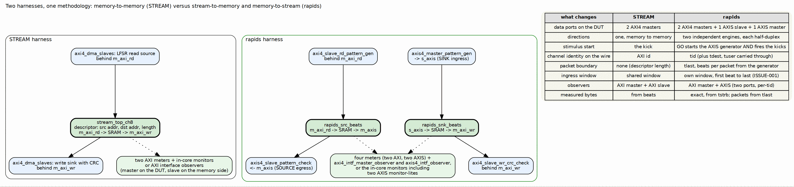

<!-- RTL Design Sherpa Documentation Header -->
<table>
<tr>
<td width="80">
  
</td>
<td>
  <strong>RTL Design Sherpa</strong> · <em>Learning Hardware Design Through Practice</em> 
  
    <a href="https://github.com/sean-galloway/RTLDesignSherpa">GitHub</a> ·
    <a href="https://github.com/sean-galloway/RTLDesignSherpa/blob/main/docs/DOCUMENTATION_INDEX.md">Documentation Index</a> ·
    <a href="https://github.com/sean-galloway/RTLDesignSherpa/blob/main/LICENSE">MIT License</a>
  
</td>
</tr>
</table>

---

<!-- End Header -->

# Why rapids Is Not STREAM

## Two engines, two stream ports

STREAM moves memory to memory: one DMA, one descriptor with a source and a
destination address, two AXI4 data masters. Its harness is therefore a
memory model on each side, an LFSR read source behind the read master and a
CRC write sink behind the write master, and everything measured is on an AXI4
bus.

RAPIDS beats is two engines that share nothing but an APB and a MonBus
egress. The SINK takes an AXI4-Stream in and writes memory; the SOURCE reads
memory and puts an AXI4-Stream out. Each descriptor has one memory address
and one stream. So the rapids harness needs what STREAM's never did: a
stream producer that the sink can be fed from, and a stream consumer that
can check what the source emits, both deterministic, both seeded, both on
chip. Half of the DUT's data ports are streams, and half of the
characterization is about them.

### Figure 1.1: Two harnesses, one methodology

**Source:** [04_rapids_vs_stream.dot](../assets/graphviz/04_rapids_vs_stream.dot)

## What that changes in the harness

| Aspect | STREAM | rapids |
|--------|--------|--------|
| Data ports on the DUT | two AXI4 masters | two AXI4 masters, one AXIS slave, one AXIS master |
| Directions under test | one, memory to memory | two, independent: stream to memory (SINK) and memory to stream (SOURCE) |
| What starts the data | the descriptor kick | GO starts the AXIS generator and fires the kicks in the same few cycles; the sink cannot move until its stream arrives |
| Channel on the wire | the AXI id | `tid`; the generator sets it, the sink routes on it, the checker demuxes on it, the observer attributes on it |
| Packet boundary | none; the descriptor length is the unit | `tlast`, placed by the generator every `GEN_BPP` beats and carried by the sink into its fill interface |
| Backpressure knob | the write slave's readiness | the checker's `chk_ready_en` on the egress stream, and the DUT's own `s_axis_tready` on ingress |
| Meters | two, on the AXI masters | four: the two AXI meters plus an AXIS meter on each stream, which also count exact bytes and packets |
| Ingress window | the shared window | the stream's own window, opened by the first offered beat and closed by the last accepted one |
| Observers | AXI master and AXI slave observers | the AXI master observer and a two-port AXIS observer with per-`tid` attribution |
| In-core monitors | AXI and descriptor monitors | the same, plus an AXIS monitor-lite in each half |

: Table 1.1: What the streams change

Everything else is the same methodology, and deliberately so: the same
`axi_bus_meter`, the same `axi_response_delay` latency model, the same
observer register map, the same `uart_axil_bridge`, the same
stage-all-then-GO launch, the same golden-CRC pass criterion. The host code
and the report generator run on both DMAs. What this book covers is the part
that could not be shared.

## Two directions, measured separately

Because the two engines are independent, the campaign runs each direction
as its own self-check. The sink self-check is the generator into `s_axis`,
through the SINK, out of `m_axi_wr` into the CRC sink; the source self-check
is the LFSR memory behind `m_axi_rd`, through the SOURCE, out of `m_axis`
into the checker. A configuration row carries both verdicts and both sets of
meters, and `--sink-only` or `--source-only` runs one. When a knob affects
only one side (an AxLEN change reaches both engines; `chk_ready_en` reaches
only the source), the report says which column moved.

The two directions also do not cost the same. The SOURCE pre-allocates SRAM
for every read burst, so under memory latency its in-flight reads are bounded
by the per-channel buffer and the read column is the one that falls first.
The SINK frees SRAM on the write handshake, not on the write response, so its
window is the outstanding count times the burst and memory latency costs it
nothing until that window is exhausted. Those are report findings (section
7.7); the point here is that a stream-fed engine and a stream-producing
engine are different machines, and the harness has to be able to tell them
apart.
