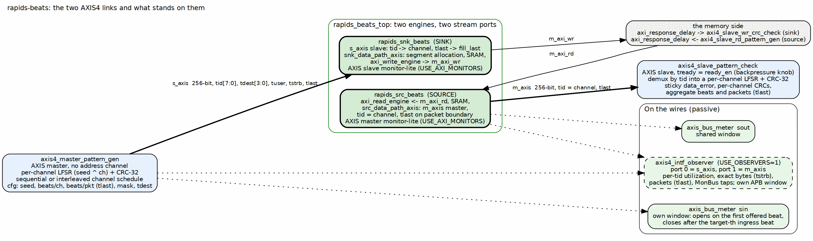
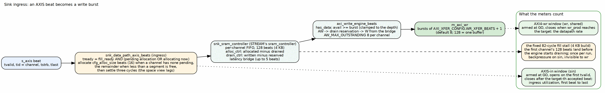

<!-- RTL Design Sherpa Documentation Header -->
<table>
<tr>
<td width="80">
  
</td>
<td>
  <strong>RTL Design Sherpa</strong> · <em>Learning Hardware Design Through Practice</em> 
  
    <a href="https://github.com/sean-galloway/RTLDesignSherpa">GitHub</a> ·
    <a href="https://github.com/sean-galloway/RTLDesignSherpa/blob/main/docs/DOCUMENTATION_INDEX.md">Documentation Index</a> ·
    <a href="https://github.com/sean-galloway/RTLDesignSherpa/blob/main/LICENSE">MIT License</a>
  
</td>
</tr>
</table>

---

<!-- End Header -->

# The AXIS4 Interfaces

### Figure 2.1: The two links and what stands on them

**Source:** [01_two_axis_links.dot](../assets/graphviz/01_two_axis_links.dot)

## The wires

Both links are full AXI4-Stream with the sideband the DUT is parameterized
for. `DATA_WIDTH` is the one width RAPIDS has, so the stream is as wide as
the memory bus: 256 bits and a 32-bit `tstrb` since the v2.0 design point.

| Signal | Sink ingress `s_axis_*` | Source egress `m_axis_*` | Width | Meaning |
|--------|------------------------|--------------------------|------:|---------|
| `tvalid`, `tready` | in, out | out, in | 1 | the handshake; every meter and observer classifies a cycle by these two bits |
| `tdata` | in | out | `DATA_WIDTH` | payload |
| `tstrb` | in | out | `DATA_WIDTH/8` | byte enables; the AXIS meter's byte count is the popcount of this on productive beats |
| `tlast` | in | out | 1 | packet boundary; becomes `fill_last` inside the sink, is generated on the packet boundary by the source |
| `tid` | in | out | `AXIS_ID_WIDTH` = 8 | the channel: the low bits select the SRAM channel on ingress and identify the producing channel on egress |
| `tdest` | in | out | `AXIS_DEST_WIDTH` = 4 | routing sideband, carried through; the harness sets it from `GEN_TDEST` |
| `tuser` | in | out | `AXIS_USER_WIDTH` = 1 | user sideband, carried through |

: Table 2.1: The AXIS4 signals as built

The DUT is the AXIS slave on ingress and the AXIS master on egress. That is
why the harness has an AXIS *master* generator and an AXIS *slave* checker,
and why the in-core monitor-lites are an AXIS slave monitor in the sink half
and an AXIS master monitor in the source half.

## Sink ingress: a beat becomes a write burst

### Figure 2.2: Sink ingress

**Source:** [02_sink_ingress.dot](../assets/graphviz/02_sink_ingress.dot)

`snk_data_path_axis_beats` turns the stream into the fill interface of the
sink data path. `tid` selects the channel, the beat goes straight through
as `fill_data`, `tlast` becomes `fill_last`. What makes ingress more than a
wire is SRAM allocation: the sink reserves space before it accepts data, in
segments of `cfg_alloc_size` beats (16, `AXI_XFER_CONFIG.ALLOC_SIZE`), and
`s_axis_tready` is high only while the beat's channel holds an allocation or
is allocating this cycle, and the FIFO can take the beat.

Three properties of that allocation were established this month and are
worth knowing when reading an ingress number:

- A packet that ends mid-segment leaves the rest of its segment allocated
  for the channel's next packet. The next packet consumes it before it
  allocates anything new, so per-channel accounting stays consistent across
  packets and runs.
- When less than a segment is free, the ingress allocates the remainder,
  so the buffer can always be filled to the top. Without that, a write burst
  equal to the buffer depth could never be satisfied after a short packet
  (rapids BUG-009, second finding).
- After any allocation a channel settles three cycles before allocating
  again, because the free-space view it reads lags an allocation by that
  much. A one- or two-beat remainder consumed before the view moved once
  let the allocator over-commit (BUG-009, third finding).

Backpressure on `s_axis_tready` therefore means one of: the channel's buffer
is full, no space is allocated yet, or the pipeline is stalled. On the 4 KB
build the first of those happens once per run in a fixed way: the generator
lands the first channel's 128 beats before the write engine has started
draining, and the ingress waits 82 cycles. It is the same 82 at every
transfer size, a startup cost and not a throughput one, and the 16 KB
buffers of the earlier design point absorbed it entirely.

## Source egress

`src_data_path_axis_beats` is the mirror: the read engine fills the
per-channel SRAM from `m_axi_rd`, and the egress side drains it onto
`m_axis` with `tid` set to the channel and `tlast` on the packet boundary.
The source's throughput under memory latency is bounded by that SRAM, since
the read engine allocates the whole burst before issuing the AR; the egress
link itself, being a master into an always-ready checker, is never the
limit unless the host asks for backpressure.

## The AXIS monitor-lites

With `USE_AXI_MONITORS=1` each half carries an AXIS monitor-lite on its
stream port (rapids TASK-015, "Option B"): an AXIS slave monitor in
`rapids_snk_beats` on `s_axis`, an AXIS master monitor in `rapids_src_beats`
on `m_axis`, each a third client of its half's MonBus arbiter beside the
descriptor and scheduler emitters. They keep the one-monitor-stream-per-half
contract and let the half-level tests see the packets. Their filtering is
configured through the MonBus group's AXIS slot, and they carry agent ids
next to the AXI descriptor monitor's. The monitors-in build of the companion
book is where they are built and measured; the bare and observer builds
leave them out, which is why those builds have no in-core view of the
streams and the AXIS observer of Chapter 4 exists.
