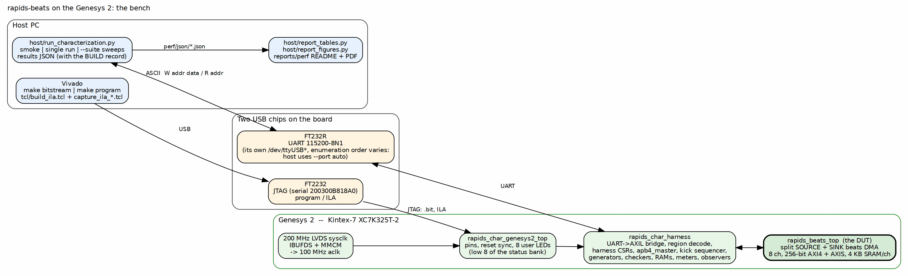

<!-- RTL Design Sherpa Documentation Header -->
<table>
<tr>
<td width="80">
  
</td>
<td>
  <strong>RTL Design Sherpa</strong> · <em>Learning Hardware Design Through Practice</em> 
  
    <a href="https://github.com/sean-galloway/RTLDesignSherpa">GitHub</a> ·
    <a href="https://github.com/sean-galloway/RTLDesignSherpa/blob/main/docs/DOCUMENTATION_INDEX.md">Documentation Index</a> ·
    <a href="https://github.com/sean-galloway/RTLDesignSherpa/blob/main/LICENSE">MIT License</a>
  
</td>
</tr>
</table>

---

<!-- End Header -->

# The System

## What it is

`rapids_beats` is an on-chip characterization system. A synthesizable harness
surrounds the RAPIDS beats DMA (split into a read-only SOURCE engine and a
write-only SINK engine behind one APB) with seeded pattern generators, CRC
checkers, descriptor and semaphore memories, a programmable memory-latency
model and four per-cycle bus meters, and exposes the whole control surface to
a host over one UART link. The host stages a configuration, fires one GO, and
reads back a window of counts that bracket exactly the transfer that ran.
Every configuration is golden-validated: the CRC the sink wrote to memory and
the CRC the source produced on its stream are compared against a software
model of the same LFSR pattern.

The point of the exercise is the number, not the demo: utilization per
interface, per cycle, under conditions the host sets (channels, beats, burst
length, memory latency, backpressure, channel schedule). Those numbers are the
performance report; this book is the apparatus.

### Figure 1.1: The bench

**Source:** [01_board_and_host.dot](../assets/graphviz/01_board_and_host.dot)

## The board

Digilent Genesys 2, Kintex-7 XC7K325T-2 (ffg900). The harness clock is
100 MHz: the board supplies a 200 MHz LVDS system clock, and
`rapids_char_genesys2_top` turns it into the single-ended 100 MHz `aclk`
through an IBUFDS and an MMCM. Everything downstream of that clock, the UART
bridge, the decode, the harness and the DUT, is board-agnostic and was
carried over unchanged from the Nexys A7 flow.

Why the Genesys 2 at all: the Artix-7 100T on the Nexys A7 is at its timing
limit for RAPIDS beats above four channels at a 512-bit datapath. The
Kintex-7 325T has roughly three times the LUTs and a faster speed grade, so
the full eight-channel geometry closes 100 MHz with margin, and the
instrumented variants of Chapter 3 fit at all. The `BOARD` knob still selects
either target; the Genesys 2 defaults to eight channels, the Nexys to four.

| Resource | XC7K325T-2 | Note |
|----------|-----------:|------|
| Slice LUTs | 203,800 | the observers build of the 256-bit design point uses about 76,000 |
| Block RAM tiles | 445 | the same build uses 44 |
| User LEDs | 8 | the low 8 bits of the harness status bank |
| Reset | red CPU reset button, active low | synchronized inside the pin top |

: Table 1.1: The part and what the harness uses of it

## The two USB chips

The Genesys 2 has two separate USB bridges, and the distinction matters every
time a board is set up:

- The **FT2232** carries JTAG. Vivado programs the bitstream and talks to the
  ILA through it. Its serial, `200300B818A0`, is what `FPGA_JTAG_SERIAL`
  names so a two-board chain (a Nexys A7 sits on the same chain in this
  lab) programs the right part.
- The **FT232R** carries the UART. It enumerates as its own `/dev/ttyUSB*`,
  and which number it gets depends on plug order. The host tools therefore
  default to `--port auto` and probe every `ttyUSB` for the harness ID
  register rather than pinning a node.

The link is 115200-8N1 with an ASCII protocol: `W addr data` and `R addr`,
one 32-bit AXI4-Lite access per line. That is slow, and the harness is built
so that slowness never lands inside a measurement (Chapter 2, the launch
path).

## The stack, top to bottom

| Layer | Module | Role |
|-------|--------|------|
| Pin top | `rapids_char_genesys2_top` | LVDS clock in, MMCM, reset sync, LEDs; instantiates the pin-level top |
| Pin-level top | `rapids_char_top` | pins to harness ports; historically the host front-end, now pins plus status only |
| Harness | `rapids_char_harness` | UART to AXI4-Lite bridge, region decode, harness CSRs, APB master, kick sequencer, generators, checkers, memories, latency model, meters, optional observers |
| DUT | `rapids_beats_top` | SOURCE (memory to AXIS) and SINK (AXIS to memory), 8 channels, one APB, merged MonBus egress |

: Table 1.2: The stack

The host front-end used to live in the pin-level top. It was moved into the
harness on 2026-09-23 so that simulating the harness exercises the board's own
launch path: the cocotb testbench drives the same UART bytestream the host
does, and the same decode, CSRs and kick sequencer run. That is what makes
"sim equals board" a checkable claim rather than a hope (Chapter 4).

## The design point

Since 2026-09-29 the DUT is built at 256-bit AXI4 and AXIS (RAPIDS has one
`DATA_WIDTH` for both) with 128 beats of SRAM per channel, 4 KB. The earlier
512-bit, 256-deep (16 KB) point is what report versions 1.0 to 1.5 measured.
The line rate is therefore 3.20 GB/s per direction: 32 bytes per beat at
100 MHz.

The bitstream reports its own geometry. Harness CSR 0x004, `BUILD`, carries
bytes per beat, channel count, log2 of the SRAM depth and the three
instrument flags, and the host reads it on first contact and takes its byte
and bandwidth arithmetic from there. A host started with a channel count the
bitstream does not have refuses to run. Every results file carries that
`design` record, so a number can never be attributed to the wrong build.
