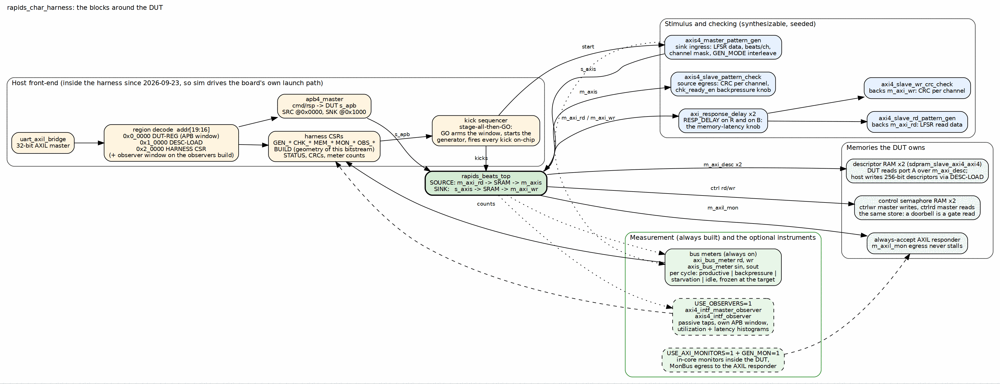

<!-- RTL Design Sherpa Documentation Header -->
<table>
<tr>
<td width="80">
  
</td>
<td>
  <strong>RTL Design Sherpa</strong> · <em>Learning Hardware Design Through Practice</em> 
  
    <a href="https://github.com/sean-galloway/RTLDesignSherpa">GitHub</a> ·
    <a href="https://github.com/sean-galloway/RTLDesignSherpa/blob/main/docs/DOCUMENTATION_INDEX.md">Documentation Index</a> ·
    <a href="https://github.com/sean-galloway/RTLDesignSherpa/blob/main/LICENSE">MIT License</a>
  
</td>
</tr>
</table>

---

<!-- End Header -->

# The Harness

`rapids_char_harness` is the bitstream minus the pins. It has three jobs:
give the host a control surface, feed and check the DUT with synthesizable
stimulus, and measure without perturbing. Figure 2.1 is the block map; the
sections below take the blocks in the order a transfer meets them.

### Figure 2.1: The harness block map

**Source:** [02_harness_blocks.dot](../assets/graphviz/02_harness_blocks.dot)

## The host front-end

`uart_axil_bridge` turns the UART bytestream into a single 32-bit AXI4-Lite
master. A decode on address bits 19:16 splits that master into three regions:

| Region | Word address | What is behind it |
|--------|-------------|-------------------|
| DUT-REG | `0x0_0000` | an APB window into the DUT through `apb4_master`: address bits 12:0 are the APB byte address, so the SOURCE register space at 0x0000, the SINK space at 0x1000 and the per-channel kick windows are all reachable |
| DESC-LOAD | `0x1_0000` | eight 32-bit holding words assemble one 256-bit descriptor; `DESC_KICK` issues a single-beat AXI4 write of it into the SOURCE or SINK descriptor RAM; `DESC_STATUS` reports the write landed |
| HARNESS CSR | `0x2_0000` | generator, checker, memory and monitor control, the status and CRC readback, the meter counts, `BUILD`, `ID` |

: Table 2.1: The three regions

The observers build adds a fourth window for the observers' own APB
configuration and readback; the host tools address it by name through the
generated register map, never by offset.

Registers are reached by name everywhere. The harness CSR map and the DUT's
map come out of PeakRDL as Python register maps
(`rtl/rapids_harness_csr_regmap.py`, `rtl/rapids_harness_desc_regmap.py`,
and the DUT's `rapids_regmap.py`), and `rapids_char_io.py` writes fields by
name. Offsets churn; names do not.

## The launch path: stage everything, then GO

UART is slow, a few hundred microseconds per access. If the measurement
window opened at the first CSR write and closed at the last, the numbers
would measure the link, not the DMA. Two mechanisms make the numbers
trustworthy:

1. **Atomic launch.** Every CSR, every descriptor and every per-channel kick
   is staged first. A single write to `GO` then arms the meter window, starts
   the AXIS generator and fires all the staged kicks on-chip within a few
   `aclk` cycles. The kick sequencer holds the kicks; the host never times
   anything.
2. **Deterministic close.** The host stages `OBS_TARGET`, the number of
   productive beats the transfer will produce on the completion interface.
   The meters freeze the cycle after that count is reached, so the window
   brackets exactly the transfer, independent of the DUT's internal idle
   signalling. Earlier builds keyed the close on `system_idle` and left the
   window open until the host read it, which diluted utilization toward zero.

Between runs the host pulses `CHANNEL_RESET` on both halves. That clears the
schedulers and descriptor engines; it does not reach the SRAM controller,
which is why BUG-009's poisoned states survived it and why a campaign that
must not inherit history starts from a reprogram.

## Stimulus and checking

Everything that produces or consumes data is on-chip and seeded, so the
board and the simulator see the same bytes.

| Block | Side | What it does |
|-------|------|--------------|
| `axis4_master_pattern_gen` | SINK ingress (`s_axis`) | LFSR data from `GEN_SEED`, `GEN_NBEATS` per channel, `GEN_CHMASK`, `GEN_BPP` beats per packet, `GEN_TDEST`; `GEN_MODE.INTERLEAVE` round-robins the active channels one beat at a time instead of finishing one channel before starting the next |
| `axis4_slave_pattern_check` | SOURCE egress (`m_axis`) | per-channel CRC of what arrives; `CHK_CTRL.chk_ready_en` is the egress backpressure knob |
| `axi4_slave_rd_pattern_gen` | backs `m_axi_rd` | LFSR read data for the SOURCE, a CRC of what it served |
| `axi4_slave_wr_crc_check` | backs `m_axi_wr` | per-channel CRC of what the SINK wrote |
| `axi_response_delay` x2 | in front of both slaves | `RESP_DELAY`: hold R and B for a programmed number of cycles, the memory-latency knob of the latency sweeps |

: Table 2.2: Stimulus and checking

The golden model on the host, `rapids_char_golden.py`, runs the same LFSR and
computes the CRCs a correct DMA must produce. PASS is anchored on the data
path: the sink's write CRC and the source's egress CRC must equal the model.
The generator's own expected-CRC readback is corroboration only.

## Memories the DUT owns

| Block | Count | Role |
|-------|------:|------|
| descriptor RAM (`sdpram_slave_axi4_axi4`) | 2 | one per half; the DUT reads descriptors over `m_axi_desc`, the host writes them through DESC-LOAD |
| control semaphore RAM (`sdpram_slave_axi4_axi4`) | 2 | one per half; the control-write master writes and the control-read master reads the same store, so a doorbell write is observable by a gate read |
| always-accept AXI4-Lite responder | 1 | terminates the DUT's `m_axil_mon` MonBus egress so it never stalls |

: Table 2.3: Memories

## Measurement

Four bus meters are always built, one per data interface: `axi_bus_meter`
on the read and write AXI4 masters, `axis_bus_meter` on the AXIS in and out.
Each classifies every cycle of the window into productive, backpressure,
starvation or idle, and the host turns those into utilization and effective
bandwidth. They are cheap, and they are the source of truth for report
sections 1 to 6.

Two optional instruments, each a build variant of Chapter 3:

- **Observers** (`USE_OBSERVERS=1`): the shared `axi4_intf_master_observer`
  on the AXI masters and `axis4_intf_observer` on the AXIS links. Passive
  taps on the same wires the meters watch, with their own APB window, per
  channel utilization and read/write latency histograms
  (`HIST_MAX_OUTSTANDING=32` so the latency sweeps do not lose samples). They
  are what measured STREAM's five knobs on this DUT (report section 7).
  `OBS_ENABLE_MON_TAPS` additionally arms their MonBus event taps.
- **Monitors-in** (`USE_AXI_MONITORS=1` with `GEN_MON=1`): the in-core AXI
  and descriptor monitors inside the DUT and the per-channel completion and
  error emitters that give their packets an egress. On by default in a
  product; off here by default because the bare build is tuned to close
  eight channels, and on when the question is what the monitors cost.

## The debug variant

`tcl/build_ila.tcl` defines `RAPIDS_CHAR_ILA`, under which the harness and
the DUT's engines mark their observation-window nets `mark_debug`, and the
script inserts an ILA on every marked net. The marks expand to nothing in
every other build, so they cost the measured bitstreams no logic and no
timing. `tcl/capture_ila_bug009.tcl` is the capture driver: program, arm on
`r_go` or on a late AXI4-write beat count, drive one host run, write the
trace as CSV. Its optional poison pre-run and no-reprogram modes exist
because BUG-009 was history-dependent.
