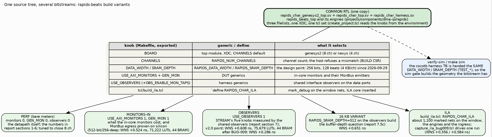

<!-- RTL Design Sherpa Documentation Header -->
<table>
<tr>
<td width="80">
  
</td>
<td>
  <strong>RTL Design Sherpa</strong> · <em>Learning Hardware Design Through Practice</em> 
  
    <a href="https://github.com/sean-galloway/RTLDesignSherpa">GitHub</a> ·
    <a href="https://github.com/sean-galloway/RTLDesignSherpa/blob/main/docs/DOCUMENTATION_INDEX.md">Documentation Index</a> ·
    <a href="https://github.com/sean-galloway/RTLDesignSherpa/blob/main/LICENSE">MIT License</a>
  
</td>
</tr>
</table>

---

<!-- End Header -->

# One RTL, Several Bitstreams

## The rule

There is one harness, one pin top, one board top, one set of filelists and
one XDC. Every bitstream this area has ever measured came from that source at
a different set of parameters. Nothing is copied to make a variant: a
variant is a line in the Makefile, exported into the environment, and
`tcl/create_project.tcl` reads it there and hands it to Vivado as a generic
or a define. The alternative, a near-copy of the harness per flavour, is how
two designs drift apart while everyone believes they are measuring the same
thing; STREAM retired exactly such a pair, and this area never had one.

The same knobs go to the simulator. `make verify-sim` and `make sim` pass
`DATA_WIDTH` and `SRAM_DEPTH` to the cocotb harness testbench as
`TEST_DATA_WIDTH` and `TEST_SRAM_DEPTH`, so the pre-bitstream gate simulates
the geometry the bitstream will have, and a bug that only exists at 128 beats
is not hidden by a 512-beat simulation.

### Figure 3.1: One source tree, several bitstreams

**Source:** [03_build_variants.dot](../assets/graphviz/03_build_variants.dot)

## The knobs

| Knob | Reaches the design as | Selects |
|------|----------------------|---------|
| `BOARD` | top module, XDC, default `CHANNELS` | `genesys2` (eight channels) or `nexys` (four) |
| `CHANNELS` | `RAPIDS_NUM_CHANNELS` | channel count, also handed to the host so the campaign and the bitstream cannot disagree |
| `DATA_WIDTH`, `SRAM_DEPTH` | `RAPIDS_DATA_WIDTH`, `RAPIDS_SRAM_DEPTH` | the design point; both readable back through `BUILD` |
| `USE_AXI_MONITORS`, `GEN_MON` | DUT generics | the in-core monitors and their MonBus emitters |
| `USE_OBSERVERS`, `OBS_ENABLE_MON_TAPS` | harness generics | the shared interface observers and their event taps |
| `tcl/build_ila.tcl` | `` `define RAPIDS_CHAR_ILA `` | the marked debug nets and an ILA core |

: Table 3.1: The build knobs

The monitor knobs deliberately carry the same names STREAM's `build-*`
Makefiles export, so a reader who knows one area's builds knows the other's.

## The variants and why each exists

| Variant | Knobs | The question it answers | Measured |
|---------|-------|-------------------------|----------|
| Performance (bare meters) | monitors 0, `GEN_MON` 0, observers 0 | how fast the datapath is, measured by the four cheap meters; the bitstream is tuned to close eight channels at 100 MHz, so this is the reference point every other variant is compared against | report sections 1 to 6, every design point |
| Monitors-in | `USE_AXI_MONITORS=1`, `GEN_MON=1` | what the in-core monitors cost in area and timing, and whether the DUT's MonBus egress works on silicon at all; also the first build after a monitor-lite update to check timing had not moved | 512-bit, 256-deep, 8 ch (2026-09-28): WNS +0.524 ns, 71,222 LUTs, 44 BRAM tiles; all 172 campaign configurations identical to the bare build |
| Observers | `USE_OBSERVERS=1` (taps optional) | STREAM's five characterization knobs measured by the shared interface observers instead of the bare meters, with latency histograms; the passive taps must not change a single utilization cell, and they did not | 256-bit, 4 KB, 8 ch: WNS +0.608 ns, 75,679 LUTs, 44 BRAM tiles (report v2.0); after the BUG-009 fixes WNS +0.286 ns |
| 16 KB variant | observers build with `RAPIDS_SRAM_DEPTH=512` | whether the per-channel buffer depth is in the eight-channel latency knee (it is, report 7.5c) and in the single-channel window (it is not) | WNS +0.651 ns |
| ILA | `build_ila.tcl` on the bare build | see the engine gates, the ingress allocation and the SRAM controller's counts during one run; the BUG-009 traces | about 1,100 marked nets; WNS +0.356 ns and +0.584 ns on the two builds this month |

: Table 3.2: The build variants

Two things follow from the table. First, the instrumented variants are not
redundant with each other: observers and monitors watch from opposite sides
of the DUT boundary, and each has a zero the other cannot see. Second, the
bare build is where timing is tuned, so any variant that closes with less
margin is reporting the cost of its instrument, not a regression of the
datapath.

## The design points

| Point | `DATA_WIDTH` / `SRAM_DEPTH` | Line rate | Reports |
|-------|-----------------------------|----------:|---------|
| Original | 512 / 256 (16 KB per channel) | 6.40 GB/s | v1.0 to v1.5 |
| Current | 256 / 128 (4 KB per channel) | 3.20 GB/s | v2.0 onward |

: Table 3.3: The design points

Every utilization cell of the 256-bit build matched the 512-bit build at the
same beat count, so the engines' per-beat behaviour is width-independent and
every gigabyte figure simply halves. Two things the smaller buffer did
change: a fixed 82-cycle ingress fill stall per run, and a single-channel
write window of about 80 beats instead of about 93. Those are the report's
findings; the point here is that the comparison was possible only because
both points came from the same source at different generics.

## What a build costs and where it lives

A full flow is synthesis, implementation and bitstream generation, ten to
forty minutes on the lab host. `make bitstream` runs `verify-sim` first
unless `BITSTREAM_SKIP_VERIFY=1`, refuses to start Vivado if the sink
self-check fails, and writes `bitstream/rapids_char.bit` plus the timing,
utilization and DRC reports under `reports/`. Bitstreams are never committed.
The one or two worth keeping are copied out of the tree by `make keep` into
the hold directory (`RDS_HOLD_DIR`), and `make program` falls back to that
copy when the build directory is clean, saying which file it is programming
every time.
