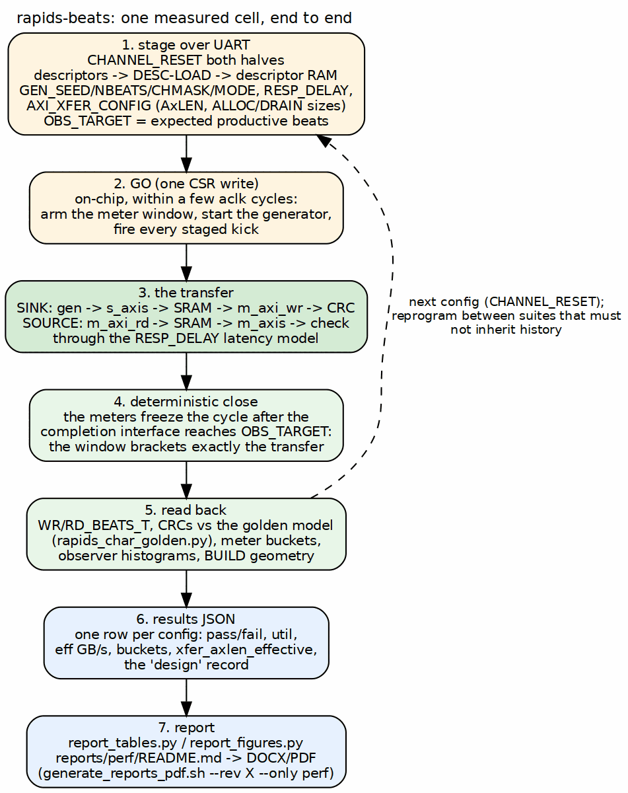

<!-- RTL Design Sherpa Documentation Header -->
<table>
<tr>
<td width="80">
  
</td>
<td>
  <strong>RTL Design Sherpa</strong> · <em>Learning Hardware Design Through Practice</em> 
  
    <a href="https://github.com/sean-galloway/RTLDesignSherpa">GitHub</a> ·
    <a href="https://github.com/sean-galloway/RTLDesignSherpa/blob/main/docs/DOCUMENTATION_INDEX.md">Documentation Index</a> ·
    <a href="https://github.com/sean-galloway/RTLDesignSherpa/blob/main/LICENSE">MIT License</a>
  
</td>
</tr>
</table>

---

<!-- End Header -->

# Host Tools and Flow

## Make targets

The flow Makefile in `flows-rapids-beats/` is the one entry point. It
exports the knobs of Chapter 3 and drives Vivado, the simulator and the host
tools with them.

| Target | What it does |
|--------|--------------|
| `make sim` | the cocotb harness self-check, sink and source, at the Makefile's `DATA_WIDTH` and `SRAM_DEPTH` |
| `make verify-sim` | the sink self-check only; the gate `make bitstream` runs first |
| `make bitstream` | synthesis, implementation, bitstream and reports (`BOARD=genesys2 USE_OBSERVERS=1` for the observers build) |
| `make program` | flash the board over JTAG, naming the file it programs |
| `make smoke` | a fast golden-validated check over UART, two channels, four beats, both halves |
| `make suite` | the full sweep, results to a JSON file |
| `make flow` | sim, bitstream, program, characterize |

: Table 4.1: Make targets

## The host tools

| Tool | Role |
|------|------|
| `rapids_char_io.py` | the UART link and register access by name through the generated register maps |
| `descriptor_builder.py` | assembles the 256-bit descriptors the DESC-LOAD region writes |
| `rapids_char_golden.py` | the software LFSR and CRC model every run is validated against |
| `run_characterization.py` | the campaign driver: `--smoke`, a single run (`--active`, `--beats`, `--xfer-axlen`, `--interleave`, `--backpressure`, `--sink-only` / `--source-only`), or `--suite` with `--suite-channels`, `--suite-beats`, `--suite-descs`, `--suite-xfer`, `--suite-delay`, `--suite-bp`, `--suite-seeds`; every row carries the `BUILD` record and the AxLEN the engines actually ran |
| `dump_status.py` | pretty-prints the status CSRs of a running board |
| `run_sink_once.py` | one sink run, for debugging by hand |
| `report_tables.py`, `report_figures.py` | rebuild the report's tables and PNG figures from any campaign's JSON files |
| `plot_char_reports.py`, `gather_size_sweep.sh` | the older plotting and gathering helpers |

: Table 4.2: Host tools

`run_characterization.py` reads `BUILD` on first hardware contact and refuses
a `--channels` that does not match the bitstream. It warns when a requested
AxLEN exceeds the build's cap (the SRAM depth minus one, since BUG-009) and
records the effective value in every row, so a table never labels a
128-beat burst as 256.

## One measured cell, end to end

### Figure 4.1: From a host command to a report cell

**Source:** [04_measurement_path.dot](../assets/graphviz/04_measurement_path.dot)

For each configuration the driver resets both halves, loads the descriptors,
programs the generator and the knobs, stages the kicks and the productive
beat target, writes GO, polls the completion counter, and scores: beat
totals, CRCs against the golden model, meter buckets, and on the observers
build the histograms. The row goes into the results JSON. The report scripts
turn the JSON files under `reports/perf/json/` into the tables and figures of
`reports/perf/README.md`, and `reports/generate_reports_pdf.sh --rev X --only
perf` turns that into the versioned DOCX and PDF.

## Simulation equals board

The harness simulation drives the same UART bytestream through the same
bridge, decode, CSRs and kick sequencer that the board runs, against the same
generics. `dv/test_rapids_char_harness.py` carries the sink and source
self-checks, and the environment knobs `TEST_NUM_ACTIVE`, `TEST_NUM_BEATS`,
`TEST_XFER_AXLEN`, `TEST_RESP_DELAY_RD` and `TEST_RESP_DELAY_WR`,
`TEST_GEN_INTERLEAVE` and `TEST_USE_OBSERVERS` reach the same registers the
host's options do. A board finding is therefore reproduced by setting those
knobs, not by writing a new test.

The limits are worth knowing. The self-checks run one transfer each, so a
defect that needs history (a run that ends mid-segment, then a run that needs
the whole buffer) is a board reproduction first and a macro-level test in the
component area second. And the simulator's slave models drain at their own
rhythm, so a race that depends on a partial allocation landing on a stale
view was seen only on silicon, through the ILA variant.

## Reprogram between campaigns

A wedged channel is cleared by a reprogram, not by `CHANNEL_RESET`. The
campaign scripts that produce report data therefore program the board before
each suite, and a smoke run is treated as history: it ends mid-segment, and
the BUG-009 investigation showed what a following full-depth burst did with
that.
