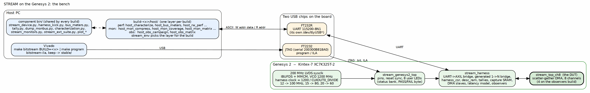

<!-- RTL Design Sherpa Documentation Header -->
<table>
<tr>
<td width="80">
  
</td>
<td>
  <strong>RTL Design Sherpa</strong> · <em>Learning Hardware Design Through Practice</em> 
  
    <a href="https://github.com/sean-galloway/RTLDesignSherpa">GitHub</a> ·
    <a href="https://github.com/sean-galloway/RTLDesignSherpa/blob/main/docs/DOCUMENTATION_INDEX.md">Documentation Index</a> ·
    <a href="https://github.com/sean-galloway/RTLDesignSherpa/blob/main/LICENSE">MIT License</a>
  
</td>
</tr>
</table>

---

<!-- End Header -->

# The System

## What it is

The STREAM system on the Genesys 2 is two things sharing one bitstream
source. It is a characterization harness: a synthesizable wrapper that feeds
the STREAM scatter-gather DMA from an on-chip LFSR memory model, sinks its
writes into a CRC checker, adds programmable memory latency, and counts every
cycle of every interface. And it is a monitor-validation environment: the
same wrapper carries the tally memories, capture SRAM and drains that let the
host see every MonBus packet type from every agent in the DUT, whether the
packets come from the in-core monitors or from interface observers standing
outside the DUT.

Which of those it is on a given day is a question of which build is
programmed. Chapter 3 is about that. The rest of this chapter is what does
not change between them.

### Figure 1.1: The bench

**Source:** [01_board_and_host.dot](../assets/graphviz/01_board_and_host.dot)

## The board

Digilent Genesys 2, Kintex-7 XC7K325T-2. The Nexys A7 version of this
system (`stream_char_top`) was the original; the Genesys 2 top,
`stream_genesys2_top`, adds an IBUFDS and an MMCM for the board's 200 MHz
LVDS system clock and drops the seven-segment display for the eight user
LEDs. Everything below the top is the same RTL on both boards.

The harness clock is a parameter, not a constant. The MMCM runs its VCO at
1200 MHz and the harness clock is 1200 divided by `CLKOUT0_DIVIDE`: 12 gives
100 MHz, 15 gives 80, 20 gives 60. `FPGA_CLK_HZ`, which sizes the UART
divisor, the heartbeat and the timer, is derived from the same parameter, so
the two can never disagree. The mon sign-off build ran at 60 MHz, which is
where the full-cone monitor build closed with margin; the perf build is the
one that cares about the clock, and it is small enough to run faster.

| Resource | XC7K325T-2 | The builds |
|----------|-----------:|------------|
| Slice LUTs | 203,800 | mon sign-off 139,293 (68%); the two instruments together would need 217,761, which is why they are never built together (2026-10-03 re-measurement: 86,865 LUTs / 42.6%, WNS +1.914 ns; RTL has moved since the original sign-off) |
| Block RAM tiles | 445 | 20 to 24 on the current reports |
| User LEDs | 8 | status bank; PASS and FAIL are one-byte patterns |
| Reset | red CPU reset button, active low | synchronized in the top |

: Table 1.1: The part and what the builds use of it

## The two USB chips

The Genesys 2 carries JTAG on an FT2232 (serial `200300B818A0`, the one
`FPGA_JTAG_SERIAL` names, because a Nexys A7 shares the chain in this lab)
and the UART on a separate FT232R that enumerates as its own `/dev/ttyUSB*`.
The host tools probe for the harness rather than pin a device node. The link
is 115200-8N1 with the ASCII `W addr data` / `R addr` protocol, one 32-bit
AXI4-Lite access per line.

## The stack, top to bottom

| Layer | Module | Role |
|-------|--------|------|
| Board top | `stream_genesys2_top` | LVDS clock in, MMCM, reset sync, LEDs, the geometry generics |
| Harness | `stream_harness` | UART to AXI4-Lite bridge, the generated one-to-many bridge, harness CSRs, descriptor RAM, tallies, capture SRAM, DMA slaves, latency model, observers |
| DUT | `stream_top_ch8` | the STREAM DMA: APB configuration and kicks, eight channels (four on the obs build), one descriptor AXI4 master, read and write data masters, MonBus egress |

: Table 1.2: The stack

The harness is component-level: one `stream_harness.sv`, one
`stream_genesys2_top.sv`, one `harness_csr.sv`, one `axi_response_delay.sv`,
one set of generated bridges, one Tcl set and one XDC, shared by every build.
Every geometry default the harness uses comes from `stream_cfg_pkg`, which is
the single source the board top and the simulation share. A literal in the
harness is how the simulation and the board once drifted apart, with the perf
characterization run at sixteen outstanding transactions against a board
built at two.

## What the host sees

One AXI4-Lite master, fanned out by a generated bridge to every slave in the
harness: the STREAM APB window, the harness CSRs, the descriptor RAM, the
MonBus error drains, the two tally memories and their configuration, the
slave-monitor and observer register blocks, and the capture SRAM. Chapter 2
has the map. Every register the host touches is reached by name through a
register map generated from `regs/harness_csr.rdl`; a hand-kept Python table
used to exist, drifted, and declared ten registers the RTL did not decode,
which three host tools then read as zeros off a running board.
