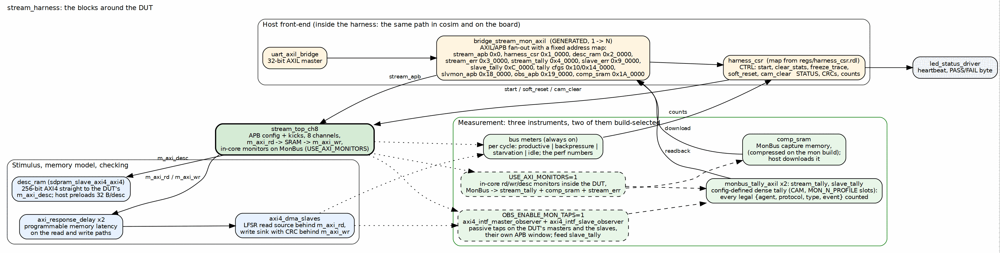

<!-- RTL Design Sherpa Documentation Header -->
<table>
<tr>
<td width="80">
  
</td>
<td>
  <strong>RTL Design Sherpa</strong> · <em>Learning Hardware Design Through Practice</em> 
  
    <a href="https://github.com/sean-galloway/RTLDesignSherpa">GitHub</a> ·
    <a href="https://github.com/sean-galloway/RTLDesignSherpa/blob/main/docs/DOCUMENTATION_INDEX.md">Documentation Index</a> ·
    <a href="https://github.com/sean-galloway/RTLDesignSherpa/blob/main/LICENSE">MIT License</a>
  
</td>
</tr>
</table>

---

<!-- End Header -->

# The Harness

`stream_harness` is the bitstream minus the pins. Unlike the RAPIDS harness,
whose host front-end was moved inside it late, this one was built with the
UART bridge and the CSRs inside from the start, so the cosim and the board
have always run the same host programs over the same bytestream. Figure 2.1
is the block map.

### Figure 2.1: The harness block map

**Source:** [02_harness_blocks.dot](../assets/graphviz/02_harness_blocks.dot)

## The host front-end and the bridge

`uart_axil_bridge` turns the UART bytestream into one 32-bit AXI4-Lite
master. A generated bridge (`bridge_stream_mon_axil`, from the bridge
generator in `projects/components/fabric-gen-ip/bridge`) fans it out to every
slave, converting protocol and width per port; it is regenerated by
`bin/regen_bridges.sh` as the flow's PREBUILD step, so a slave added to the
map is a generator input, not hand-written glue.

| Base | Size | Slave |
|------|-----:|-------|
| `0x0000_0000` | 8 KB | `stream_apb`: the STREAM configuration window |
| `0x0001_0000` | 4 KB | `harness_csr` |
| `0x0002_0000` | 64 KB | `desc_ram`: descriptor preload, 32 bytes per descriptor |
| `0x0003_0000` | 4 KB | `stream_err`: the MonBus IRQ FIFO drain |
| `0x0004_0000` | 256 KB | `stream_tally`: the in-core monitors' packet tally |
| `0x0008_0000` | 4 KB | `dma_axil`: tied off, reserved |
| `0x0009_0000` | 4 KB | `slave_err`: the slave-monitor error drain |
| `0x000C_0000` | 256 KB | `slave_tally`: the observers' packet tally |
| `0x0010_0000` | 256 KB | `stream_tally_cfg`: tally CAM configuration and readback |
| `0x0014_0000` | 256 KB | `slave_tally_cfg` |
| `0x0018_0000` | 4 KB | `slvmon_apb`: slave-monitor configuration |
| `0x0019_0000` | 4 KB | `obs_apb`: observer configuration |
| `0x001A_0000` | 64 KB | `comp_sram`: MonBus capture memory, host download |

: Table 2.1: The bridge address map (monitor build)

Every MonBus-carrying AXI path is 64 bits wide. The descriptor read path is
a direct 256-bit AXI4 from the DUT to `desc_ram`, bypassing the bridge, and
the data masters are 128-bit into the pattern generator and CRC checker.

## The harness CSR

`harness_csr` is the host's control and status surface, separate from the
STREAM registers in the APB window. Its map is generated from
`regs/harness_csr.rdl`; the RTL is hand-written against it and every
external AXI4-Lite channel sits behind a skid buffer for timing.

| Register | Role |
|----------|------|
| `CTRL` | `start` (opens the measurement window), `clear_stats`, `freeze_trace` (stops capture writes), `soft_reset`, `cam_clear` (clears every CAM in the DUT's monitors and the tally) |
| `STATUS` | latched `stream_irq`, sticky `any_error`, sticky `trace_overflow`, `clear_busy` (poll to zero after `clear_stats` before the next capture) |
| `DBG_WR_PTR`, `DBG_OVERFLOW` | how much of the capture memory is written, and whether it overflowed |
| `CRC_RD_EXPECTED`, `CRC_WR_EXPECTED`, `CRC_WR_COMPUTED` | the source's pseudo-random CRC, the expected sink CRC, and what the sink actually wrote |
| meter and count registers | the per-interface cycle classification the perf host reads |

: Table 2.2: Harness CSR, the registers that define a run

`soft_reset` clears every instrument in the harness, which is what lets one
programming run a long sequence of host programs without inheriting state;
the runner hooks on the host issue it between programs.

## Stimulus and the memory model

| Block | Role |
|-------|------|
| `axi4_dma_slaves` | an LFSR read-source pattern generator behind `m_axi_rd` and a write-sink CRC checker behind `m_axi_wr`; both accept the next transaction on the last beat of the current one (an earlier two-state version inserted a dead cycle per burst and cost the datapath a phantom 6 percent) |
| `axi_response_delay` x2 | a programmable memory-latency model on the read and on the write path, the knob of the latency sweeps |
| `desc_ram` | the descriptor store the host preloads and the DUT fetches from directly |

: Table 2.3: Stimulus and memory model

## The three instruments

The harness carries three ways of measuring, and Chapter 3 is about which
build has which.

- **Bus meters**, always built. Per interface, every cycle of the window is
  productive, backpressure, starvation or idle. They sit outside the monitor
  gate on purpose: the perf build has no monitor and must still count. That
  separation regressed once, when the gate over-reached and the perf build
  reported zeros, and the monitor test now asserts the meters are non-zero in
  that flavour.
- **Tallies**, `monbus_tally_axil` twice. A direct count over every possible
  MonBus identity would be a 20,480-cell matrix of which about 245 tuples are
  legal; crossed with a 16-bit agent id it would be 99 percent empty. The
  tally instead loads the legal `{agent, protocol, packet type, event}`
  tuples into a CAM (`MON_N_PROFILE` slots, 32 on the sign-off builds) and
  counts densely, so the host can prove every agent emitted every packet
  type it may legally emit. `stream_tally` counts the in-core monitors,
  `slave_tally` the observers.
- **Capture**, `comp_sram`. The MonBus stream itself, compressed on the mon
  build, downloadable by the host and decoded against the cosim reference;
  `stream_err` and `slave_err` drain the error and IRQ FIFOs.

The two optional sources of packets are the DUT's in-core monitors
(`USE_AXI_MONITORS`) and the interface observers standing on the DUT's
masters and on the slaves (`OBS_ENABLE_MON_TAPS`). Both feed the same
tally and capture machinery; they are never built together, and the reason
is in Chapter 3.
