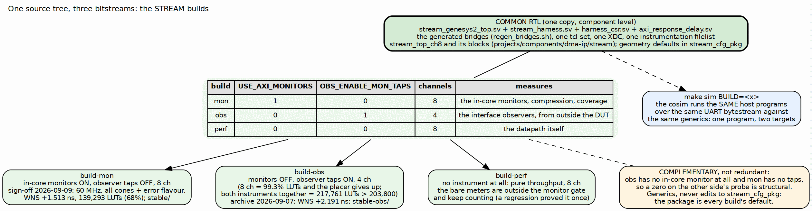

<!-- RTL Design Sherpa Documentation Header -->
<table>
<tr>
<td width="80">
  
</td>
<td>
  <strong>RTL Design Sherpa</strong> · <em>Learning Hardware Design Through Practice</em> 
  
    <a href="https://github.com/sean-galloway/RTLDesignSherpa">GitHub</a> ·
    <a href="https://github.com/sean-galloway/RTLDesignSherpa/blob/main/docs/DOCUMENTATION_INDEX.md">Documentation Index</a> ·
    <a href="https://github.com/sean-galloway/RTLDesignSherpa/blob/main/LICENSE">MIT License</a>
  
</td>
</tr>
</table>

---

<!-- End Header -->

# One RTL, Three Builds

## The rule

There is one harness, one board top, one CSR block, one latency model, one
set of generated bridges, one Tcl set and one XDC, all at component level.
`build-mon/`, `build-obs/` and `build-perf/` each hold a Makefile of
variables and nothing else; the flow logic is the shared `make/fpga_flow.mk`.
Which build you want is a question about what is under test, and the answer
is a row in this table:

| Build | `USE_AXI_MONITORS` | `OBS_ENABLE_MON_TAPS` | Channels | Measures |
|-------|:-----------------:|:---------------------:|:--------:|----------|
| `mon` | 1 | 0 | 8 | the in-core monitors: coverage, compression, error and fault probes |
| `obs` | 0 | 1 | 4 | the interface observers, watching the same DUT from outside it |
| `perf` | 0 | 0 | 8 | the datapath itself, with no instrument in the way |

: Table 3.1: The three builds

Two near-identical harnesses, one per flavour, used to exist. They were
retired because a variant that is a copy drifts: the board and the simulation
once disagreed on the outstanding-transaction limit for exactly that reason.
Now a variant is a parameter, the parameter is a generic handed to Vivado,
and `stream_cfg_pkg` stays every build's default; editing the package to
retarget one build silently retargets the other two.

### Figure 3.1: One source tree, three bitstreams

**Source:** [03_build_variants.dot](../assets/graphviz/03_build_variants.dot)

## Why three, and why not two

The mon and obs builds are complementary, not redundant. They exercise the
monitor code from two directions: the in-core monitors see transactions from
inside the DUT, the observers see them on the interfaces outside it, and both
push their packets through the same tally and capture machinery. So build-obs
has no in-core STREAM monitor at all, and a zero on any `mon_*` probe there is
structural; build-mon has its observer taps off, and a zero on an observer
probe there is equally structural. Reading either zero as a defect has cost an
afternoon before, which is why the Makefile says so in capitals.

They cannot be one build. With every monitor cone and both observers at
eight channels the design needs 217,761 LUTs against the 203,800 on the part,
and the placer never runs. Even the obs build alone does not fit at eight
channels: it reached 99.33 percent of the LUTs and "could not place all
instances", so obs is pinned at four (six does not route either). The
eight-channel design point is perf's requirement; the obs channel count is
incidental, not a traded-away requirement.

The perf build exists so that a number about the datapath is a number about
the datapath. Its bus meters are instantiated outside the monitor gate and
keep counting with every instrument removed; that arrangement is what lets
the design fit a small part, and it is guarded by a test after it regressed
once.

## What the builds measured

| Build | Sign-off | Clock | Result |
|-------|----------|------:|--------|
| `mon` | 2026-09-09, `stable/MANIFEST.md` | 60 MHz | all cones plus the error flavour, compression built, 8 channels, `MON_N_PROFILE=32`: WNS +1.513 ns, 139,293 LUTs (68.35%), 0 failed nets; 512 packets in 516 slots on the board, 66.4% smaller than the raw encoding, CRC match, cosim reference within 4 points (2026-10-03 re-measurement: 66.0% / 1.02 slots/packet, within data-dependent noise; bit sha256 `aceec688043ad630879779ddae211814fcc4dc457365d7c06ec95b8a4f348e6b`, WNS +1.914 ns, 86,865 LUTs) |
| `obs` | 2026-09-07, `stable-obs/MANIFEST.md` | as built | 4 channels, 32-entry tally CAM, WNS +2.191 ns, archived the day a `make clean-all` destroyed the previous obs bitstream and it turned out obs had been synthesizing at 100.01 percent of the LUTs and placing by luck (2026-10-03 re-measurement: `build-obs/results/obs_board_2026-10-03.txt`, bit sha256 `60696ace63fed2c77ad4d3f1f511d06dd85801c9b5a9dac1d4078454192bfa5f`, WNS +3.925 ns, 73,809 LUTs; the observer instrument changed 2026-09-27, commit 78cddb5e2 — lite taps, no perf/debug cone, caps0 bit4/bit5 read 0) |
| `perf` | current reports on disk | as built | 68,139 LUTs (33.4%), 24 BRAM tiles in `build-perf/fpga/reports`; the sweeps behind `reports/perf` and `reports/ext_addressing` (2026-10-03 re-measurement: `build-perf/results/perf_sweep_2026-10-03.{csv,json}`, bit sha256 `d26f9b7b3ac534a1507ab5a519e728d541b1045cf67000329fbedf77e3b9512c`, WNS +1.175 ns, 64,305 LUTs) |

: Table 3.2: Sign-off builds

The `stable/` directories hold exactly one build each, with the bitstream,
the Vivado reports for that bitstream, the board results measured on it and
a manifest naming the tree SHA it was built from. They exist because `make
clean-all` in a build directory deletes tracked bitstreams and reports, and
that has destroyed a verified bitstream more than once; `stable/` is a
sibling of the build directories, outside that blast radius.

## The knobs behind the rows

| Knob | Where | What it selects |
|------|-------|-----------------|
| `STREAM_NUM_CHANNELS` | build Makefile | channel count: 8 for mon and perf, 4 for obs |
| `USE_AXI_MONITORS` | build Makefile, DUT generic | the in-core rd/wr/descriptor monitors, their CAMs, and the compression pipeline (gated on this flavour only) |
| `OBS_ENABLE_MON_TAPS` | build Makefile, harness generic | arm the observers' MonBus event taps; the observers' meters and histograms count without them |
| `MON_ERROR_FLAVOR`, `MON_CONES` | build Makefile | which monitor cones are built; the sign-off is the union including error |
| `MON_N_PROFILE` | build Makefile | tally CAM depth |
| `CLKOUT0_DIVIDE` | board top parameter | 100, 80 or 60 MHz harness clock |
| `stream_env` | host | which build's `host/` layer goes on the Python path (default `mon`; perf sets it explicitly so a perf program cannot import mon's copy of a sibling) |

: Table 3.3: The knobs
