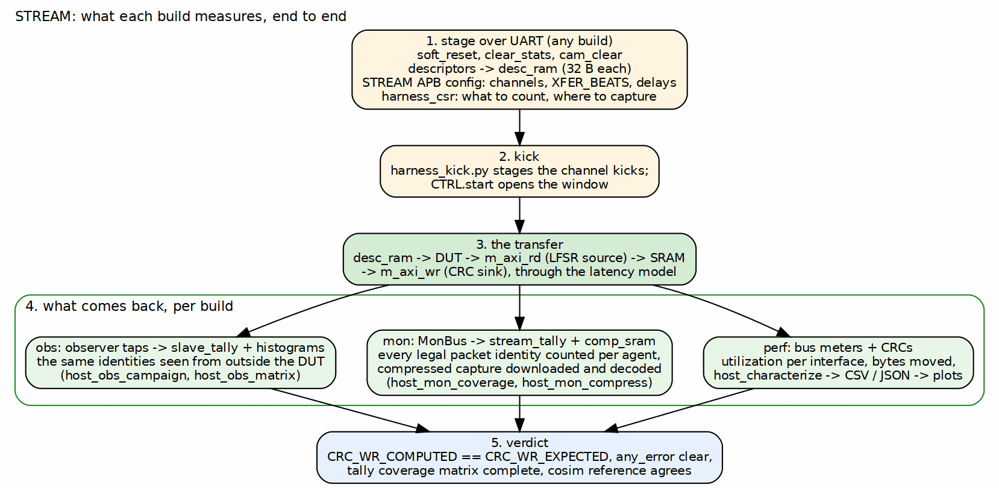

<!-- RTL Design Sherpa Documentation Header -->
<table>
<tr>
<td width="80">
  
</td>
<td>
  <strong>RTL Design Sherpa</strong> · <em>Learning Hardware Design Through Practice</em> 
  
    <a href="https://github.com/sean-galloway/RTLDesignSherpa">GitHub</a> ·
    <a href="https://github.com/sean-galloway/RTLDesignSherpa/blob/main/docs/DOCUMENTATION_INDEX.md">Documentation Index</a> ·
    <a href="https://github.com/sean-galloway/RTLDesignSherpa/blob/main/LICENSE">MIT License</a>
  
</td>
</tr>
</table>

---

<!-- End Header -->

# Host Tools and Flow

## The shared flow

The area Makefile is a dispatcher: `make bitstream BUILD=obs` runs the
target in `build-obs/`, whose Makefile is variables plus an include of
`make/fpga_flow.mk`. The flow's targets are therefore identical across the
three builds and across the other Genesys 2 and Nexys A7 systems that use it.

| Target | What it does |
|--------|--------------|
| `lint`, `flat-filelist`, `lint-decl-order` | Verilator lint of the whole harness against the expanded filelist, before any Vivado run |
| `prebuild` | the build's PREBUILD step: here, regenerate the bridges |
| `project`, `synth`, `bitstream` | create the Vivado project; synthesis only with utilization and failing-path reports; the full flow with every report |
| `bitstream-ila` | the same design plus an ILA on the marked debug nets |
| `sim` | this build's harness cosim (cocotb, Verilator) |
| `program` | flash the board, naming the file, falling back to the hold copy after a clean |
| `run SEQUENCES="..."`, `seq-list` | drive the programmed board through the area's sequences |
| `utilization`, `timing` | print the latest reports |
| `keep` | copy the bitstream to `RDS_HOLD_DIR` outside the repo and the reports to `../stable/` |
| `clean`, `clean-build`, `clean-all` | remove Vivado artifacts, cosim trees, everything; `clean-all` is what `stable/` protects against |

: Table 4.1: Flow targets (from `make/fpga_flow.mk`)

## The host layers

Two levels of Python. The component `bin/` holds what every build uses:
`stream_device.py` (the UART link and register access by name),
`harness_kick.py` (staging the channel kicks), `bus_meters.py` (the meter
packing, one definition shared with the cosim so both measure the same
thing), `tally.py` and `dump_monbus.py` (reading the tallies and decoding a
capture), `characterization.py` and `stream_ext_suite.py` (the campaign
runners), `stream_monitors.py` (monitor and observer configuration), and the
plotting scripts. Each build then has its own `host/` with the programs that
only make sense on that bitstream:

| Build | Programs |
|-------|----------|
| `perf` | `host_characterize`, `host_bus_meters`, `host_desc_perf`, `host_rw_perf`, `host_ext_char`, `host_ext_soak`, `host_probe_multichannel`, `host_verify_descriptors`, `host_status`, `host_perf_json_to_csv` |
| `mon` | `host_mon_coverage`, `host_mon_compress`, `host_mon_matrix`, `host_mon_err_probe`, `host_mon_fault_probe`, `host_reg_walk` |
| `obs` | `host_obs_campaign`, `host_obs_matrix`, `host_reg_walk` |

: Table 4.2: Per-build host programs

`stream_env` selects which build's `host/` goes on the Python path. Its
default is `mon`; `build-perf` sets it explicitly because without that a perf
program importing a sibling from its own directory would get mon's copy, and
it would appear to work, since Python also puts the running script's own
directory first.

### Figure 4.1: What each build measures, end to end

**Source:** [04_measurement_path.dot](../assets/graphviz/04_measurement_path.dot)

## One program, two targets

The same host program runs against the cosim and against the board. The
cocotb harness testbench presents the UART bytestream to `stream_harness`
exactly as the FT232R does, the harness carries the bridge and the CSRs, and
the generics are the build's. A monitor coverage result on the board is
therefore compared with the same program's result in cosim, and the sign-off
manifest records both (512 packets in 516 slots on the board against 1.12
slots per packet in cosim, for the compression program). A host program that
only works on one target is a defect in the harness or the program, not a
difference in kind.

The sign-off discipline before a build is the same on every flavour: the
FULL-level sim suites of all three builds green on a verified-clean tree,
recorded in the manifest with the tree SHA, so the bitstream is reproducible
from the recorded source.

## Where the results go

| Report | Source build | Content |
|--------|-------------|---------|
| `reports/perf` | perf | utilization sweeps: channels, descriptors, sizes, latency (the CSV data under `docs/data/`) |
| `reports/compression` | mon | MonBus compression on the board against the cosim |
| `reports/area` | any | what the monitors and the readback logic cost in LUTs per channel count |
| `reports/ext_addressing` | perf | the extended row/column addressing campaign |
| `stable/results` | mon | the board sweeps measured on the sign-off bitstream |

: Table 4.3: Reports

Each report directory has its own README and, where a deliverable exists,
the versioned DOCX and PDF built through the house pipeline.
