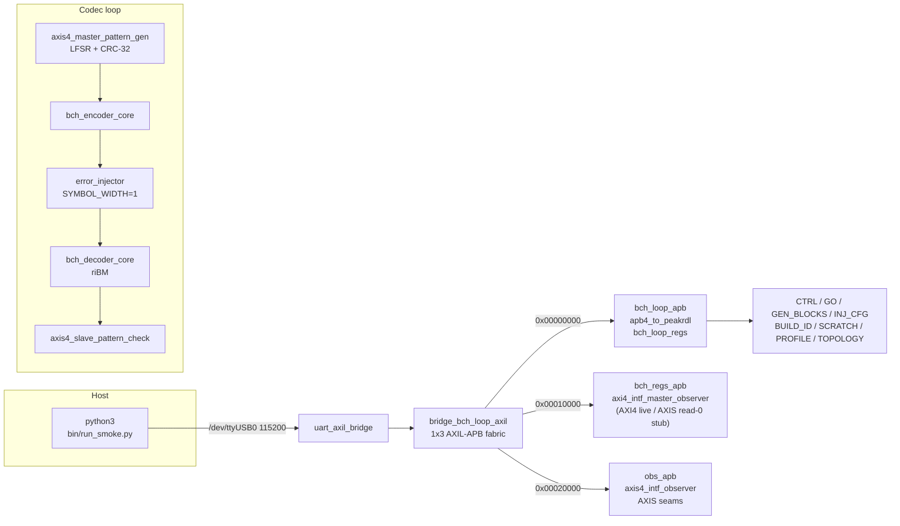
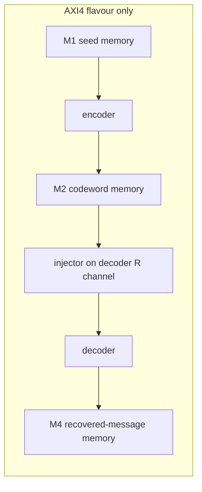

<!-- RTL Design Sherpa Documentation Header -->
<table>
<tr>
<td width="80">
  <a href="https://github.com/sean-galloway/RTLDesignSherpa">
    
  </a>
</td>
<td>
  <strong>RTL Design Sherpa</strong> · <em>Learning Hardware Design Through Practice</em><br>
  <sub>
    <a href="https://github.com/sean-galloway/RTLDesignSherpa">GitHub</a> ·
    <a href="https://github.com/sean-galloway/RTLDesignSherpa/blob/main/docs/DOCUMENTATION_INDEX.md">Documentation Index</a> ·
    <a href="https://github.com/sean-galloway/RTLDesignSherpa/blob/main/LICENSE">MIT License</a>
  </sub>
</td>
</tr>
</table>

---

# The BCH UART Harness

This is the BCH(4224,4120) t=8 codec on the Digilent Genesys 2, wrapped in a UART-controlled loop that runs the same campaigns in cocotb simulation and on the board. The geometry is frozen in `build-loop/rtl/bch_loop_cfg_pkg.sv`: GF(2^13), primitive polynomial `0x201B`, first root `b=1`, `n=4224` shortened from `8191 = 2^13 - 1`, parity degree `104 = m*t`. The component core defaults to `BITS_PER_BEAT = 8`; this harness widens the AXI-Stream/AXI4 wrappers to 32-bit beats.

The whole point of the loop is that errors are injected **after** the encoder. The checker regenerates the expected LFSR pattern independently and compares it against the decoder's output, so the verdict comes from a reference that never saw the errors.

## What's in the harness

| Module | File | Role |
| --- | --- | --- |
| `bch_loop_genesys2_top` | `build-loop/rtl/bch_loop_genesys2_top.sv` | Genesys 2 board top: 200 MHz LVDS input, MMCM to 100 MHz, UART, LEDs. |
| `bch_loop_top` | `build-loop/rtl/bch_loop_top.sv` | Nexys A7-100T board top, kept as the `nexys_a7_100t` target option. |
| `bch_loop_harness` | `build-loop/rtl/bch_loop_harness.sv` | Board-agnostic datapath, CSR wiring, observer mux, status aggregation. |
| `bch_axi4_pipeline` | `build-loop/rtl/bch_axi4_pipeline.sv` | AXI4 flavour: memory-to-memory codec chain over three job memories. |
| `bch_loop_cfg_pkg` | `build-loop/rtl/bch_loop_cfg_pkg.sv` | One source of geometry, UART baud, build ID `0x4243_4850` ("BCHP"). |
| `bch_loop_regs` / `bch_loop_regs_pkg` | `build-loop/rtl/generated/bch_loop_regs/rtl/bch_loop_regs.sv`, `bch_loop_regs_pkg.sv` | PeakRDL-generated CSR block from `build-loop/rtl/bch_loop_regs.rdl`. |
| `bridge_bch_loop_axil` | `rtl/bridges/generated/bridge_bch_loop_axil/bridge_bch_loop_axil.sv` | Generated 1-master x 3-slave AXIL-to-APB fabric. |
| `uart_axil_bridge` | `projects/components/utility-ip/converters/rtl/uart_to_axil4/uart_axil_bridge.sv` | UART byte stream to AXI4-Lite master. |
| `apb4_to_peakrdl` | `projects/components/utility-ip/converters/rtl/apb4_to_peakrdl.sv` | APB4 slave to PeakRDL cpuif shim. |
| `axis4_master_pattern_gen` | `rtl/amba/shared/axis4_master_pattern_gen.sv` | LFSR data source, one packet per block, per-channel CRC-32. |
| `bch_encoder_axis4` / `bch_encoder_core` | `projects/components/ecc-ip/bch/rtl/top/bch_encoder_axis4.sv`, `rtl/macro/bch_encoder_core.sv` | BCH encoder, AXIS wrapper around the core. |
| `bch_beat_packer` | `projects/components/ecc-ip/bch/rtl/fub/bch_beat_packer.sv` | Repacks encoder output into `ceil(n/BITS_PER_BEAT)` codeword beats. |
| `error_injector` | `projects/components/utility-ip/misc/rtl/error_injector.sv` | Shared bit-granular injector, modes 0..7, sits after the encoder. |
| `bch_decoder_axis4` / `bch_decoder_core` | `projects/components/ecc-ip/bch/rtl/top/bch_decoder_axis4.sv`, `rtl/macro/bch_decoder_core.sv` | RIBM decoder, AXIS wrapper around the core. |
| `axis4_slave_pattern_check` | `rtl/amba/shared/axis4_slave_pattern_check.sv` | Independent reference checker, byte-granular CRC-32. |
| `axis4_intf_observer` | `projects/components/utility-ip/misc/rtl/axis4_intf_observer.sv` | APB-programmable observer on the four AXIS seams. |
| `axi4_intf_master_observer` | `projects/components/utility-ip/misc/rtl/axi4_intf_master_observer.sv` | APB-programmable observer on the AXI4 pipeline ports (AXI4 flavour only). |
| `axi_bus_meter` | `rtl/amba/shared/axi_bus_meter.sv` | Four windowed bandwidth meters inside the harness. |

| Script | File | Role |
| --- | --- | --- |
| `bch_env.py` | `bin/bch_env.py` | Path anchor: puts the shared `projects/fpga-systems/bin` and `build-loop/host` on `sys.path`. |
| `run_smoke.py` | `bin/run_smoke.py` | Campaign runner: resolves sequences, opens `BchLoopDriver`, prints report. |
| `Init` | `bin/seq_init.py` | Proves BUILD_ID, SCRATCH round-trip, PROFILE, TOPOLOGY. |
| `Smoke` | `bin/seq_smoke.py` | Bypass, clean, `e=t`, `e=t+1`, DEBUG walk. |
| `Sweep` | `bin/seq_sweep.py` | Exact count for `e = 0 .. 2t+2`. |
| `RandomCampaign` | `bin/seq_random.py` | Fresh data/error seeds, mixed modes. |
| `Soak` | `bin/seq_soak.py` | Long-running random-pattern stress. |
| `BchLoopDriver` / `RunResult` | `build-loop/host/bch_loop.py` | By-name register access, status collection, observer readers. |
| `bch_loop_programs` | `build-loop/host/bch_loop_programs.py` | The authored-once programs: `smoke`, `bypass`, `run`, `sweep`, `verdict`. |
| `host_bch_loop.py` | `build-loop/host/host_bch_loop.py` | CLI front-end over the same programs. |
| `bch_loop_regs_regmap.py` | `build-loop/dv/tbclasses/bch_loop_regs_regmap.py` | PeakRDL-generated by-name register map. |

| Make target | File | Role |
| --- | --- | --- |
| `make help` | `Makefile` | Area dispatcher; delegates every target to `build-loop/`. |
| `make -C build-loop bitstream` | `build-loop/Makefile` | Vivado build; set `BCH_TARGET=genesys2` and `BCH_IFACE={AXIS,AXI4}`. |
| `make -C build-loop program` | `build-loop/Makefile` → `make/fpga_board.mk` → `projects/fpga-systems/bin/fpga_board.py` | Programs the board after JTAG identity verification. |
| `make regmap` | `Makefile` | Regenerates the CSR RTL and `dv/tbclasses/bch_loop_regs_regmap.py` from the RDL. |
| `bin/regen_bridges.sh` | `bin/regen_bridges.sh` | Regenerates the 1x3 fabric from `rtl/bridges/configs/bridge_bch_loop_axil.toml`. |
| `bin/build_image_matrix.sh` | `bin/build_image_matrix.sh` | Serial build of both `bch_loop_genesys2_axis.bit` and `bch_loop_genesys2_axi4.bit`. |

## How the pieces connect





The register path is the same in both flavours. The host talks by name, not by offset: `BchLoopDriver` wraps `UARTAxiBridge` with `UartRegisterMap` over `bch_loop_regs_regmap.py`. The only raw addresses in the host code are the two expansion-window bases used to attach observer register maps: `OBS_AXI4_BASE = 0x00010000` and `OBS_AXIS_BASE = 0x00020000` in `build-loop/host/bch_loop.py`. Those bases match `rtl/bridges/generated/bridge_bch_loop_axil/bridge_bch_loop_axil.toml`; if a window moves, the bridge is regenerated and the host picks it up in one place.

Clock and reset come from `bch_loop_genesys2_top`: the 200 MHz LVDS system clock passes through `IBUFDS` and an `MMCME2_BASE` with `CLKFBOUT_MULT_F = 6` and `CLKOUT0_DIVIDE_F = 12`, giving a 100 MHz harness clock. The Nexys A7 top runs the full profile on the same 100 MHz directly. That frequency was chosen because the BCH loop and the UART divisor both close timing comfortably at 100 MHz on the k325t-2, and it keeps the AXIS and AXI4 flavours interchangeable from the host's point of view. The small Nexys profile is different: it divides the 100 MHz pin in fabric to 50 MHz, because the Artix-7 -1 speed grade cannot close this loop at 100 MHz (see the small-profile section below).

## The FPGA-testing choices, and why

### Deterministic campaigns

Every board campaign is deterministic: the default `gen_seed` and `inj_seed` are 1, and the sequences in `bin/seq_*.py` produce the same bit-exact runs in cocotb simulation and on the board. That matters because a failure you can replay is a failure you can fix; a non-deterministic board-only failure is just a scary story. `seq_random.py` still varies its draws, but those draws come from a host-side `random.Random(seed)` seeded by the caller, so the variation is reproducible when you need it.

### Injector modes mapped to real failure mechanisms

The shared `error_injector` exposes eight modes, and each one answers a different physical question. Exact-count mode proves the correction boundary: at `e <= t` every block must correct with exactly `e` bits flipped, and at `e > t` the decoder must flag uncorrectable. Burst and rate modes model raw bit-error behaviour on a noisy channel. Clusters and localized mode stand in for spatially correlated faults -- a bad DRAM row, a disturbed NAND page, a half-plane failure -- because real errors are rarely uniform. Badblock mode models retention tails and worn blocks: most of the stream stays clean while a hard minority runs at a much higher error rate. Debug mode is the bring-up helper, a deterministic walking pattern that closes by inspection.

### Post-encoder injection protecting parity bits too

The injector sits after the encoder, not inside the generator. That is not an accident: an error in the generator data would be encoded faithfully and the code would never see it. By corrupting the codeword, the parity bits are exposed to the same errors as the data, which is what happens when a real packet is stored, transmitted, or read back from memory. The `bch_loop_harness.sv` header comment calls this out explicitly, and the layout follows from it.

### Recheck + flip-only verdict as the on-chip oracle

The BCH decoder uses riBM with odd-syndrome computation and even syndromes by squaring. It runs a second-syndrome recheck (`ENABLE_RECHECK`) and performs flip-only correction -- there is no Forney, because binary values are always 1. The checker independently regenerates the expected stream and reports `data_err` on any mismatched beat. Together they form the on-chip oracle: the decoder decides whether it thinks it corrected the block, and the checker decides whether the recovered bytes actually match the reference.

### UART over a debug core, plus the safety pair

The host link is a plain UART at 115200 baud, driven by `uart_axil_bridge`. That choice keeps the harness scriptable from Python without a debug core licence and without vendor-specific probes. But scriptable does not mean careless. Two pieces of shared tooling guard the board: `projects/fpga-systems/bin/board_lock.sh` serializes programming flows by JTAG serial, and `projects/fpga-systems/bin/fpga_board.py` refuses to program until a JTAG readback confirms the expected Genesys 2 serial `200300B818A0` on the chain with a device behind it. The readback also bounces `hw_server` and retries up to five times on the deviceless-enumeration race that otherwise refused roughly half of programming attempts when a second Digilent board shared the chain.

### Genesys 2 over Nexys A7 for these harnesses

The harness directory moved from `NexysA7/` to `Genesys2/` on 2026-10-05. `BCH_TARGET` still accepts `nexys_a7_100t` as a build option, but the Genesys 2 is the primary target for the full profile. The k325t-2 has the room and timing margin to hold the full BCH(4224,4120) loop at 100 MHz with both AXIS and AXI4 flavours; both images came out timing-clean on the board build with positive slack.

### The small Nexys A7 profile: BCH(248,224) t=3

The same harness also runs on the Nexys A7-100T at a reduced geometry, selected at build time with `BCH_PROFILE=small` (the default `BCH_PROFILE=board` is unchanged). The small profile is BCH(248,224) t=3, shortened from BCH(255,231) over GF(2^8) with primitive polynomial 0x11D: 32-bit beats, 7 data beats per block, distinct BUILD_ID "BCHS" so `init` fails loudly against the wrong bitstream. Because the Artix-7 -1 speed grade cannot close even this small loop at 100 MHz (the board build measured WNS -4.3 ns), the small profile divides the 100 MHz pin clock in fabric to 50 MHz (`CFG_SYS_CLK_HZ` matches, so the UART stays at 115200 baud). The post-route result is comfortable: WNS +7.8 ns at 38% LUT, 0 block RAM. Build it with:

```bash
make -C build-loop bitstream BCH_TARGET=nexys_a7_100t BCH_PROFILE=small
```

The deterministic campaign sequences, the host programs, and the UART-equivalence sim all run unchanged against either profile; the host reads the geometry from the PROFILE CSR and the BUILD_ID, not from compile-time constants. The Genesys 2 board evidence (battery, million-block soak) belongs to the board profile; the small profile is the teaching/bring-up target for the A7. Tracked as issue #82.

### AXIS vs AXI4 flavours covering both integration styles

Two bitstreams are built: `bch_loop_genesys2_axis.bit` and `bch_loop_genesys2_axi4.bit`. The AXIS flavour is a single streaming pipe; the AXI4 flavour is a memory-to-memory job chain across four AXI4 memories. The AXI4 flavour refuses runs whose `GEN_BLOCKS` exceed the job-memory capacity rather than letting regions wrap, so long soaks belong on the AXIS image. The host reads `TOPOLOGY` to discover which datapath is loaded, so the same campaign scripts drive both without a command-line flag.

### What is deliberately NOT board-tested

Some things are out of scope, and it is worth saying so plainly. The 2026-10-05 million-block soak ran on the AXIS image and passed: 1,000,000 blocks in 31,910s with zero mis-decodes of the 74,560 blocks pushed past the correction limit. BCH has no erasure path in this harness: the injector's `out_erasure` is tied off and `cfg_mark_erasure` is held low. The board validates two profiles: BCH(4224,4120) t=8 on the Genesys 2, and the small BCH(248,224) t=3 on the Nexys A7 (see the small-profile section above); profiles smaller than that, like `(63,57) t=1`, are covered in simulation and component DV, not on any board.

## Operating it

Start with `make help` in `projects/fpga-systems/Genesys2/ecc-ip/bch/` and the per-build help under `build-loop/`. A typical board run looks like `bin/run_smoke.py --board genesys2 --port /dev/ttyUSB0 --sequences init smoke sweep`. Board timing, utilisation, and the matrix summary are recorded in `stable/MANIFEST.md` and `stable/reports/{genesys2_axis,genesys2_axi4}/`. Campaign transcripts turn into reports with `projects/fpga-systems/bin/report_battery.py` (JSON artifacts, correction-boundary / decode-cost / soak-timeline figures, and a generated `FINDINGS.md`); published runs live under `stable/results/`. For the Galois-field math behind the profile, see the component HAS chapter 7 under `projects/components/ecc-ip/bch/docs/`. The sister harness has the matching write-up at `../../reed-solomon/docs/UART_HARNESS.md`; BCH does not have a README yet, so this document is the architecture reference until one lands.
