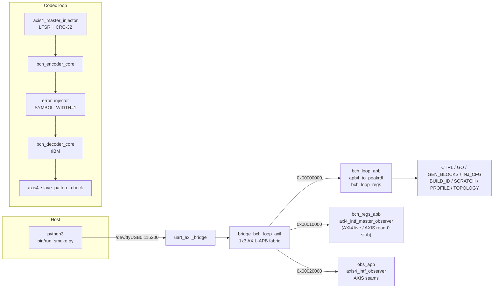
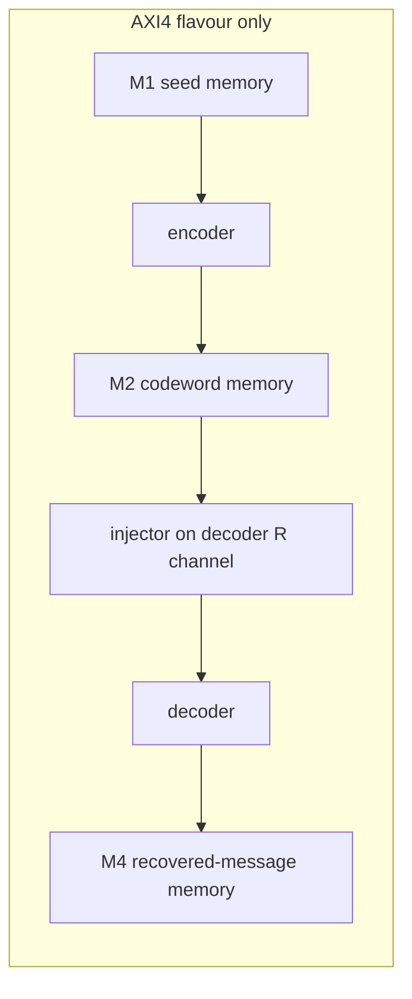

# Harness Architecture

## RTL inventory

| Module | File | Role |
| --- | --- | --- |
| `bch_loop_genesys2_top` | `build-loop/rtl/bch_loop_genesys2_top.sv` | Genesys 2 board top: 200 MHz LVDS input, MMCM to 100 MHz, UART, LEDs. |
| `bch_loop_top` | `build-loop/rtl/bch_loop_top.sv` | Nexys A7-100T board top, kept as the `nexys_a7_100t` target option. |
| `bch_loop_harness` | `build-loop/rtl/bch_loop_harness.sv` | Board-agnostic datapath, CSR wiring, observer mux, status aggregation. |
| `bch_axi4_pipeline` | `build-loop/rtl/bch_axi4_pipeline.sv` | AXI4 flavour: memory-to-memory codec chain over three job memories. |
| `bch_loop_cfg_pkg` | `build-loop/rtl/bch_loop_cfg_pkg.sv` | One source of geometry, UART baud, build ID `0x4243_4850` ("BCHP"). |
| `bch_loop_regs` / `bch_loop_regs_pkg` | Generated from `build-loop/rtl/bch_loop_regs.rdl` | PeakRDL-generated CSR block. |
| `bridge_bch_loop_axil` | Generated fabric | 1-master x 3-slave AXIL-to-APB fabric. |
| `uart_axil_bridge` | `projects/components/utility-ip/converters/rtl/uart_to_axil4/uart_axil_bridge.sv` | UART byte stream to AXI4-Lite master. |
| `apb4_to_peakrdl` | `projects/components/utility-ip/converters/rtl/apb4_to_peakrdl.sv` | APB4 slave to PeakRDL cpuif shim. |
| `axis4_master_injector` | `rtl/amba/shared/axis4_master_injector.sv` | LFSR data source, one packet per block, per-channel CRC-32. |
| `bch_encoder_axis4` / `bch_encoder_core` | Component BCH RTL | BCH encoder, AXIS wrapper around the core. |
| `bch_beat_packer` | Component BCH RTL | Repacks encoder output into `ceil(n/BITS_PER_BEAT)` codeword beats. |
| `error_injector` | `projects/components/utility-ip/misc/rtl/error_injector.sv` | Shared bit-granular injector, modes 0..7, sits after the encoder. |
| `bch_decoder_axis4` / `bch_decoder_core` | Component BCH RTL | RIBM decoder, AXIS wrapper around the core. |
| `axis4_slave_pattern_check` | `rtl/amba/shared/axis4_slave_pattern_check.sv` | Independent reference checker, byte-granular CRC-32. |
| `axis4_intf_observer` | Shared utility RTL | APB-programmable observer on the four AXIS seams. |
| `axi4_intf_master_observer` | Shared utility RTL | APB-programmable observer on the AXI4 pipeline ports (AXI4 flavour only). |
| `axi_bus_meter` | `rtl/amba/shared/axi_bus_meter.sv` | Four windowed bandwidth meters inside the harness. |

: Table 2.1: RTL blocks in the BCH harness.

## Host and build inventory

| Script / target | File | Role |
| --- | --- | --- |
| `bch_env.py` | `bin/bch_env.py` | Path anchor for shared host code. |
| `run_smoke.py` | `bin/run_smoke.py` | Campaign runner. |
| `Init` / `Smoke` / `Sweep` / `RandomCampaign` / `Soak` | `bin/seq_*.py` | Deterministic campaign sequences. |
| `BchLoopDriver` / `RunResult` | `build-loop/host/bch_loop.py` | By-name register access and status collection. |
| `bch_loop_programs` | `build-loop/host/bch_loop_programs.py` | Shared authored-once programs. |
| `host_bch_loop.py` | `build-loop/host/host_bch_loop.py` | CLI front-end. |
| `make -C build-loop bitstream` | `build-loop/Makefile` | Vivado build; set `BCH_TARGET=genesys2` and `BCH_IFACE={AXIS,AXI4}`. |
| `bin/build_image_matrix.sh` | `bin/build_image_matrix.sh` | Serial build of both Genesys 2 bitstreams. |

: Table 2.2: Host scripts and build flow.

## Datapath diagram

### Figure 2.1: BCH AXIS datapath and register path.

The AXI4 flavour replaces the streaming seams with job memories; the codec
itself is identical.

### Figure 2.2: BCH AXI4 memory-to-memory datapath.

## Register path, clock, and reset

The host talks by name, not by offset: `BchLoopDriver` wraps `UARTAxiBridge`
with `UartRegisterMap` over the generated `bch_loop_regs_regmap.py`. The only
raw addresses are the two expansion-window bases (`OBS_AXI4_BASE = 0x00010000`
and `OBS_AXIS_BASE = 0x00020000`), which match the bridge fabric definition.

Clock and reset come from `bch_loop_genesys2_top`: the 200 MHz LVDS system
clock passes through `IBUFDS` and an `MMCME2_BASE` with `CLKFBOUT_MULT_F = 6`
and `CLKOUT0_DIVIDE_F = 12`, giving a 100 MHz harness clock. That frequency
was chosen because the BCH loop and the UART divisor both close timing
comfortably at 100 MHz on the k325t-2.
