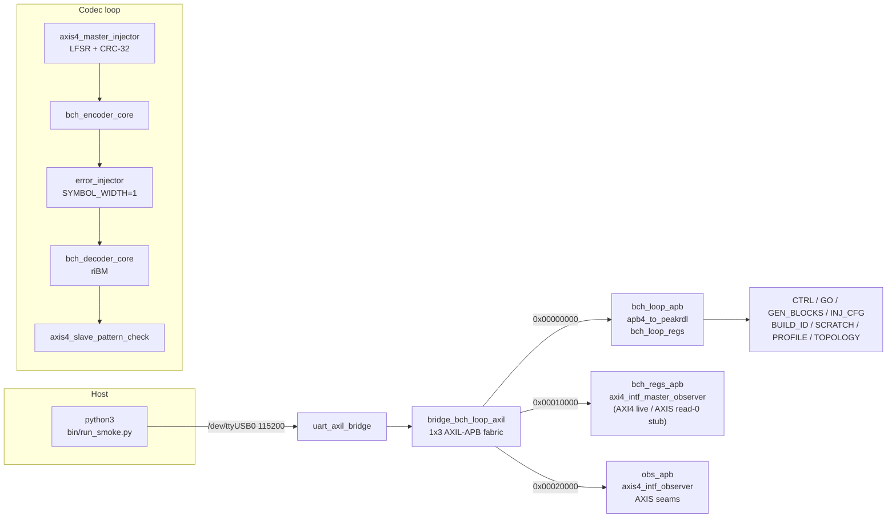
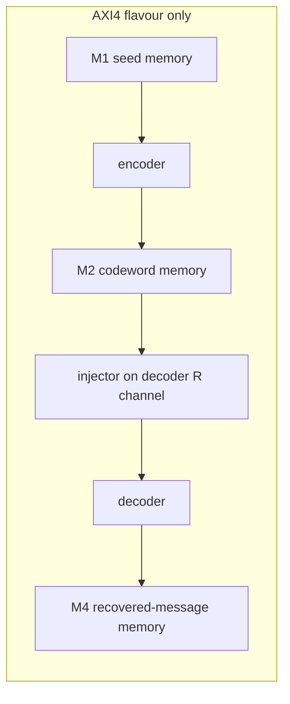

# How The Pieces Connect

## Register path

The host talks by name, not by offset: `BchLoopDriver` wraps
`UARTAxiBridge` with `UartRegisterMap` over `bch_loop_regs_regmap.py`. The
diagram shows the path from the laptop to the three APB windows.

The register path is the same in both flavours. The only raw addresses in the
host code are the two expansion-window bases used to attach observer register
maps: `OBS_AXI4_BASE = 0x00010000` and `OBS_AXIS_BASE = 0x00020000` in
`build-loop/host/bch_loop.py`. Those bases match
`rtl/bridges/generated/bridge_bch_loop_axil/bridge_bch_loop_axil.toml`; if a
window moves, the bridge is regenerated and the host picks it up in one
place.

## AXI4 flavour datapath

The AXI4 flavour replaces the streaming middle with a memory-to-memory job
chain across three job memories.

## Clock and reset

Clock and reset come from `bch_loop_genesys2_top`: the 200 MHz LVDS system
clock passes through `IBUFDS` and an `MMCME2_BASE` with `CLKFBOUT_MULT_F = 6`
and `CLKOUT0_DIVIDE_F = 12`, giving a 100 MHz harness clock. The Nexys A7 top
runs the same 100 MHz directly. That frequency was chosen because the BCH
loop and the UART divisor both close timing comfortably at 100 MHz on the
k325t-2, and it keeps the AXIS and AXI4 flavours interchangeable from the
host's point of view.
