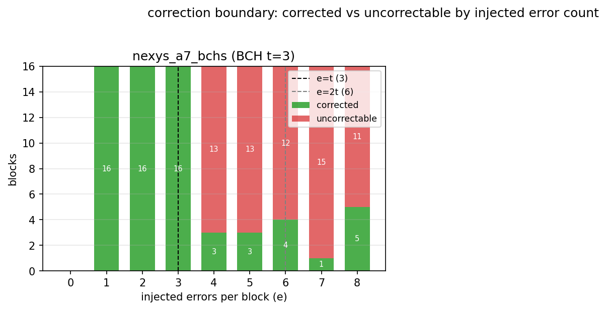
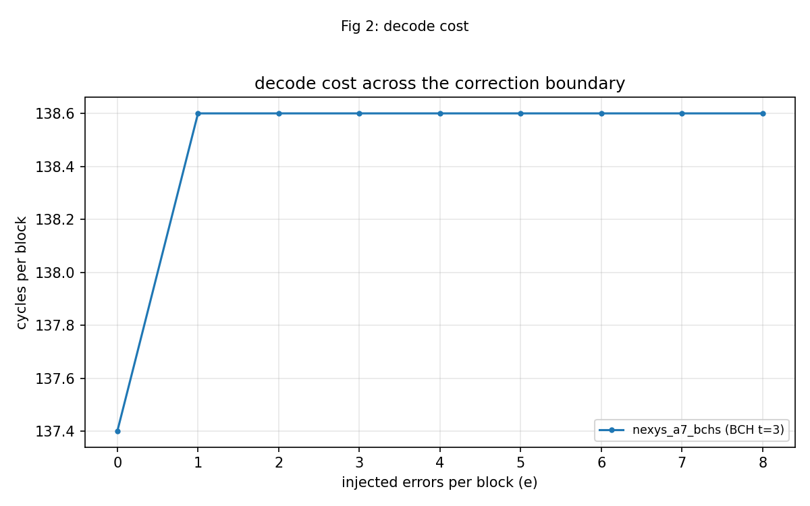
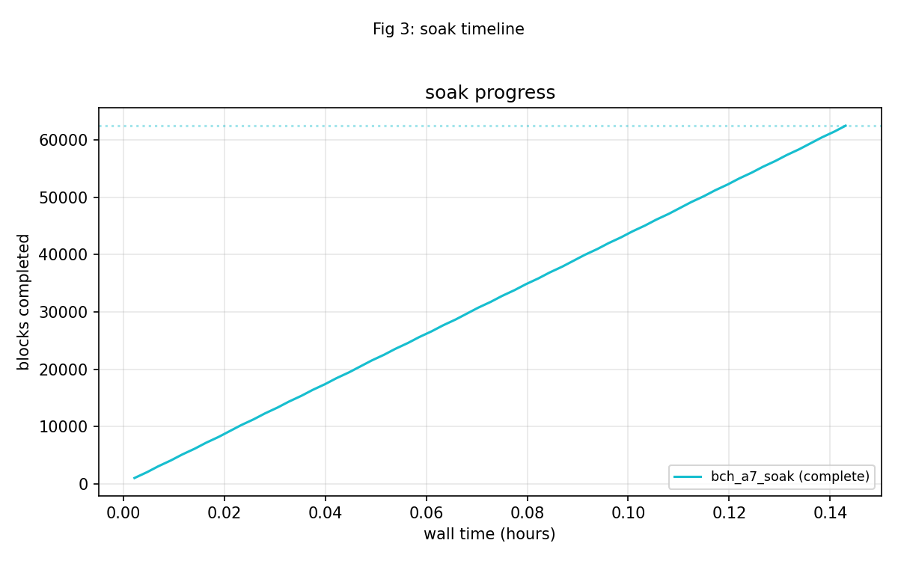
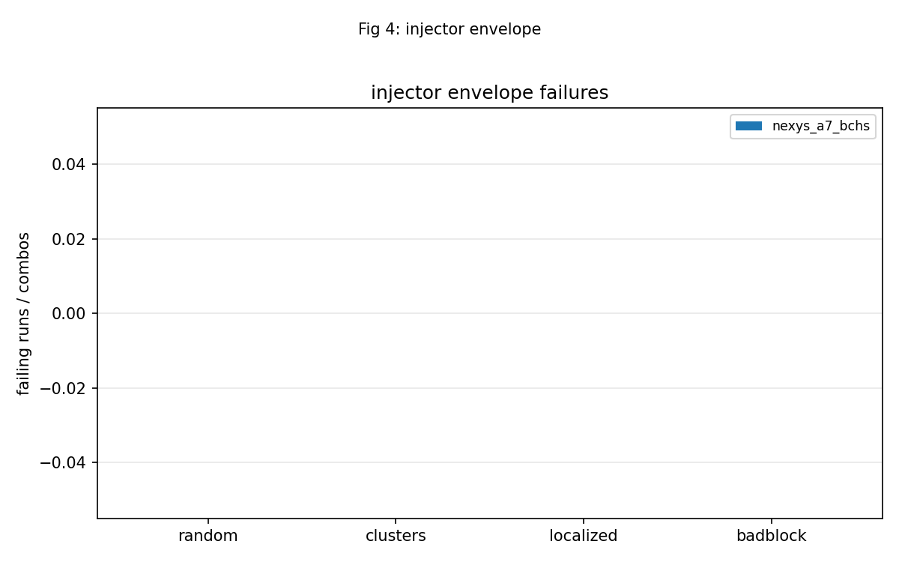

<!-- RTL Design Sherpa Documentation Header -->
<table>
<tr>
<td width="80">
  
</td>
<td>
  <strong>RTL Design Sherpa</strong> · <em>Learning Hardware Design Through Practice</em> 
  
    <a href="https://github.com/sean-galloway/RTLDesignSherpa">GitHub</a> ·
    <a href="https://github.com/sean-galloway/RTLDesignSherpa/blob/main/docs/DOCUMENTATION_INDEX.md">Documentation Index</a> ·
    <a href="https://github.com/sean-galloway/RTLDesignSherpa/blob/main/docs/DOCUMENTATION_INDEX.md">MIT License</a>
  
</td>
</tr>
</table>

---

<!-- End Header -->

# Battery Report — 2026-10-07

Board serial: `210292BFA3EE`  
Generated: 2026-10-07T14:03:08Z  

## Summary

- Images reported: **2**
- Passed: **1**
- Failed: **1**
- Partial: **0**
- Program failed: **0**

> Confidence: **62,528** blocks across the soak(s); **887** mis-decodes (**5,952** blocks were pushed past the correction limit).

| Image | Codec | Status | Solver | Sequences |
|-------|-------|--------|--------|-----------|
| nexys_a7_bchs | BCH(248,224) | PASS | RIBM; datapath AXIS; no comparator, so the B-side counters read 0 by design | badblock=PASS, clusters=PASS, init=PASS, localized=PASS, random=PASS, smoke=PASS, sweep=PASS |
| bch_a7_soak | BCH(248,224) | FAIL | RIBM; datapath AXIS; no comparator, so the B-side counters read 0 by design | init=PASS, soak=FAIL |

## Per-Image Findings

### nexys_a7_bchs

Codec: BCH(248,224) t=3 m=8 4 symbols/beat  
Solver/topology: RIBM; datapath AXIS; no comparator, so the B-side counters read 0 by design  
Overall status: **PASS**  

Smoke results:

| Mode | cyc/blk | Status |
|------|---------|--------|
| bypass | 14.1 | PASS |
| clean | 20.8 | PASS |
| e=3 | 138.6 | PASS |
| e=4 | 138.6 | PASS |
| debug | 38.8 | PASS |

Sweep: 9 error counts from e=0 to e=8.  

Random campaign: 64 runs x 4 blocks; 38 clean / 91 corrected / 127 uncorrectable; 0 failing run(s).  

badblock: 4 combos x 64 blocks; 0 failing combo(s).  

clusters: 4 combos x 16 blocks; 0 failing combo(s).  

localized: 3 combos x 16 blocks; 0 failing combo(s).  

### bch_a7_soak

Codec: BCH(248,224) t=3 m=8 4 symbols/beat  
Solver/topology: RIBM; datapath AXIS; no comparator, so the B-side counters read 0 by design  
Overall status: **FAIL**  

Soak progress: 62464 of 62528 blocks after 515s (121 blk/s).  

Soak final counters:

| Metric | Value |
|--------|-------|
| blocks_final | 62,528 |
| wall_s | 516 |
| blk_per_s | 121.0 |
| clean | 14,149 |
| corrected | 40,654 |
| uncorrectable | 7,725 |
| bits_corrected | 80,767 |
| failing_runs | 0 |
| over_t_blocks | 5,952 |
| misdecoded | 887 |
| misdecode_rate | 1.49e-01 (1 in 7) |

Errors/exceptions seen in transcript:

- `[seq] soak raised: RuntimeError: beyond the threshold 887 of 5952 blocks were accepted (1.49e-01), over the 1e-02 ceiling -- the decoder is accepting blocks it should be flagging
`
- `Traceback (most recent call last):
`
- `    raise RuntimeError(
`
- `RuntimeError: beyond the threshold 887 of 5952 blocks were accepted (1.49e-01), over the 1e-02 ceiling -- the decoder is accepting blocks it should be flagging
`
- `  soak  FAIL   515.84s  RuntimeError: beyond the threshold 887 of 5952 blocks were accepted (1.49e-01), over the 1e-02 ceiling -- the decoder is accepting blocks it should be flagging
`
- `  soak  FAIL   515.84s  RuntimeError: beyond the threshold 887 of 5952 blocks were accepted (1.49e-01), over the 1e-02 ceiling -- the decoder is accepting blocks it should be flagging
`

## Figures

## Limits

- None noted.
