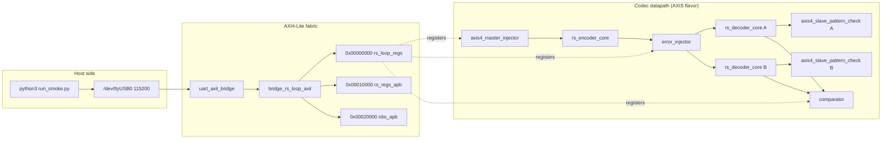

<!-- RTL Design Sherpa Documentation Header -->
<table>
<tr>
<td width="80">
  <a href="https://github.com/sean-galloway/RTLDesignSherpa">
    
  </a>
</td>
<td>
  <strong>RTL Design Sherpa</strong> · <em>Learning Hardware Design Through Practice</em><br>
  <sub>
    <a href="https://github.com/sean-galloway/RTLDesignSherpa">GitHub</a> ·
    <a href="https://github.com/sean-galloway/RTLDesignSherpa/blob/main/docs/DOCUMENTATION_INDEX.md">Documentation Index</a> ·
    <a href="https://github.com/sean-galloway/RTLDesignSherpa/blob/main/LICENSE">MIT License</a>
  </sub>
</td>
</tr>
</table>

---

<!-- End Header -->

# The Reed-Solomon UART Harness

This is the Genesys 2 board harness for the RS(252,236) t = 8 Reed-Solomon
codec. The same loop subjects both key-equation solvers — riBM and Euclid — to
a regenerated LFSR pattern that never saw the injected errors, so a corrected
block is proven against a reference rather than against the other decoder. You
drive the whole thing from a laptop over a 115200-baud UART, and it reports
per-block verdicts, bandwidth meters, and a beat-by-beat comparator when both
solvers are present.

The harness directory moved from `projects/fpga-systems/NexysA7/reed-solomon/`
to `projects/fpga-systems/Genesys2/ecc-ip/reed-solomon/` on 2026-10-05. Set
`RS_TARGET=genesys2` to build for the Kintex-7 XC7K325T-2; the default
`nexys_a7_100t` keeps the original names and report layout byte-identical. The
Genesys 2 image matrix is four bitstreams:
`rs_loop_genesys2_{axis_ribm,axis_euclid,axi4_ribm,axi4_euclid}.bit`.

## What's in the harness

The table below lists the RTL blocks that make up the harness. Every path is
relative to `projects/fpga-systems/Genesys2/ecc-ip/reed-solomon/` unless it lives in a
shared area.

| Module | File | Role |
|---|---|---|
| `uart_axil_bridge` | `projects/components/utility-ip/converters/rtl/uart_to_axil4/uart_axil_bridge.sv` | UART 115200 8N1 to AXI4-Lite master. |
| `bridge_rs_loop_axil` | `rtl/bridges/generated/bridge_rs_loop_axil/bridge_rs_loop_axil.sv` | Generated 1-master x 3-slave AXI4-Lite/APB fabric. |
| `rs_loop_genesys2_top` / `rs_loop_top` | `build-loop/rtl/rs_loop_genesys2_top.sv` / `build-loop/rtl/rs_loop_top.sv` | Board top: Genesys 2 MMCM wrapper, or Nexys A7 100 MHz direct clock. |
| `rs_loop_harness` | `build-loop/rtl/rs_loop_harness.sv` | Codec loop, register decode, bandwidth meters, observers, verdict tallies. |
| `rs_loop_cfg_pkg` | `build-loop/rtl/rs_loop_cfg_pkg.sv` | Single source of geometry: RS(252,236), 4 symbols/beat, shortened so n and k are multiples of the beat. |
| `rs_loop_regs` | Generated from `build-loop/rtl/rs_loop_regs.rdl` via the shared `apb4_to_peakrdl` shim | Host-visible register block: BUILD_ID RSLP, SCRATCH, PROFILE, TOPOLOGY, INJ_CFG, INJ_SEED, etc. |
| `axis4_master_injector` | `rtl/amba/shared/axis4_master_injector.sv` | LFSR data source plus expected CRC-32, one packet per block. |
| `axis4_slave_pattern_check` | `rtl/amba/shared/axis4_slave_pattern_check.sv` | Regenerates the same LFSR pattern and compares beats per decoder. |
| `rs_encoder_core` | `projects/components/ecc-ip/reed-solomon/rtl/macro/rs_encoder_core.sv` | RS(252,236) encoder. |
| `error_injector` | `projects/components/utility-ip/misc/rtl/error_injector.sv` | Post-encoder corruption: modes 0 none, 1 exact count, 2 burst, 3 rate, 4 clusters, 5 localized, 6 badblock, 7 debug. |
| `rs_decoder_core` | `projects/components/ecc-ip/reed-solomon/rtl/macro/rs_decoder_core.sv` | Decoder with selectable KES_ALGO and erasure path. |
| `rs_erasure_unit` | `projects/components/ecc-ip/reed-solomon/rtl/fub/rs_erasure_unit.sv` | Erasure locator / transform used when ERASURE_SUPPORT=1. |
| `rs_axi4_pipeline` | `build-loop/rtl/rs_axi4_pipeline.sv` | Memory-to-memory job chain for the AXI4 flavor. |
| `axis4_intf_observer` | `projects/components/utility-ip/misc/rtl/axis4_intf_observer.sv` | Four AXIS seam observer on window 0x20000. |
| `axi4_intf_master_observer` | `projects/components/utility-ip/misc/rtl/axi4_intf_master_observer.sv` | Four codec AXI4 master-port observer on window 0x10000. |

The host side is layered so the same programs run in cocotb simulation and on
the board:

| Script | File | Role |
|---|---|---|
| `rs_env` | `bin/rs_env.py` | One place this area learns the repo root and puts shared `projects/fpga-systems/bin` plus `build-loop/host` on `sys.path`. |
| `run_smoke.py` | `bin/run_smoke.py` | Campaign runner: resolves sequences, opens the UART, and runs them through `SequenceRunner`. |
| `init` | `bin/seq_init.py` | Proves the link and bitstream: BUILD_ID, SCRATCH round-trip, PROFILE, TOPOLOGY. |
| `smoke` | `bin/seq_smoke.py` | Bypass, clean run, e = t, e = t + 1, deterministic debug walk. |
| `sweep` | `bin/seq_sweep.py` | Exact-count table for e = 0 .. 2t + 2. |
| `random` | `bin/seq_random.py` | Fresh data/error seeds, mixed modes and counts. Also hosts the `clusters`, `localized`, and `badblock` campaign classes. |
| `soak` | `bin/seq_soak.py` | Million-block random soak, run by run, with replayable seeds. |
| `erasure` | `bin/seq_erasure.py` | Marked runs at f = t, 2t, 2t + 1. |
| `RsLoopDriver` | `build-loop/host/rs_loop.py` | By-name register access, status, bandwidth meters, observer readout. |
| `rs_loop_programs` | `build-loop/host/rs_loop_programs.py` | The authored-once programs shared by sim and board: `smoke`, `bypass`, `run`, `sweep`, `verdict`. |
| `host_rs_loop.py` | `build-loop/host/host_rs_loop.py` | CLI front-end: smoke, bypass, run, sweep, random, bw, obs, soak, erasure. |

Build and validation flow:

| Target / artifact | File | Role |
|---|---|---|
| Top-level dispatcher | `Makefile` | Delegates to `build-loop/Makefile` for `bitstream`, `lint`, `sim`, etc.; `make regmap` regenerates CSRs. |
| Per-build flow | `build-loop/Makefile` | Vivado project, constraints, and report handling; consumes `make/fpga_flow.mk`. |
| Four-image matrix | `bin/build_image_matrix.sh` | Builds `{axis,axi4}` x `{riBM,Euclid}` with one solver per bitstream. |
| Bandwidth matrix | `bin/measure_image_matrix.sh` | Programs and measures each image in turn. |
| Genesys 2 constraints | `build-loop/fpga/constraints/rs_loop_genesys2.xdc` | 200 MHz LVDS input, MMCM, UART pins, LEDs. |
| Validation record | `stable/MANIFEST.md` | Timing slack, board campaigns, and known issues for the kept images. |

## How the pieces connect



The host register path is: Python over pyserial to the UART, into
`uart_axil_bridge`, through the generated `bridge_rs_loop_axil` 1x3 fabric, and
out as three APB windows. Window 0 at `0x00000000` is `rs_loop_apb`, which
feeds the shared `apb4_to_peakrdl` shim and then the generated `rs_loop_regs`
block — that is where BUILD_ID, SCRATCH, PROFILE, TOPOLOGY, INJ_CFG, and the
status/counter registers live. Window 1 at `0x00010000` is `rs_regs_apb`; on
the AXI4 flavor it hosts the `axi4_intf_master_observer` watching the codec's
four AXI4 master ports, while on AXIS flavors it is a read-zero stub so the
host bus never hangs. Window 2 at `0x00020000` is `obs_apb`, always live, where
an `axis4_intf_observer` watches the four AXIS seams in codeword order:
message-in, codeword-out, codeword-in, message-out. The fabric definition is
frozen in `rtl/bridges/generated/bridge_rs_loop_axil/bridge_rs_loop_axil.toml`,
so adding a new window is a bridge regeneration rather than a harness rewrite.

Clock and reset differ only at the board top. On the Genesys 2 the 200 MHz LVDS
system clock passes through `IBUFDS` into an `MMCME2_BASE` with VCO = 1200 MHz
and `CLKOUT0_DIVIDE_F = 12`, producing the 100 MHz harness clock
(`build-loop/rtl/rs_loop_genesys2_top.sv`). The Nexys A7 top uses the on-board
100 MHz clock directly for the board profile; under `RS_LOOP_SMALL` it divides
the pin to 50 MHz in fabric (`build-loop/rtl/rs_loop_top.sv`), because the
Artix-7 -1 speed grade cannot close even the small loop at 100 MHz. Both
synchronize the active-low pushbutton reset into the harness clock domain
before it reaches `rs_loop_harness`. All of the downstream geometry —
including the UART divisor — comes from `rs_loop_cfg_pkg.sv`, so the clock
constant and the divider output cannot drift apart.

## The FPGA-testing choices, and why

### The dual-solver loop as mutual oracle

The AXIS datapath feeds the same corrupted blocks to two `rs_decoder_core`
instances, one with `KES_ALGO=RIBM` and one with `KES_ALGO=EUCLID`. Each
decoder's output is compared beat-by-beat against the generator's regenerated
LFSR pattern in its own `axis4_slave_pattern_check`, so a correction is judged
by a reference that never saw the errors — not by the other decoder. A separate
comparator then requires the two decoders to agree on every beat and on every
block's verdict. That makes a solver bug visible as a disagreement even when
both decoders "correct." On the board images this comparator is present only in
simulation (`ENABLE_COMPARE=1`); the production board matrix carries one solver
per bitstream to save area and keep the handshake clean for the bandwidth
meters. The cross-solver check then happens by running the identical
deterministic campaign on the riBM and Euclid images and requiring matching
numbers.

### Determinism makes the riBM and Euclid images cross-oracles

The host-side RNG seed defaults to 1. With that default, the random, soak,
clusters, localized, and badblock campaigns are fully deterministic: the riBM
and Euclid images run bit-identical workloads. On the 2026-10-05 Genesys 2
battery all four single-decoder images passed 7/7 campaigns, and the matching
verdict counts between riBM and Euclid are themselves the cross-check. You do
not need the on-chip comparator to know the two solvers agree — the campaigns
prove it.

### Injector modes map to real failure mechanisms

The shared `error_injector` operates on 8-bit symbols, because that is RS's
natural unit. Mode 1 exact-count places exactly e errors per block at uniformly
random distinct positions, which is what makes the e = t / e = t + 1 boundary
sharp. Mode 2 burst and mode 3 rate model raw channel bit-error behavior. Modes
4 clusters and 5 localized model spatially correlated faults — a bad DRAM row,
a disturbed NAND page, or a failed symbol column. Mode 6 badblock models the
tail of NAND retention: most blocks clean, a hard minority very bad. Mode 7
debug is the deterministic bring-up walk. When `INJ_CFG.mark` is set, the
injector's hit mask rides the decoder `in_erasure` sideband, turning any of
these placement modes into an erasure run where the decoder is told which
symbols were corrupted.

### Post-encoder injection protects parity symbols

Errors are injected after the encoder, not in the generator. An error in the
generator's data would be encoded faithfully and would be invisible to the code.
Placing the injector on the coded stream means parity symbols are corrupted too,
which is the workload the decoder actually has to handle. That is why the
generator has no error-injection mode and the injector is a separate block.

### UART over a debug core, with a lock/readback safety pair

The harness uses a plain UART instead of a proprietary debug core, so the host
side is just pyserial and Python scripts. Board safety is a pair: `board_lock.sh`
serializes programming flows by the board's JTAG serial, and `fpga_board.py`
reads the JTAG chain through `jtag_readback.tcl` before programming to confirm
the expected Genesys 2 serial (200300B818A0) is present with a device behind it.
A lock prevents collisions; a readback detects misattribution. When the
hw_server deviceless-enumeration race refused about half of programming
attempts, the readback path was changed to bounce hw_server and retry, bounded
at five. The verdict is recorded beside the bitstream sha256 so a result file
cannot be mistaken for verified if the identity check was inconclusive.

### Genesys 2 over Nexys A7

The Kintex-7 XC7K325T-2 was chosen because it has room for the full harness plus
observers and still closes timing with positive slack. The four Genesys 2 images
routed with WNS from +0.875 ns to +1.822 ns. The Nexys A7-100T flow is kept as a
target option (`RS_TARGET=nexys_a7_100t`) and the original image names and
report layout stay byte-identical; the Genesys 2 is the primary target for the
full profile.

### The small Nexys A7 profile: RS(64,56) t=4

The same harness also runs on the Nexys A7-100T at a reduced geometry,
selected at build time with `RS_PROFILE=small` (the default `RS_PROFILE=board`
is unchanged). The small profile is RS(64,56) t=4, shortened from RS(255,247)
over GF(2^8) with primitive polynomial 0x11D: 8-bit symbols, 4 symbols per
32-bit beat, 14 data beats and 16 codeword beats per block, distinct BUILD_ID
"RSLS" so `init` fails loudly against the wrong bitstream. Like the BCH small
profile, it divides the 100 MHz pin clock in fabric to 50 MHz — the Artix-7 -1
speed grade cannot close the loop at 100 MHz — with `CFG_SYS_CLK_HZ` matching
so the UART stays at 115200 baud. Build it with:

```bash
make -C build-loop bitstream RS_TARGET=nexys_a7_100t RS_PROFILE=small
```

The campaign sequences and the UART-equivalence sim run unchanged against
either profile; the host reads the geometry from the PROFILE CSR and the
BUILD_ID. Tracked as issue #83.

### AXIS and AXI4 flavors cover both integration styles

The AXIS flavor is a single streaming pipe: generator, encoder, injector,
decoder, checker. The AXI4 flavor replaces the middle with `rs_axi4_pipeline`,
a memory-to-memory job chain over block RAM. Both use the same generator,
checker, CSRs, and verdict logic, so a run reports itself identically whichever
middle is built. The AXI4 flavor refuses a `GEN_BLOCKS` value that would exceed
the job memories — it declines rather than clamp, because clamping would answer
a question the host did not ask. Running the same deterministic campaign on both
flavors is a free sanity check: at e = 8 the AXI4 flavor takes 381.0
cycles/block against 199.2 on AXIS. The two numbers must be consistent for the
same workload, and they are.

### What is deliberately not board-tested

A few things are intentionally left in simulation or are still open:

- The 2026-10-05 board battery ran the four single-decoder images. The
dual-decoder comparator with `ENABLE_COMPARE=1` is the sim/DV domain; it caught
real harness bugs (dropped/duplicated beats under skewed drains) without costing
a bitstream.
- The soak campaign ran to completion on 2026-10-06: the million-block soak on
  `axi4_ribm` passed with 0 failing runs and 2 mis-decodes out of 74,240 blocks
  pushed past the correction limit — a 1-in-37,120 rate, below the model's
  predicted roughly 1-in-20,000 at e = t + 1. The pass criterion is the bounded
  mis-decode rate, not zero.
- The erasure `f = 2t` boundary is a known open bug, filed as
`vault/Tasks/projects/components/ecc-ip/reed-solomon/task/open/TASK-005.md`.
`f = t` corrects and `f = 2t + 1` refuses on the board; `f = 2t` is flagged
uncorrectable even though the design intent says it should correct.
- The component DV matrix — 195 cells per `TASK-001.md` — exercises the codec in
ways the board harness does not replicate.

## Operating it

To run on the Genesys 2:

```bash
cd projects/fpga-systems/Genesys2/ecc-ip/reed-solomon
bin/run_smoke.py --board genesys2 --port /dev/ttyUSB0 --sequences init smoke sweep
```

See `README.md` and `Makefile` for the full target list (bitstream, lint, sim,
regmap) and `build-loop/host/host_rs_loop.py` for the lower-level CLI. Build
evidence and the board-validation record live in `stable/MANIFEST.md` and the
four `stable/reports/genesys2_*` directories. Campaign transcripts turn into
reports with `projects/fpga-systems/bin/report_battery.py` (JSON artifacts,
correction-boundary / decode-cost / soak-timeline figures, and a generated
`FINDINGS.md`); published runs live under `stable/results/`. The math behind
the codec is in
the component HAS chapter 7 at
`projects/components/ecc-ip/reed-solomon/docs/reed_solomon_has/ch07_understanding_the_math/`.
The sister BCH harness is documented at `../../bch/docs/UART_HARNESS.md`.
