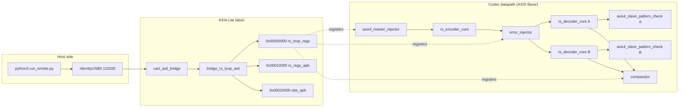

# Harness Architecture

## RTL inventory

| Module | File | Role |
|---|---|---|
| `uart_axil_bridge` | `projects/components/utility-ip/converters/rtl/uart_to_axil4/uart_axil_bridge.sv` | UART 115200 8N1 to AXI4-Lite master. |
| `bridge_rs_loop_axil` | Generated fabric | 1-master x 3-slave AXI4-Lite/APB fabric. |
| `rs_loop_genesys2_top` / `rs_loop_top` | `build-loop/rtl/rs_loop_genesys2_top.sv` / `build-loop/rtl/rs_loop_top.sv` | Genesys 2 MMCM wrapper, or Nexys A7 100 MHz direct clock. |
| `rs_loop_harness` | `build-loop/rtl/rs_loop_harness.sv` | Codec loop, register decode, bandwidth meters, observers, verdict tallies. |
| `rs_loop_cfg_pkg` | `build-loop/rtl/rs_loop_cfg_pkg.sv` | Single source of geometry: RS(252,236), 4 symbols/beat. |
| `rs_loop_regs` | Generated from `build-loop/rtl/rs_loop_regs.rdl` | Host-visible CSR block. |
| `axis4_master_injector` | `rtl/amba/shared/axis4_master_injector.sv` | LFSR data source plus expected CRC-32, one packet per block. |
| `axis4_slave_pattern_check` | `rtl/amba/shared/axis4_slave_pattern_check.sv` | Regenerates the same LFSR pattern and compares beats per decoder. |
| `rs_encoder_core` | Component RS RTL | RS(252,236) encoder. |
| `error_injector` | Shared utility RTL | Post-encoder corruption: modes 0..7 plus erasure mark. |
| `rs_decoder_core` | Component RS RTL | Decoder with selectable KES_ALGO and erasure path. |
| `rs_erasure_unit` | Component RS RTL | Erasure locator / transform used when `ERASURE_SUPPORT=1`. |
| `rs_axi4_pipeline` | `build-loop/rtl/rs_axi4_pipeline.sv` | Memory-to-memory job chain for the AXI4 flavor. |
| `axis4_intf_observer` | Shared utility RTL | Four AXIS seam observer on window 0x20000. |
| `axi4_intf_master_observer` | Shared utility RTL | Four codec AXI4 master-port observer on window 0x10000. |

: Table 2.1: RTL blocks in the Reed-Solomon harness.

## Host and build inventory

| Script / target | File | Role |
|---|---|---|
| `rs_env.py` | `bin/rs_env.py` | Path anchor for shared host code. |
| `run_smoke.py` | `bin/run_smoke.py` | Campaign runner. |
| `init` / `smoke` / `sweep` / `random` / `soak` / `erasure` | `bin/seq_*.py` | Deterministic campaign sequences. |
| `RsLoopDriver` | `build-loop/host/rs_loop.py` | By-name register access and status collection. |
| `rs_loop_programs` | `build-loop/host/rs_loop_programs.py` | Shared authored-once programs. |
| `host_rs_loop.py` | `build-loop/host/host_rs_loop.py` | CLI front-end. |
| `make -C build-loop bitstream` | `build-loop/Makefile` | Vivado build; set `RS_TARGET=genesys2`. |
| `bin/build_image_matrix.sh` | `bin/build_image_matrix.sh` | Builds `{axis,axi4}` x `{riBM,Euclid}`. |

: Table 2.2: Host scripts and build flow.

## Datapath diagram

### Figure 2.1: Reed-Solomon AXIS datapath and register path.

## Register path, clock, and reset

The host register path is Python over pyserial to the UART, into
`uart_axil_bridge`, through the generated `bridge_rs_loop_axil` 1x3 fabric,
and out as three APB windows. Window 0 at `0x00000000` holds `rs_loop_regs`
(BUILD_ID, SCRATCH, PROFILE, TOPOLOGY, INJ_CFG, etc.). Window 1 at
`0x00010000` hosts the AXI4 master observer on AXI4 flavours and is a read-zero
stub on AXIS. Window 2 at `0x00020000` is always live and hosts the AXIS seam
observer.

On the Genesys 2 the 200 MHz LVDS system clock passes through `IBUFDS` into an
`MMCME2_BASE` with VCO = 1200 MHz and `CLKOUT0_DIVIDE_F = 12`, producing the
100 MHz harness clock. The Nexys A7 top uses the on-board 100 MHz clock
directly.
