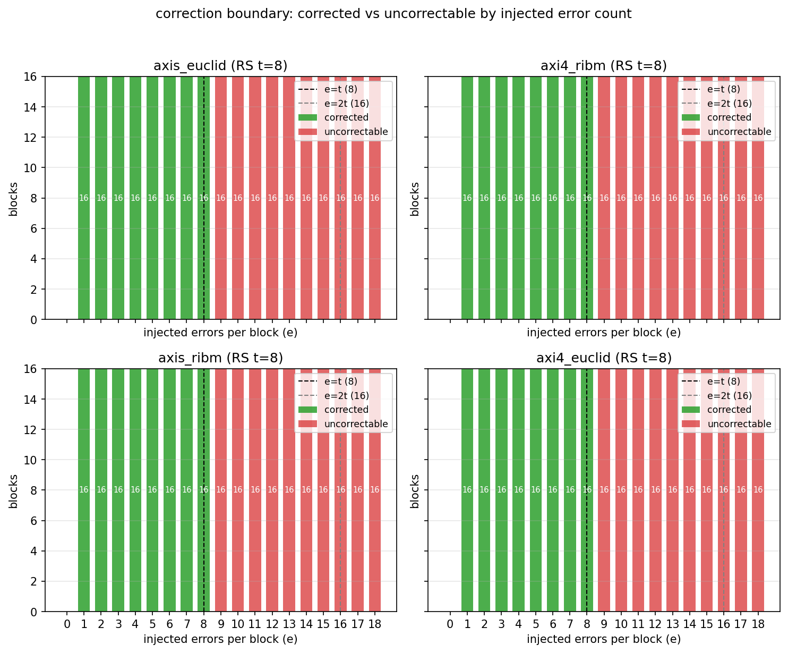
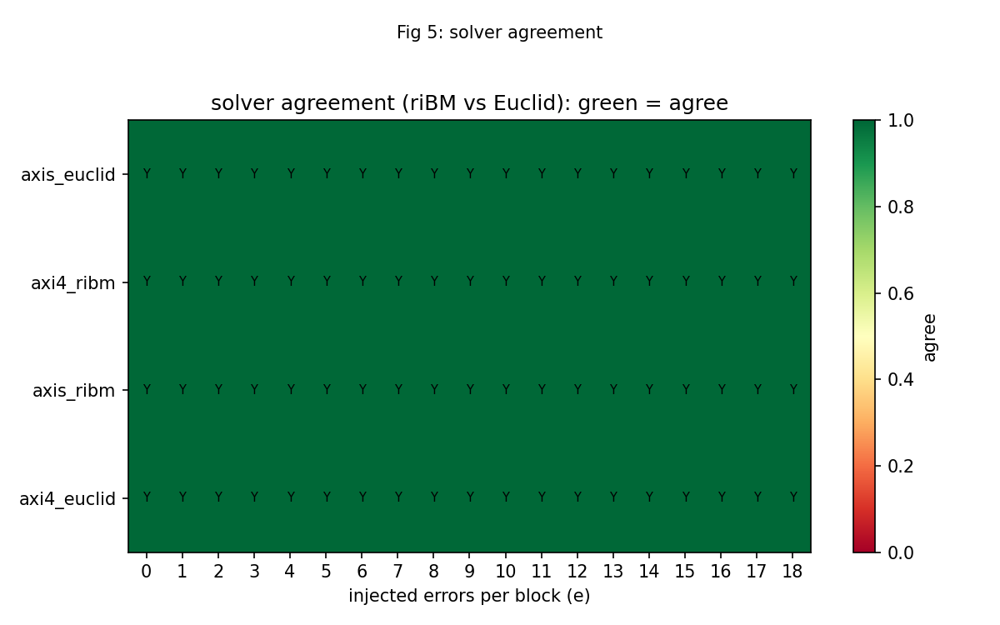

# Battery Results

## Per-image campaign status

All four images passed every campaign in the 2026-10-05 battery:

| Image | Solver | Init | Smoke | Sweep | Random | Clusters | Localized | Badblock |
|-------|--------|------|-------|-------|--------|----------|-----------|----------|
| axis_ribm | riBM | PASS | PASS | PASS | PASS | PASS | PASS | PASS |
| axis_euclid | Euclid | PASS | PASS | PASS | PASS | PASS | PASS | PASS |
| axi4_ribm | riBM | PASS | PASS | PASS | PASS | PASS | PASS | PASS |
| axi4_euclid | Euclid | PASS | PASS | PASS | PASS | PASS | PASS | PASS |

: Table 4.1: Reed-Solomon 2026-10-05 battery per-image status.

## Correction boundary

### Figure 4.1: Reed-Solomon correction boundary across all four images.

## Decode cost

### Figure 4.2: Reed-Solomon decode cost across all four images.

## Sweep verdict table

The sweep ran e = 0 .. 18 with 16 blocks per count on every image:

| e | Verdict | Blocks | Notes |
|---|---------|--------|-------|
| 0 | Correct | 16 | Clean decode. |
| 1 | Correct | 16 | 16 symbols corrected. |
| 2 | Correct | 16 | 32 symbols corrected. |
| 3 | Correct | 16 | 48 symbols corrected. |
| 4 | Correct | 16 | 64 symbols corrected. |
| 5 | Correct | 16 | 80 symbols corrected. |
| 6 | Correct | 16 | 96 symbols corrected. |
| 7 | Correct | 16 | 112 symbols corrected. |
| 8 | Correct | 16 | 128 symbols corrected. |
| 9 | Uncorrectable | 16 | Past correction boundary. |
| 10 | Uncorrectable | 16 | Past correction boundary. |
| 11 | Uncorrectable | 16 | Past correction boundary. |
| 12 | Uncorrectable | 16 | Past correction boundary. |
| 13 | Uncorrectable | 16 | Past correction boundary. |
| 14 | Uncorrectable | 16 | Past correction boundary. |
| 15 | Uncorrectable | 16 | Past correction boundary. |
| 16 | Uncorrectable | 16 | Past correction boundary. |
| 17 | Uncorrectable | 16 | Past correction boundary. |
| 18 | Uncorrectable | 16 | Past correction boundary. |

: Table 4.2: Reed-Solomon sweep verdicts.

## Solver agreement

### Figure 4.3: Reed-Solomon solver agreement matrix (riBM vs Euclid).

The matrix is entirely green with a Y in every cell. That means no image, at
any injected error count from 0 to 18, disagreed with its sibling solver on
the same deterministic workload. The absence of any red cell is the board
evidence that the two key-equation solvers are consistent.
