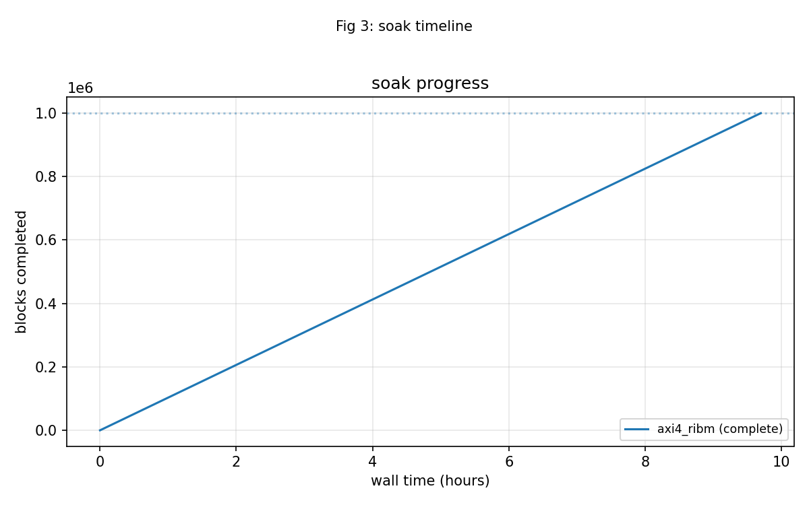

# Soak Results

## One million blocks on the AXI4 image

The 2026-10-05 soak ran the `axi4_ribm` image on board serial
`200300B818A0`. Final counters from
`stable/results/2026-10-05_soak/battery.json`:

| Metric | Value |
|--------|-------|
| blocks_final | 1,000,000 |
| wall_s | 34,902 |
| blk_per_s | 29.0 |
| clean | 113,143 |
| corrected | 768,077 |
| uncorrectable | 118,780 |
| symbols_corrected | 3,119,170 |
| failing_runs | 0 |
| over_t_blocks | 74,240 |
| misdecoded | 2 |
| misdecode_rate | 2.69e-05 (1 in 37,120) |

: Table 4.1: RS soak final counters.

The confidence statement is:

> 1,000,000 blocks, 3,119,170 symbols corrected, 0 failing runs, 9h42m at
> 29 blk/s UART-bound. Of the 74,240 blocks pushed past the correction limit,
> 2 were accepted and silently mis-decoded — a rate of 1 in 37,120, which is
> below the model's predicted roughly 1-in-20,000 mis-decode rate at
> e = t + 1 for this profile.

## Mis-decodes versus the model

The soak's pass criterion is a bounded mis-decode rate, not zero
mis-decodes. A block carrying more than t = 8 symbol errors is beyond the
code's guaranteed radius; the decoder is mathematically permitted to return
a codeword other than the transmitted one. The harness counts every such
event, and the acceptance bound is the analytic failure rate for the
profile. The observed 2 of 74,240 sits under the model bound, which is what
"soak PASS" means here. Every other over-t block was flagged uncorrectable,
and all 768,077 corrected blocks matched the oracle.

## Soak timeline

### Figure 4.4: RS soak timeline over one million blocks.

## What 29 blk/s means

The codec itself can run at roughly 500k blocks per second at 100 MHz. The
soak measured 29 blocks per second because the host poll loop, running over a
115200-baud UART, is the bottleneck. That is not a hardware limit; it is a
fixture limit. Any future soak that wants to go deeper or faster should size
the host interaction accordingly, or move to a faster host interface, rather
than inferring decoder throughput from the soak rate.

## Image notes

The soak ran on the memory-to-memory AXI4 image. The earlier plan to prefer
the AXIS flavour for soaks turned out to be unnecessary: the AXI4 job
memories accept the soak's per-block job pattern without issue. The
`axi4_ribm` image is single-decoder, so the riBM-versus-Euclid comparator
counters read 0 by design; solver agreement on the board is covered by the
deterministic cross-image campaigns in the battery chapter.
