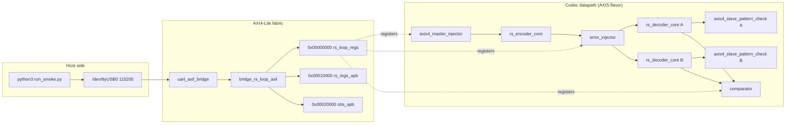

# How The Pieces Connect

## Register path and datapath

The host register path is: Python over pyserial to the UART, into
`uart_axil_bridge`, through the generated `bridge_rs_loop_axil` 1x3 fabric, and
out as three APB windows.

Window 0 at `0x00000000` is `rs_loop_apb`, which feeds the shared
`apb4_to_peakrdl` shim and then the generated `rs_loop_regs` block — that is
where BUILD_ID, SCRATCH, PROFILE, TOPOLOGY, INJ_CFG, and the status/counter
registers live. Window 1 at `0x00010000` is `rs_regs_apb`; on the AXI4 flavor
it hosts the `axi4_intf_master_observer` watching the codec's four AXI4
master ports, while on AXIS flavors it is a read-zero stub so the host bus
never hangs. Window 2 at `0x00020000` is `obs_apb`, always live, where an
`axis4_intf_observer` watches the four AXIS seams in codeword order:
message-in, codeword-out, codeword-in, message-out. The fabric definition is
frozen in
`rtl/bridges/generated/bridge_rs_loop_axil/bridge_rs_loop_axil.toml`, so
adding a new window is a bridge regeneration rather than a harness rewrite.

## Clock and reset

Clock and reset differ only at the board top. On the Genesys 2 the 200 MHz
LVDS system clock passes through `IBUFDS` into an `MMCME2_BASE` with VCO =
1200 MHz and `CLKOUT0_DIVIDE_F = 12`, producing the 100 MHz harness clock
(`build-loop/rtl/rs_loop_genesys2_top.sv`). The Nexys A7 top uses the on-board
100 MHz clock directly (`build-loop/rtl/rs_loop_top.sv`). Both synchronize
the active-low pushbutton reset into the 100 MHz domain before it reaches
`rs_loop_harness`. All of the downstream geometry — including the UART
divisor — comes from `rs_loop_cfg_pkg.sv`, so the clock constant and the MMCM
output cannot drift apart.
