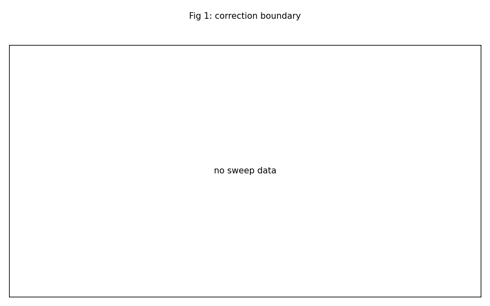
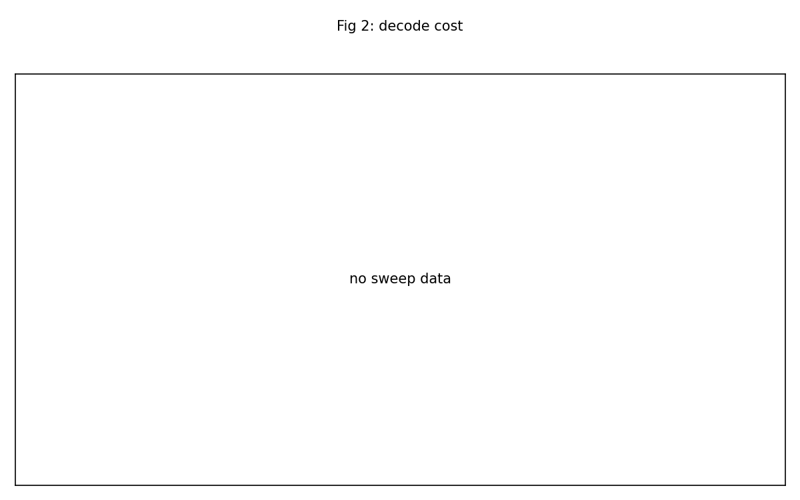
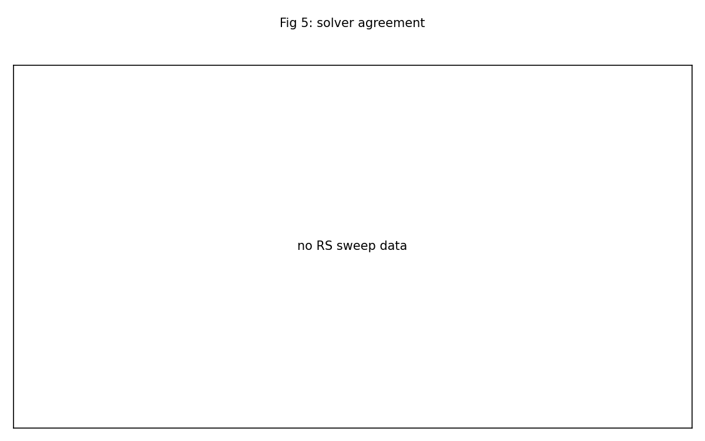

<!-- RTL Design Sherpa Documentation Header -->
<table>
<tr>
<td width="80">
  
</td>
<td>
  <strong>RTL Design Sherpa</strong> · <em>Learning Hardware Design Through Practice</em> 
  
    <a href="https://github.com/sean-galloway/RTLDesignSherpa">GitHub</a> ·
    <a href="https://github.com/sean-galloway/RTLDesignSherpa/blob/main/docs/DOCUMENTATION_INDEX.md">Documentation Index</a> ·
    <a href="https://github.com/sean-galloway/RTLDesignSherpa/blob/main/docs/DOCUMENTATION_INDEX.md">MIT License</a>
  
</td>
</tr>
</table>

---

<!-- End Header -->

# Battery Report — 2026-10-05

Board serial: `200300B818A0`  
Generated: 2026-10-06T09:41:25Z  

## Summary

- Images reported: **1**
- Passed: **1**
- Failed: **0**
- Partial: **0**
- Program failed: **0**

> Confidence: **1,000,000** blocks across the soak(s); **2** mis-decodes (**74,240** blocks were pushed past the correction limit).

| Image | Codec | Status | Solver | Sequences |
|-------|-------|--------|--------|-----------|
| axi4_ribm | RS(252,236) | PASS | riBM; no comparator, so the B-side counters and CMP_* read 0 by design | init=PASS, soak=PASS |

## Per-Image Findings

### axi4_ribm

Codec: RS(252,236) t=8 m=8 4 symbols/beat  
Solver/topology: riBM; no comparator, so the B-side counters and CMP_* read 0 by design  
Overall status: **PASS**  

Soak progress: 999936 of 1000000 blocks after 34900s (29 blk/s).  

Soak final counters:

| Metric | Value |
|--------|-------|
| blocks_final | 1,000,000 |
| wall_s | 34902 |
| blk_per_s | 29.0 |
| clean | 113,143 |
| corrected | 768,077 |
| uncorrectable | 118,780 |
| symbols_corrected | 3,119,170 |
| beats_compared_ribm_vs_euclid | 0 |
| failing_runs | 0 |
| over_t_blocks | 74,240 |
| misdecoded | 2 |
| misdecode_rate | 2.69e-05 (1 in 37120) |

## Figures

## Limits

- No sweep data was present in the transcripts.
