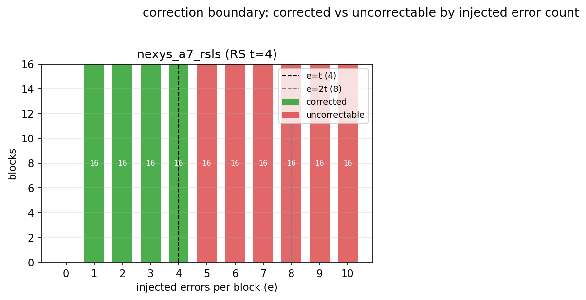
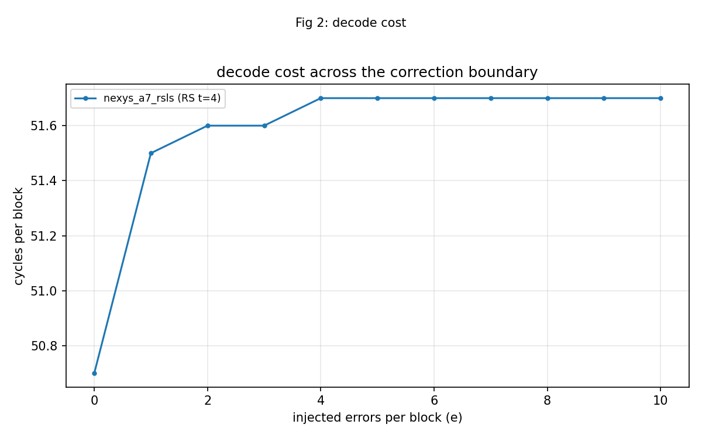
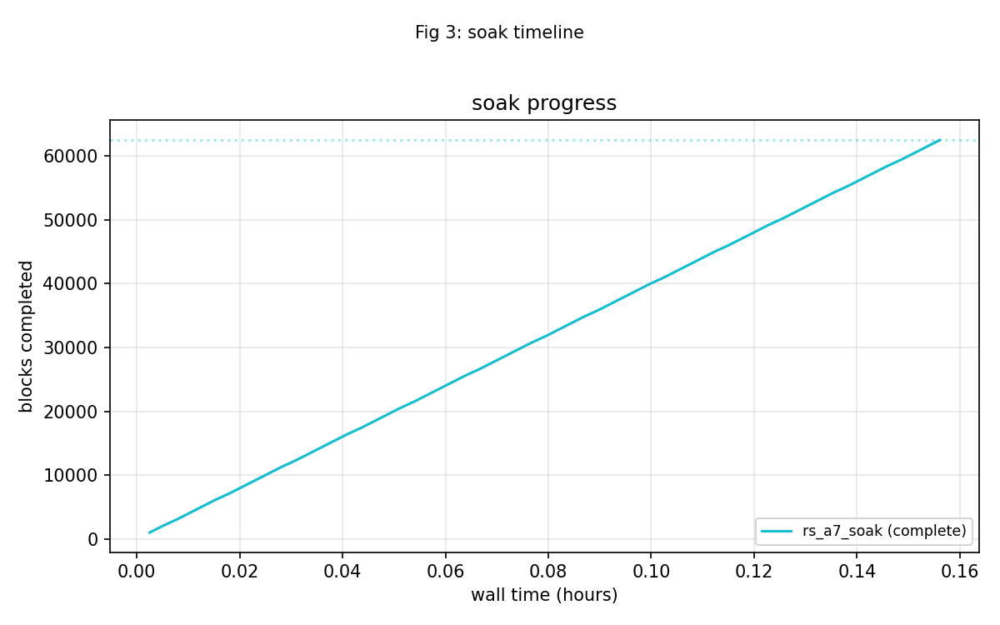
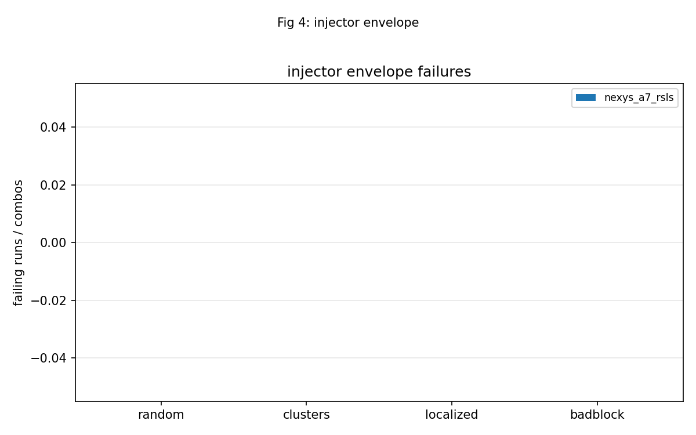
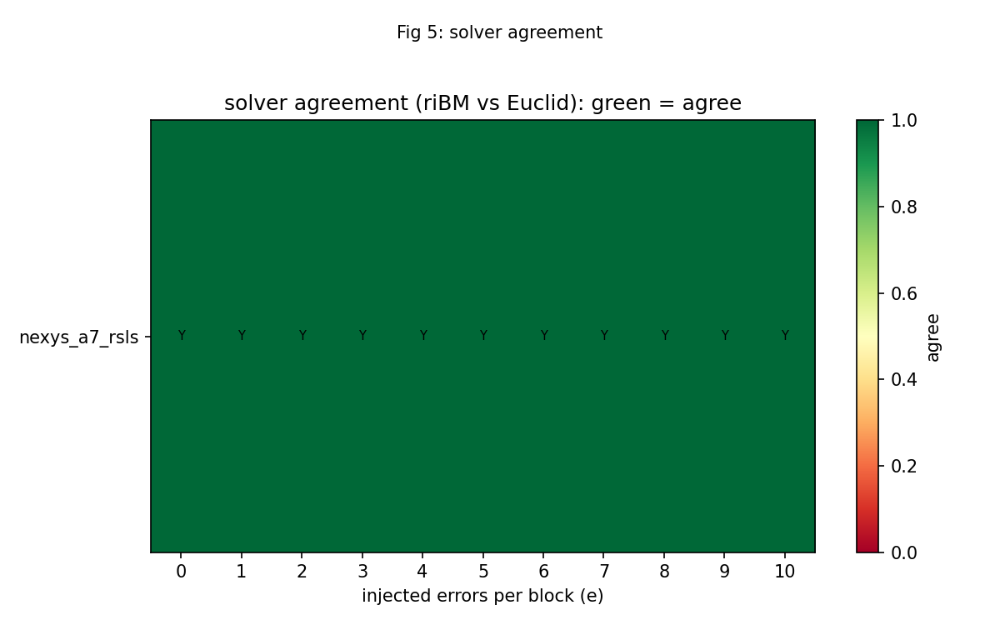

<!-- RTL Design Sherpa Documentation Header -->
<table>
<tr>
<td width="80">
  
</td>
<td>
  <strong>RTL Design Sherpa</strong> · <em>Learning Hardware Design Through Practice</em> 
  
    <a href="https://github.com/sean-galloway/RTLDesignSherpa">GitHub</a> ·
    <a href="https://github.com/sean-galloway/RTLDesignSherpa/blob/main/docs/DOCUMENTATION_INDEX.md">Documentation Index</a> ·
    <a href="https://github.com/sean-galloway/RTLDesignSherpa/blob/main/docs/DOCUMENTATION_INDEX.md">MIT License</a>
  
</td>
</tr>
</table>

---

<!-- End Header -->

# Battery Report — 2026-10-07

Board serial: `210292BFA3EE`  
Generated: 2026-10-07T14:03:16Z  

## Summary

- Images reported: **2**
- Passed: **2**
- Failed: **0**
- Partial: **0**
- Program failed: **0**

> Confidence: **62,528** blocks across the soak(s); **0** mis-decodes (**4,928** blocks were pushed past the correction limit and every one was flagged).

| Image | Codec | Status | Solver | Sequences |
|-------|-------|--------|--------|-----------|
| nexys_a7_rsls | RS(64,56) | PASS | riBM; no comparator, so the B-side counters and CMP_* read 0 by design | badblock=PASS, clusters=PASS, init=PASS, localized=PASS, random=PASS, smoke=PASS, sweep=PASS |
| rs_a7_soak | RS(64,56) | PASS | riBM; no comparator, so the B-side counters and CMP_* read 0 by design | init=PASS, soak=PASS |

## Per-Image Findings

### nexys_a7_rsls

Codec: RS(64,56) t=4 m=8 4 symbols/beat  
Solver/topology: riBM; no comparator, so the B-side counters and CMP_* read 0 by design  
Overall status: **PASS**  

Smoke results:

| Mode | cyc/blk | Status |
|------|---------|--------|
| bypass | 14.2 | PASS |
| clean | 18.8 | PASS |
| e=4 | 51.7 | PASS |
| e=5 | 51.7 | PASS |
| debug | 19.6 | PASS |

Sweep: 11 error counts from e=0 to e=10.  

Random campaign: 64 runs x 4 blocks; 58 clean / 90 corrected / 108 uncorrectable; 0 failing run(s).  

badblock: 4 combos x 64 blocks; 0 failing combo(s).  

clusters: 4 combos x 16 blocks; 0 failing combo(s).  

localized: 3 combos x 16 blocks; 0 failing combo(s).  

### rs_a7_soak

Codec: RS(64,56) t=4 m=8 4 symbols/beat  
Solver/topology: riBM; no comparator, so the B-side counters and CMP_* read 0 by design  
Overall status: **PASS**  

Soak progress: 62464 of 62528 blocks after 562s (111 blk/s).  

Soak final counters:

| Metric | Value |
|--------|-------|
| blocks_final | 62,528 |
| wall_s | 563 |
| blk_per_s | 111.0 |
| clean | 12,138 |
| corrected | 42,096 |
| uncorrectable | 8,294 |
| symbols_corrected | 100,090 |
| beats_compared_ribm_vs_euclid | 0 |
| failing_runs | 0 |
| over_t_blocks | 4,928 |
| misdecoded | 0 |
| misdecode_rate | 0.00e+00 (1 in 4928) |

## Figures

## Limits

- None noted.
