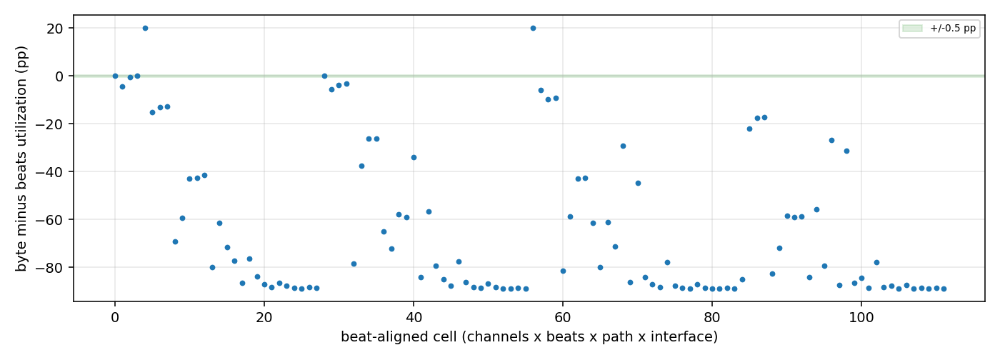
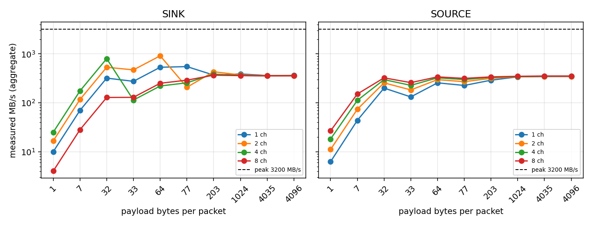
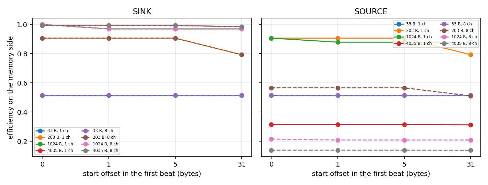

<!-- RTL Design Sherpa Documentation Header -->
<table>
<tr>
<td width="80">
  <a href="https://github.com/sean-galloway/RTLDesignSherpa">
    
  </a>
</td>
<td>
  <strong>RTL Design Sherpa</strong> &middot; <em>Learning Hardware Design Through Practice</em><br>
  <sub>
    <a href="https://github.com/sean-galloway/RTLDesignSherpa">GitHub</a> &middot;
    <a href="https://github.com/sean-galloway/RTLDesignSherpa/blob/main/docs/DOCUMENTATION_INDEX.md">Documentation Index</a> &middot;
    <a href="https://github.com/sean-galloway/RTLDesignSherpa/blob/main/LICENSE">MIT License</a>
  </sub>
</td>
</tr>
</table>

---

<!-- End Header -->


# RAPIDS Byte-Granular DMA: Byte Characterization Report

**Version:** 0.1  
**Date:** 2026-09-30  
**Platform:** Genesys 2, 256-bit, 8 channels, 100 MHz  
**Results:** `rapids_byte_perf_prelim_20260930.json`

> **PRELIMINARY.** These numbers were measured on the bitstream that predates the channel-reset fix. They validate the tooling and the report; the final numbers replace them after the rebuild. Cells without a measurement are marked **TBD**.

---

## 1. Headline

| Path | Point | Efficiency | MB/s measured | % of 3200 MB/s peak |
|---|---:|---:|---:|---:|
| Sink | byte path, 4096 B x 8 ch | 1.000 | 357 | 11.1 % |
| Sink | beat path, 4096 beats x 8 ch | 1.000 | 356 | 11.1 % |
| Source | byte path, 4096 B x 8 ch | 1.000 | 352 | 11.0 % |
| Source | beat path, 4096 beats x 8 ch | 1.000 | 356 | 11.1 % |

: Largest transfers at 8 channels

These rates sit at the harness checker ceiling of 3200 / 9 = 355.6 MB/s, not at the DUT's limit: the byte-wise CRC checkers take 9 cycles per 32-byte beat (section 3). Read every MB/s in this report against both the 3200 MB/s peak and that ceiling. Efficiency (payload over beats x lanes) does not depend on the checker.

## 2. Definitions

| Term | Meaning |
|---|---|
| Bytes moved | Total payload bytes over all active channels and descriptors; from the exact byte count of the AXIS bus meter. |
| Beats moved | Accepted beats on the interface named: AXIS beats on the stream side, memory beats on the AXI side. |
| Efficiency | payload bytes / (beats x BYTE_LANES), BYTE_LANES = 32. 1.0 means every lane of every beat carried payload. |
| MB/s | Total bytes / measurement window, windows counted in 100 MHz cycles by the harness meters, not wall clock. |
| Peak | 3200 MB/s = 100 MHz x 32 B, per direction. Shown beside every measured MB/s value. |
| Engaged utilization | prod / (prod + bp + starv) on one interface; the RAPIDS Beats headline metric, used only for the beat-aligned comparison. |

: Definitions

## 3. Beat-aligned rows against the RAPIDS Beats report

These rows use the beat-scaled path (`pkt_bytes=None`, beats per channel) on the byte DUT, which is how the RAPIDS Beats report measured its matrix: 9-beat bursts, response delay 0, backpressure off, default seed, bare bus meters. The metric is engaged utilization (`prod / (prod + bp + starv)`), the RAPIDS Beats headline metric. "Unchanged" is checked numerically: every cell is compared to the same cell of `genesys_dw256_obs_C.json` and must agree within 0.5 percentage points, the threshold the RAPIDS Beats report itself applies between builds.

| Ch | Beats/ch | Sink AXIS-in % (byte / beats) | Sink AXI4-wr % | Source AXI4-rd % | Source AXIS-out % | Max abs delta (pp) |
|---|---:|---:|---:|---:|---:|---:|
| 1 | 1 | 50.0 / 50.0 | 10.0 / 14.3 | 6.2 / 6.7 | 6.7 / 6.7 | 4.29 |
| 1 | 4 | 100.0 / 80.0 | 25.0 / 40.0 | 9.3 / 22.2 | 9.5 / 22.2 | 20.00 |
| 1 | 16 | 25.0 / 94.1 | 13.6 / 72.7 | 10.6 / 53.3 | 10.7 / 53.3 | 69.12 |
| 1 | 64 | 57.1 / 98.5 | 11.6 / 91.4 | 20.7 / 82.1 | 10.7 / 82.1 | 79.79 |
| 1 | 256 | 22.6 / 99.6 | 11.2 / 97.7 | 18.6 / 94.8 | 11.0 / 94.8 | 86.47 |
| 1 | 1024 | 12.7 / 99.9 | 11.1 / 99.4 | 12.4 / 98.7 | 11.1 / 98.7 | 88.27 |
| 1 | 4096 | 11.5 / 100.0 | 11.1 / 99.9 | 11.4 / 99.7 | 11.1 / 99.7 | 88.73 |
| 2 | 1 | 66.7 / 66.7 | 16.7 / 22.2 | 8.0 / 11.8 | 8.7 / 11.8 | 5.56 |
| 2 | 4 | 10.5 / 88.9 | 19.5 / 57.1 | 10.1 / 36.4 | 10.3 / 36.4 | 78.36 |
| 2 | 16 | 32.0 / 97.0 | 12.2 / 84.2 | 11.7 / 69.6 | 10.6 / 69.6 | 72.00 |
| 2 | 64 | 65.3 / 99.2 | 11.4 / 95.5 | 33.6 / 90.1 | 10.8 / 90.1 | 84.15 |
| 2 | 256 | 14.8 / 99.8 | 11.2 / 98.8 | 19.8 / 97.3 | 11.1 / 97.3 | 87.67 |
| 2 | 1024 | 11.8 / 100.0 | 11.1 / 99.7 | 12.5 / 99.3 | 11.1 / 99.3 | 88.58 |
| 2 | 4096 | 11.3 / 100.0 | 11.1 / 99.9 | 11.4 / 99.8 | 11.1 / 99.8 | 88.81 |
| 4 | 1 | 100.0 / 80.0 | 25.0 / 30.8 | 9.3 / 19.0 | 9.8 / 19.0 | 20.00 |
| 4 | 4 | 12.9 / 94.1 | 14.2 / 72.7 | 10.6 / 53.3 | 10.7 / 53.3 | 81.21 |
| 4 | 16 | 37.2 / 98.5 | 11.6 / 91.4 | 21.0 / 82.1 | 10.8 / 82.1 | 79.79 |
| 4 | 64 | 70.3 / 99.6 | 11.2 / 97.3 | 50.3 / 94.8 | 10.8 / 94.8 | 86.12 |
| 4 | 256 | 12.6 / 99.7 | 11.1 / 99.4 | 20.7 / 98.7 | 11.1 / 98.7 | 88.27 |
| 4 | 1024 | 11.5 / 99.9 | 11.1 / 99.9 | 12.6 / 99.7 | 11.1 / 99.7 | 88.73 |
| 4 | 4096 | 11.2 / 100.0 | 11.1 / 100.0 | 11.4 / 99.9 | 11.1 / 99.9 | 88.85 |
| 8 | 1 | 4.0 / 88.9 | 16.0 / 38.1 | 10.1 / 27.6 | 10.4 / 27.6 | 84.85 |
| 8 | 4 | 14.5 / 97.0 | 12.5 / 84.2 | 11.3 / 69.6 | 10.6 / 69.6 | 82.42 |
| 8 | 16 | 40.5 / 99.2 | 11.4 / 95.5 | 34.5 / 90.1 | 10.8 / 90.1 | 84.15 |
| 8 | 64 | 73.1 / 99.8 | 11.2 / 98.5 | 66.2 / 97.3 | 11.0 / 97.3 | 87.30 |
| 8 | 256 | 11.8 / 96.1 | 11.1 / 99.7 | 21.4 / 99.3 | 11.1 / 99.3 | 88.58 |
| 8 | 1024 | 11.3 / 99.0 | 11.1 / 99.9 | 12.6 / 99.8 | 11.1 / 99.8 | 88.81 |
| 8 | 4096 | 11.2 / 99.7 | 11.1 / 100.0 | 11.5 / 100.0 | 11.1 / 100.0 | 88.87 |

: Engaged utilization, byte build / RAPIDS Beats reference, beat-aligned rows

**Verdict: CHANGED.** 112 of 112 beat-aligned cells were compared; 108 differ by more than 0.5 pp; the largest difference is -88.87 pp (ch 8, 4096 beats, sink wr). Cells over the threshold: ch1 b1 sink wr -4.29 pp; ch1 b4 sink sin +20.00 pp; ch1 b4 sink wr -15.00 pp; ch1 b4 source rd -12.92 pp; ch1 b4 source sout -12.70 pp; ch1 b16 sink sin -69.12 pp; ch1 b16 sink wr -59.17 pp; ch1 b16 source rd -42.74 pp; ch1 b16 source sout -42.67 pp; ch1 b64 sink sin -41.32 pp; ch1 b64 sink wr -79.79 pp; ch1 b64 source rd -61.34 pp; ....

**What this comparison can and cannot show.** The byte build's on-chip checkers (`BYTE_CRC=1` on `axi4_slave_wr_crc_check` and `axis4_slave_pattern_check`) fold the strobed bytes of each beat into the CRC four bytes per cycle and hold ready low while they do, so a 32-byte beat occupies 9 cycles. That caps the harness at 3200 / 9 = 355.6 MB/s (11.1 % of the 3200 MB/s peak), which is where the large-transfer rows sit. The RAPIDS Beats reference used the word-wide checkers and is not checker-bound. The large differences above are therefore the checkers backpressuring the DUT, not evidence about the DUT's own throughput, and the "utilization unchanged" criterion cannot be settled on this build. It needs the beat-aligned rows measured with the word-wide checkers (`BYTE_CRC=0`) on a separate performance bitstream, which also has to keep the 1-beat and 4-beat rows comparable. Until then the beat-aligned rows are **not comparable** to the RAPIDS Beats report.

### Figure 3.1: Byte minus beats utilization, beat-aligned cells



| Ch | Beats/ch | Sink bytes | Sink beats | Sink eff | Sink MB/s | Sink % peak | Src bytes | Src beats | Src eff | Src MB/s | Src % peak |
|---|---:|---:|---:|---:|---:|---:|---:|---:|---:|---:|---:|
| 1 | 1 | 32 | 1 | 1.000 | 320 | 10.0 % | 32 | 1 | 1.000 | 200 | 6.2 % |
| 1 | 4 | 128 | 4 | 1.000 | 800 | 25.0 % | 128 | 4 | 1.000 | 298 | 9.3 % |
| 1 | 16 | 512 | 16 | 1.000 | 430 | 13.4 % | 512 | 16 | 1.000 | 339 | 10.6 % |
| 1 | 64 | 2048 | 64 | 1.000 | 372 | 11.6 % | 1056 | 33 | 1.000 | 342 | 10.7 % |
| 1 | 256 | 8192 | 256 | 1.000 | 359 | 11.2 % | 4864 | 152 | 1.000 | 353 | 11.0 % |
| 1 | 1024 | 32768 | 1024 | 1.000 | 357 | 11.1 % | 29440 | 920 | 1.000 | 355 | 11.1 % |
| 1 | 4096 | 131072 | 4096 | 1.000 | 356 | 11.1 % | 127744 | 3992 | 1.000 | 355 | 11.1 % |
| 2 | 1 | 64 | 2 | 1.000 | 533 | 16.7 % | 64 | 2 | 1.000 | 256 | 8.0 % |
| 2 | 4 | 256 | 8 | 1.000 | 337 | 10.5 % | 256 | 8 | 1.000 | 324 | 10.1 % |
| 2 | 16 | 1024 | 32 | 1.000 | 389 | 12.2 % | 928 | 29 | 1.000 | 340 | 10.6 % |
| 2 | 64 | 4096 | 128 | 1.000 | 363 | 11.4 % | 1312 | 41 | 1.000 | 344 | 10.8 % |
| 2 | 256 | 16384 | 512 | 1.000 | 357 | 11.2 % | 9152 | 286 | 1.000 | 354 | 11.1 % |
| 2 | 1024 | 65536 | 2048 | 1.000 | 356 | 11.1 % | 58304 | 1822 | 1.000 | 355 | 11.1 % |
| 2 | 4096 | 262144 | 8192 | 1.000 | 356 | 11.1 % | 254912 | 7966 | 1.000 | 356 | 11.1 % |
| 4 | 1 | 128 | 4 | 1.000 | 800 | 25.0 % | 128 | 4 | 1.000 | 298 | 9.3 % |
| 4 | 4 | 512 | 16 | 1.000 | 413 | 12.9 % | 512 | 16 | 1.000 | 339 | 10.6 % |
| 4 | 16 | 2048 | 64 | 1.000 | 372 | 11.6 % | 1056 | 33 | 1.000 | 346 | 10.8 % |
| 4 | 64 | 8192 | 256 | 1.000 | 358 | 11.2 % | 1760 | 55 | 1.000 | 346 | 10.8 % |
| 4 | 256 | 32768 | 1024 | 1.000 | 357 | 11.1 % | 17536 | 548 | 1.000 | 355 | 11.1 % |
| 4 | 1024 | 131072 | 4096 | 1.000 | 356 | 11.1 % | 115840 | 3620 | 1.000 | 355 | 11.1 % |
| 4 | 4096 | 524288 | 16384 | 1.000 | 356 | 11.1 % | 509056 | 15908 | 1.000 | 356 | 11.1 % |
| 8 | 1 | 256 | 8 | 1.000 | 129 | 4.0 % | 256 | 8 | 1.000 | 324 | 10.1 % |
| 8 | 4 | 1024 | 32 | 1.000 | 397 | 12.4 % | 960 | 30 | 1.000 | 338 | 10.6 % |
| 8 | 16 | 4096 | 128 | 1.000 | 363 | 11.4 % | 1280 | 40 | 1.000 | 345 | 10.8 % |
| 8 | 64 | 16384 | 512 | 1.000 | 357 | 11.1 % | 2720 | 85 | 1.000 | 352 | 11.0 % |
| 8 | 256 | 65536 | 2048 | 1.000 | 356 | 11.1 % | 33920 | 1060 | 1.000 | 355 | 11.1 % |
| 8 | 1024 | 262144 | 8192 | 1.000 | 356 | 11.1 % | 230528 | 7204 | 1.000 | 356 | 11.1 % |
| 8 | 4096 | 1048576 | 32768 | 1.000 | 356 | 11.1 % | 1016960 | 31780 | 1.000 | 356 | 11.1 % |

: Beat-aligned rows: bytes, beats, efficiency, MB/s and share of the 3200 MB/s peak

Every beat-aligned row moves whole beats, so efficiency is 1.000 by construction; measured range over 56 rows: 1.000 to 1.000.

## 4. Transfer size (offset 0)

One descriptor per channel, payload in bytes, start offset 0. Bytes moved and beats are totals over the active channels; efficiency is payload bytes over beats times 32 bytes per beat, on the AXIS side and on the memory side. MB/s is total bytes over the measurement window (the longer of the stream and memory windows) and is always shown with its share of the 3200 MB/s peak (100 MHz x 32 B).

### 4.1 Sink path

| Payload B | Offset | Ch | Bytes moved | AXIS beats | Mem beats | Eff (AXIS) | Eff (mem) | MB/s | % of peak | Result |
|---|---:|---:|---:|---:|---:|---:|---:|---:|---:|---:|
| 1 | 0 | 1 | 1 | 1 | 1 | 0.031 | 0.031 | 10.0 | 0.31 % | PASS |
| 1 | 0 | 2 | 2 | 2 | 2 | 0.031 | 0.031 | 16.7 | 0.52 % | PASS |
| 1 | 0 | 4 | 4 | 4 | 4 | 0.031 | 0.031 | 25.0 | 0.78 % | PASS |
| 1 | 0 | 8 | 8 | 8 | 8 | 0.031 | 0.031 | 4.0 | 0.13 % | PASS |
| 7 | 0 | 1 | 7 | 1 | 1 | 0.219 | 0.219 | 70.0 | 2.19 % | PASS |
| 7 | 0 | 2 | 14 | 2 | 2 | 0.219 | 0.219 | 116.7 | 3.65 % | PASS |
| 7 | 0 | 4 | 28 | 4 | 4 | 0.219 | 0.219 | 175.0 | 5.47 % | PASS |
| 7 | 0 | 8 | 56 | 8 | 8 | 0.219 | 0.219 | 28.1 | 0.88 % | PASS |
| 32 | 0 | 1 | 32 | 1 | 1 | 1.000 | 1.000 | 320.0 | 10.00 % | PASS |
| 32 | 0 | 2 | 64 | 2 | 2 | 1.000 | 1.000 | 533.3 | 16.67 % | PASS |
| 32 | 0 | 4 | 128 | 4 | 4 | 1.000 | 1.000 | 800.0 | 25.00 % | PASS |
| 32 | 0 | 8 | 256 | 8 | 8 | 1.000 | 1.000 | 128.6 | 4.02 % | PASS |
| 33 | 0 | 1 | 33 | 2 | 2 | 0.516 | 0.516 | 275.0 | 8.59 % | PASS |
| 33 | 0 | 2 | 66 | 4 | 4 | 0.516 | 0.516 | 471.4 | 14.73 % | PASS |
| 33 | 0 | 4 | 132 | 8 | 8 | 0.516 | 0.516 | 113.8 | 3.56 % | PASS |
| 33 | 0 | 8 | 264 | 16 | 16 | 0.516 | 0.516 | 129.4 | 4.04 % | PASS |
| 64 | 0 | 1 | 64 | 2 | 2 | 1.000 | 1.000 | 533.3 | 16.67 % | PASS |
| 64 | 0 | 2 | 128 | 4 | 4 | 1.000 | 1.000 | 914.3 | 28.57 % | PASS |
| 64 | 0 | 4 | 256 | 8 | 8 | 1.000 | 1.000 | 220.7 | 6.90 % | PASS |
| 64 | 0 | 8 | 512 | 16 | 16 | 1.000 | 1.000 | 251.0 | 7.84 % | PASS |
| 77 | 0 | 1 | 77 | 3 | 3 | 0.802 | 0.802 | 550.0 | 17.19 % | PASS |
| 77 | 0 | 2 | 154 | 6 | 6 | 0.802 | 0.802 | 208.1 | 6.50 % | PASS |
| 77 | 0 | 4 | 308 | 12 | 12 | 0.802 | 0.802 | 256.7 | 8.02 % | PASS |
| 77 | 0 | 8 | 616 | 24 | 24 | 0.802 | 0.802 | 290.6 | 9.08 % | PASS |
| 203 | 0 | 1 | 203 | 7 | 7 | 0.906 | 0.906 | 369.1 | 11.53 % | PASS |
| 203 | 0 | 2 | 406 | 14 | 14 | 0.906 | 0.906 | 431.9 | 13.50 % | PASS |
| 203 | 0 | 4 | 812 | 28 | 28 | 0.906 | 0.906 | 386.7 | 12.08 % | PASS |
| 203 | 0 | 8 | 1624 | 56 | 56 | 0.906 | 0.906 | 367.4 | 11.48 % | PASS |
| 1024 | 0 | 1 | 1024 | 32 | 32 | 1.000 | 1.000 | 389.4 | 12.17 % | PASS |
| 1024 | 0 | 2 | 2048 | 64 | 64 | 1.000 | 1.000 | 371.7 | 11.62 % | PASS |
| 1024 | 0 | 4 | 4096 | 128 | 128 | 1.000 | 1.000 | 363.4 | 11.36 % | PASS |
| 1024 | 0 | 8 | 8192 | 256 | 256 | 1.000 | 1.000 | 359.5 | 11.23 % | PASS |
| 4035 | 0 | 1 | 4035 | 127 | 127 | 0.993 | 0.993 | 360.9 | 11.28 % | PASS |
| 4035 | 0 | 2 | 8070 | 254 | 254 | 0.993 | 0.993 | 358.0 | 11.19 % | PASS |
| 4035 | 0 | 4 | 16140 | 508 | 508 | 0.993 | 0.993 | 356.1 | 11.13 % | PASS |
| 4035 | 0 | 8 | 32280 | 1016 | 1016 | 0.993 | 0.993 | 355.6 | 11.11 % | PASS |
| 4096 | 0 | 1 | 4096 | 128 | 128 | 1.000 | 1.000 | 363.4 | 11.36 % | PASS |
| 4096 | 0 | 2 | 8192 | 256 | 256 | 1.000 | 1.000 | 359.5 | 11.23 % | PASS |
| 4096 | 0 | 4 | 16384 | 512 | 512 | 1.000 | 1.000 | 357.5 | 11.17 % | PASS |
| 4096 | 0 | 8 | 32768 | 1024 | 1024 | 1.000 | 1.000 | 356.5 | 11.14 % | PASS |

: Size sweep, sink path, offset 0

### 4.2 Source path

| Payload B | Offset | Ch | Bytes moved | AXIS beats | Mem beats | Eff (AXIS) | Eff (mem) | MB/s | % of peak | Result |
|---|---:|---:|---:|---:|---:|---:|---:|---:|---:|---:|
| 1 | 0 | 1 | 1 | 1 | 1 | 0.031 | 0.031 | 6.2 | 0.20 % | PASS |
| 1 | 0 | 2 | 2 | 2 | 2 | 0.031 | 0.031 | 11.1 | 0.35 % | PASS |
| 1 | 0 | 4 | 4 | 4 | 4 | 0.031 | 0.031 | 18.2 | 0.57 % | PASS |
| 1 | 0 | 8 | 8 | 8 | 8 | 0.031 | 0.031 | 26.7 | 0.83 % | PASS |
| 7 | 0 | 1 | 7 | 1 | 1 | 0.219 | 0.219 | 43.8 | 1.37 % | PASS |
| 7 | 0 | 2 | 14 | 2 | 2 | 0.219 | 0.219 | 73.7 | 2.30 % | PASS |
| 7 | 0 | 4 | 28 | 4 | 4 | 0.219 | 0.219 | 112.0 | 3.50 % | PASS |
| 7 | 0 | 8 | 56 | 8 | 8 | 0.219 | 0.219 | 151.4 | 4.73 % | PASS |
| 32 | 0 | 1 | 32 | 1 | 1 | 1.000 | 1.000 | 200.0 | 6.25 % | PASS |
| 32 | 0 | 2 | 64 | 2 | 2 | 1.000 | 1.000 | 256.0 | 8.00 % | PASS |
| 32 | 0 | 4 | 128 | 4 | 4 | 1.000 | 1.000 | 297.7 | 9.30 % | PASS |
| 32 | 0 | 8 | 256 | 8 | 8 | 1.000 | 1.000 | 324.1 | 10.13 % | PASS |
| 33 | 0 | 1 | 33 | 2 | 2 | 0.516 | 0.516 | 132.0 | 4.12 % | PASS |
| 33 | 0 | 2 | 66 | 4 | 4 | 0.516 | 0.516 | 183.3 | 5.73 % | PASS |
| 33 | 0 | 4 | 132 | 8 | 8 | 0.516 | 0.516 | 227.6 | 7.11 % | PASS |
| 33 | 0 | 8 | 264 | 16 | 16 | 0.516 | 0.516 | 258.8 | 8.09 % | PASS |
| 64 | 0 | 1 | 64 | 2 | 2 | 1.000 | 1.000 | 256.0 | 8.00 % | PASS |
| 64 | 0 | 2 | 128 | 4 | 4 | 1.000 | 1.000 | 297.7 | 9.30 % | PASS |
| 64 | 0 | 4 | 256 | 8 | 8 | 1.000 | 1.000 | 324.1 | 10.13 % | PASS |
| 64 | 0 | 8 | 512 | 16 | 16 | 1.000 | 1.000 | 339.1 | 10.60 % | PASS |
| 77 | 0 | 1 | 77 | 3 | 3 | 0.802 | 0.802 | 226.5 | 7.08 % | PASS |
| 77 | 0 | 2 | 154 | 6 | 6 | 0.802 | 0.802 | 270.2 | 8.44 % | PASS |
| 77 | 0 | 4 | 308 | 12 | 12 | 0.802 | 0.802 | 299.0 | 9.34 % | PASS |
| 77 | 0 | 8 | 616 | 24 | 24 | 0.802 | 0.802 | 315.9 | 9.87 % | PASS |
| 203 | 0 | 1 | 203 | 7 | 7 | 0.906 | 0.906 | 290.0 | 9.06 % | PASS |
| 203 | 0 | 2 | 406 | 14 | 14 | 0.906 | 0.906 | 317.2 | 9.91 % | PASS |
| 203 | 0 | 4 | 812 | 28 | 28 | 0.906 | 0.906 | 332.8 | 10.40 % | PASS |
| 203 | 0 | 8 | 1014 | 33 | 56 | 0.960 | 0.566 | 339.1 | 10.60 % | PASS |
| 1024 | 0 | 1 | 928 | 29 | 32 | 1.000 | 0.906 | 339.9 | 10.62 % | PASS |
| 1024 | 0 | 2 | 1056 | 33 | 64 | 1.000 | 0.516 | 341.7 | 10.68 % | PASS |
| 1024 | 0 | 4 | 1280 | 40 | 128 | 1.000 | 0.312 | 343.2 | 10.72 % | PASS |
| 1024 | 0 | 8 | 1760 | 55 | 256 | 1.000 | 0.215 | 348.5 | 10.89 % | PASS |
| 4035 | 0 | 1 | 1280 | 40 | 127 | 1.000 | 0.315 | 344.1 | 10.75 % | PASS |
| 4035 | 0 | 2 | 1760 | 55 | 254 | 1.000 | 0.217 | 347.1 | 10.85 % | PASS |
| 4035 | 0 | 4 | 2656 | 83 | 508 | 1.000 | 0.163 | 349.0 | 10.91 % | PASS |
| 4035 | 0 | 8 | 4512 | 141 | 1016 | 1.000 | 0.139 | 353.3 | 11.04 % | PASS |
| 4096 | 0 | 1 | 1280 | 40 | 128 | 1.000 | 0.312 | 344.1 | 10.75 % | PASS |
| 4096 | 0 | 2 | 1760 | 55 | 256 | 1.000 | 0.215 | 347.1 | 10.85 % | PASS |
| 4096 | 0 | 4 | 2688 | 84 | 512 | 1.000 | 0.164 | 352.3 | 11.01 % | PASS |
| 4096 | 0 | 8 | 4512 | 141 | 1024 | 1.000 | 0.138 | 352.0 | 11.00 % | PASS |

: Size sweep, source path, offset 0

### Figure 4.1: Efficiency against payload size


### Figure 4.2: Measured MB/s against payload size, peak as the dashed line



Observations from this data:

- Sink, 8 channels, 4096 B: 357 MB/s = 11.1 % of the 3200 MB/s peak at efficiency 1.000.
- Sink, 8 channels: 1 B payload reaches 4.0 MB/s, 89x less than 4096 B; the window is dominated by fixed per-packet latency (199 cycles for one beat per channel).
- Source, 8 channels, 4096 B: 352 MB/s = 11.0 % of the 3200 MB/s peak at efficiency 1.000.
- Source, 8 channels: 1 B payload reaches 26.7 MB/s, 13x less than 4096 B; the window is dominated by fixed per-packet latency (30 cycles for one beat per channel).

## 5. Start offset

A descriptor may start mid-beat. The offset moves payload into an extra memory beat when `offset + payload` crosses a beat boundary, lowering memory-side efficiency while the AXIS side, which packs from lane 0, is unchanged. Offset 0 rows repeat the size sweep.

### 5.1 Sink path

| Payload B | Offset | Ch | Bytes moved | AXIS beats | Mem beats | Eff (AXIS) | Eff (mem) | MB/s | % of peak | Result |
|---|---:|---:|---:|---:|---:|---:|---:|---:|---:|---:|
| 33 | 0 | 1 | 33 | 2 | 2 | 0.516 | 0.516 | 275.0 | 8.59 % | PASS |
| 33 | 1 | 1 | 33 | 2 | 2 | 0.516 | 0.516 | 275.0 | 8.59 % | PASS |
| 33 | 5 | 1 | 33 | 2 | 2 | 0.516 | 0.516 | 275.0 | 8.59 % | PASS |
| 33 | 31 | 1 | 33 | 2 | 2 | 0.516 | 0.516 | 275.0 | 8.59 % | PASS |
| 203 | 0 | 1 | 203 | 7 | 7 | 0.906 | 0.906 | 369.1 | 11.53 % | PASS |
| 203 | 1 | 1 | 203 | 7 | 7 | 0.906 | 0.906 | **TBD** | **TBD** | FAIL |
| 203 | 5 | 1 | 203 | 7 | 7 | 0.906 | 0.906 | 369.1 | 11.53 % | PASS |
| 203 | 31 | 1 | 203 | 7 | 8 | 0.906 | 0.793 | 225.6 | 7.05 % | PASS |
| 1024 | 0 | 1 | 1024 | 32 | 32 | 1.000 | 1.000 | 389.4 | 12.17 % | PASS |
| 1024 | 1 | 1 | 1024 | 32 | 33 | 1.000 | 0.970 | 317.0 | 9.91 % | PASS |
| 1024 | 5 | 1 | 1024 | 32 | 33 | 1.000 | 0.970 | 318.0 | 9.94 % | PASS |
| 1024 | 31 | 1 | 1024 | 32 | 33 | 1.000 | 0.970 | 324.1 | 10.13 % | PASS |
| 4035 | 0 | 1 | 4035 | 127 | 127 | 0.993 | 0.993 | 360.9 | 11.28 % | PASS |
| 4035 | 1 | 1 | 4035 | 127 | 127 | 0.993 | 0.993 | 360.9 | 11.28 % | PASS |
| 4035 | 5 | 1 | 4035 | 127 | 127 | 0.993 | 0.993 | 361.2 | 11.29 % | PASS |
| 4035 | 31 | 1 | 4035 | 127 | 128 | 0.993 | 0.985 | 344.6 | 10.77 % | PASS |
| 33 | 0 | 8 | 264 | 16 | 16 | 0.516 | 0.516 | 129.4 | 4.04 % | PASS |
| 33 | 1 | 8 | 264 | 16 | 16 | 0.516 | 0.516 | 129.4 | 4.04 % | PASS |
| 33 | 5 | 8 | 264 | 16 | 16 | 0.516 | 0.516 | 129.4 | 4.04 % | PASS |
| 33 | 31 | 8 | 264 | 16 | 16 | 0.516 | 0.516 | 129.4 | 4.04 % | PASS |
| 203 | 0 | 8 | 1624 | 56 | 56 | 0.906 | 0.906 | 367.4 | 11.48 % | PASS |
| 203 | 1 | 8 | 1624 | 56 | 56 | 0.906 | 0.906 | **TBD** | **TBD** | FAIL |
| 203 | 5 | 8 | 1624 | 56 | 56 | 0.906 | 0.906 | 368.3 | 11.51 % | PASS |
| 203 | 31 | 8 | 1624 | 56 | 64 | 0.906 | 0.793 | 249.8 | 7.81 % | PASS |
| 1024 | 0 | 8 | 8192 | 256 | 256 | 1.000 | 1.000 | 359.5 | 11.23 % | PASS |
| 1024 | 1 | 8 | 8192 | 256 | 264 | 1.000 | 0.970 | 328.6 | 10.27 % | PASS |
| 1024 | 5 | 8 | 8192 | 256 | 264 | 1.000 | 0.970 | 328.7 | 10.27 % | PASS |
| 1024 | 31 | 8 | 8192 | 256 | 264 | 1.000 | 0.970 | 329.5 | 10.30 % | PASS |
| 4035 | 0 | 8 | 32280 | 1016 | 1016 | 0.993 | 0.993 | 355.6 | 11.11 % | PASS |
| 4035 | 1 | 8 | 32280 | 1016 | 1016 | 0.993 | 0.993 | 355.6 | 11.11 % | PASS |
| 4035 | 5 | 8 | 32280 | 1016 | 1016 | 0.993 | 0.993 | 355.7 | 11.12 % | PASS |
| 4035 | 31 | 8 | 32280 | 1016 | 1024 | 0.993 | 0.985 | 347.4 | 10.86 % | PASS |

: Offset sweep, sink path

### 5.2 Source path

| Payload B | Offset | Ch | Bytes moved | AXIS beats | Mem beats | Eff (AXIS) | Eff (mem) | MB/s | % of peak | Result |
|---|---:|---:|---:|---:|---:|---:|---:|---:|---:|---:|
| 33 | 0 | 1 | 33 | 2 | 2 | 0.516 | 0.516 | 132.0 | 4.12 % | PASS |
| 33 | 1 | 1 | 33 | 2 | 2 | 0.516 | 0.516 | 126.9 | 3.97 % | PASS |
| 33 | 5 | 1 | 33 | 2 | 2 | 0.516 | 0.516 | 126.9 | 3.97 % | PASS |
| 33 | 31 | 1 | 33 | 2 | 2 | 0.516 | 0.516 | 126.9 | 3.97 % | PASS |
| 203 | 0 | 1 | 203 | 7 | 7 | 0.906 | 0.906 | 290.0 | 9.06 % | PASS |
| 203 | 1 | 1 | 203 | 7 | 7 | 0.906 | 0.906 | 285.9 | 8.93 % | PASS |
| 203 | 5 | 1 | 203 | 7 | 7 | 0.906 | 0.906 | 285.9 | 8.93 % | PASS |
| 203 | 31 | 1 | 203 | 7 | 8 | 0.906 | 0.793 | 285.9 | 8.93 % | PASS |
| 1024 | 0 | 1 | 928 | 29 | 32 | 1.000 | 0.906 | 339.9 | 10.62 % | PASS |
| 1024 | 1 | 1 | 928 | 29 | 33 | 1.000 | 0.879 | 339.9 | 10.62 % | PASS |
| 1024 | 5 | 1 | 928 | 29 | 33 | 1.000 | 0.879 | 339.9 | 10.62 % | PASS |
| 1024 | 31 | 1 | 928 | 29 | 33 | 1.000 | 0.879 | 339.9 | 10.62 % | PASS |
| 4035 | 0 | 1 | 1280 | 40 | 127 | 1.000 | 0.315 | 344.1 | 10.75 % | PASS |
| 4035 | 1 | 1 | 1280 | 40 | 127 | 1.000 | 0.315 | 344.1 | 10.75 % | PASS |
| 4035 | 5 | 1 | 1280 | 40 | 127 | 1.000 | 0.315 | 344.1 | 10.75 % | PASS |
| 4035 | 31 | 1 | 1280 | 40 | 128 | 1.000 | 0.312 | 344.1 | 10.75 % | PASS |
| 33 | 0 | 8 | 264 | 16 | 16 | 0.516 | 0.516 | 258.8 | 8.09 % | PASS |
| 33 | 1 | 8 | 264 | 16 | 16 | 0.516 | 0.516 | 256.3 | 8.01 % | PASS |
| 33 | 5 | 8 | 264 | 16 | 16 | 0.516 | 0.516 | 256.3 | 8.01 % | PASS |
| 33 | 31 | 8 | 264 | 16 | 16 | 0.516 | 0.516 | 256.3 | 8.01 % | PASS |
| 203 | 0 | 8 | 1014 | 33 | 56 | 0.960 | 0.566 | 339.1 | 10.60 % | PASS |
| 203 | 1 | 8 | 1014 | 33 | 56 | 0.960 | 0.566 | 339.1 | 10.60 % | PASS |
| 203 | 5 | 8 | 1014 | 33 | 56 | 0.960 | 0.566 | 339.1 | 10.60 % | PASS |
| 203 | 31 | 8 | 1046 | 34 | 64 | 0.961 | 0.511 | 344.1 | 10.75 % | PASS |
| 1024 | 0 | 8 | 1760 | 55 | 256 | 1.000 | 0.215 | 348.5 | 10.89 % | PASS |
| 1024 | 1 | 8 | 1760 | 55 | 264 | 1.000 | 0.208 | 345.1 | 10.78 % | PASS |
| 1024 | 5 | 8 | 1760 | 55 | 264 | 1.000 | 0.208 | 345.1 | 10.78 % | PASS |
| 1024 | 31 | 8 | 1760 | 55 | 264 | 1.000 | 0.208 | 345.1 | 10.78 % | PASS |
| 4035 | 0 | 8 | 4512 | 141 | 1016 | 1.000 | 0.139 | 353.3 | 11.04 % | PASS |
| 4035 | 1 | 8 | 4512 | 141 | 1016 | 1.000 | 0.139 | 353.3 | 11.04 % | PASS |
| 4035 | 5 | 8 | 4512 | 141 | 1016 | 1.000 | 0.139 | 353.3 | 11.04 % | PASS |
| 4035 | 31 | 8 | 4512 | 141 | 1024 | 1.000 | 0.138 | 352.0 | 11.00 % | PASS |

: Offset sweep, source path

### Figure 5.1: Memory-side efficiency against start offset



Offsets that cost an extra memory beat (sink, 1 channel): 203 B at offset 31: 7 -> 8 memory beats; 1024 B at offset 1: 32 -> 33 memory beats; 1024 B at offset 5: 32 -> 33 memory beats; 1024 B at offset 31: 32 -> 33 memory beats; 4035 B at offset 31: 127 -> 128 memory beats.

## 6. Descriptor chains

Several descriptors per channel back to back (4 channels), offset 0. Efficiency counts payload over all beats of the chain.

| Payload B | Descs | Path | Bytes moved | AXIS beats | Eff (AXIS) | MB/s | % of peak | Result |
|---|---:|---:|---:|---:|---:|---:|---:|---:|
| 1 | 16 | sink | 64 | 64 | 0.031 | 5.4 | 0.17 % | PASS |
| 1 | 16 | source | 64 | 64 | 0.031 | 37.2 | 1.16 % | PASS |
| 64 | 4 | sink | 1024 | 32 | 1.000 | 223.6 | 6.99 % | PASS |
| 64 | 4 | source | 1024 | 32 | 1.000 | 347.1 | 10.85 % | PASS |
| 64 | 16 | sink | 4096 | 128 | 1.000 | 221.4 | 6.92 % | PASS |
| 64 | 16 | source | 3872 | 121 | 1.000 | 352.6 | 11.02 % | PASS |
| 1024 | 4 | sink | 16384 | 512 | 1.000 | 341.4 | 10.67 % | PASS |
| 1024 | 4 | source | 2656 | 83 | 1.000 | 350.9 | 10.96 % | PASS |
| 1024 | 16 | sink | 65536 | 2048 | 1.000 | 336.3 | 10.51 % | PASS |
| 1024 | 16 | source | 50432 | 1576 | 1.000 | 355.4 | 11.11 % | PASS |

: Descriptor chains, 4 channels

## 7. Source backpressure (integrity only)

The source backpressure is paced by the host toggling the checker's ready over UART, so the cycle counts measure the host, not the DUT (rapids TASK-085). These rows are integrity checks: bytes and beats must still match and the golden CRCs must agree. Their MB/s is not reported.

| Ch | Payload B | Offset | Expected bytes | Expected AXIS beats | MB/s | Result |
|---|---:|---:|---:|---:|---:|---:|
| 1 | 33 | 0 | 33 | 2 | n/a (host-paced) | PASS |
| 1 | 33 | 5 | 33 | 2 | n/a (host-paced) | PASS |
| 1 | 1024 | 0 | 1024 | 32 | n/a (host-paced) | PASS |
| 1 | 1024 | 5 | 1024 | 32 | n/a (host-paced) | PASS |
| 4 | 33 | 0 | 132 | 8 | n/a (host-paced) | PASS |
| 4 | 33 | 5 | 132 | 8 | n/a (host-paced) | PASS |
| 4 | 1024 | 0 | 4096 | 128 | n/a (host-paced) | PASS |
| 4 | 1024 | 5 | 4096 | 128 | n/a (host-paced) | PASS |

: Source with backpressure, integrity rows

## 8. Failures, caveats and coverage

| Point | Path | After earlier failure | Errors (first two) |
|---|---|---|---|
| offset_ch1_p203_o1_d1 | sink | - | ch0: SINK GOLDEN MISMATCH (DUT DATA BUG) wr=0x850D0C5F golden=0x67E11839 |
| offset_ch8_p203_o1_d1 | sink | offset_ch1_p203_o1_d1 | ch0: SINK GOLDEN MISMATCH (DUT DATA BUG) wr=0x850D0C5F golden=0x67E11839; ch1: SINK GOLDEN MISMATCH (DUT DATA BUG) wr=0xBD687A55 golden=0x5F846E33 |

: Failed points as recorded, never dropped

A failure is recorded with its errors and is never retried away. Points after the first failure carry the id of that failure (`after_failure`): the sticky sink packet-length flag and the AXI response error flags clear only on `aresetn`, and `CHANNEL_RESET` does not reach them, so one failed point can poison the ones after it. A failure that is repeatable at its own coordinates, with no earlier failure in the file, is a genuine result.

Coverage: 105 of 105 planned points of profile `standard` are in this file (103 passed, 2 failed).

Standing limitations of the design, not of this measurement:

- The sink `s_axis_tready` is one signal qualified by TID, so a beat for a channel whose packet record has not arrived blocks every channel behind it on the stream (head-of-line blocking, inherent and documented).
- TYPE=EXT descriptors stay beat-aligned by design and are not part of the byte sweeps.
- Each interface has its own measurement window; the `sin` window runs from the first to the last stream beat (rapids ISSUE-001), so windows differ per interface and MB/s here uses the longer of the stream and memory windows.

## 9. Provenance and reproduction

| Item | Value |
|---|---|
| Results file | `rapids_byte_perf_prelim_20260930.json` |
| Timestamp | 2026-09-30T09:40:04 |
| Profile | `standard` |
| Status | PRELIMINARY |
| Bitstream | `rapids_byte.bit` sha256 `2de9c03d369b6014` |
| Design | 256-bit, 8 channels, 4096 B SRAM per channel, 100 MHz, peak 3200 MB/s per direction |
| Beats reference | `genesys_dw256_obs_C.json` |

: Provenance

No device readback is recorded in this results file: it was measured before the campaign began reading CSR_ID, BUILD and the configure-time sentinel at the start and end of each session. The bitstream identity above is the file hash the run was started from, not a readback, so a reprogram by another user during the run would not have been detected. The final run records the readback.

One command runs the campaign and regenerates this report:

```bash
cd projects/fpga-systems/Genesys2/rapids/flows-rapids
./byte_perf.sh --profile standard          # PRELIMINARY: writes *_prelim_*.json
./byte_perf.sh --profile full --final      # final numbers, after the channel-reset fix is on the board
```
