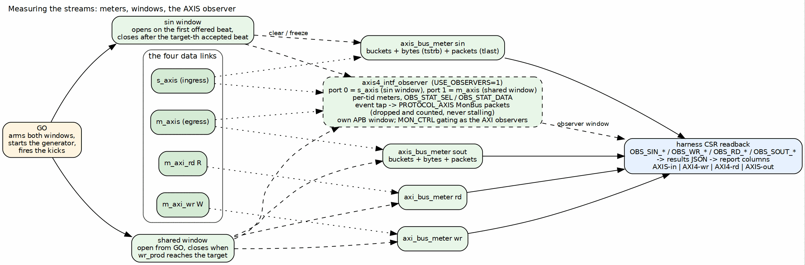

<!-- RTL Design Sherpa Documentation Header -->
<table>
<tr>
<td width="80">
  <a href="https://github.com/sean-galloway/RTLDesignSherpa">
    
  </a>
</td>
<td>
  <strong>RTL Design Sherpa</strong> · <em>Learning Hardware Design Through Practice</em><br>
  <sub>
    <a href="https://github.com/sean-galloway/RTLDesignSherpa">GitHub</a> ·
    <a href="https://github.com/sean-galloway/RTLDesignSherpa/blob/main/docs/DOCUMENTATION_INDEX.md">Documentation Index</a> ·
    <a href="https://github.com/sean-galloway/RTLDesignSherpa/blob/main/LICENSE">MIT License</a>
  </sub>
</td>
</tr>
</table>

---

<!-- End Header -->

# Measuring a Stream

### Figure 4.1: Meters, windows and observers on the stream side



**Source:** [03_axis_measurement.dot](../assets/graphviz/03_axis_measurement.dot)

## The AXIS meters

`axis_bus_meter` is the AXIS analogue of `axi_bus_meter`, one instance per
stream, snooping `tvalid`, `tready`, `tlast`, `tstrb` and `tid` and driving
nothing. Every cycle of its window goes into one bucket:

| `tvalid` | `tready` | Bucket | Meaning |
|:--------:|:--------:|--------|---------|
| 1 | 1 | productive | a beat transferred |
| 1 | 0 | backpressure | the master wants to send, the slave stalls |
| 0 | 1 | starvation | the slave is ready, the master is not producing |
| 0 | 0 | idle | both quiet |

: Table 4.1: The cycle classification, shared with the AXI meters

On top of the buckets the AXIS meter counts what an AXI meter cannot: the
exact number of payload bytes moved, as the popcount of `tstrb` on each
productive beat, and packets, as `tlast` handshakes. Those two are
window-independent, so a throughput computed from bytes over busy time is
robust to the idle and backpressure padding that distorts a pure cycle
utilization when a window is held open too long. The host reports both:
utilization from the buckets and the byte-derived figure beside it.

## The ingress window is its own

Every AXI-side meter and the egress meter share one window: armed at GO,
closed the cycle after the write beat count reaches the staged target. For
the ingress stream that definition measured the wrong thing. The stream
starts at the kick, before the sink's write side is busy, and after the last
beat is accepted the ingress sits ready and idle while the sink drains to
memory, about 200 cycles on the board regardless of transfer size. With the
shared window, ingress starvation was a constant, ingress utilization was
the minimum of the direction on nearly every row, and the reported sink
throughput was launch latency, not datapath rate (rapids ISSUE-001).

So `sin` has its own window. It arms at GO, opens on the first cycle the
generator offers `tvalid` (a sink not yet ready then shows as backpressure,
which is ingress behaviour), and closes the cycle after the target-th
ingress beat is accepted: first beat to last beat, which is what ingress
utilization means. The open is combinational so that first handshake is
counted rather than lost to a register delay; the close falls back to the
shared window when no target is staged. The AXIS observer's port 0 uses the
same window, so the bare meter and the observer agree to the beat.

### Figure 4.2: The ingress window, before and after

```wavedrom
{ "signal": [
  { "name": "GO",              "wave": "010......|..." },
  { "name": "s_axis_tvalid",   "wave": "0..1.....|10." },
  { "name": "s_axis_tready",   "wave": "0..1.0.1.|1.." },
  { "name": "shared window",   "wave": "01.......|..0", "node": ".a...........b" },
  { "name": "sin window",      "wave": "0..1.....|.0.", "node": "...c.......d" },
  {},
  { "name": "wr_prod",         "wave": "=....=...|=.=", "data": ["0","...","target-1","target"] }
],
  "edge": [ "a~>b  arm at GO, close on wr_prod == target", "c~>d  first offered beat to last accepted beat" ],
  "head": { "text": "Ingress window: shared (ISSUE-001) versus its own", "tick": 0 }
}
```

## What the report reads from them

| Column | Meter | Window |
|--------|-------|--------|
| AXIS-in (`sin`) | `axis_bus_meter` on `s_axis` | its own: first offered beat to last accepted beat |
| AXI4-wr (`wr`) | `axi_bus_meter` on `m_axi_wr` W | shared |
| AXI4-rd (`rd`) | `axi_bus_meter` on `m_axi_rd` R | shared |
| AXIS-out (`sout`) | `axis_bus_meter` on `m_axis` | shared |

: Table 4.2: The four columns

The one AXIS-specific residue in the headline rows is on `sin`: a single
starvation cycle, the registered close landing one cycle after the last
accepted beat, and on the 4 KB build the fixed 82-cycle fill stall as
backpressure. Everything else on the stream side reads at line rate once
transfers are descriptor-sized.

## The AXIS observer

`axis4_intf_observer` (`USE_OBSERVERS=1`) is the AXIS sibling of the AXI
interface observers: the same APB window layout, the same register map, the
same MonBus egress and telemetry readback, so one host decoder serves all
three and the report generator runs unchanged on STREAM's harness and on
this one. The harness instantiates it with two ports, port 0 on `s_axis`
and port 1 on `m_axis`, every pin an input, both halves of the handshake
included: attaching it cannot change the stream it measures.

Per port it builds an `axis_bus_meter` of its own with per-`tid` channel
attribution, read through `OBS_STAT_SEL` and `OBS_STAT_DATA`, and an event
tap that emits `PROTOCOL_AXIS` MonBus packets. There is no AXIS monitor in
the AMBA monitor library, so the tap was written in the monitor-lite's
discipline: no CAM, no timer pool, stamps rather than counters, and an
event the MonBus cannot take is dropped and counted (`OBS_STICKY.TAP_BLOCKED`)
rather than allowed to stall anything.

| Class | Event | Fires when |
|-------|-------|------------|
| Error | `VALID_TIMING` | `tvalid` dropped before `tready` accepted |
| Error | `STRB_INVALID` | a beat handshook with `tstrb` all zero |
| Timeout | `HANDSHAKE`, `PACKET` | a stall, or an in-packet gap, reached `MON_TIMEOUT` |
| Completion | `STREAM_END` | `tlast` handshook |
| Credit | `BACKPRESSURE` | a stall reached `MON_LATENCY` cycles (there is no Threshold class for AXIS) |
| Channel | `ID_CHANGE`, `DEST_CHANGE` | `tid` or `tdest` changed inside a packet |
| Stream | `START`, `PAUSE`, `RESUME` | first beat of a packet; `tvalid` dropped or returned mid-packet |

: Table 4.3: The AXIS tap's packet vocabulary

Runtime gating reuses `MON_CTRL` bit for bit with the AXI observers, the
address-range checker is inert because a stream has no address, and
`OBS_ENABLE_MON_TAPS` decides at build time whether the tap logic exists at
all; the meters and the histograms count without it.

What the observers add over the bare meters, measured: the same utilization
numbers to the beat, plus exact bytes and packets per port with per-`tid`
attribution, the tap's own packet count as a cross-check, and a sticky bit
that says when a number undercounts (report section 7.6). What they cost:
the observers build closes at less margin than the bare build, and that
difference is the instrument's price, not the datapath's.
