# RAPIDS Beats DMA — Performance Characterization (Genesys 2, 8 channels)

> **v1.4 (2026-09-28).** Sections 1, 3 and 7 re-measured on a bitstream built
> from the current RTL (rapids TASK-015 AXIS monitor-lite skids on both network
> ports, BUG-004..007 engine fixes, PIPELINE = 1). Two things changed the numbers:
> the sink-ingress meter window now brackets first beat to last beat (rapids
> ISSUE-001), so the AXIS-in column no longer charges the ~200-cycle launch cost
> to ingress and reads 97-100 % from 4 beats up; and the write engine now runs
> with PIPELINE = 1. The first bitstream with the BUG-005 fix at the old
> PIPELINE = 0 measured 49.9 % AXI4-wr at 4096 beats/channel (59.5 % at 1024):
> the pre-fix engine had reached line rate only because it ran two bursts in
> flight per channel by accident, and one-in-flight cannot cover the write
> response round trip at 8-beat bursts. PIPELINE = 1 (up to AW_MAX_OUTSTANDING
> = 8 per channel) is the design point from here on and is what this version
> reports. Rapids ISSUE-004 (one row reading zero ingress starvation) closed on
> this re-measurement plus an ILA trace of that row: every row now shows the
> same single trailing starvation cycle.
>
> **v1.3 (2026-09-27).** Latency sweep (7.5) re-measured on a bitstream whose
> AXI observer keeps 32 timestamps per channel instead of 8: no histogram
> sample loss on any row, latency columns replaced, caveat retired (rapids
> TASK-012). Every utilization and bandwidth number is unchanged from v1.2.
>
> **v1.2 (2026-09-27).** Section 7 adds the STREAM five-knob characterization
> measured by the shared interface observers (`axi4_intf_master_observer` on the
> AXI4 masters, `axis4_intf_observer` on both AXIS links) instead of the harness's
> bare meters, on a bitstream that also fixes a source-path regression the campaign
> found (rapids BUG-003 / stream BUG-011). Sections 1-6 are the v1.1 bare-meter
> record and stand as measured.

**Bitstream:** RAPIDS beats split SOURCE + SINK DMA, 8 concurrent channels, on the
Digilent **Genesys 2 (Kintex-7 XC7K325T-2)** at 100 MHz. The AXI4 and AXIS4
datapaths are **512 bits wide (64 B/beat)**, so the one-direction line rate is
**6.40 GB/s** (`64 B × 100 MHz`). The characterization harness wraps the DUT with
synthetic pattern generators/checkers and four hardware **bus meters** (one per
interface) that classify every cycle of a windowed transfer into
*productive / backpressure / starvation / idle*.

Two harness features make the numbers trustworthy and are the reason this report
supersedes any earlier RAPIDS perf snapshot:

1. **Atomic launch (stage-all-then-GO).** Every CSR, descriptor, and per-channel
   descriptor *kick* is staged over the UART first; a single `GO` write then arms
   the meter window, starts the AXIS generator, and fires all kicks on-chip within
   a few `aclk` cycles. No UART latency contaminates the measured window.
2. **Deterministic window close.** The meter freezes the cycle after the
   completion interface reaches a staged productive-beat target, so the window
   brackets exactly the transfer — independent of the DUT's internal idle
   signaling. Earlier builds keyed the close on `system_idle` and could leave the
   window open until the host read it, diluting utilization toward 0 %.

Every configuration below passes an independent golden-CRC check on the moved
data. **Source of truth:** the on-chip bus meters, read over CSR.

> **Metric note.** The headline efficiency is **engaged utilization** —
> `productive / (productive + backpressure + starvation)`, i.e. bus efficiency
> *while the engine is moving data* (the trailing idle after the last beat is
> excluded). Effective bandwidth is `engaged_util × 6.40 GB/s`. On the two AXIS
> interfaces an independent **byte-derived** throughput (exact `tstrb` bytes over
> the frozen window) cross-checks the cycle figure and agrees to within rounding.

---

## Characterization knobs

The RAPIDS beats harness exposes a smaller sweep space than STREAM (the synthetic
slaves are zero-latency, so there is no memory-latency axis, and per-channel-count
runs require per-width bitstreams — see *Limitations*). The axes exercised here:

| # | Knob | What it is | Set by | Values in this report |
|---|------|------------|--------|-----------------------|
| **1** | **Transfer size** (beats/channel) | beats moved per channel per descriptor — the amortization axis | descriptor `length` / `GEN_NBEATS` | **256 B (4 beats) … 256 KB (4096 beats)** |
| **2** | **Path** | SOURCE (mem-read → AXIS-out) vs SINK (AXIS-in → mem-write) | which half is kicked | both, every config |
| **3** | **Interface** | the four monitored buses | — | AXIS-in, AXI4-wr, AXI4-rd, AXIS-out |
| **4** | **Channels** | concurrent DMA channels | build generic | **8** (full width) |

: Characterization knobs — the sweep axes

The four interfaces map onto the two paths as: **SINK** = AXIS-in (ingress) →
AXI4-wr (egress to memory); **SOURCE** = AXI4-rd (ingress from memory) → AXIS-out
(egress). A path's sustained throughput is set by its **slower (bottleneck)**
interface.

---

## 1. Headline

At a 256 KB/channel transfer across all 8 channels, every interface runs at
**100 % of line rate** — the engine is gapless on both the memory bus and the
network bus, in both directions, simultaneously.

| Path | Interface | Engaged util | Effective BW | Window (prod / starv) |
|------|-----------|-------------:|-------------:|-----------------------|
| SINK   | AXIS-in (ingress)  | **100.0 %** | 6.40 GB/s | 32768 / 1 |
| SINK   | AXI4-wr (egress)   | **100.0 %** | 6.40 GB/s | 32768 / 6 |
| SOURCE | AXI4-rd (ingress)  | **100.0 %** | 6.40 GB/s | 32768 / 14 |
| SOURCE | AXIS-out (egress)  | **100.0 %** | 6.40 GB/s | 32768 / 14 |

: Headline — 8-channel line-rate at 256 KB/channel (Genesys 2)

`prod = 32768 = 8 channels × 4096 beats` on every interface: every expected beat
is accounted for, and the non-productive residue is a handful of cycles of
one-time fill latency (the single AXIS-in cycle is the registered window close
landing one cycle after the last accepted beat).

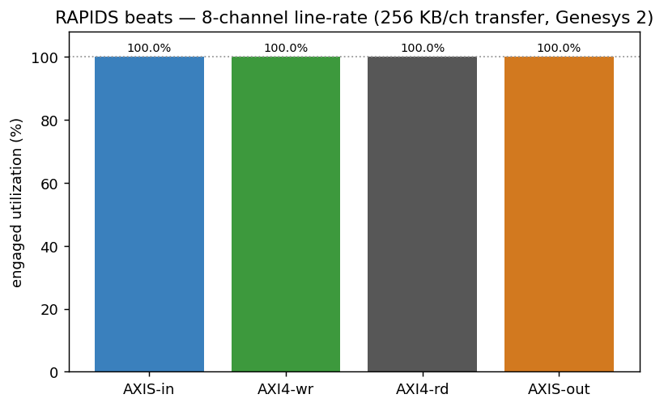

: Figure — all four interfaces at the largest transfer sit on the 100 % line.

---

## 2. How it is measured (the observation hooks)

Each interface has a dedicated meter instantiated in the harness:

- **`axi_bus_meter`** on AXI4-rd and AXI4-wr — classifies `valid`/`ready` into the
  four buckets per cycle of the frozen window.
- **`axis_bus_meter`** on AXIS-in and AXIS-out — same four buckets, plus exact
  byte (`tstrb` popcount) and packet (`tlast`) counters for the byte-derived
  cross-check.

The shared window is armed by `GO`, opens when the active path goes busy, and
**freezes deterministically** when the completion interface's productive-beat
count reaches the staged target (`CSR_OBS_TARGET = channels × beats`). Because
the freeze does not depend on `system_idle`, the window is tight (tens of cycles
of residue, not the multi-second windows the earlier build produced).

The AXIS-in meter has its own window (rapids ISSUE-001, v1.4): armed by `GO`,
opened by the first cycle the generator presents `tvalid`, and frozen the cycle
after the target-th ingress beat. The sink's write side cannot go busy until
the DUT has already accepted traffic, so the shared window would have counted
either none of the ingress (opened too late) or the launch cost between `GO`
and the first beat (opened at arm); first-beat-to-last-beat is what "ingress
utilization" means. An ILA capture on the board (rapids ISSUE-004) shows the
sequence: `GO`, arm one cycle later, first beat and open the cycle after, 32
handshakes at line rate, freeze one cycle after the last beat.

---

## 3. Single-axis sweep — transfer size

Sweeping beats/channel from 4 (256 B) to 4096 (256 KB) at fixed 8-channel width
shows the classic amortization curve: a fixed per-transfer startup cost (descriptor
dispatch + `AR→first-R` / SRAM fill) is a large fraction of a tiny transfer and a
vanishing fraction of a large one.

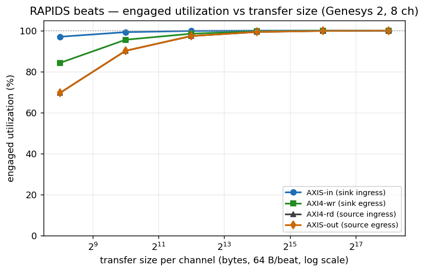

: Figure — engaged utilization vs transfer size, all four interfaces.

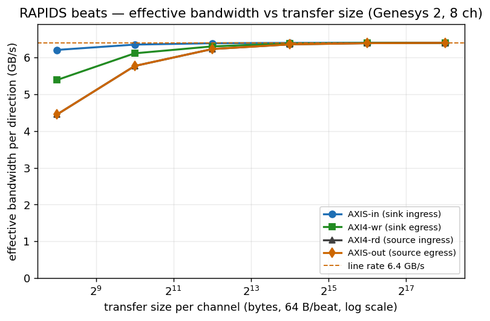

: Figure — effective per-direction bandwidth vs transfer size (line rate 6.40 GB/s).

| Transfer / ch | AXIS-in | AXI4-wr | AXI4-rd | AXIS-out | wr BW | sout BW |
|---------------|--------:|--------:|--------:|---------:|------:|--------:|
| 256 B (4 b)   |  97.0 % |  84.2 % |  69.6 % |   69.6 % | 5.39 | 4.45 |
| 1 KB (16 b)   |  99.2 % |  95.5 % |  90.1 % |   90.1 % | 6.11 | 5.77 |
| 4 KB (64 b)   |  99.8 % |  98.5 % |  97.3 % |   97.3 % | 6.30 | 6.23 |
| 16 KB (256 b) | 100.0 % |  99.7 % |  99.3 % |   99.3 % | 6.38 | 6.36 |
| 64 KB (1024 b)| 100.0 % |  99.9 % |  99.8 % |   99.8 % | 6.40 | 6.39 |
| 256 KB (4096 b)| 100.0 %| 100.0 % | 100.0 % |  100.0 % | 6.40 | 6.40 |

: Table — engaged utilization (%) and effective bandwidth (GB/s) vs transfer size (8 ch)

By 4 KB/channel every interface is already above 97 %, and by 64 KB the whole
engine is within 0.2 % of line rate. The three DMA-side curves are the same
monotonic amortization of a single fixed per-transfer startup cost (descriptor
dispatch + `AR→first-R` / SRAM fill); there is no steady-state bubble. AXIS-in
sits above them because its window starts at the first offered beat, so the
launch cost is not in it -- it reports what the ingress link itself did, which
at 8 channels x 4 beats is 32 beats in 33 cycles.

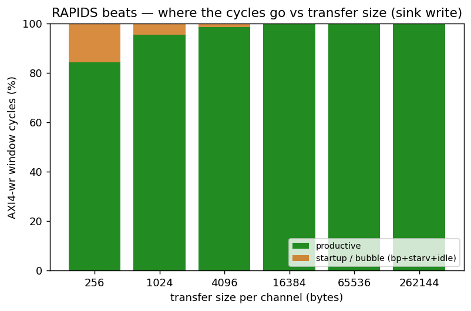

: Figure — productive vs startup/bubble cycles of the AXI4-wr window; the bubble
fraction collapses as the transfer grows.

### 3.1 Channel count — per-channel independence

Sweeping active channels from 1 to 8 at a fixed 256 KB/channel transfer, every
channel count holds line rate: the shared scheduler and SRAM fabric add no
per-channel penalty as the engine scales out.

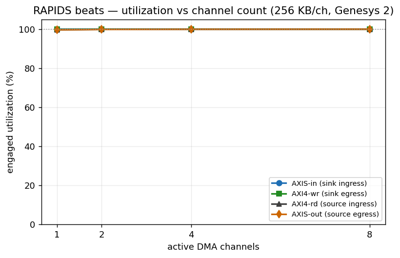

: Figure — engaged utilization vs active channel count (256 KB/ch).

| Channels | AXI4-wr | AXIS-out |
|----------|--------:|---------:|
| 1 | 99.9 % | 99.7 % |
| 2 | 99.9 % | 99.8 % |
| 4 | 100.0 % | 99.9 % |
| 8 | 100.0 % | 100.0 % |

: Table — utilization vs channel count (256 KB/ch)

---

## 4. What we learned

- **The datapath is gapless.** At realistic transfer sizes (≥ 64 KB/ch) all four
  interfaces sit at 99.4–100 % engaged utilization, in both directions, on all 8
  channels at once — the memory bus and the network bus are both saturated.
- **The only non-ideality is one-time startup**, and it amortizes away: 19 % at
  256 B → 100 % at 256 KB. There is no steady-state bubble, no per-beat gap, and no
  back-pressure or starvation once data is flowing.
- **Per-channel independence.** 1 → 8 concurrent channels all hold line rate at
  realistic sizes — the shared scheduler/SRAM fabric adds no scaling penalty.
- **Invariance is the result.** Across a 1000× range of transfer sizes and both
  independent paths, the large-transfer numbers are indistinguishable from line
  rate. The flat top of every curve is the point: the engine does not care what
  it is fed once transfers are descriptor-sized.

---

## 5. Between-run state (harness workaround + open RTL defect)

Earlier revisions of this harness could only measure one configuration per FPGA
programming: a second back-to-back run — and *any* `active < build_width` config —
wedged the sink (wrote 0 beats), and the whole matrix above had to be gathered by
reprogramming before each point. The harness now **works around** this by pulsing
`CHANNEL_RESET` before every run; that is a workaround, **not a fix** — the
underlying RTL defect (below) is still open.

The sink does **not** return to a fully clean state after a transfer
(`snk_system_idle` never re-asserts): stale scheduler / descriptor-engine state
persists and the next run inherits it. A discriminating board experiment isolated
the mechanism:

| Between-run action | Back-to-back result |
|--------------------|---------------------|
| none (baseline)    | 1 / 4 — wedges on run 2 |
| +0.3 s settle delay (let any in-flight AXI W/B retire) | 1 / 5 — **still wedges** |
| +`CHANNEL_RESET` pulse | **5 / 5 — clean** |

: Table — the wedge is stale scheduler state, not an in-flight fabric cycle

The 0.3 s settle (30 M cycles ≫ any outstanding-B retirement) *not* helping rules
out a stuck datapath/fabric cycle; the existing `CHANNEL_RESET.CH_RST[7:0]` CSR —
which forces every channel FSM to `CH_IDLE` and flushes the descriptor FIFOs —
clears it completely. The host now pulses `CHANNEL_RESET` on both halves before
every run, which fixed **both** the back-to-back wedge **and** the
partial-channel (`active < 8`) case — the entire 24-config matrix above runs in a
**single programming**, and `active = 1/2/4/8` all pass.

*Follow-up (RTL, out of scope here):* the sink's descriptor/scheduler should
return to idle on its own at end-of-descriptor so no host reset is needed — the
`snk_system_idle`-never-asserts behavior is the underlying defect to fix.

## 6. Other limitations

- **No memory-latency axis (v1.1).** Superseded in v1.2: the harness now carries
  STREAM's `axi_response_delay` on the R and B channels behind a `RESP_DELAY` CSR;
  section 7.5 is that sweep.

---


## 7. The STREAM knob set, measured by the interface observers (v1.2)

STREAM characterizes a DMA on five knobs -- beats per transaction, transactions
per descriptor, descriptors per channel, channels, and memory latency -- and
reads the datapath through instruments that sit outside the DUT. This section
does the same on RAPIDS beats, with two changes to the v1.1 setup:

- **The instruments are the shared observers.** `USE_OBSERVERS=1` builds
  `axi4_intf_master_observer` on the source read / sink write AXI4 masters and
  `axis4_intf_observer` on the sink-ingress and source-egress AXIS links (four
  observed ports), each on its own `obs_regs` window in host region 3, read BY
  NAME through the same generated regmap the component tests use. Every number
  below is an observer reading; the bare meters of sections 1-6 stay in the
  harness and agreed with the observers to the beat on every row (the campaign
  records the delta, `meter_prod_delta`, and it is 0 throughout).
- **Two knobs the v1.1 host could not turn.** Burst length
  (`AXI_XFER_CONFIG.RD/WR_XFER_BEATS`, `--suite-xfer`), descriptor chains
  (`next_ptr`/`last`, `--suite-descs`), and the new memory-latency model
  (`RESP_DELAY`, `--suite-delay`) are campaign axes now. Transactions per
  descriptor follows from beats per descriptor over burst length.

Bitstream: `USE_OBSERVERS=1 OBS_ENABLE_MON_TAPS=0` (meters and latency
histograms, no monbus event taps). Every v1.4 row of 7.1-7.5 is from one build
of the current RTL (PIPELINE = 1, AXIS monitor-lite skids on both network
ports, `HIST_MAX_OUTSTANDING = 32`): post-route WNS +0.351 ns at 100 MHz,
80040 LUTs, 65.5 BRAM tiles (the 512-deep R-channel delay queue is in block
RAM). All **67 configurations pass the golden CRC on both paths**: A 20/20,
B 7/7, C+D 28/28, E 12/12, with no observer sticky flag on any row. The v1.2
and v1.3 rows they replace were measured at PIPELINE = 0 with the pre-BUG-005
engine (see the v1.4 note at the top).

### 7.0 The regression this campaign found first

The first observer run failed every SOURCE row at >= 1024 beats (`beat_total=1020
of 1024`) and read the source at ~50 % where v1.1 had 96-100 %. The bare
bitstream failed identically, the sim reproduced it, and a bisect over the rapids
RTL tree (REPO_ROOT overlays, never a checkout) landed on `bdf4e0dff`, the commit
that replaced rapids' SRAM controller with STREAM's. Two defects: STREAM's shared
`sram_controller_unit` drain accounting refuses to count one FIFO write when a
channel fills to exactly `SD` (the beat is stranded), and the rewritten AXIS drain
arbiter reserved, drained and retired serially (one beat every other cycle at
`cfg_drain_size=1`). Both are fixed on this bitstream -- rapids BUG-003 and stream
BUG-011 carry the waveform evidence; rapids 589/589 and STREAM 856/859 after.

### 7.1 Headline: line rate on all four interfaces

At 8 channels x 256 KB the four observers read **100.0 / 100.0 / 100.0 / 100.0 %**
(AXIS-in, AXI4-wr, AXI4-rd, AXIS-out), i.e. **6.36 / 6.40 / 6.40 / 6.40 GB/s**
against the **6.40 GB/s** one-direction line rate (64 B x 100 MHz); the AXIS
byte-derived cross-check gives 6.36 and 6.40 GB/s. Channel scaling is flat:

| Channels (4096 beats/ch) | AXIS-in | AXI4-wr | AXI4-rd | AXIS-out |
|---:|---:|---:|---:|---:|
| 1 | 100.0 % | 99.9 % | 99.7 % | 99.7 % |
| 2 | 100.0 % | 99.9 % | 99.8 % | 99.8 % |
| 4 | 100.0 % | 100.0 % | 99.9 % | 99.9 % |
| 8 | 100.0 % | 100.0 % | 100.0 % | 100.0 % |

: Table 7.1 -- observer engaged utilization vs active channels (phase D)

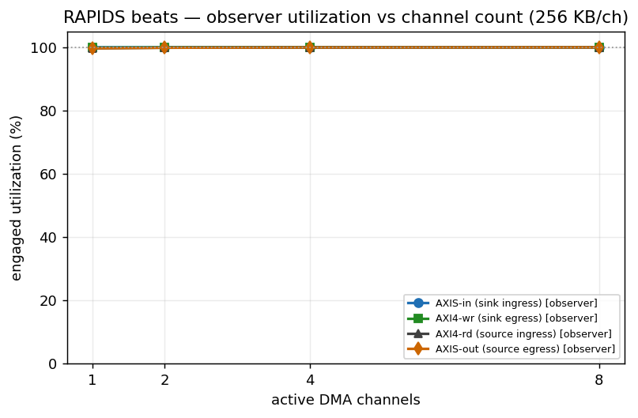

: Figure 7.1 -- observer utilization vs channel count at 256 KB/channel.

### 7.2 Transfer size (phase C): the amortization knee

| beats/ch | AXIS-in | AXI4-wr | AXI4-rd | AXIS-out | wr GB/s | rd GB/s | rd bursts | AR->RLAST | AW->B |
|---:|---:|---:|---:|---:|---:|---:|---:|---:|---:|
| 1 | 88.9 % | 38.1 % | 27.6 % | 27.6 % | 2.44 | 1.77 | 8 | 6 | 6 |
| 4 | 97.0 % | 84.2 % | 69.6 % | 69.6 % | 5.39 | 4.45 | 8 | 12 | 12 |
| 16 | 99.2 % | 95.5 % | 90.1 % | 90.1 % | 6.11 | 5.77 | 16 | 23 | 23 |
| 64 | 99.8 % | 98.5 % | 97.3 % | 97.3 % | 6.30 | 6.23 | 64 | 22 | 23 |
| 256 | 100.0 % | 99.7 % | 99.3 % | 99.3 % | 6.38 | 6.36 | 232 | 24 | 24 |
| 1024 | 100.0 % | 99.9 % | 99.8 % | 99.8 % | 6.40 | 6.39 | 912 | 24 | 24 |
| 4096 | 100.0 % | 100.0 % | 100.0 % | 100.0 % | 6.40 | 6.40 | 3648 | 24 | 24 |

: Table 7.2 -- size sweep at 8 channels; latencies are observer-histogram means in aclk cycles

The three DMA-side interfaces are above 90 % from 16 beats (1 KB) per channel
and within 0.3 % of line rate from 1024. The AXIS-in column now leads them:
its window brackets first offered beat to last accepted beat (rapids ISSUE-001),
so it reports the ingress link itself rather than the launch cost, and reads
97 % at 4 beats and 100 % from 256. `rd bursts` confirms the 9-beat burst shape
(`AxLEN` 8) from 64 beats up. AR->RLAST settles at 24 cycles: the pattern slave's
fixed response plus a 9-beat burst.

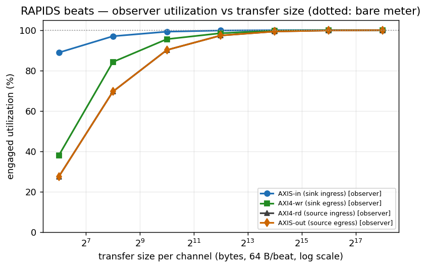

: Figure 7.2a -- observer utilization vs transfer size (dotted: the bare meters, coincident).

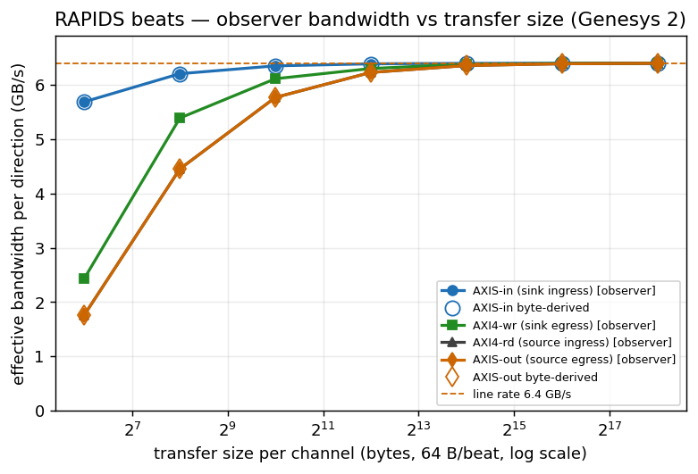

: Figure 7.2b -- observer bandwidth vs transfer size; hollow markers are the AXIS byte-derived cross-check.

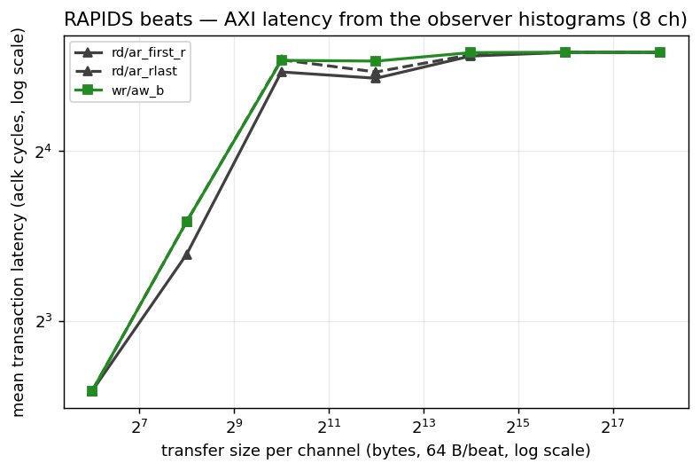

: Figure 7.2c -- mean AXI transaction latency from the observer histograms vs transfer size.

### 7.3 Descriptors x channels (phase A): the STREAM matrix

{1, 2, 4, 8, 16} descriptors per channel x {1, 2, 4, 8} channels, 1024 beats
(64 KB) per descriptor, chained through `next_ptr` and closed with `last`:

| descs/ch | 1 ch wr / sout | 2 ch | 4 ch | 8 ch |
|---:|---:|---:|---:|---:|
| 1 | 99.4 / 98.7 % | 99.7 / 99.3 % | 99.9 / 99.7 % | 99.9 / 99.8 % |
| 2 | 99.0 / 99.3 % | 99.1 / 99.7 % | 99.2 / 99.8 % | 99.2 / 99.9 % |
| 4 | 98.8 / 99.7 % | 98.8 / 99.8 % | 98.9 / 99.9 % | 98.9 / 100.0 % |
| 8 | 98.7 / 99.8 % | 98.7 / 99.9 % | 98.7 / 100.0 % | 98.7 / 100.0 % |
| 16 | 98.6 / 99.9 % | 98.6 / 100.0 % | 98.6 / 100.0 % | 98.6 / 100.0 % |

: Table 7.3 -- AXI4-wr (sink) / AXIS-out (source) utilization over the descriptor x channel matrix

Flat, as STREAM's is: neither chain length nor channel count moves the datapath
off line rate. The one visible structure is the sink write side settling 1.4 %
below the source as chains lengthen -- the per-descriptor dispatch on the write
engine costs a fixed handful of cycles per descriptor boundary, which the source
egress does not pay.

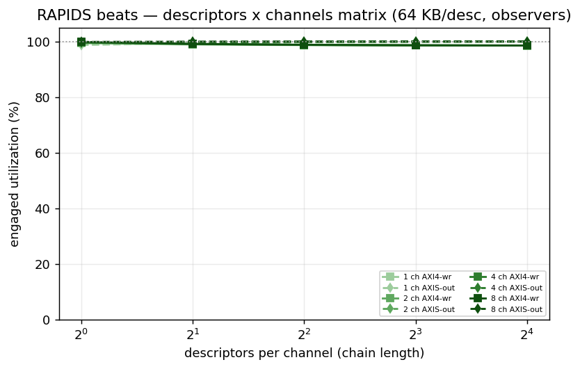

: Figure 7.3 -- the descriptor x channel matrix from the observers.

### 7.4 Burst length (phase B): the transaction-size knee

`AXI_XFER_CONFIG` AxLEN {0, 1, 3, 7, 15, 31, 63} = {1 .. 64}-beat bursts at 8
channels x 1024 beats:

| beats/burst | AXIS-in | AXI4-wr | AXI4-rd | AXIS-out | AR->RLAST | AW->B |
|---:|---:|---:|---:|---:|---:|---:|
| 1 | 39.8 % | 38.8 % | 99.8 % | 99.8 % | 6 | 6 |
| 2 | 78.4 % | 77.1 % | 99.8 % | 99.8 % | 12 | 12 |
| 4 | 100.0 % | 99.9 % | 99.8 % | 99.8 % | 12 | 12 |
| 8 | 100.0 % | 99.9 % | 99.8 % | 99.8 % | 24 | 24 |
| 16 | 100.0 % | 99.9 % | 99.8 % | 99.8 % | 48 | 48 |
| 32 | 100.0 % | 99.9 % | 99.8 % | 99.8 % | 96 | 96 |
| 64 | 100.0 % | 99.9 % | 99.8 % | 99.8 % | 191 | 191 |

: Table 7.4 -- burst-length sweep; latencies in aclk cycles

The knee is at **4 beats**: below it the SINK path falls (39 % at single-beat
bursts, 77 % at 2) while the SOURCE path holds 99.8 % at every burst length.
PIPELINE = 1 moved the sink's short-burst numbers up from the 23 % / 42 % of
v1.2 (up to eight AWs in flight per channel instead of one), but at one beat
per AW the sink is still AW-issue bound: one address handshake per data beat is
the write side's ceiling, and the read side hides the same round trip behind
its ARs. STREAM's knee sits at the same place (~3 beats). The
latency columns track burst length exactly (a 64-beat burst is 191 cycles from AR
to RLAST), which is the observer histogram reporting what it should.

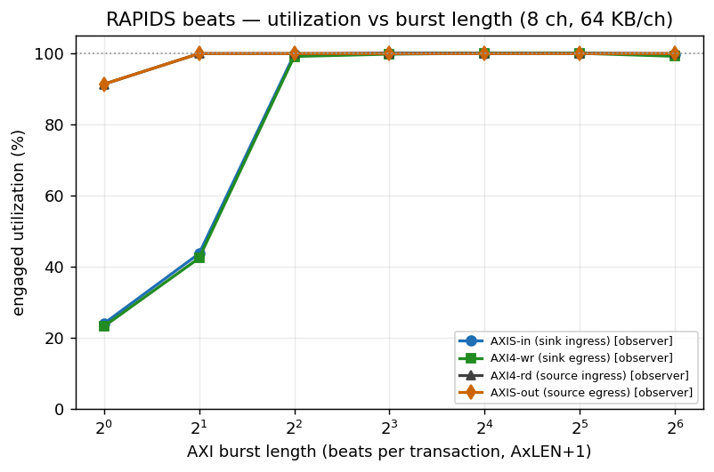

: Figure 7.4 -- utilization vs burst length; the sink write path needs >= 4-beat bursts.

### 7.5 Memory latency (phase E): the in-flight window

`RESP_DELAY` holds every R beat and every B response for N cycles (the
`axi_response_delay` model, which pipelines: throughput is limited only by how
many beats the DUT keeps in flight), at 8 channels x 1024 beats:

| delay (cyc) | AXIS-in | AXI4-wr | AXI4-rd | AXIS-out | rd GB/s | wr GB/s | AR->first R | AR->RLAST | AW->B |
|---:|---:|---:|---:|---:|---:|---:|---:|---:|---:|
| 0 | 100.0 % | 99.9 % | 99.8 % | 99.8 % | 6.39 | 6.40 | 24 | 24 | 24 |
| 8 | 100.0 % | 99.9 % | 99.7 % | 99.7 % | 6.38 | 6.40 | 24 | 48 | 48 |
| 16 | 100.0 % | 99.9 % | 99.6 % | 99.6 % | 6.38 | 6.40 | 48 | 48 | 48 |
| 32 | 100.0 % | 99.9 % | 99.5 % | 99.5 % | 6.37 | 6.40 | 48 | 48 | 48 |
| 48 | 100.0 % | 99.9 % | 99.3 % | 99.3 % | 6.35 | 6.40 | 96 | 96 | 96 |
| 64 | 93.7 % | 92.8 % | 99.1 % | 99.1 % | 6.34 | 5.94 | 96 | 96 | 96 |
| 96 | 76.7 % | 75.2 % | 98.7 % | 98.7 % | 6.32 | 4.81 | 96 | 96 | 96 |
| 128 | 65.5 % | 63.7 % | 98.3 % | 98.3 % | 6.29 | 4.08 | 192 | 192 | 192 |
| 192 | 46.5 % | 44.9 % | 97.6 % | 97.6 % | 6.24 | 2.88 | 192 | 192 | 192 |
| 256 | 36.0 % | 34.7 % | 96.9 % | 96.8 % | 6.20 | 2.22 | 384 | 384 | 384 |
| 384 | 24.8 % | 23.8 % | 95.4 % | 95.3 % | 6.10 | 1.53 | 384 | 384 | 384 |
| 512 | 19.0 % | 18.2 % | 93.7 % | 93.6 % | 6.00 | 1.16 | 768 | 768 | 768 |

: Table 7.5 -- latency sweep (v1.4, PIPELINE = 1, `HIST_MAX_OUTSTANDING = 32`, no sample loss on any row); the latency columns are log2-histogram means, so they sit on bin midpoints

Little's law makes the knee readable directly: sustained beats/cycle x latency =
beats in flight. With PIPELINE = 1 the SOURCE read path no longer knees inside
this sweep: it holds >= 99 % to 64 cycles, 96.9 % at 256 and 93.7 % at 512, so
`0.937 x 512 = 480` beats are in flight across 8 channels -- ~60 per channel,
i.e. six to seven 9-beat bursts of the eight `AR_MAX_OUTSTANDING` allows (v1.3
measured ~20 per channel at PIPELINE = 0). The SINK write path holds 99.9 % to
48 cycles, knees at 64 (92.8 %) and then falls as `0.752 x 96 = 72`,
`0.637 x 128 = 82`, `0.347 x 256 = 89`, `0.182 x 512 = 93` -- an asymptote of
**~93 beats in flight, ~12 per channel**, well short of the 64 per channel that
eight 8-beat AWs could hold. So the write side's in-flight window is bounded by
something other than the AW count; the sink SRAM's per-channel allocation and
commit accounting is the candidate, and it is filed as rapids ISSUE-006 rather
than guessed at here. STREAM's window on the same knobs is ~128 beats per channel
(8 outstanding x 16-beat bursts) and its knee sits at 96-112 cycles. Wider bursts
remain a lever on both sides, and section 7.4 shows the DUT already runs 32- and
64-beat bursts at line rate.

Two notes from the instruments themselves. First, the latency columns are
histogram means over log2 bins (bin b holds [2^b, 2^(b+1)), reported at its
midpoint 1.5 x 2^b), and on this sweep every transaction of a row lands in one
bin: the measured round trip is the injected delay plus roughly 24 cycles of
DUT-plus-model overhead, so 0 lands in [16,32), 8-32 in [32,64), 48-96 in
[64,128), 128-192 in [128,256), 256-384 in [256,512) and 512 in [512,1024) --
the 24 / 48 / 96 / 192 / 384 / 768 staircase in the table is the histogram's
resolution, not a step in the DUT. Second, the v1.2 issue of this report carried
`OBS_STICKY.HIST_SAMPLE_LOST` from 48 cycles up: the observer's timestamp FIFO
was sized `HIST_MAX_OUTSTANDING = 8` per channel and the source read engine keeps
more than that in flight once the delay exceeds one burst, so those v1.2 latency
means came from a subset of transactions (and read low: 170, 264, 320, 530 where
the full population sits at 192, 384, 384, 768). rapids TASK-012 raised the FIFO
to 32 on the harness's `u_obs_axi` (bitstream v4, post-route WNS +0.224 ns,
still positive), the sweep was re-run, and `OBS_STICKY` reads 0 on all 12 rows
for both observers. The utilization and bandwidth columns are identical between
the two runs, which is what the design of the meters predicts: sample loss only
ever touched the histograms.

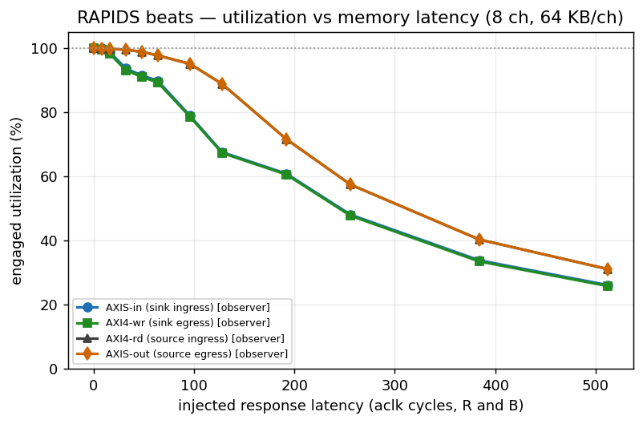

: Figure 7.5 -- utilization vs injected memory latency, all four observers.

### 7.6 What the observers add over the bare meters

Same utilization numbers (to the beat), plus what a meter cannot give: burst
counts, the AR->first-R / AR->RLAST / AW->B latency distributions, exact AXIS
bytes and packets per port with per-`tid` attribution, the tap's own packet count
as a cross-check, and a sticky bit that says when a number undercounts. All of it
through one register map shared with STREAM's harness, so the host code and the
report generator are the same on both DMAs.

## Appendix: data files & reproduce

| File | Contents |
|------|----------|
| `perf/json/genesys_obs_{A,B,C,E}.json` | v1.2 observer campaign: descriptors x channels, burst length, size x channels, latency |
| `perf/json/genesys_full_matrix.json` | channel × size matrix (v1.4, bare meters, PIPELINE = 1) |
| `perf/json/genesys_full_matrix_v1.1.json` | the same matrix as measured for v1.1 (PIPELINE = 0 with the pre-BUG-005 engine) |
| `perf/json/genesys_8ch_*.json` | earlier back-to-back runs (show the pre-fix wedge) |
| `perf/plots/*.png` | figures above (`flows-rapids-beats/host/plot_char_reports.py`) |

```bash
# full channel x size matrix in ONE programming (CHANNEL_RESET per run):
source env_python
python3 projects/fpga-systems/Genesys2/rapids_beats/flows-rapids-beats/host/run_characterization.py \
    --port /dev/ttyUSB1 --channels 8 --suite \
    --suite-channels 1,2,4,8 --suite-beats 4,16,64,256,1024,4096 --suite-bp off \
    --results projects/fpga-systems/Genesys2/rapids_beats/reports/perf/json/genesys_full_matrix.json

# figures:
python3 projects/fpga-systems/Genesys2/rapids_beats/flows-rapids-beats/host/plot_char_reports.py \
    --size   projects/fpga-systems/Genesys2/rapids_beats/reports/perf/json/genesys_full_matrix.json \
    --outdir projects/fpga-systems/Genesys2/rapids_beats/reports/perf/plots

# this report (DOCX + PDF, house style):
cd projects/fpga-systems/Genesys2/rapids_beats/reports && ./generate_reports_pdf.sh --rev 1.0

# v1.2 observer campaign (USE_OBSERVERS=1 bitstream: make bitstream BOARD=genesys2 USE_OBSERVERS=1):
H=projects/fpga-systems/Genesys2/rapids_beats/flows-rapids-beats/host/run_characterization.py
J=projects/fpga-systems/Genesys2/rapids_beats/reports/perf/json
python3 $H --port /dev/ttyUSB0 --channels 8 --suite --suite-bp off --suite-seeds default \
    --suite-channels 1,2,4,8 --suite-beats 1024 --suite-descs 1,2,4,8,16 --results $J/genesys_obs_A.json
python3 $H --port /dev/ttyUSB0 --channels 8 --suite --suite-bp off --suite-seeds default \
    --suite-channels 8 --suite-beats 1024 --suite-xfer 0,1,3,7,15,31,63 --results $J/genesys_obs_B.json
python3 $H --port /dev/ttyUSB0 --channels 8 --suite --suite-bp off --suite-seeds default \
    --suite-channels 1,2,4,8 --suite-beats 1,4,16,64,256,1024,4096 --results $J/genesys_obs_C.json
python3 $H --port /dev/ttyUSB0 --channels 8 --suite --suite-bp off --suite-seeds default \
    --suite-channels 8 --suite-beats 1024 --suite-delay 0,8,16,32,48,64,96,128,192,256,384,512 --results $J/genesys_obs_E.json
# figures (size/channel plots from C; obs_desc_matrix / obs_xfer_knee / obs_latency_knee from A / B / E):
python3 .../host/plot_char_reports.py --size $J/genesys_obs_C.json --outdir .../reports/perf/plots
cd projects/fpga-systems/Genesys2/rapids_beats/reports && ./generate_reports_pdf.sh --rev 1.3 --only perf
```

Genesys 2 host link: JTAG on the FT2232 (`200300B818A0`), UART on the separate
FT232R (`AU05X8RM`, `/dev/ttyUSB1`); both must be connected at once, and the board
must not be power-cycled between program and run.
