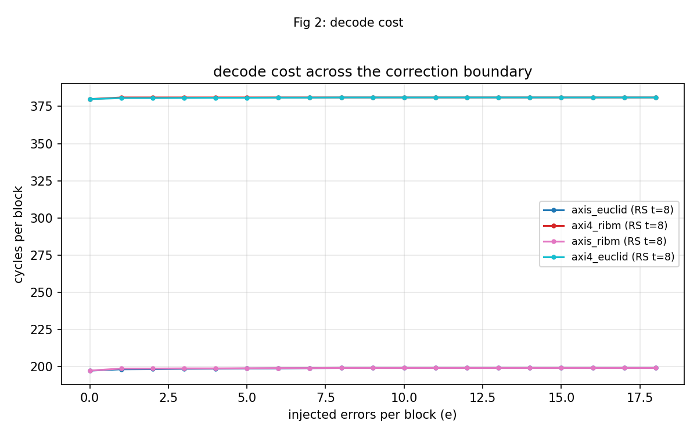
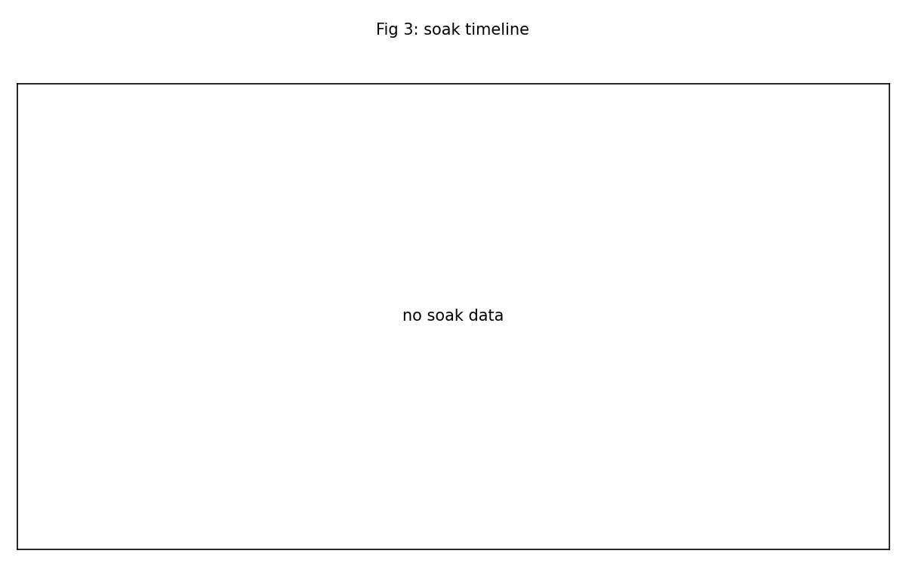
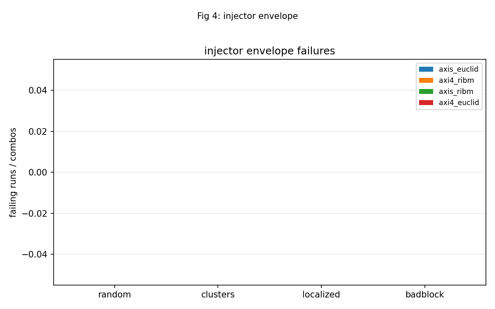

<!-- RTL Design Sherpa Documentation Header -->
<table>
<tr>
<td width="80">
  
</td>
<td>
  <strong>RTL Design Sherpa</strong> · <em>Learning Hardware Design Through Practice</em> 
  
    <a href="https://github.com/sean-galloway/RTLDesignSherpa">GitHub</a> ·
    <a href="https://github.com/sean-galloway/RTLDesignSherpa/blob/main/docs/DOCUMENTATION_INDEX.md">Documentation Index</a> ·
    <a href="https://github.com/sean-galloway/RTLDesignSherpa/blob/main/docs/DOCUMENTATION_INDEX.md">MIT License</a>
  
</td>
</tr>
</table>

---

<!-- End Header -->

# Battery Report — 2026-10-05

Board serial: `200300B818A0`  
Generated: 2026-10-06T00:02:22Z  

## Summary

- Images reported: **4**
- Passed: **4**
- Failed: **0**
- Partial: **0**
- Program failed: **0**

| Image | Codec | Status | Solver | Sequences |
|-------|-------|--------|--------|-----------|
| axis_euclid | RS(252,236) | PASS | Euclid; no comparator, so the B-side counters and CMP_* read 0 by design | badblock=PASS, clusters=PASS, init=PASS, localized=PASS, random=PASS, smoke=PASS, sweep=PASS |
| axi4_ribm | RS(252,236) | PASS | riBM; no comparator, so the B-side counters and CMP_* read 0 by design | badblock=PASS, clusters=PASS, init=PASS, localized=PASS, random=PASS, smoke=PASS, sweep=PASS |
| axis_ribm | RS(252,236) | PASS | riBM; no comparator, so the B-side counters and CMP_* read 0 by design | badblock=PASS, clusters=PASS, init=PASS, localized=PASS, random=PASS, smoke=PASS, sweep=PASS |
| axi4_euclid | RS(252,236) | PASS | Euclid; no comparator, so the B-side counters and CMP_* read 0 by design | badblock=PASS, clusters=PASS, init=PASS, localized=PASS, random=PASS, smoke=PASS, sweep=PASS |

## Per-Image Findings

### axis_euclid

Codec: RS(252,236) t=8 m=8 4 symbols/beat  
Solver/topology: Euclid; no comparator, so the B-side counters and CMP_* read 0 by design  
Overall status: **PASS**  

Smoke results:

| Mode | cyc/blk | Status |
|------|---------|--------|
| bypass | 59.2 | PASS |
| clean | 71.5 | PASS |
| e=8 | 199.2 | PASS |
| e=9 | 199.2 | PASS |
| debug | 72.4 | PASS |

Sweep: 19 error counts from e=0 to e=18.  

Random campaign: 64 runs x 16 blocks; 90 clean / 499 corrected / 435 uncorrectable; 0 failing run(s).  

badblock: 4 combos x 16 blocks; 0 failing combo(s).  

clusters: 4 combos x 16 blocks; 0 failing combo(s).  

localized: 3 combos x 16 blocks; 0 failing combo(s).  

### axi4_ribm

Codec: RS(252,236) t=8 m=8 4 symbols/beat  
Solver/topology: riBM; no comparator, so the B-side counters and CMP_* read 0 by design  
Overall status: **PASS**  

Smoke results:

| Mode | cyc/blk | Status |
|------|---------|--------|
| bypass | 59.2 | PASS |
| clean | 254.0 | PASS |
| e=8 | 381.0 | PASS |
| e=9 | 381.0 | PASS |
| debug | 255.1 | PASS |

Sweep: 19 error counts from e=0 to e=18.  

Random campaign: 64 runs x 16 blocks; 90 clean / 499 corrected / 435 uncorrectable; 0 failing run(s).  

badblock: 4 combos x 16 blocks; 0 failing combo(s).  

clusters: 4 combos x 16 blocks; 0 failing combo(s).  

localized: 3 combos x 16 blocks; 0 failing combo(s).  

### axis_ribm

Codec: RS(252,236) t=8 m=8 4 symbols/beat  
Solver/topology: riBM; no comparator, so the B-side counters and CMP_* read 0 by design  
Overall status: **PASS**  

Smoke results:

| Mode | cyc/blk | Status |
|------|---------|--------|
| bypass | 59.2 | PASS |
| clean | 71.5 | PASS |
| e=8 | 199.2 | PASS |
| e=9 | 199.2 | PASS |
| debug | 72.8 | PASS |

Sweep: 19 error counts from e=0 to e=18.  

Random campaign: 64 runs x 16 blocks; 90 clean / 499 corrected / 435 uncorrectable; 0 failing run(s).  

badblock: 4 combos x 16 blocks; 0 failing combo(s).  

clusters: 4 combos x 16 blocks; 0 failing combo(s).  

localized: 3 combos x 16 blocks; 0 failing combo(s).  

### axi4_euclid

Codec: RS(252,236) t=8 m=8 4 symbols/beat  
Solver/topology: Euclid; no comparator, so the B-side counters and CMP_* read 0 by design  
Overall status: **PASS**  

Smoke results:

| Mode | cyc/blk | Status |
|------|---------|--------|
| bypass | 59.2 | PASS |
| clean | 254.0 | PASS |
| e=8 | 381.0 | PASS |
| e=9 | 381.0 | PASS |
| debug | 254.6 | PASS |

Sweep: 19 error counts from e=0 to e=18.  

Random campaign: 64 runs x 16 blocks; 90 clean / 499 corrected / 435 uncorrectable; 0 failing run(s).  

badblock: 4 combos x 16 blocks; 0 failing combo(s).  

clusters: 4 combos x 16 blocks; 0 failing combo(s).  

localized: 3 combos x 16 blocks; 0 failing combo(s).  

## Figures

## Limits

- No soak campaign data was present in the transcripts.
- Transcript sections that never reached the codec, or were superseded by a richer section from another transcript, were kept out of the figures:
  - `axis_ribm` from `projects/fpga-systems/Genesys2/reed-solomon/stable/results/2026-10-05_battery/logs/battery_2_axi4_ribm.txt` — program failed -- kept section from projects/fpga-systems/Genesys2/reed-solomon/stable/results/2026-10-05_battery/logs/battery_1_axis_euclid.txt
  - `axi4_ribm` from `projects/fpga-systems/Genesys2/reed-solomon/stable/results/2026-10-05_battery/logs/battery_1_axis_euclid.txt` — superseded by richer section -- kept section from projects/fpga-systems/Genesys2/reed-solomon/stable/results/2026-10-05_battery/logs/battery_2_axi4_ribm.txt
  - `axi4_euclid` from `projects/fpga-systems/Genesys2/reed-solomon/stable/results/2026-10-05_battery/logs/battery_2_axi4_ribm.txt` — program failed -- kept section from projects/fpga-systems/Genesys2/reed-solomon/stable/results/2026-10-05_battery/logs/battery_1_axis_euclid.txt
  - `axis_ribm` from `projects/fpga-systems/Genesys2/reed-solomon/stable/results/2026-10-05_battery/logs/battery_1_axis_euclid.txt` — init FAIL -- kept section from projects/fpga-systems/Genesys2/reed-solomon/stable/results/2026-10-05_battery/logs/battery_3_axis_ribm_axi4_euclid.txt
  - `axi4_euclid` from `projects/fpga-systems/Genesys2/reed-solomon/stable/results/2026-10-05_battery/logs/battery_1_axis_euclid.txt` — superseded by richer section -- kept section from projects/fpga-systems/Genesys2/reed-solomon/stable/results/2026-10-05_battery/logs/battery_3_axis_ribm_axi4_euclid.txt
