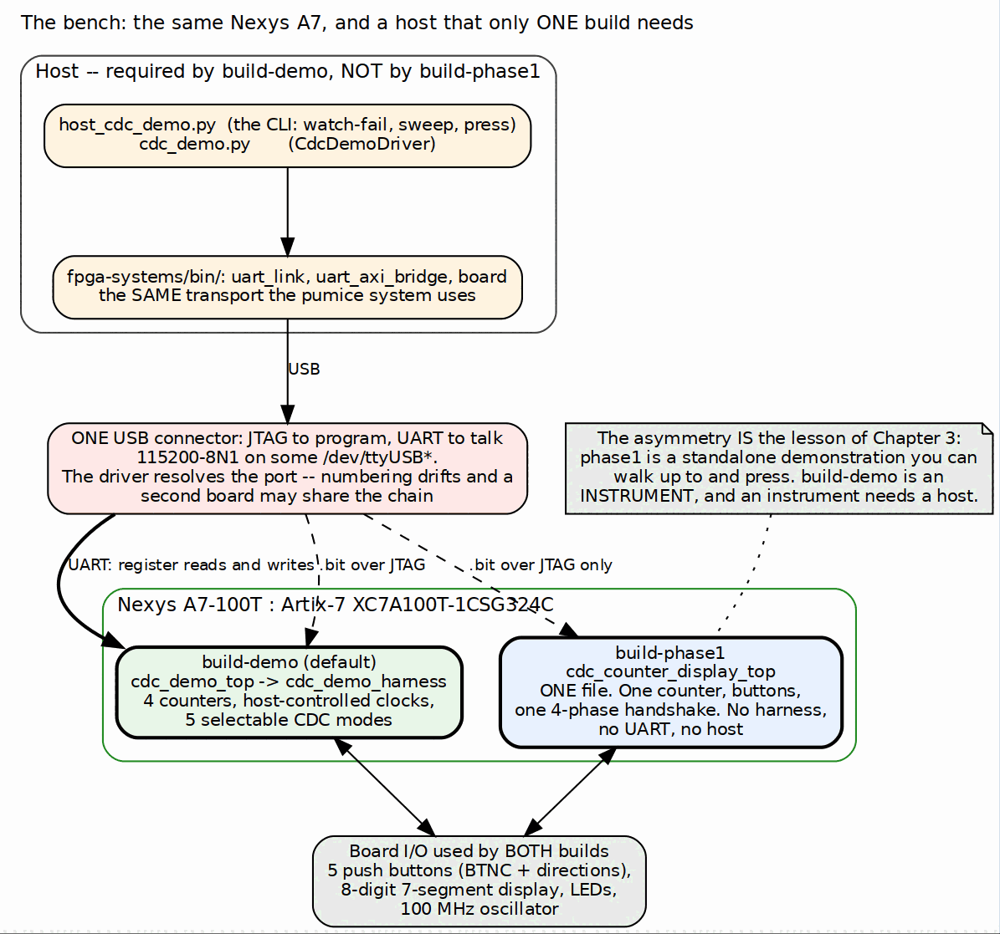

<!-- RTL Design Sherpa Documentation Header -->
<table>
<tr>
<td width="80">
  
</td>
<td>
  <strong>RTL Design Sherpa</strong> · <em>Learning Hardware Design Through Practice</em> 
  
    <a href="https://github.com/sean-galloway/RTLDesignSherpa">GitHub</a> ·
    <a href="https://github.com/sean-galloway/RTLDesignSherpa/blob/main/docs/DOCUMENTATION_INDEX.md">Documentation Index</a> ·
    <a href="https://github.com/sean-galloway/RTLDesignSherpa/blob/main/LICENSE">MIT License</a>
  
</td>
</tr>
</table>

---

<!-- End Header -->

# The System

## What this project is for

This is a teaching instrument. It demonstrates clock domain crossing done
correctly and done incorrectly, on real hardware, with the incorrect version
failing visibly on demand. The thing being demonstrated is a counter whose value
has to cross from its own clock into the clock that drives the display.

That framing matters for the rest of the book, because it makes the *display*
the measuring instrument. There is no CRC and no performance counter here. The
experimental result is what the 7-segment digits show.

### Figure 1.1: The bench

**Source:** [01_board_and_host.dot](../assets/graphviz/01_board_and_host.dot)

## The board

The same Nexys A7-100T as the pumice DDR2 system: Artix-7 XC7A100T-1CSG324C,
one 100 MHz oscillator, one USB connector carrying both the JTAG chain and the
UART. What this project uses that the DDR2 system does not is the human
interface -- five push buttons and the 7-segment display -- and what it does not
use at all is the DDR2 part.

Port discovery is the same problem and has the same answer: the `ttyUSB`
numbering drifts and a second board may share the chain, so the host driver
resolves the port rather than trusting a constant. The driver carries that
comment where the logic lives.

## The asymmetry between the two builds

The one structural fact to take from this chapter is that the two builds are not
two configurations of one design. They are two designs:

| | `build-phase1` | `build-demo` (default) |
|---|---|---|
| Top | `cdc_counter_display_top` | `cdc_demo_top` |
| RTL files in the build | one | three, plus a generated CSR block |
| Counters | one | four, each on its own clock |
| CDC crossings available | one, fixed | five, selectable per counter |
| Host | none -- nothing to drive | required |
| Stimulus | a human pressing BTNC | buttons *or* injected register writes |
| What it shows | a correct crossing working | a correct crossing and a broken one, side by side |

: Table 1.1: The two builds are two designs

`build-phase1` is the original: a debounced button in a 10 Hz domain, a counter,
and a 4-phase handshake carrying the value into a 1 kHz display domain. You walk
up to the board, press a button, and the number goes up. It needs no host
because there is nothing to configure.

`build-demo` is the instrument. It has four counters so that three of them can
be a control group; it has host-settable clocks so a crossing can be pushed
until it breaks; and it has five selectable crossings so the broken one can be
compared against four correct ones without rebuilding.

**Note:** the project Makefile is a dispatcher, not a build. Targets go to
`build-demo` by default and `BUILD=phase1` selects the other. All flow logic
lives in the repo-wide `make/fpga_flow.mk`; the per-build Makefiles set variables
and nothing else. That is why adding a third build would not mean copying a
build system.

## Why a demonstration needs the broken version

A correct CDC is invisible. It works, and a reader learns nothing from watching
it work, because they cannot tell a correct crossing from a lucky one.

The failure is the content. But an unsafe crossing is not reliably broken -- it
is *probabilistically* broken, and at low clock rates it mostly works. A demo
that shows mode 0 at 6 MHz demonstrates that the wrong design is fine, which is
worse than showing nothing. Making the failure appear on demand is the actual
engineering problem this system solves, and Chapter 4 is how.
