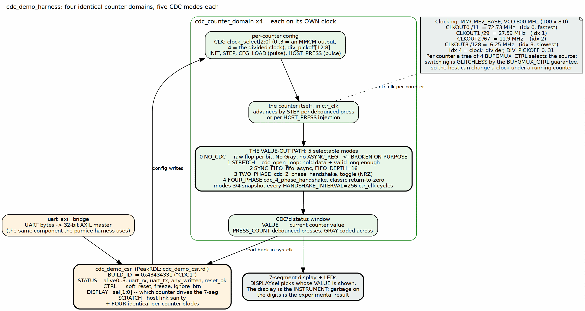

<!-- RTL Design Sherpa Documentation Header -->
<table>
<tr>
<td width="80">
  
</td>
<td>
  <strong>RTL Design Sherpa</strong> · <em>Learning Hardware Design Through Practice</em> 
  
    <a href="https://github.com/sean-galloway/RTLDesignSherpa">GitHub</a> ·
    <a href="https://github.com/sean-galloway/RTLDesignSherpa/blob/main/docs/DOCUMENTATION_INDEX.md">Documentation Index</a> ·
    <a href="https://github.com/sean-galloway/RTLDesignSherpa/blob/main/LICENSE">MIT License</a>
  
</td>
</tr>
</table>

---

<!-- End Header -->

# The Harness

## The shape of it

`cdc_demo_harness` is a UART bridge, a generated CSR block, four identical
counter domains on four different clocks, and a display multiplexer. The host
writes configuration, the counters count, and the crossings under test carry
their values into the system clock where the host and the display can see them.

### Figure 2.1: The harness block map

**Source:** [02_harness_blocks.dot](../assets/graphviz/02_harness_blocks.dot)

## The front end is borrowed, deliberately

`uart_axil_bridge` is the same component the pumice DDR2 harness uses, and the
host-side transport in `projects/fpga-systems/bin/` is the same too. Nothing
about the serial link is specific to CDC.

That reuse is the point: a project whose subject is clock domain crossing should
not also be inventing a serial protocol. It also means the port-discovery and
framing bugs are fixed once, for every board on the bench.

## The global registers

`cdc_demo_csr.rdl` generates the CSR block. The global half is small:

| Register | Fields | Purpose |
|---|---|---|
| `BUILD_ID` | `0x43434331` | ASCII `CDC1`. Proves which bitstream you are talking to |
| `STATUS` | `alive0..3`, `uart_rx`, `uart_tx`, `any_written`, `reset_ok` | liveness per counter, link activity, and whether anything has been configured since reset |
| `CTRL` | `soft_reset`, `freeze`, `ignore_btn` | pulse a reset, stop all counters, or lock out the physical buttons |
| `DISPLAY` | `sel[1:0]` | which counter's value drives the 7-segment display |
| `SCRATCH` | 32 bits | read-write, host link sanity |

: Table 2.1: The global registers

Three of those exist because of specific failure modes at the bench:

- **`BUILD_ID`** -- the cheapest wasted afternoon is measuring a stale
  bitstream. If `CDC1` does not read back, stop.
- **`any_written`** -- distinguishes "the demo is showing defaults" from "the
  demo is showing what I configured". Without it, a host script that silently
  failed to write looks identical to one that worked.
- **`ignore_btn`** -- a physical button press during a scripted sweep is an
  uncontrolled input. `ignore_btn` makes the experiment reproducible by taking
  the human out of it.

`freeze` is the other quiet one: it stops every counter at once so a displayed
value can be read carefully rather than glimpsed.

## The per-counter block, times four

Each of the four counters has an identical register block:

| Register | Fields | Purpose |
|---|---|---|
| `CLK` | `clock_select[2:0]`, `div_pickoff[12:8]` | which clock this counter runs on; `0..3` select an MMCM output, `4` selects the divided clock, and `div_pickoff` then chooses the divisor tap |
| `INIT` | `value[15:0]` | the value `CFG_LOAD` will load |
| `STEP` | `value[15:0]` | how much a press advances the counter |
| `CFG_LOAD` | strobe | pulse: load `INIT` |
| `HOST_PRESS` | strobe | pulse: inject one virtual button press |
| `VALUE` | `value[15:0]` | the counter's current value, **crossed into `sys_clk` by the mode under test** |
| `PRESS_COUNT` | `value[15:0]` | debounced press count, crossed **Gray-coded** |

: Table 2.2: One counter's registers (four identical blocks)

Two design decisions are worth drawing out.

**`STEP` is not always 1.** A counter advancing by 1 changes one or two bits per
press, and a multi-bit crossing hazard needs many bits changing at once to show
itself. A `STEP` that flips several bits at a time makes the failure far more
likely per event, which is the difference between a demo that fails in seconds
and one that fails in an hour.

**`HOST_PRESS` exists so the stimulus is not a finger.** A scripted press is
repeatable, can be issued thousands of times, and can be issued faster than a
human can press. The physical buttons remain for the walk-up demonstration.

**Important:** `VALUE` and `PRESS_COUNT` cross differently on purpose. `VALUE`
crosses by whatever mode is selected -- including the broken one -- while
`PRESS_COUNT` always crosses Gray-coded. During a failure the press count stays
trustworthy while the value does not, and that contrast *within one counter* is
what shows the reader the bug is in the crossing and not in the counting.

## The clock tree

The clocks are the experiment's independent variable, so they are generated
deliberately rather than divided down casually:

| Index | Source | Frequency |
|---|---|---|
| 0 | MMCM `CLKOUT0`, divide 11 | 72.73 MHz (fastest) |
| 1 | MMCM `CLKOUT1`, divide 29 | 27.59 MHz |
| 2 | MMCM `CLKOUT2`, divide 67 | 11.9 MHz |
| 3 | MMCM `CLKOUT3`, divide 128 | 6.25 MHz (slowest MMCM output) |
| 4 | `clock_divider`, `DIV_PICKOFF` 0..31 | host-selectable, the fine-grained sweep |

: Table 2.3: The five clock sources per counter

The MMCM runs at a VCO of 800 MHz from the 100 MHz input with a feedback
multiplier of 8.0 and `DIVCLK_DIVIDE` of 1. The four outputs are chosen to be
mutually unrelated rather than neat multiples: a crossing between clocks with a
simple integer relationship can pass by luck, and luck is exactly what this
project is trying to remove.

**Important:** per counter, a tree of four `BUFGMUX_CTRL` instances selects the
source, and that switching is *glitchless* by the primitive's guarantee. This is
what allows the host to change a counter's clock while it is running, which the
sweep in Chapter 4 depends on. A naive clock mux would produce a runt pulse on
every change and the resulting corruption would be indistinguishable from the CDC
failure being demonstrated -- the apparatus would be generating the result.

## The five crossings

The value-out path is the thing under test, and it is selectable:

| Mode | Name | Implementation | Why it is here |
|---|---|---|---|
| 0 | `NO_CDC` | a raw flop per bit; no Gray, no `ASYNC_REG` | **broken on purpose** -- the demonstration |
| 1 | `STRETCH` | `cdc_open_loop`: source holds data and valid long enough for the destination to sample | the cheapest correct answer when the source can be made to wait |
| 2 | `SYNC_FIFO` | `fifo_async`, `FIFO_DEPTH = 16` | the general answer: every event survives, in order |
| 3 | `TWO_PHASE` | `cdc_2_phase_handshake`, toggle / NRZ | correct, and cheaper per transfer than 4-phase |
| 4 | `FOUR_PHASE` | `cdc_4_phase_handshake`, classic return-to-zero | the conservative textbook crossing; the one `build-phase1` uses |

: Table 2.4: The five value-out crossings

Modes 3 and 4 snapshot the counter every `HANDSHAKE_INTERVAL = 256` counter-clock
cycles. A handshake has a round-trip cost, so it cannot forward every increment;
it forwards a consistent *sample*. That is the right trade for a displayed value
and the wrong one for an event count -- which is why the press count does not use
it.

**Note:** modes 1 through 4 are all correct, and they are not interchangeable.
Their differences are throughput, latency and whether every event or only the
latest value survives. Selecting between four correct answers and seeing that
they all display the same number is a quieter lesson than mode 0, and it is
available in the same bitstream.
