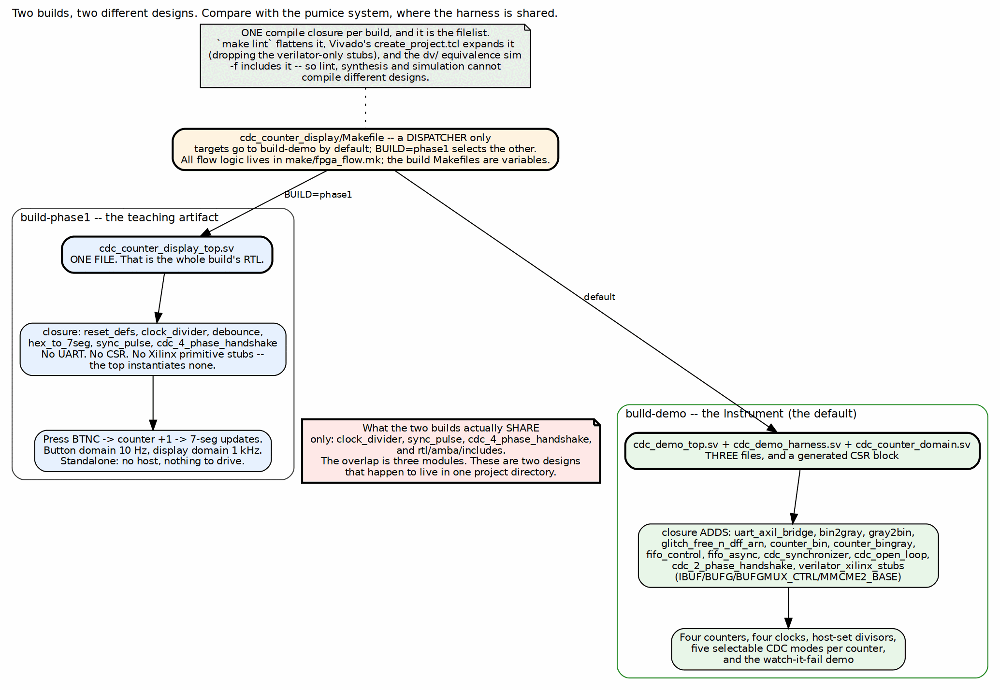

<!-- RTL Design Sherpa Documentation Header -->
<table>
<tr>
<td width="80">
  <a href="https://github.com/sean-galloway/RTLDesignSherpa">
    
  </a>
</td>
<td>
  <strong>RTL Design Sherpa</strong> · <em>Learning Hardware Design Through Practice</em><br>
  <sub>
    <a href="https://github.com/sean-galloway/RTLDesignSherpa">GitHub</a> ·
    <a href="https://github.com/sean-galloway/RTLDesignSherpa/blob/main/docs/DOCUMENTATION_INDEX.md">Documentation Index</a> ·
    <a href="https://github.com/sean-galloway/RTLDesignSherpa/blob/main/LICENSE">MIT License</a>
  </sub>
</td>
</tr>
</table>

---

<!-- End Header -->

# Two Builds, Two Designs

## The short answer, and it is the opposite of the pumice system's

**Yes -- the harness RTL is different per build here, completely.**
`build-phase1` has no harness at all. It is one RTL file with no UART, no CSR
block and no host interface. `build-demo` is three files plus a generated CSR
block, and the dependency closures of the two builds overlap in three modules.

This is worth stating plainly because the other Nexys A7 project answers the same
question the other way. The pumice DDR2 system has *one* harness source that
every one of its five targets compiles; only the DUT, the PHY or the debug cores
change. Both answers are right for their project, and the reason they differ is
the reason this chapter exists.

### Figure 3.1: Two builds, two designs



**Source:** [03_build_variants.dot](../assets/graphviz/03_build_variants.dot)

## What each build actually compiles

| | `build-phase1` | `build-demo` |
|---|---|---|
| Build RTL | `cdc_counter_display_top.sv` | `cdc_demo_top.sv`, `cdc_demo_harness.sv`, `cdc_counter_domain.sv` |
| Generated | none | `cdc_demo_csr` from `cdc_demo_csr.rdl` |
| Repo closure | `reset_defs`, `clock_divider`, `debounce`, `hex_to_7seg`, `sync_pulse`, `cdc_4_phase_handshake` | `uart_axil_bridge`, `bin2gray`, `gray2bin`, `sync_pulse`, `glitch_free_n_dff_arn`, `counter_bin`, `counter_bingray`, `fifo_control`, `fifo_async`, `cdc_synchronizer`, `cdc_open_loop`, `cdc_2_phase_handshake`, `cdc_4_phase_handshake`, `clock_divider` |
| Xilinx primitive stubs | none needed -- the top instantiates none | `IBUF`, `BUFG`, `BUFGMUX_CTRL`, `MMCME2_BASE` |

: Table 3.1: The two compile closures

The shared part is three modules -- `clock_divider`, `sync_pulse` and
`cdc_4_phase_handshake` -- plus the AMBA include directory. Everything else is
disjoint. These are two designs that share a project directory, a board and a
build flow, and nothing else.

## Why that is the right structure here

The pumice system shares its harness because its builds are *the same
experiment on different subjects*: swap pumice for LiteDRAM and the numbers must
stay comparable, so the apparatus must not move. Sharing is what makes the
comparison valid.

Here the two builds are *different experiments*:

- `build-phase1` answers "can a beginner see a correct CDC work on real
  hardware, with nothing but a board and a USB cable for power?" Adding a UART
  harness to it would make it worse. The absence of a host is the feature: there
  is no configuration to get wrong and nothing between the button and the
  display.
- `build-demo` answers "can we make an unsafe CDC fail on demand, visibly, with
  a control group?" That needs four counters, host-settable clocks and selectable
  crossings, none of which phase 1 can express.

Forcing one harness onto both would compromise both: phase 1 would stop being a
standalone artifact, and the demo would inherit constraints from a teaching
example. Keeping them separate costs one extra top-level file and a dispatcher.

**Note:** this is why `build-phase1` is kept rather than deleted as superseded.
It is not an earlier version of `build-demo`; it is the simplest thing that
demonstrates the concept, and that has its own value.

## The dispatcher, and where the flow logic lives

`cdc_counter_display/Makefile` selects a build and does nothing else. Targets go
to `build-demo` by default; `BUILD=phase1` selects the other:

```bash
make bitstream                 # build-demo
make program                   # build-demo
make bitstream BUILD=phase1    # build-phase1
make program   BUILD=phase1
```

All flow logic -- synthesis, programming, lint, cleaning -- lives in the
repo-wide `make/fpga_flow.mk`. The per-build Makefiles set variables only.

That split is what keeps two builds from becoming two build systems. The same
`fpga_flow.mk` drives the pumice builds on this board and the STREAM and RAPIDS
builds on the Genesys 2, so a fix to the flow reaches every project at once.

## One compile closure per build, and it is the filelist

Each build has exactly one filelist, and three different tools consume it:

- `make lint` flattens it;
- Vivado's `create_project.tcl` expands it, dropping the verilator-only
  primitive stubs so synthesis sees the real unisims;
- the `dv/` equivalence simulation `-f` includes it.

**Important:** that is deliberate and it is the whole defence against the
classic FPGA failure of linting one design, simulating a second and synthesizing
a third. Because all three read the same list, they cannot disagree about what
the design is. Both build filelists carry that statement in their header
comment, which is the right place for it -- the next person tempted to add a
source directly to the Vivado project reads why not.

The stub handling is the one subtlety. `verilator_xilinx_stubs` provides `IBUF`,
`BUFG`, `BUFGMUX_CTRL` and `MMCME2_BASE` so that lint and simulation can
elaborate the top. They are guarded by `ifdef VERILATOR` *and* dropped by the
Vivado tcl -- belt and braces, because a stub reaching synthesis would silently
replace a real clock primitive.
