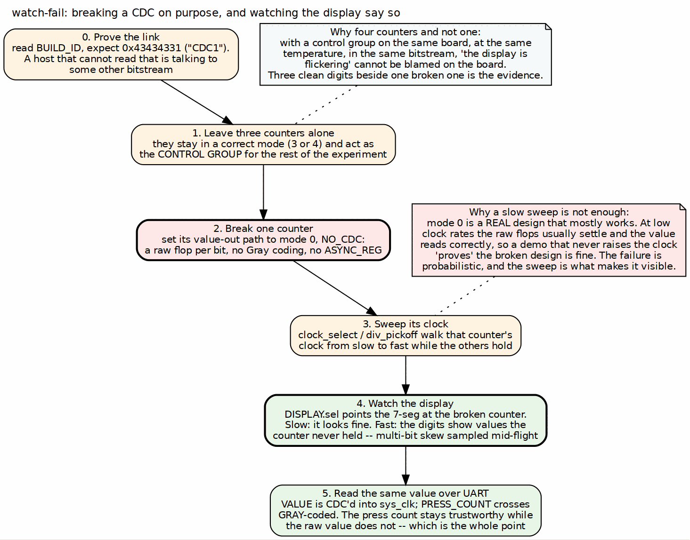

<!-- RTL Design Sherpa Documentation Header -->
<table>
<tr>
<td width="80">
  <a href="https://github.com/sean-galloway/RTLDesignSherpa">
    
  </a>
</td>
<td>
  <strong>RTL Design Sherpa</strong> · <em>Learning Hardware Design Through Practice</em><br>
  <sub>
    <a href="https://github.com/sean-galloway/RTLDesignSherpa">GitHub</a> ·
    <a href="https://github.com/sean-galloway/RTLDesignSherpa/blob/main/docs/DOCUMENTATION_INDEX.md">Documentation Index</a> ·
    <a href="https://github.com/sean-galloway/RTLDesignSherpa/blob/main/LICENSE">MIT License</a>
  </sub>
</td>
</tr>
</table>

---

<!-- End Header -->

# Host Tools and Flow

## The tools

| Program | Role |
|---|---|
| `host_cdc_demo.py` | the CLI: `watch-fail`, sweeps, presses, per-counter configuration |
| `cdc_demo.py` | `CdcDemoDriver` -- the register-level API the CLI drives |
| `fpga-systems/bin/` | `uart_link`, `uart_axi_bridge`, `board` -- the shared transport, identical to the pumice system's |

: Table 4.1: The host tools

The headline invocation is one line:

```bash
make host-cdc_demo ARGS="watch-fail --counter 2"
```

## The watch-fail flow

### Figure 4.1: Breaking a CDC on purpose, and watching the display say so



**Source:** [04_measurement_path.dot](../assets/graphviz/04_measurement_path.dot)

The sequence is: prove the link, leave three counters correct, break one, sweep
its clock, watch the display, and read the same value back over UART. Each step
is there for a reason, and the reasons are the content of this chapter.

## Step 0: prove the link before anything else

Read `BUILD_ID` and expect `0x43434331`. A host that cannot read `CDC1` back is
talking to a different bitstream, and every subsequent observation is fiction.
Then check `any_written` in `STATUS`: it distinguishes a demo showing configured
values from one showing power-on defaults, which look identical on the display.

## Step 1: the control group is not optional

Three counters stay in a correct mode for the whole experiment. This is the step
most likely to be skipped and the one that makes the result mean anything.

Without it, "the display is flickering" has many explanations: a marginal board,
a bad USB cable, a power supply, a timing failure somewhere else entirely, or the
CDC bug being demonstrated. With three correct counters running in the same
bitstream, on the same die, at the same temperature, at the same instant, all of
those explanations are eliminated at once. Three clean digit groups beside one
scrambled group is evidence; one scrambled group alone is an anecdote.

## Step 2: break exactly one thing

Set the chosen counter's value-out path to mode 0, `NO_CDC`: a raw flop per bit,
no Gray coding, no `ASYNC_REG` attribute. Nothing else changes.

It is worth being precise about what is wrong with it. The flops will mostly
settle; the problem is that the counter's bits do not all change at the same
instant, and a destination clock that samples during the transition captures a
mixture of old and new bits. The result is a value the counter never held. With
no Gray coding, a single increment can change many bits, so the window for a
corrupt sample is wide.

## Step 3: the sweep is what makes the failure appear

This is the step that distinguishes a working demonstration from a misleading
one.

**Important:** mode 0 is a real design that mostly works. At 6.25 MHz against a
system clock, the raw flops usually have time to settle and the value reads back
correctly. A demonstration that sets mode 0 and stops has just shown the audience
that the unsafe design is fine -- the most damaging possible outcome for a
teaching tool.

So the host sweeps that counter's clock from slow to fast through
`clock_select` and `div_pickoff`, while the other three hold. The failure is
probabilistic in the ratio of the two clock rates and in how many bits changed,
so the sweep walks the probability up until the failure is continuous and
obvious. This is also why the clock mux has to be glitchless: if changing the
clock itself produced a runt pulse, the sweep would generate corruption
indistinguishable from the corruption being studied.

## Steps 4 and 5: two views of the same failure

The display shows the broken counter's value -- `DISPLAY.sel` points the
7-segment at it -- and at the fast end of the sweep the digits show values the
counter never held.

Reading the same counter over UART adds the part that identifies the bug rather
than just exhibiting it. `VALUE` crosses by the selected (broken) mode;
`PRESS_COUNT` always crosses Gray-coded. During the failure the press count
remains correct while the value does not. The counter is therefore counting
correctly and the crossing is losing information -- which is the conclusion the
demonstration exists to support, and it is visible in two registers of the same
block.

`CTRL.freeze` is useful here: stopping every counter lets a corrupt value be read
carefully instead of glimpsed, and confirms that the corrupt value was *sampled*
rather than merely displayed too briefly to read.

## Reproducibility

Two features exist only to make a scripted run repeatable:

- **`ignore_btn`** locks out the physical buttons, so a bystander pressing BTNC
  cannot perturb a sweep.
- **`HOST_PRESS`** replaces the finger: presses become register writes, issued
  as fast and as often as needed, identically every run.

**Note:** the same discipline that applies to the DDR2 system applies here. A
simulation run against a stale build directory reports success for the previous
design; `make clean-all` before a run whose result you intend to believe. The
`dv/` equivalence simulation shares the build's filelist for exactly this
reason -- so what you simulated is what you will program.
