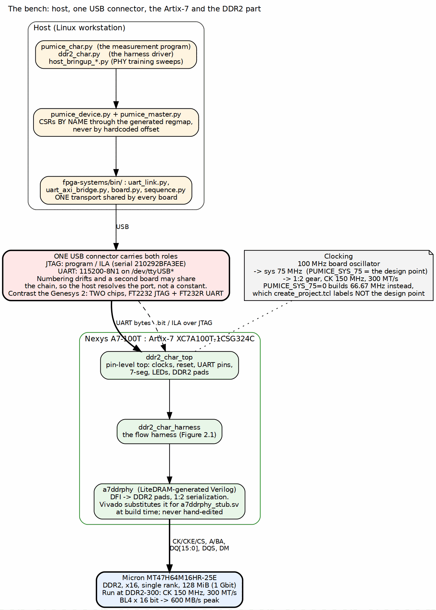

<!-- RTL Design Sherpa Documentation Header -->
<table>
<tr>
<td width="80">
  
</td>
<td>
  <strong>RTL Design Sherpa</strong> · <em>Learning Hardware Design Through Practice</em> 
  
    <a href="https://github.com/sean-galloway/RTLDesignSherpa">GitHub</a> ·
    <a href="https://github.com/sean-galloway/RTLDesignSherpa/blob/main/docs/DOCUMENTATION_INDEX.md">Documentation Index</a> ·
    <a href="https://github.com/sean-galloway/RTLDesignSherpa/blob/main/LICENSE">MIT License</a>
  
</td>
</tr>
</table>

---

<!-- End Header -->

# The System

## What is on the bench

One Nexys A7-100T, one USB cable, one DDR2 part soldered to the board, and a
host program on a Linux workstation. The device under test is the pumice
DDR2/LPDDR2 memory controller; everything else in the bitstream exists to put
traffic through it and count what comes back.

The split matters and this book keeps to it. The controller's architecture --
its AXI front end, its scheduler, its CAMs, its DFI layer -- is the subject of
the pumice HAS and MAS. What follows is the *apparatus*: the part you would
have to rebuild if you wanted to measure some other controller, which is
exactly what the LiteDRAM comparison build does.

### Figure 1.1: The bench

**Source:** [01_board_and_host.dot](../assets/graphviz/01_board_and_host.dot)

## The board and the part

| Item | Value | Source |
|---|---|---|
| Board | Digilent Nexys A7-100T | `projects/fpga-systems/boards/nexys_a7_100t/board_info.md` |
| FPGA | Xilinx Artix-7 XC7A100T-1CSG324C | same |
| Oscillator | 100 MHz, single | same |
| DRAM | Micron MT47H64M16HR-25E, DDR2, x16, single rank, 128 MiB | `ddr2-characterization/README.md` |
| DDR2 banks | Bank 34 at 3.3 V LVCMOS33, Bank 35 at 1.5 V SSTL15 | `board_info.md` |

: Table 1.1: Board and memory device

**Note:** `board_info.md` records the DRAM as "128 Mb", which is the bit count
of the wrong generation of part. `MT47H64M16` is 64 M addresses by 16 bits =
1 Gbit = 128 MiB, which is what the characterization README states and what the
address map assumes. Where the two disagree, the part number wins.

## The single USB connector

One connector does both jobs: it carries the JTAG chain that programs the
device and drives the ILA, and it carries the UART the host talks to. The
practical consequences are what the tooling has to cope with:

- **JTAG is addressed by serial number**, `210292BFA3EE`, because both this
  board and the Genesys 2 sit on the same chain on this bench.
- **The UART is not addressed by a constant.** It appears as some
  `/dev/ttyUSB*`, the numbering drifts between plug-ins, and a second board may
  be present. The host resolves the port rather than hardcoding it; the
  `cdc_demo` driver on the same board carries the same comment for the same
  reason.

This is the one place where the Nexys A7 is simpler than its sibling. The
Genesys 2 needs two chips -- an FT2232 for JTAG and a separate FT232R for the
UART, each enumerating independently -- and its system book has a whole section
on telling them apart.

## The clock chain, and why it fixes every later number

The board has one 100 MHz oscillator. From it the design derives a 75 MHz
system clock and, through a 1:2 gear, a 150 MHz DDR2 clock giving 300 MT/s on
the bus. With BL4 on a 16-bit bus that is:

    300 MT/s x 2 bytes = 600 MB/s theoretical peak

That 600 MB/s is the denominator of every percentage in every findings page.
It is not a target, it is arithmetic; quoting a throughput without it is how a
number stops meaning anything, which is why the house rule is that a bandwidth
table carries the measured figure *and* the peak.

The 75 MHz profile is selected by the `PUMICE_SYS_75` define. It is the design
point, and `build-perf/fpga/tcl/create_project.tcl` says so in as many words --
it prints the frequency profile at build time and labels the alternative,
`PUMICE_SYS_75=0` at 66.67 MHz, as *not* the board design point. A bitstream
built without the define will work and will report lower numbers, and a reader
comparing those against the design-point results would draw a false conclusion.

**Important:** the timing margin at 75 MHz is deliberately thin. A positive
worst-negative-slack of a few tens of picoseconds is the design point being
met, not a near miss -- the most recent measurement build closed at WNS
+0.031 ns. Report the sign and the value; do not "fix" a thin positive margin.

## Where the DUT ends and the harness begins

The boundary is DFI v2.1, and it was chosen so that the same boundary is
exercised in three places: by the DV repo's DFI BFM in simulation, by the
`a7ddrphy_stub` in the harness's own cosim, and by LiteDRAM's real `a7ddrphy`
on the board. Code that passes in cocotb against the BFM should pass on
hardware against the PHY, modulo PHY-side training -- and PHY training is
precisely what Chapter 4's bring-up sweeps exist to settle.

The PHY itself is out of scope for the controller family on purpose. IOB
serdes, bitslip, IDELAY tap calibration: all FPGA-specific, none of it
something a DDR2 controller should own. So the harness reuses LiteDRAM's
`a7ddrphy` verbatim rather than reimplementing it.
