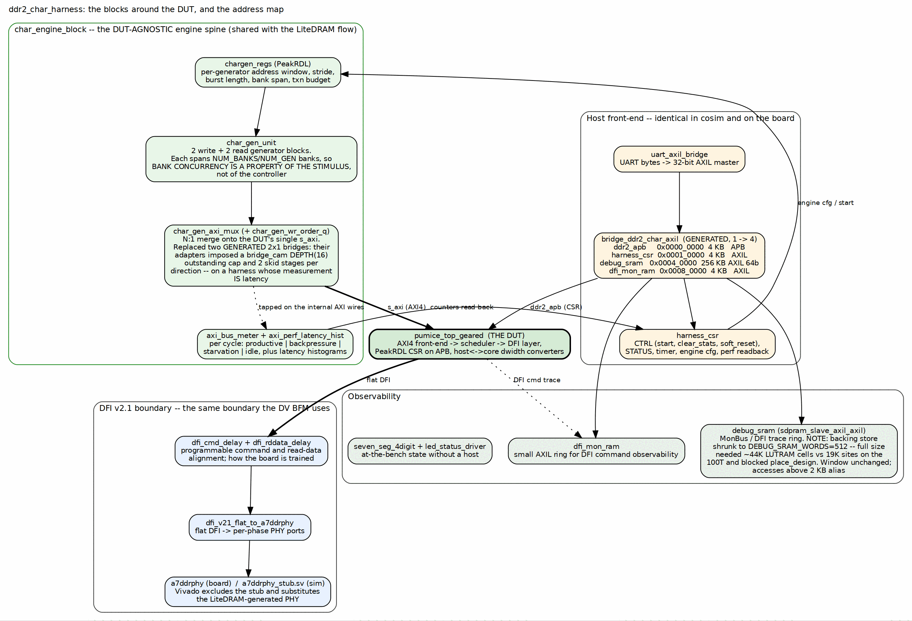

<!-- RTL Design Sherpa Documentation Header -->
<table>
<tr>
<td width="80">
  
</td>
<td>
  <strong>RTL Design Sherpa</strong> · <em>Learning Hardware Design Through Practice</em> 
  
    <a href="https://github.com/sean-galloway/RTLDesignSherpa">GitHub</a> ·
    <a href="https://github.com/sean-galloway/RTLDesignSherpa/blob/main/docs/DOCUMENTATION_INDEX.md">Documentation Index</a> ·
    <a href="https://github.com/sean-galloway/RTLDesignSherpa/blob/main/LICENSE">MIT License</a>
  
</td>
</tr>
</table>

---

<!-- End Header -->

# The Harness

## The shape of it

The harness is a host front-end, a DUT-agnostic engine spine, the DUT, the DFI
tail, and two kinds of observability. Read the figure left to right and the
whole apparatus is one sentence: UART bytes become register writes, register
writes start generators, generators put AXI traffic through the controller,
meters count what the controller did with it, and the host reads the counters
back.

### Figure 2.1: The harness block map

**Source:** [02_harness_blocks.dot](../assets/graphviz/02_harness_blocks.dot)

## The host front-end

`uart_axil_bridge` turns the UART byte stream into a 32-bit AXIL master.
`bridge_ddr2_char_axil` -- a *generated* bridge, from
`ddr2_char_framework/rtl/bridges/configs/bridge_ddr2_char_axil.toml` -- fans
that one master out to four slaves at fixed bases.

| Slave | Base | Size | Protocol | Purpose |
|---|---|---|---|---|
| `ddr2_apb` | `0x0000_0000` | 4 KB | APB | pumice controller CSR (PeakRDL-generated) |
| `harness_csr` | `0x0001_0000` | 4 KB | AXIL | harness control, timer, engine cfg, perf readback |
| `debug_sram` | `0x0004_0000` | 256 KB | AXIL 64b | MonBus / DFI trace ring |
| `dfi_mon_ram` | `0x0008_0000` | 4 KB | AXIL | small ring for DFI command observability |

: Table 2.1: The bridge address map

Two details in that map are deliberate rather than accidental. The 256 KB
`debug_sram` window spans `0x4_0000..0x7_FFFF`, which is why `dfi_mon_ram`
sits at `0x8_0000` and not at `0x5_0000` -- placing it lower would have
overlapped. And the slot at `0x2_0000..0x3_FFFF` is unallocated: it used to
hold a `desc_ram`, which became unnecessary once the pattern-generator engines
covered the workload class the descriptor mode was reserved for.

**Important:** `build-perf/host/ADDRESS_MAP.md` mirrors this decode for
convenience, and says outright that the RTL is authoritative. If the two
disagree, the fix is to the document, not to the hardware.

## harness_csr: the registers that define a run

| Off | Register | R/W | What it does |
|---|---|---|---|
| `0x00` | `CTRL` | RW | `start_wr`, `start_rd`, `clear_stats`, `freeze_trace` (latch), `soft_reset` |
| `0x04` | `STATUS` | R | per-direction done/error, `any_error`, `init_done`, `init_fail` |
| `0x10`/`0x14` | `CRC_EXPECTED` / `CRC_ACTUAL` | R | write-engine expected CRC, read-engine actual CRC |
| `0x18` | `CRC_MATCH` | R | `exp==act`, both valid bits, and `beats_mism != 0` |
| `0x24` | `BEATS_MISM` | R | mismatched beat count from the read engine |
| `0x20` | `BUILD_ID` | R | `0x44445232`, the ASCII `DDR2` -- proves you are talking to this build |
| `0x28`-`0x5C` | timer block | RW/R | 64-bit cycle counter, beat-count stop trigger, and first/last R and W beat stamps |
| `0x60` | `CTRLR_CFG` | RW | `memtype` (DDR2/LPDDR2), `t_phy_wrlat`, `t_rddata_en`, `rd_in_order` |
| `0x64` | `CTRLR_CAP` | RW | scheduler lookahead and synth-mask caps |
| `0x80`-`0x8C` | PHY CSR passthrough | RW/R | indirect access to the `a7ddrphy` leveling knobs |

: Table 2.2: harness_csr, the registers that define a run

The first/last beat stamps are what make a throughput number defensible: they
bound the window the bytes actually moved in, so the host divides by a measured
interval rather than by "however long the host thought the run took".

`BUILD_ID` exists because the cheapest way to waste an afternoon is to measure
a stale bitstream. A host that cannot read `DDR2` back is talking to something
else.

**Note:** `RESP_DELAY` at `0x3C` is present and documented as unwired.
`axi_response_delay.sv` is committed under `ddr2_char_framework/rtl/` and
carried in the filelist but not instantiated, so that adding programmable
memory latency later is a one-line swap-in rather than a new dependency. A
register that reads back what you wrote and changes nothing is a trap unless it
is labelled, which is why it is labelled here and in the address map.

## The engine spine, and why it is a separate block

`char_engine_block.sv` is the part of the harness that does not know what the
DUT is. It holds the generator registers, the generator array, the AXI merge,
and the instruments:

| Block | Role | Why it is shaped this way |
|---|---|---|
| `chargen_regs` (PeakRDL) | per-generator address window, stride, burst length, bank span, transaction budget | the stimulus is *described*, not compiled in, so a sweep is a host loop and not a rebuild |
| `char_gen_unit` | two write and two read generator blocks | each spans `NUM_BANKS / NUM_GEN` banks, so **bank concurrency is a property of the stimulus**, not of the controller -- that is what makes the bank/gap knee measurable |
| `char_gen_axi_mux` + `char_gen_wr_order_q` | N:1 merge onto the DUT's single `s_axi` | see below |
| `axi_bus_meter` | per cycle: productive, backpressure, starvation, idle | four states that account for every cycle; this is where "the arbiter is idle 33% of the time" came from |
| `axi_perf_latency_hist` | response-time histograms | a mean hides a bimodal distribution, which is exactly what a page-policy change produces |

: Table 2.3: The engine spine

The merge deserves its own paragraph because it replaced something. It used to
be two *generated* 2x1 bridges. They were not removed because their routing was
wrong -- at 2x1 that routing is a combinational grant-lock round robin and the
replacement works the same way. They were removed because of the four generated
adapters wrapped around them, which imposed a `bridge_cam` `DEPTH(16)` cap on
outstanding transactions and two skid stages per direction. On a harness whose
measurement *is* latency, the apparatus was setting the answer. The generated
configurations are still in the tree so both paths can be built and compared;
nothing in this build reads them.

## The DFI tail

Between the controller and the pads sit three things, and all three are
harness, not DUT:

- `dfi_cmd_delay` and `dfi_rddata_delay` -- programmable command and read-data
  alignment. These are the knobs the bring-up sweeps turn, and the reason a
  working board configuration is a *tuple* rather than a single number.
- `dfi_v21_flat_to_a7ddrphy` -- flat DFI to the PHY's per-phase ports.
- the PHY itself: `a7ddrphy_stub.sv` for verilator and cocotb, and LiteDRAM's
  generated `a7ddrphy` on hardware. Vivado excludes the stub and substitutes
  the real PHY at build time. The generated PHY is never hand-edited -- when
  the PHY DQ tristate had to be observed, the ILA was marked on the
  *synthesized netlist* instead, which is what the `ila_phy` build is.

The PHY leveling knobs are driven by *firmware*, not by a hardware state
machine: there are 13 of them, reached indirectly through the four
`PHY_CSR_*` registers, with the knob map in
`rtl-vivado/a7ddrphy/a7ddrphy_csr_map.txt`. Only meaningful on hardware; the
sim stub ignores the writes.

## Observability, and one honest compromise

`dfi_mon_ram` is a small AXIL ring for DFI command observability, and
`seven_seg_4digit` plus `led_status_driver` give state at the bench with no
host attached -- a heartbeat and a pass/fail byte are enough to tell "hung"
from "running" across the room.

`debug_sram` is the compromise. The full-size 256 KB trace ring would have
needed roughly 44 K LUT-as-distributed-RAM cells against the 100T's 19 K
sites -- 2.4x over the device -- and it blocked `place_design` outright. The
backing store is therefore shrunk to `DEBUG_SRAM_WORDS=512` (256 x 64-bit =
2 KB) and the trace ring is not used on this build. The 256 KB *address
window* is unchanged, so accesses above 2 KB alias back into the ring rather
than erroring.

**Important:** that aliasing is the dangerous part. A reader who downloads the
window and finds plausible-looking repeated data has not found a trace; they
have found the same 2 KB four hundred times over. Raise `DEBUG_SRAM_WORDS` in
`ddr2_char_harness.sv` on a device with headroom before trusting a trace from
this window.

## Why the APB CDC is an async FIFO and not a handshake

The controller's CSR window reaches it through `apb4_slave_cdc` and
`peakrdl_to_cmdrsp`. The CDC inside `apb4_slave_cdc` is a gray-pointer async
FIFO (`gaxi_fifo_async`), deliberately not a toggle handshake, and the reason
is a reset asymmetry specific to this harness: the APB side runs on `presetn`
and the core side on `aresetn`, and `CTRL.soft_reset` pulses **only the core
side**. A toggle-parity handshake desynchronizes across that asymmetric reset
and leaves the response stream permanently offset by one transaction -- every
readback returns the answer to the previous question. An async FIFO with gray
pointers re-synchronizes instead of latching a parity error.

This is recorded in the filelist that pulls the CDC in, next to the
dependency it justifies, which is the right place for it: the next person to
"simplify" that CDC reads the reason before they do it.
