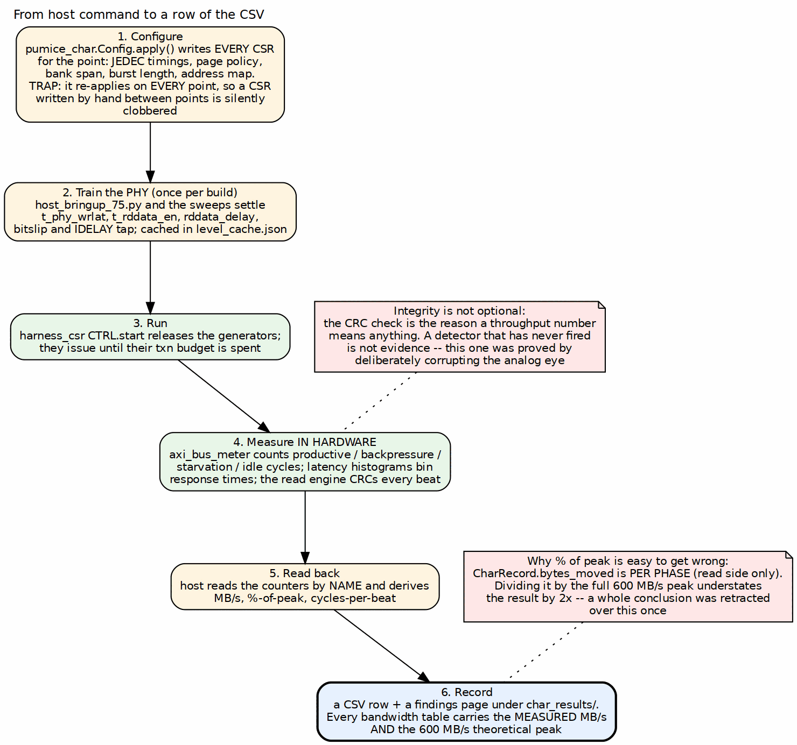

<!-- RTL Design Sherpa Documentation Header -->
<table>
<tr>
<td width="80">
  
</td>
<td>
  <strong>RTL Design Sherpa</strong> · <em>Learning Hardware Design Through Practice</em> 
  
    <a href="https://github.com/sean-galloway/RTLDesignSherpa">GitHub</a> ·
    <a href="https://github.com/sean-galloway/RTLDesignSherpa/blob/main/docs/DOCUMENTATION_INDEX.md">Documentation Index</a> ·
    <a href="https://github.com/sean-galloway/RTLDesignSherpa/blob/main/LICENSE">MIT License</a>
  
</td>
</tr>
</table>

---

<!-- End Header -->

# Host Tools and Flow

## The shared transport

Nothing about the byte-level transport is specific to this project. It lives in
`projects/fpga-systems/bin/` and every board on this bench uses it:

| Module | Role |
|---|---|
| `uart_link.py` | frame and checksum the serial link |
| `uart_axi_bridge.py` | the host end of `uart_axil_bridge`: reads and writes become AXIL transactions |
| `board.py`, `fpga_board.py` | port discovery, programming, board identity |
| `sequence.py` | scripted register sequences, replayable |

: Table 4.1: The shared host transport

One transport shared across boards is the reason a new project starts at the
register map rather than at the serial protocol. It is also why the same
`--port auto` discovery logic protects both this project and the CDC demo from
the drifting `ttyUSB` numbering described in Chapter 1.

On top of it sit the project-specific layers: `pumice_device.py` and
`pumice_master.py` present the controller, and `ddr2_char.py` presents the
harness.

**Important:** these access registers **by name**, resolved through the
PeakRDL-generated regmap, never by a hardcoded offset. Offsets churn every time
the RDL changes, and a host that hardcodes them fails silently by reading a
neighbouring register that happens to decode. `test_harness_regmap_consistency.py`
exists to keep the host's view and the generated map from drifting apart.

## From a command to a number

### Figure 4.1: From host command to a row of the CSV

**Source:** [04_measurement_path.dot](../assets/graphviz/04_measurement_path.dot)

The loop is six steps, and the interesting parts are the first and the last.

## Step 1: bring-up, once per bitstream

Before any measurement, the PHY has to be levelled. This is firmware-driven --
there is no hardware leveling FSM -- so it is a host job, done through the
`PHY_CSR_*` passthrough, by `host_bringup_75.py` and the sweep scripts beside
it (`host_sweep_rddata_delay.py`, `host_bringup_cmd_delay_sweep.py`,
`host_train_per_lane.py`, `host_eye_margin_ab.py`).

The settled result is cached in `level_cache.json`, and the current board
records:

| Field | Value |
|---|---|
| `ok` | true |
| `bitslip` | 0 |
| `rd_tap` | 8 |
| `rd_window` | 0 to 16 |

: Table 4.2: The cached leveling result for this board

A working configuration is a *tuple*, not a single number: bitslip, IDELAY tap,
read-data delay and the command/read-enable timings all have to agree. The
`rd_window` is the part worth reading -- a window of 0 to 16 with the tap at 8
means the chosen tap sits in the middle of a wide passing region, which is what
a healthy leveling result looks like. A tap that only works at the edge of a
narrow window is a result that will not survive a temperature change.

## Steps 2 to 5: configure, run, measure, read back

`pumice_char.Config.apply()` writes every CSR that defines a measurement point:
JEDEC timings, page policy, bank span, burst length, address mapping. Then
`harness_csr.CTRL` releases the generators, they run until their transaction
budgets are spent, and the instruments count in hardware while they do.

**Important:** `apply()` re-programs **every** CSR on **every** measurement
point. A register written by hand between points is therefore silently
clobbered on the next one. This is not hypothetical: a tRTW override appeared to
take effect and did not, and the only reason it was caught was that the printed
configuration line still showed the old value. When overriding something for an
experiment, override it where `apply()` will carry it, not after.

## Step 6: recording, and the arithmetic that has already gone wrong once

Results become a CSV row and a findings page under
`ddr2-characterization/char_results/` or `build-perf/results/`.

**Important:** `CharRecord.bytes_moved` is **per phase** -- the read side only.
Dividing it by the full 600 MB/s peak understates the result by a factor of two.
This is not a theoretical hazard: a whole conclusion ("concurrent read plus
write is bounded at about 47% of peak by the controller") was published and then
retracted, because the real figure was 95% and 95% is the design point rather
than a defect. Every percentage in this system is a chance to make that mistake
again, which is why the house rule is that a bandwidth table shows the measured
MB/s *and* the theoretical peak, so the division is visible and checkable.

## Integrity is what makes throughput mean anything

The write engine computes an expected CRC and the read engine computes an actual
one; `CRC_MATCH` and `BEATS_MISM` are read back with the performance counters. A
throughput number from a run that corrupted data is not a throughput number.

**Important:** a detector that has never fired is not evidence that data is
clean. This one had never fired, and proving it worked took deliberately
corrupting the analog eye -- forcing the read window off its centre -- at which
point it reported every beat mismatched. Two earlier attempts to inject a fault
failed for uninteresting reasons and looked like the detector working. If you
add a checker to this harness, make it fail on purpose before you trust it
passing.

## One program, two targets

The same host program drives the simulation twin and the board, because the
framework speaks the same UART byte stream in both. That equivalence is the
system's main defence against wasted board time:

- a host program is debugged in cosim, where a failure is inspectable;
- a difference between cosim and board isolates to the PHY or the DRAM, because
  everything above DFI is the same source;
- the cosim run is the gate that must pass before controller RTL is committed.

The reverse of that discipline also holds, and it is recorded here because it
has bitten: a test run against a stale build directory reports green for the old
design. A sub-second "1 passed" is fiction. `make clean-all` before any run that
you intend to believe.

## The bench programs worth knowing

| Program | What it is for |
|---|---|
| `pumice_char.py` | the characterization sweeps; produces the CSVs |
| `ddr2_char.py` | direct harness driver: CSRs, engines, timer, trace |
| `host_ddr2_smoke.py` | is the board alive and is this the right bitstream |
| `host_bringup_*.py` | PHY leveling and the timing sweeps behind `level_cache.json` |
| `host_capture_read.py`, `host_wide_rd_sweep.py` | read-path diagnosis when a number is wrong |
| `test_pumice_page_stats.py` | checks the page-hit/miss statistics the host derives |

: Table 4.3: The host programs

`host_ddr2_smoke.py` first, always. It reads `BUILD_ID` and proves the link
before anything expensive depends on it.
