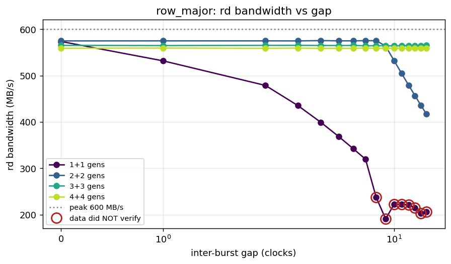
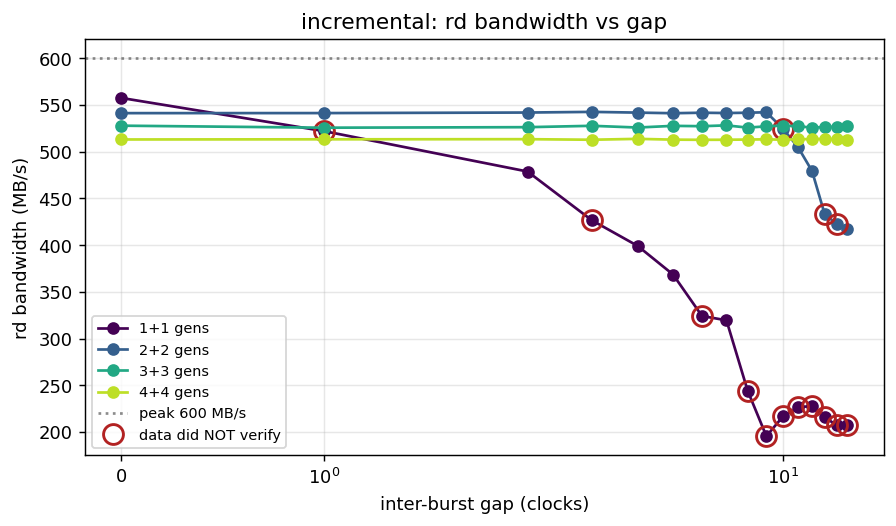
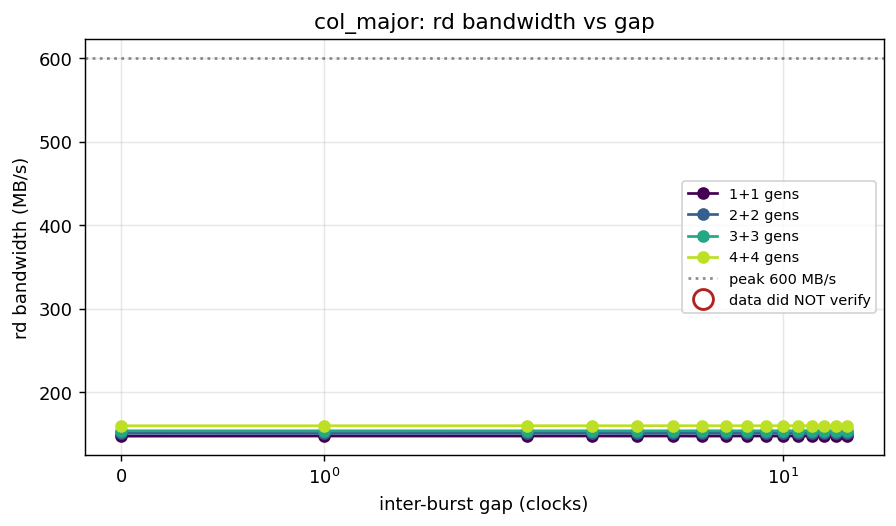
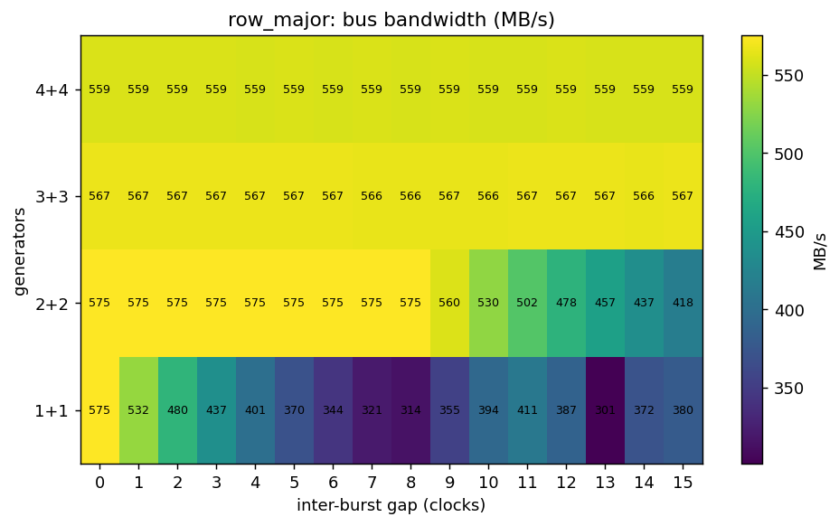
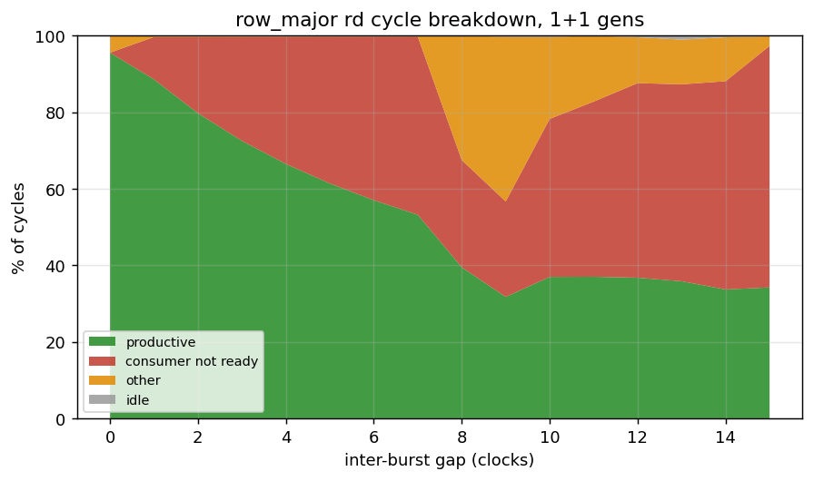
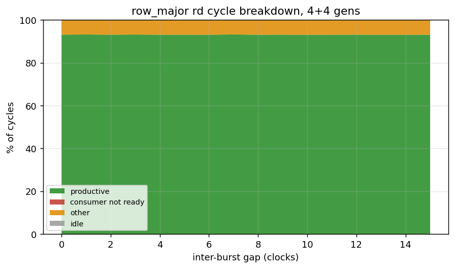

# Measured Results

Every number in this chapter is from the Nexys A7, not simulation: 75 MHz
controller clock, DDR2-300, BL4 on the x16 MT47H64M16, `open_page` policy, the
4+4 generator bitstream. **Peak is 600 MB/s** — 8 bytes per controller cycle.
Measured 2026-09-14.

The figures and the raw records are in the repository, so nothing here has to
be taken on trust: `build-perf/reports/bank_gap_sweep.json` (192 records),
`axlen_sweep.json`, `outstanding_sweep.json`, and the plots under
`build-perf/reports/plots/`.

---

## 8.1 Streaming bandwidth, and why short bursts fall short

Reads and writes both reach about 95% of peak once bursts are long enough. They
do not at short burst lengths, and the reason is **latency, not overhead**.

| AxLEN | read MB/s | % peak | read latency (cycles) | Little's-law prediction |
|---|---|---|---|---|
| 1 | 98.7 | 16.4% | 50.6 | 93.1 |
| 2 | 196.6 | 32.8% | 48.0 | 192.0 |
| 4 | 367.9 | 61.3% | 50.0 | 355.5 |
| 8 | 575.0 | 95.8% | 49.8 | 570.0 |
| 16 | 575.8 | 96.0% | 96.0 | 570.0 |

: Read bandwidth against AXI burst length, at 8 bursts outstanding

The model is `min(outstanding x AxLEN / (latency + AxLEN), 0.95) x peak`. With
8 bursts in flight against a ~49-cycle read, a one-beat burst simply cannot
fill the pipe — the requester runs out of things to have asked for.

That is an inference from one curve, so it was tested directly from the other
axis: hold AxLEN and sweep the number of bursts in flight instead.

| AxLEN | at 8 outstanding | best reached | at |
|---|---|---|---|
| 1 | 98.7 MB/s (16.4%) | 390.6 MB/s (65.1%) | 32, still climbing |
| 2 | 196.6 MB/s (32.8%) | **573.1 MB/s (95.5%)** | 24 |
| 4 | 367.9 MB/s (61.3%) | **574.6 MB/s (95.8%)** | 16 |
| 8 | 575.0 MB/s (95.8%) | 575.6 MB/s (95.9%) | 12 |

: The short-burst shortfall recovers completely when more reads are in flight

**This is the decisive result.** AxLEN 2 and 4 reach the *same* ceiling as
AxLEN 8 once enough reads are in flight. A per-transaction penalty could not
behave that way — it would scale with the number of transactions and never go
away. So nothing in the controller's datapath limits short bursts; the read
latency and the requester's budget are the whole story. AxLEN 1 needs roughly
49 bursts in flight and the harness ceiling is 32, which is why it alone is
still climbing rather than a different mechanism.

The knee confirms the shape too. It is the smallest number of bursts in flight
at which bandwidth reaches 95% of the plateau, and the model puts it at
`0.95 x (latency + AxLEN) / AxLEN`:

| AxLEN | model knee | measured knee | ratio |
|---|---|---|---|
| 1 | 47.7 | none inside 32 (still climbing) | — |
| 2 | 24.1 | 24 | 0.99x |
| 4 | 12.7 | 12 | 0.95x |
| 8 | 6.9 | 8 | 1.17x |

: Where bandwidth reaches its plateau, measured against the model

Scaling and constant both hold. The 1.17x at AxLEN 8 is the sweep grid rather
than a discrepancy — the model wants 6.9 and the available steps are 4 and 8.
The per-point agreement is as good: at AxLEN 4 the model tracks all eight
points from -0.1% to +4.4%, with measured bandwidth sitting slightly *above*
the prediction throughout, which says the effective latency is marginally
better than the sampled average rather than worse.

> **A note on how this knee is scored, because the obvious way is wrong.**
> Reading the knee as "the first point that stopped improving" names the point
> *after* saturation — one sweep step late, every time. Scored that way these
> same measurements read 32 / 24 / 12 and appear to sit 1.3-2x above the model,
> which is exactly what an earlier draft of this chapter reported as an open
> anomaly. There was no anomaly. The knee is where bandwidth *arrives* at the
> plateau, not where it first fails to climb.

---

## 8.2 How much idle the controller absorbs

The gap sweep runs N writers and N readers **concurrently**, one bank apiece,
inserting 0 to 15 idle clocks between bursts, across three address orders and
at 4+4 / 3+3 / 2+2 / 1+1 engines. It answers a different question from the
bandwidth sweeps: not "how fast can it go" but "how much slack does it have".

The knee is the largest gap whose read bandwidth is still within 3% of the
gap-0 value.

| address order | 4+4 | 3+3 | 2+2 | 1+1 |
|---|---|---|---|---|
| cacheline | 15 | 15 | 9 | 0 |
| row-major | 15 | 15 | 9 | 0 |
| col-major | 15 | 15 | 15 | 15 |

: Gap knee by address order and generator count

Read bandwidth from gap 0 to gap 15: 1+1 row-major 574 -> 206 MB/s (36%
retained), 2+2 575 -> 417 (73%), 3+3 565 -> 565, 4+4 559 -> 559.

### Figure 8.1: Read Bandwidth vs Gap, Row-Major



### Figure 8.2: Read Bandwidth vs Gap, Cacheline



### Figure 8.3: Read Bandwidth vs Gap, Col-Major



**Reading these curves.** Two things look wrong at first glance and are not:

*The high generator counts are flat.* A gap only bends the curve once aggregate
demand falls **below** what the controller can deliver. At 4+4, gap 15 still
leaves each generator at roughly a 52% duty cycle, and four of those together
still out-demand the controller — so nothing moves. A flat curve there is a
result, not a broken axis. It also means the 4-bit gap field cannot inject
enough idle to starve four generators: at high counts the lever is the
outstanding dial, not the gap.

*Col-major is flat at every generator count.* It is page-miss bound at about
150 MB/s, 25% of peak. The DRAM is the limit, so generator pacing never becomes
the binding constraint. Compare it against row-major's 575 MB/s on the same
silicon and the same settings: **a 3.8x spread from the address pattern alone**,
which remains the single most useful fact in this guide. Tune the address map
before tuning anything else.

### Figure 8.4: Bus Bandwidth Across Gap and Generator Count



---

## 8.3 Where the cycles went

Bandwidth says a point was slow. The cycle classification says *who stopped*,
which is the difference between a finding and a number.

| gap | read MB/s | productive | consumer not ready | other |
|---|---|---|---|---|
| 0 | 574 | 95.6% | 0.0% | 4.4% |
| 4 | 399 | 66.5% | 33.2% | 0.2% |
| 8 | 237 | 39.5% | 28.0% | 32.5% |
| 15 | 206 | 34.3% | 63.1% | 2.6% |

: Read cycle breakdown, row-major, 1+1 generators

### Figure 8.5: Cycle Breakdown at 1+1 — the Bend and its Cause



### Figure 8.6: Cycle Breakdown at 4+4 — Saturated at Every Gap



At 1+1 the productive fraction falls from 95.6% to 34.3% while "consumer not
ready" climbs from nothing to 63.1%. That is the engine's own inter-burst gap
deasserting `rready`, so **the bandwidth went to generator-induced idle, not to
anything the controller did**. At 4+4 the productive fraction sits at 93.1%
regardless of gap — the controller is saturated everywhere on that axis, which
is the same fact Figure 8.1 shows as a flat line, seen from the cause side.

> **Two traps in this instrument, both of which produced published nonsense
> before they were caught.**
>
> The bus meter **free-runs** from `clear_stats()` until it is read, so its own
> total spans the host's UART chatter as well as the transfer — 7.2M cycles
> against a 16.7k-cycle window on a 1+1 point, a factor of 430. Fractions taken
> against that total made a point moving 95% of peak report "0.2% productive,
> 99.8% starvation". The *counts* are sound — productive lands on exactly the
> beats moved — so the fix is the denominator: normalise against the timer's
> first-to-last stamp for that direction. The meter's own starvation bucket is
> where the host idle lands and is not reported as a fraction at all.
>
> On a **read**, the engine is the *consumer*, so its own pacing gap shows up
> as `rvalid && !rready` — the bucket a write would call backpressure. It is
> generator-induced idle, the opposite of the controller refusing. The label in
> Figure 8.5 says "consumer not ready" for exactly this reason; do not read the
> read and write breakdowns with the same vocabulary.

---

## 8.4 Integrity, and one configuration that must not be quoted

All 192 gap-sweep points completed. **22 of them returned mismatching data**,
and they are not scattered: they are a specific configuration, tracked as
PUMICE-037.

Concurrent read+write with the **reader's** gap at 8 or above returns wrong
data, and when the two address ranges overlap it leaves genuinely corrupted
cells behind. The boundary was narrowed by elimination on the board, each line
its own run from a verified-clean 128 MiB prefill:

| configuration | result |
|---|---|
| prefill, then read every bank read-only, all three orders | clean |
| reader alone, gap 0-15 | clean at every gap |
| writer alone, gap 0-15 | cells clean |
| writer gap 0-15, reader gap 0 | clean at every writer gap |
| reader gap **0-7** with a concurrent writer | clean |
| reader gap **>= 8** with a concurrent writer | 1.5k-7k of 32000 beats wrong |
| 4+4 concurrent at gap 0 and gap 4 | clean, cells clean |

: PUMICE-037 — narrowing the failing configuration

Neither engine alone does it at any gap, and the writer's own gap never does
it. **Everything in this chapter is at gap 0-7 and is unaffected**, but no
gap >= 8 concurrent point may be quoted as a clean operating point. The plots
ring those points, and `plot_bank_gap.py` refuses any record file whose
bandwidth exceeds its own stored ceiling.

Whether the defect is in the controller or in the harness read engine is not
yet settled. The stray-beat counter is zero on all 22 failing points, which
rules out the read engine's stray-drain path and points at the data itself;
against that, a read engine cannot corrupt cells, and cells are corrupted. The
next step is a simulation reproduction with waves — and the reason this reached
the board at all is that both gap-bearing simulation suites drain the writer
before starting the reader, so **concurrency with a gap has never been
simulated**.

---

## 8.5 Reproducing these numbers

```bash
cd build-perf
make bitstream && make program
python3 bin/axlen_sweep.py                 # 8.1, first table
python3 bin/outstanding_sweep.py           # 8.1, second table
python3 bin/bank_gap_sweep.py              # 8.2-8.4, ~12 minutes
python3 bin/plot_bank_gap.py reports/bank_gap_sweep.json
```

Leave `PREFILL` at its default (`point`). It re-fills the whole device before
every measurement so that points are independent; without it, a point that
corrupts cells is inherited by every later point that reads the region and
reported as *that* point's result. Chapter 3 lists the rest of the pitfalls,
and `docs/DDR2_BANDWIDTH_MEASUREMENT.md` carries the full treatment.
