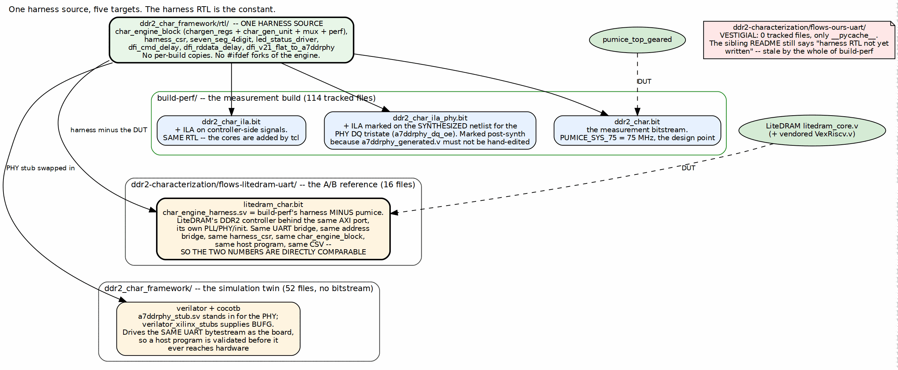

<!-- RTL Design Sherpa Documentation Header -->
<table>
<tr>
<td width="80">
  
</td>
<td>
  <strong>RTL Design Sherpa</strong> · <em>Learning Hardware Design Through Practice</em> 
  
    <a href="https://github.com/sean-galloway/RTLDesignSherpa">GitHub</a> ·
    <a href="https://github.com/sean-galloway/RTLDesignSherpa/blob/main/docs/DOCUMENTATION_INDEX.md">Documentation Index</a> ·
    <a href="https://github.com/sean-galloway/RTLDesignSherpa/blob/main/LICENSE">MIT License</a>
  
</td>
</tr>
</table>

---

<!-- End Header -->

# One Harness, Five Targets

## The short answer

**The harness RTL does not change per build.** There is one copy of the engine
spine, the CSR block, the DFI delays and the displays, in
`ddr2_char_framework/rtl/`, and every target compiles that same source. There
are no per-build copies and no `ifdef` forks of the engine.

What changes between targets is one of exactly three things: the debug cores
added after synthesis, the DUT behind the AXI port, or the PHY model. Each is
worth a section, because each answers a different question.

### Figure 3.1: One harness source, five targets

**Source:** [03_build_variants.dot](../assets/graphviz/03_build_variants.dot)

## The five targets

| Target | Artifact | What differs | What it is for |
|---|---|---|---|
| `build-perf` base | `ddr2_char.bit` | nothing -- this is the reference | the measurement build; every published number comes from here |
| `build-perf` + ILA | `ddr2_char_ila.bit` | ILA cores added by tcl | watching controller-side signals when a number is surprising |
| `build-perf` + PHY ILA | `ddr2_char_ila_phy.bit` | ILA marked on the *synthesized netlist* | watching the PHY's DQ tristate, which has no RTL you may edit |
| LiteDRAM A/B | `litedram_char.bit` | the DUT, and the PHY comes with it | is our controller good, compared to what? |
| simulation twin | none (verilator/cocotb) | the PHY is a stub | validating a host program before it touches hardware |

: Table 3.1: The five targets built from one harness source

`ddr2-characterization/flows-ours-uart/` looks like a sixth and is not. It has
zero tracked files -- only stray `__pycache__` directories -- and its sibling
`ddr2-characterization/README.md` still opens with "Status: Skeleton --
directories scaffolded, harness RTL not yet written". That statement is stale by
the entire contents of `build-perf`, which has 114 tracked files and three
bitstreams. Treat that README as a historical document and this book as the
current one.

## What the ILA builds change, and what they do not

Neither ILA build edits the harness. `ddr2_char_ila.bit` adds debug cores to
controller-side signals through tcl at build time.

`ddr2_char_ila_phy.bit` is the more interesting one, and the reason it exists
is a constraint rather than a preference. The signal worth watching for
read/write turnaround is the PHY's DQ output enable -- whether the FPGA is
driving the DQ wires while the DRAM is returning data. That signal lives inside
LiteDRAM's generated `a7ddrphy_generated.v`, which must not be hand-edited: it
is generated output, and editing it plants a change that the next regeneration
silently reverts. So the ILA is marked on the **synthesized netlist** instead,
matching `*a7ddrphy_dq_oe_delay*` and `*a7ddrphy_dqs_oe_delay*` after synthesis
rather than instrumenting the source.

**Note:** the DFI-boundary signal `w_dfi_rddata_valid` is *not* the same thing.
It is a post-capture signal: it tells you a read has been captured, not that the
wires were contended. Arming a trigger on it and finding nothing proves nothing
about the tristate. The distinction cost a whole ILA campaign before it was
understood.

**Important:** a trigger that never fires is not evidence. When the PHY
contention build was brought up, the first three captures came back empty
because the trigger armed during the prefill's write phase. The discipline that
came out of it: arm each half of the condition separately first and confirm
*those* fire, and only then believe a silent combined trigger.

## The LiteDRAM build is the point of the whole structure

The reason the engine spine is a separate, DUT-agnostic module is this build.
`flows-litedram-uart` puts LiteDRAM's DDR2 controller behind the same AXI port
that pumice normally sits on. Its harness, `char_engine_harness.sv`, is
described in its own README as build-perf's harness *minus pumice* -- and
everything else is the same file:

- the same `uart_axil_bridge`
- the same generated address bridge
- the same `harness_csr`
- the same `char_engine_block` (generator registers, generator array, meters,
  histograms)
- the same host program and the same CSV schema

Only the controller differs. That is what makes a number from this build and a
number from `build-perf` directly comparable, and it is why the comparison is
worth anything at all. An A/B where the apparatus also changed measures the
apparatus.

The LiteDRAM core is configured to match the pumice design point deliberately:
`MT47H64M16` x16, the Xilinx A7DDRPHY, 75 MHz system with 1:2 gearing to
DDR2-300 -- the same profile `PUMICE_SYS_75` selects -- `cmd_buffer_depth` 16,
and one 64-bit AXI user port. Matching the configuration is part of matching the
experiment.

LiteDRAM brings its own PLL, its own PHY and its own initialization, which is
why this build's top (`litedram_char_top.sv`) puts the harness on LiteDRAM's
`user_clk` and wires `m_axi` to `user_port_axi_0`. It also vendors a
`VexRiscv.v` alongside the core, because LiteDRAM's self-initialization BIOS
runs on a soft CPU.

**Note:** this build also proves the board itself. When pumice could not bring
DDR2 up, a LiteDRAM memtest passing on the same board and the same part is what
separated "our controller is wrong" from "the pins, the PHY or the DRAM are
wrong". A reference build that works is a diagnostic instrument, not just a
competitor.

## The simulation twin

`ddr2_char_framework` builds no bitstream. It compiles the same harness with
`a7ddrphy_stub.sv` in place of the PHY and `verilator_xilinx_stubs` supplying
primitives like `BUFG`, and drives it from cocotb.

Its value is that it speaks **the same UART byte stream as the board**. The host
program is not rewritten for simulation; it is pointed at the simulator. A
program that works in cosim and fails on hardware has isolated the difference to
the PHY or the DRAM, which is a small search space. That equivalence is the
reason the framework exists and the reason it is the gate that runs before any
controller RTL change is committed.

## The frequency define is part of the build identity

`PUMICE_SYS_75` is not a tuning knob to be left at whatever it happened to be.
`create_project.tcl` prints the frequency profile at build time and labels the
alternative explicitly as not the design point. Two bitstreams that differ only
in that define produce two sets of numbers that must never be compared, and the
only defence is that the build says which one it is.

## What is parameterized, and the one that bites

| Parameter | Where | Why it is not a constant |
|---|---|---|
| `PUMICE_SYS_75` | build define | 75 MHz design point vs the 66.67 MHz alternative |
| `DEBUG_SRAM_WORDS` | `ddr2_char_harness.sv` | shrunk to 512 to fit the 100T; raise it on a bigger device |
| `NUM_GEN` / bank span | `chargen_regs` at runtime | bank concurrency is stimulus, so it must be a host-settable sweep |
| generator window, stride, burst, budget | `chargen_regs` at runtime | a sweep should be a host loop, never a rebuild |

: Table 3.2: Build-time and run-time parameters

The last two rows are the design decision that makes the system usable: almost
everything a characterization run wants to vary is a *runtime* register, so a
full sweep is one bitstream and a host loop. Only the things that cannot be
runtime -- the clock profile and the size of a memory -- are build-time.
