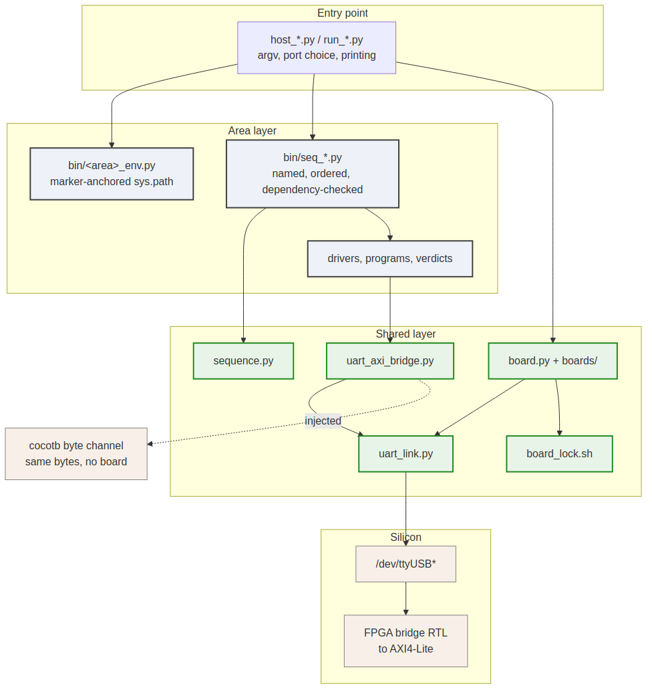

# Layering

### Figure 1.1: Layering of the host-side stack

Four layers, each of which may only reach downward.

## Entry point

One per build: a `host_*.py` or `run_*.py` that parses `argv`, decides which
port and which board, constructs the transport once, and prints results. It is
the only layer that knows a command line exists.

Entry points are deliberately thin. The work belongs in a sequence or a library,
because those are reusable and an entry point is not.

## Area layer

Owned by a unit (pumice, rapids, stream, reed-solomon, cdc). It holds:

- **Sequences** (`seq_*.py`) -- named, ordered, dependency-checked steps.
- **Libraries** -- drivers, program builders, verdict functions.
- **An environment module** (`<area>_env.py`) -- the one place the area records
  where the shared layers are, described in Chapter 5.

## Shared layer

`projects/fpga-systems/bin/`, specified by this book:

| Module | Responsibility |
| --- | --- |
| `uart_link.py` | Port enumeration, USB-serial matching, the probe loop, `UartLink` |
| `uart_axi_bridge.py` | The ASCII W/R protocol over any byte pipe |
| `sequence.py` | `Sequence`, `SequenceContext`, `SequenceRunner` |
| `board.py`, `boards/` | The board registry, programming, identity readback |
| `board_lock.sh` | One flow per physical board |
| `program_fpga.tcl`, `jtag_readback.tcl` | The two Vivado entry points |

It depends on nothing above it, which is what lets a unit be added without
touching it.

## Transport and silicon

A `/dev/ttyUSB*` character device on an FTDI part, and the FPGA behind it. The
dashed edge in the diagram is the substitution that matters: `UARTAxiBridge`
accepts an injected channel, so a cocotb simulation can receive the identical
byte stream with no board present.

## The direction rule

A layer may call downward and must not call upward. The one that gets violated
in practice is a sequence reaching for a port -- which is why the runner enforces
it rather than merely recommending it (Chapter 3).
