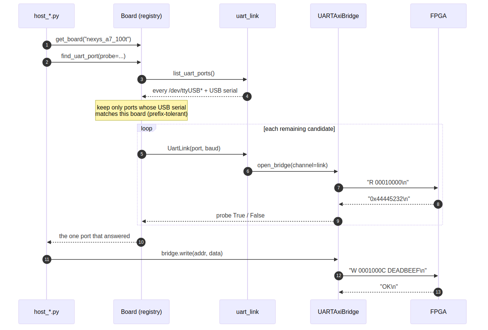

# Port discovery

### Figure 2.1: The UART flow, host to silicon



## The problem

A USB-UART re-enumerates. Unplug a cable, reboot the host, or power-cycle a
board and `/dev/ttyUSB3` becomes `/dev/ttyUSB5`. Two boards on one desk makes it
worse: the index that worked yesterday now addresses the other board, and a
harness that writes to it will be perfectly happy about it.

So a port is never hardcoded, and never merely guessed at by index. It is
resolved, every run, by asking which device answers.

## What identifies a board

`list_uart_ports()` enumerates candidates from `serial.tools.list_ports`,
falling back to a bare glob of `/dev/ttyUSB*` when pyserial is absent. The
fallback matters for board-less callers and minimal environments; the preferred
path matters because only pyserial carries the field that identifies the board:

```python
@dataclass(frozen=True)
class UartPort:
    device: str                      # /dev/ttyUSB3
    usb_serial: Optional[str] = None # the field that says WHICH BOARD
    vid: Optional[int] = None
    pid: Optional[int] = None
    description: Optional[str] = None
    manufacturer: Optional[str] = None
    location: Optional[str] = None
```

On a Digilent board with an FT2232, the USB-UART and the JTAG interface are on
the **same** part, so the USB serial number and the Vivado JTAG target serial
are the same string. That coincidence is what lets `Board.find_uart_ports()`
return only the ports belonging to the board you are about to program.

## Matching is prefix-tolerant in both directions

```python
def matches_serial(self, serial): ...
```

An FT2232 exposes one EEPROM serial across its interfaces, and the tooling on
either side may or may not append the interface letter -- `...D46F` against
`...D46FB`. Both strings are normalised (upper-cased, punctuation stripped) and
then compared with `startswith` **in both directions**.

An exact-match test here silently finds nothing on some hosts. That failure
presents as "board not attached" while the board sits plugged in on the desk,
which is precisely the hour this tolerance exists to save.

## The Genesys 2 exception

The Genesys 2 does not share one FTDI part. Its UART is a separate FT232R, so
matching UART ports against the JTAG serial finds nothing -- the same symptom as
above, from a different cause. The registry records the FT232R's own serial in
`uart_serial`, and `BoardSpec.uart_usb_serial` returns it in preference to the
JTAG serial:

```python
@property
def uart_usb_serial(self):
    return self.uart_serial or self.jtag_serial
```

Both cables must be plugged in for a UART to exist at all, whatever the
bitstream does. See Chapter 4 for the registry, and the `[[boards]]` handbook
note for the full gotcha list.

## Listing what is attached

```
python3 projects/fpga-systems/bin/uart_link.py
python3 projects/fpga-systems/bin/uart_link.py --all     # not just ttyUSB*
```

prints each device with its USB serial and description. This is the first thing
to run when a flow says it cannot find its board.
