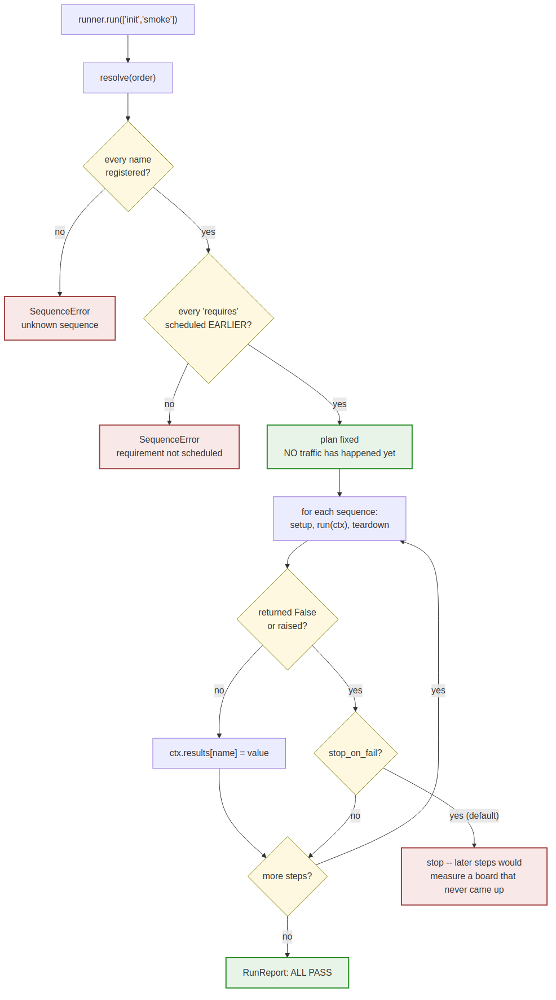

# The runner

### Figure 3.1: Resolve, then run



`SequenceRunner` holds the registry for one area and runs a requested order
against a context.

## Registration

```python
runner.add(SomeSequence)                 # class or instance
runner.discover(path, pattern="seq_*.py")
```

`add` rejects three things outright: an object that is not a `Sequence`, one
with no `name`, and a name already registered. The duplicate check names both
classes, because two files claiming one name is otherwise found only by noticing
that a step ran once when you expected it twice.

`discover` imports every file matching `seq_*.py` in a directory and registers
the `Sequence` subclasses it finds. **Discovery is by content, not by
filename**: a class in an oddly named file still registers, and a filename typo
shows up at resolve time as a missing name rather than as a silently absent
step.

If a `discover` call finds nothing it raises rather than returning an empty
registry -- an empty registry means nothing would run, which is not a state
worth proceeding from.

## Resolution happens before any traffic

```python
plan = runner.resolve(["init", "smoke"])
```

Two checks, both before the board is touched:

1. **Every requested name exists.** Unknown names raise `SequenceError` listing
   what is registered.
2. **Every `requires` is satisfied by something EARLIER in the order.**

The second is checked against what has actually been scheduled, not against the
set of names you typed, so `["smoke", "init"]` is an error rather than a coin
flip.

Missing dependencies are **reported, never auto-inserted**. Quietly running an
init the caller did not ask for is its own surprise, and the fix is one word in
the run script.

## Execution

```python
report = runner.run(order, stop_on_fail=True)
```

For each sequence: `setup`, `run`, store the result, `teardown`. Teardown runs
in a `finally`, so it happens even when `run` raised.

An exception is caught, recorded in the `StepResult` with its traceback logged,
and treated as a failure -- the run reports rather than masks.

### stop_on_fail defaults to True, and that default is load-bearing

These run against hardware. Once init fails, every later step measures a
controller that was never brought up. Their numbers are worse than useless,
because they look like data: plausible magnitudes, plausible shapes, and
entirely meaningless.

```
[run] stopping: later sequences would measure a board that never came up
```

## The report

```python
@dataclass
class StepResult:
    name: str
    ok: bool
    value: Any = None
    seconds: float = 0.0
    error: Optional[BaseException] = None
```

`RunReport.summary()` prints one line per step with status and duration, and
`RunReport.__bool__` is the overall verdict, so `if not report:` works.

Durations are per step. That is not decoration: a step that completes far faster
than its known-good time has not done what it claims, which is the standing tell
for a stale build or a skipped campaign.

## Introspection

```python
runner.names        # sorted registered names
runner.catalog()    # name, description, and requires, one per line
```

`catalog()` is what a `--list` flag should print. It reads the registry, so it
cannot drift from what would actually run.
