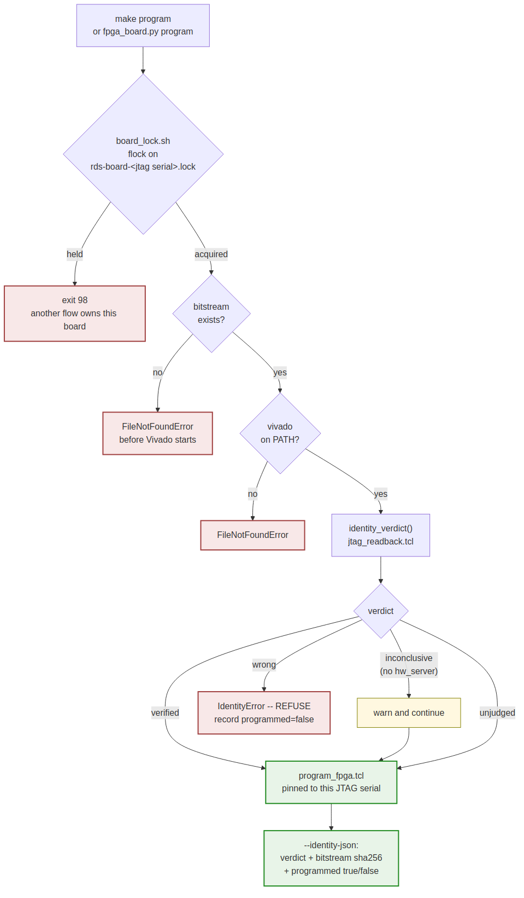

# Programming

### Figure 4.1: The program path



```
fpga_board.py program --board nexys_a7_100t --bitstream build/top.bit
```

replaces each flow's own `vivado -source tcl/program_fpga.tcl` recipe. The board
facts come from the registry, so a flow's Makefile carries neither a serial nor
its own copy of the Tcl.

## Order of checks

Cheap and local first, because a thirty-second Vivado startup to be told the
file is missing is pure waste:

1. **Bitstream exists** -- `FileNotFoundError` naming the path, suggesting
   `make bitstream`.
2. **`--dry-run`** -- prints the environment and the command, runs nothing.
3. **Vivado on PATH** -- `FileNotFoundError` suggesting the settings script.
4. **Identity** -- the subject of `03_locking_and_identity.md`.
5. **Program** -- `program_fpga.tcl`, pinned to this board's JTAG serial.

## The environment handed to Tcl

| Variable | Meaning |
| --- | --- |
| `FPGA_BITSTREAM` | Absolute path to the `.bit` |
| `FPGA_JTAG_SERIAL` | The serial to pin, absent for "any target" |
| `FPGA_BOARD` | The registry key |

A single parameterised Tcl reading these replaces the per-flow copies.

## From a Makefile

`make/fpga_board.mk` wraps the CLI:

```make
BOARD_LOCK   ?= $(FPGA_BIN)/board_lock.sh
BOARD_LOCKED  = $(BOARD_LOCK) --board $(BOARD) --
```

and the `program` recipe runs under `$(BOARD_LOCKED)`. A flow gets locking by
using the standard recipe rather than by remembering to.
