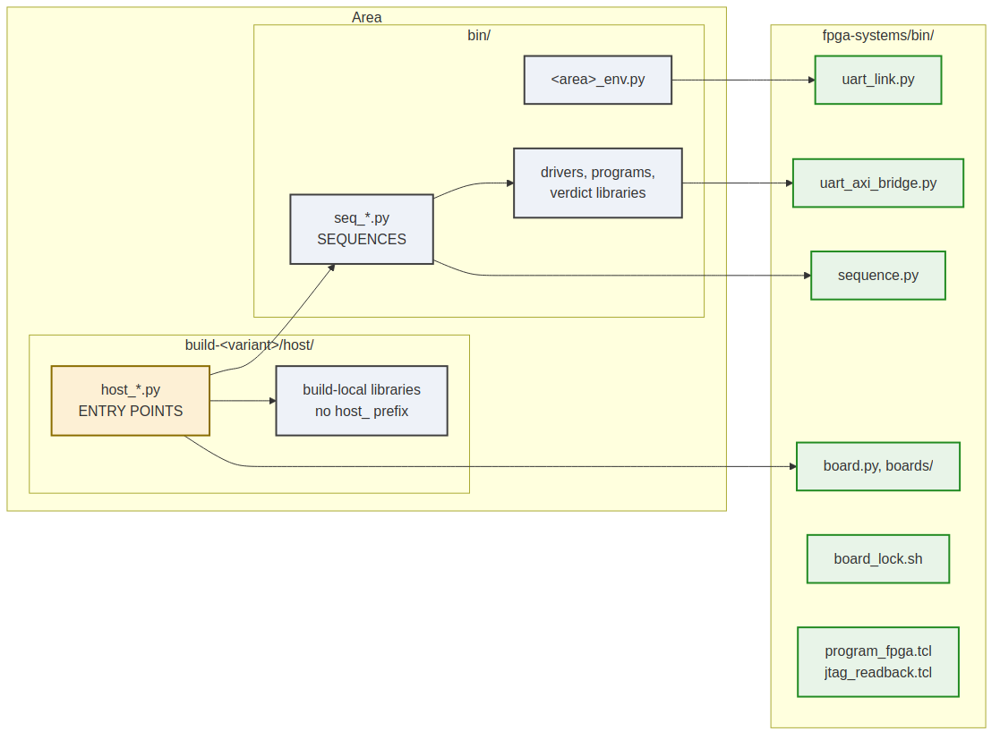

# Naming, and why the prefixes are load-bearing

### Figure 5.1: Where each kind of file lives



**The authority for the directory skeleton and the filename conventions is the
handbook note `[[flow-layout]]`, not this chapter.** This chapter records only
what binds those conventions to the layer specified in this book: the prefixes
are not a style preference, they are how two separate mechanisms *find* files.

## The table, and the two things that read it

| Pattern | Role | Discovered as |
| --- | --- | --- |
| `bin/run_*.py` | A runner: drives a whole plan | `make run-<name>` |
| `bin/seq_*.py` | One sequence | `make seq-<name>` |
| `host/host_*.py` | A standalone host program | `make host-<name>` |
| `host/test_*.py` | pytest | Via `SIM_TESTS`, never a make target |
| `host/<other>.py` | A library: imported, never run | Nothing |
| `fpga/tcl/*.tcl` | A Vivado script | `make tcl-<name>` |

Two mechanisms depend on this, and both are plain globs:

```make
# make/fpga_flow.mk
RUN_SCRIPTS   := $(sort $(wildcard $(SEQ_DIR)/run_*.py))
SEQ_SCRIPTS   := $(sort $(wildcard $(SEQ_DIR)/seq_*.py))
HOST_PROGRAMS := $(sort $(wildcard $(HOST_DIR)/host_*.py))
```

```python
# sequence.py
def discover(self, path, pattern: str = "seq_*.py"): ...
```

So a misnamed file is not merely untidy -- **it is invisible**. A sequence not
matching `seq_*.py` is never registered; a host program not matching `host_*.py`
never becomes a make target. `make targets` prints exactly what was found on
disk, so "what can I run here" is never a guess, but it can only print what the
glob matched.

## The prefix marks the file, not the directory

`host_*` identifies an **entry point**. It does not mean "everything in `host/`
is a program", and the distinction is load-bearing in both directions:

- `build-loop/host/` holds `host_rs_loop.py` (the entry point, carrying the
  `ArgumentParser`) beside `rs_loop.py` and `rs_loop_programs.py`. Those two
  parse no arguments and are correctly libraries that happen to sit next to the
  entry point using them.
- Four stream entry points are 21 to 33 line shims that bootstrap `sys.path` and
  call `main()` from a same-named library in the area's `bin/`. The entry point
  is the shim; the `ArgumentParser` is in the library.

`host_bus_meters.py` states the rule at the point where someone would get it
wrong:

> The implementation is `bin/bus_meters.py`, at COMPONENT level because it is a
> LIBRARY as well as a program -- `host_ext_char` and the cosim tests import its
> readers. **Entry points are `host_*` and live in a build; anything imported by
> more than one of them lives in `bin/`.**

**Renaming a library to `host_*` is therefore wrong.** If a file is imported by
anything, it is a library that happens to be runnable, not a program.
`[[flow-layout]]` records why discovery uses the prefix rather than scanning for
a `__main__` guard: the guard made the role invisible in `ls` and swept up
library modules carrying a debug CLI.

## Measured status, 2026-09-30

Nine build directories follow the skeleton (`build-<name>/`). Two do not:
`Genesys2/rapids/flows-rapids/` and `Genesys2/rapids_beats/flows-rapids-beats/`.

Those two are **pre-migration flows, not a competing convention**. `flows-*/` is
the layout `[[flow-migration]]` names as the thing being migrated away from, and
neither includes `make/fpga_flow.mk` at all -- so none of the discovery above
applies to them. Their `run_*.py` sitting in `host/` rather than `bin/` is a
consequence of that, not a second opinion about where runners go.

The practical reading: there is one convention, it is documented in two places
that agree, and the exceptions are a tracked migration backlog.
