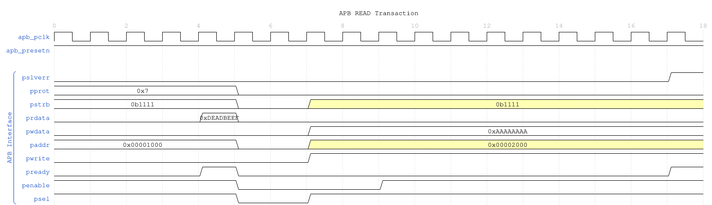

# BUG-014: STRESS — three _mon monitor stress tests fail on a memory-bounds read

> Migrated 2026-09-27 from `vault/Tasks/bridge/closed.md` as **BRIDGE-MON** (tooling TOOL-001). The flat page did not record a lane; this item was placed by hand. Body preserved as written -- only the H1 and this line are new.

---

## Stray content carried over from closed.md

These lines sat at the end of `vault/Tasks/bridge/closed.md` after the last
item and belong to no task -- an APB4 waveform/doc-page template fragment,
unrelated to this item. Preserved verbatim (headings demoted) rather than
dropped on migration; delete it if nobody claims it.

### Waveforms


**WaveJSON:** [apb_write_sequence_001.json](../../../../../docs/markdown/assets/WAVES/apb4_slave/apb_write_sequence_001.json)

**Implementation Phases:**

**Phase 1: Quick Wins (Week 1)**
- [ ] Integrate existing waveforms into docs (7 modules)
- [ ] Document clock-gated variants (reference base + CG params)
- [ ] Update shared infrastructure individual pages

**Phase 2: High-Impact Waveforms (Week 2)**
- [ ] Generate AXIL monitor waveforms (8 modules)
- [ ] Generate APB crossbar waveforms
- [ ] Generate arbiter waveforms (visualization of scheduling)
- [ ] Generate shim waveforms (protocol conversion)

**Phase 3: Complete Coverage (Week 3)**
- [ ] Document all stub modules
- [ ] Document monitor variants (HP/LP)
- [ ] Generate remaining waveforms (utilities, helpers)
- [ ] Final review and consistency check

**Success Criteria:**
- [ ] All 97 RTL modules have markdown documentation
- [ ] All key modules (monitors, crossbars, arbiters, shims) have waveforms
- [ ] Waveforms integrated into markdown (PNG + JSON links)
- [ ] Empty directories (adapters, components, testcode) have content or READMEs
- [ ] Documentation follows consistent structure:
  - Module overview
  - Parameters and ports
  - Timing diagrams (waveforms)
  - Usage examples
  - Integration notes
  - Related modules

**Deliverables:**
- [ ] ~56 new markdown files for missing modules
- [ ] ~36 waveform integrations for existing docs
- [ ] ~30 new WaveDrom test files
- [ ] ~30 new waveform .json/.png pairs
- [ ] Updated README files for all subdirectories

**Documentation Template:**

````markdown
# {module_name}

Brief description.

### Overview
Detailed functionality.

### Module Declaration
```systemverilog
module ...
```

### Parameters
| Parameter | Default | Description |
|-----------|---------|-------------|

### Ports
| Port | Direction | Description |

### Timing Diagrams

**WaveJSON:** [scenario_001.json](...)

### Usage Example
```systemverilog
// Instantiation example
```

### Integration Notes
- Clock domain considerations
- Backpressure handling
- Configuration recommendations

### Related Modules
- Link to related docs
````

**Resources:**
- **Waveform Pattern:** docs/markdown/rtl-amba/apb4/apb4_slave.md (reference)
- **Test Pattern:** val/amba/test_apb4_slave_wavedrom.py
- **Constraint Pattern:** bin/TBClasses/wavedrom_user/apb.py
- **Existing Waveforms:** docs/markdown/assets/WAVES/

**Priority Justification:**
P0 because user expected this completed weeks ago and sees directories as "mostly empty". High visibility gap.

---


---
